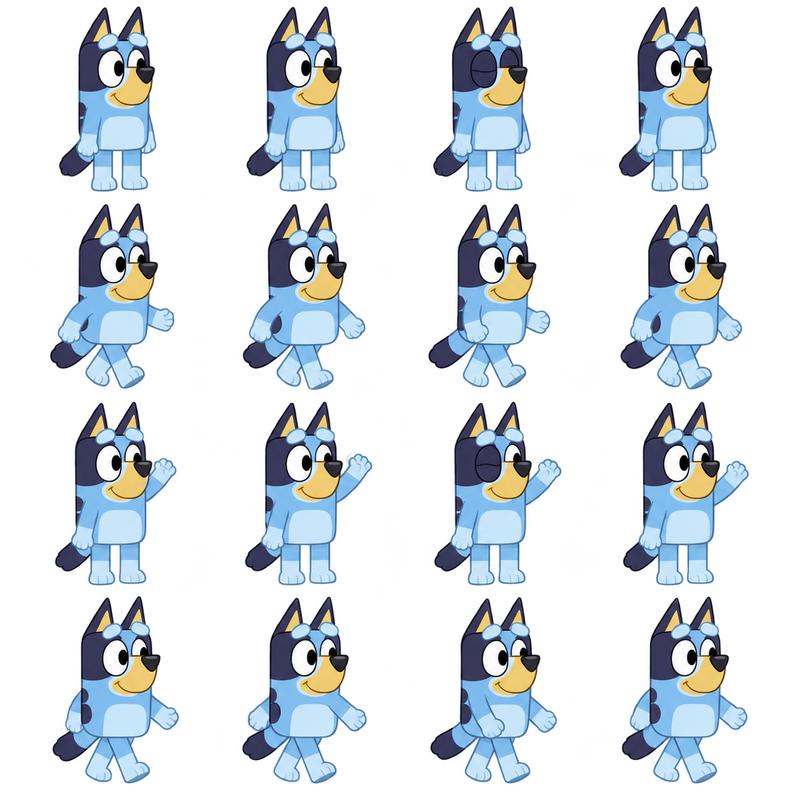

# Selected Bluey movement sheet

The user selected this earlier generated sheet on September 26: “It actually shows all movements looks amazing.” This is the chosen character appearance and pose direction. The original PNG was recovered from this chat’s generated images and copied here without changing its pixels. [Exact source identity](selection.json).

The earlier workflow left this sheet outside Unity and built a separate layered SVG rig. Passing that rig’s tests did not justify drifting from this appearance. Keep this source as the visual target; do not substitute another redraw merely because it fits the current rig.

The sheet contains idle/blink, wave and walking variants. It is not yet a verified complete animation set. Prepare sprite rectangles with stable size and ground alignment, inspect alpha edges on light and dark game backgrounds, and verify a full contact/down/passing/up cycle before runtime replacement. Record hand anchors for carried objects. Preserve the recognizable face, proportions, outlines and three-quarter silhouette. Produce missing directions/action poses and matching Bingo assets from this selected design; retain editable sources. A sprite-frame or layered implementation is acceptable only if the visible result matches this reference.

**Implemented in build 122:** [prepared Bluey and matching Bingo sheets](../AnimationSheets/README.md) now run in actual gameplay and the chooser. The user liked its appearance after phone installation. Revision 123 adds smaller walking motions; native checks and retained-save phone installation pass, with visible 123 review awaiting unlock. The exact original here remains unchanged. [Runtime evidence](../../../docs/implementation/selected-sheet-characters-2026-09-26.html).
