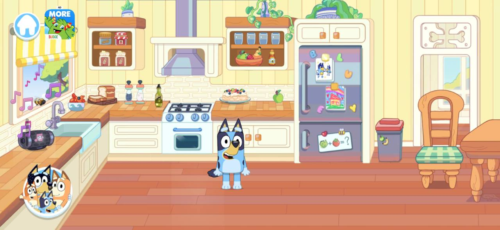
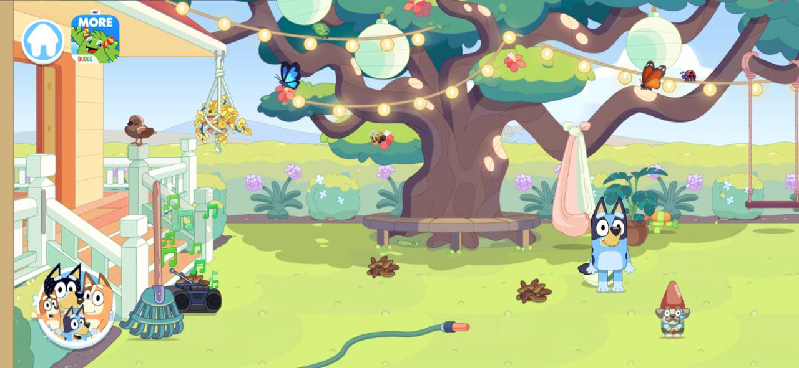
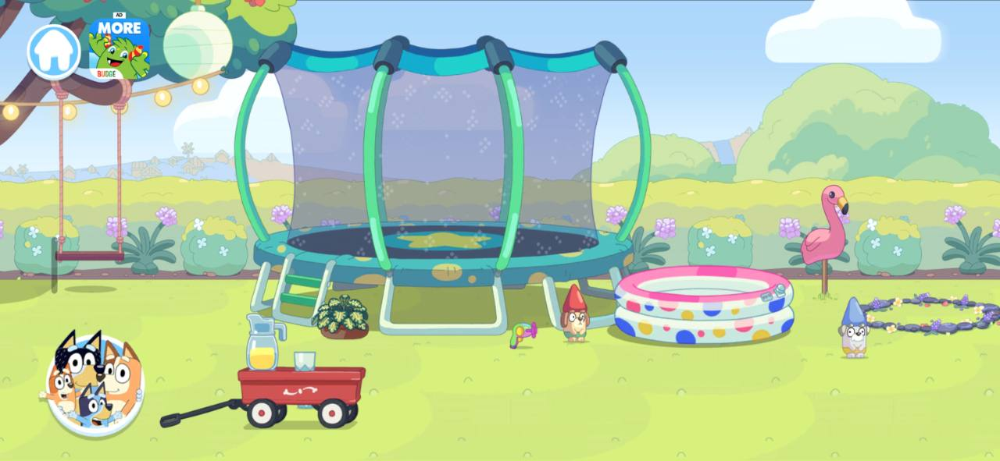
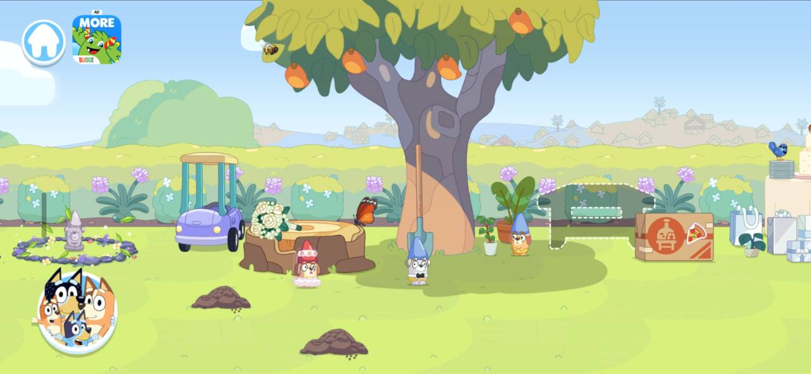
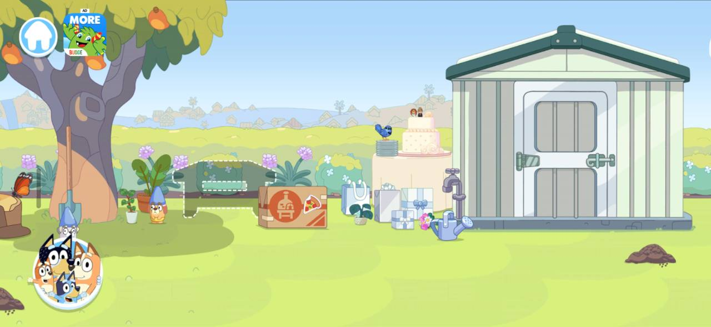
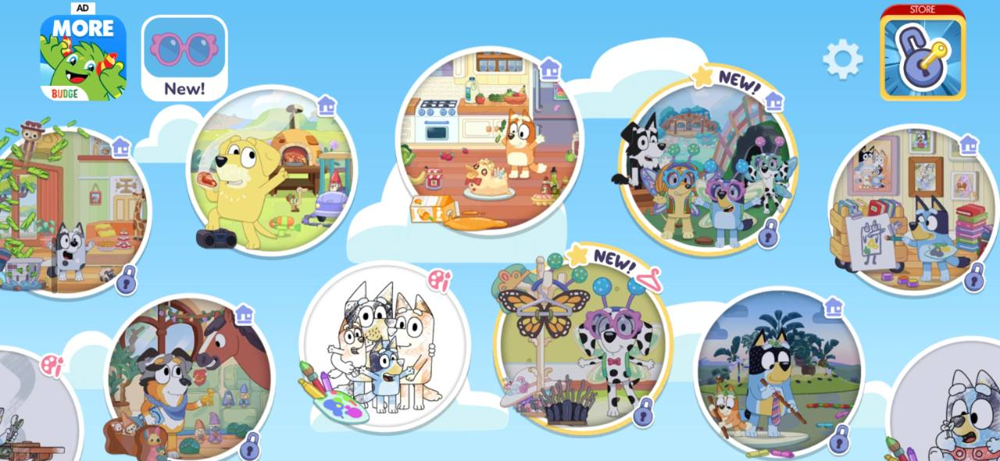
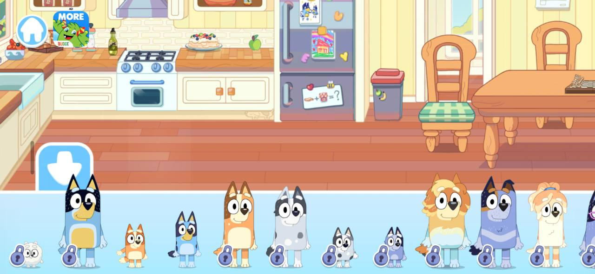
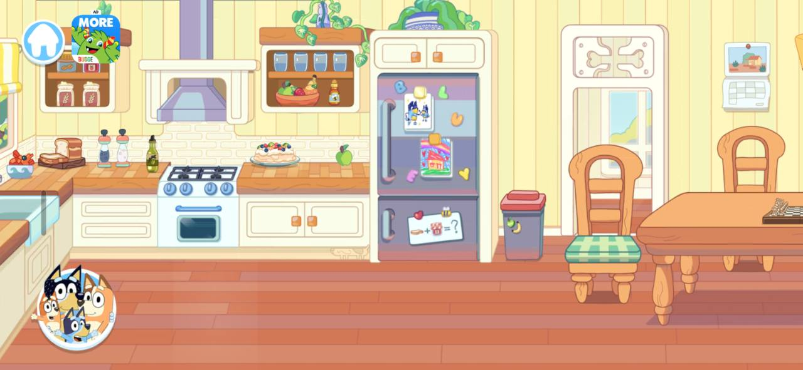

# Bluey: Let's Play! — scene, menu and interaction reference

**Research date: September 25, 2026.** This is the visual and interaction target requested for Little Weeps. It supplements the [55-chapter goal sheet](bluey-game-research-2026-09-23.html), with the user's eight screenshots as the primary visual references. The [current decisions](current-decisions.md) still govern multiplayer, saves and scope. This study records requirements and implementation proposals; it does not claim these scenes or menus are already installed in our game.

The target is Budge's **Bluey: Let's Play!** mobile playset. The user clarified that this should be the base experience, followed by their more ambitious private family version, and explicitly included character interactions such as trampoline jumping, sitting and dancing. The most consequential change is to make the illustrated environment occupy the screen, with picture controls for entering worlds and choosing characters. A recognisable character placed on the current test board is only the beginning of that presentation.

[TOC]

## 1. What is now a firm requirement

The user supplied kitchen/backyard images, then explicitly requested the pictured main-world menu and the character menu with its circle and arrow. These references supersede the earlier rotating-wheel and small portrait-drawer proposals.

- **World selection:** retain R6 circular scene previews, now arranged vertically beside the horizontal character tray by the latest user decision. A world tap opens a loading screen until that destination is ready. Keep six main destinations; rooms remain subareas.
- **Character selection:** the family portrait circle at bottom left opens a wide light-blue tray along the bottom. Full-body character choices stand in a horizontal row. A large white down arrow on a blue tab closes it, as in R7–R8.
- **Scenes:** broad illustrated rooms and connected outdoor panoramas, with furniture, equipment and loose toys that make the place feel inhabited.
- **Characters:** recognisable Bluey artwork, expressive poses and object-specific reactions. The current Bluey/Bingo artwork has prototype acceptance; stiffness still needs work.
- **Play:** children experiment with objects and choose activities freely. Pictures, animation and short spoken cues explain possibilities.

Our four-device family play, independent travel, Creek, both movement modes, personal bedrooms, protected creations and private offline saves remain required. This visual direction does not remove any of the 35 feature IDs or the existing content catalogs.

## 2. Reference board: all eight supplied images

These are unmodified user-supplied captures. They are research references, not finished Little Weeps artwork or runtime scene backgrounds. The [reference manifest](bluey-research/lets-play-2026-09-25/references.json) records original filenames, dimensions and hashes.

### R1 — Kitchen composition

The yellow paneled walls, pale cabinets, lavender fridge, terracotta floor and large familiar appliances establish a room immediately. The foreground floor is open enough to place a character or toy. Countertop objects have readable silhouettes. Fridge pictures communicate combinations inside the scene. Bluey is roughly a third of the picture's height, including ears; this is a visual estimate, not a runtime measurement.

### R2 — Veranda and tree

The veranda and oversized tree anchor opposite sides of the view. Hanging lights, foliage, flowers, a hammock and small animals supply detail above the playable lawn. Loose objects remain readable against simpler ground. Music-note graphics visibly indicate the radio's activity; these stills cannot establish its actual audio or timing.

### R3 — Trampoline and pool

The large equipment dominates this section, giving it a different purpose from the tree area. The trampoline has a translucent front net; the pool has a front rim. Those shapes imply separate front/back drawing layers for convincing character placement. The picture alone does not establish the collision or animation implementation.

### R4 — Tree, toys and wedding bench

Objects occupy distinct little play arrangements: car near stump, shovel against tree, gnomes on the lawn, bench beside gifts. Background hills and repeated hedge shapes connect the view to its neighbors. The slight perspective exposes the ground and furniture tops without changing to an overhead camera.

### R5 — Shed end of the backyard

The tree/bench/gifts overlap R4, which is strong visual evidence of adjacent views of one longer setting. The shed is a destination landmark, not just filler. A tap and watering can create an obvious possible activity. Whether the shed door opens, the can fills or every gift can be manipulated is not established by this image.

### R6 — Main destination menu

Scene thumbnails fill thick white-edged circles, staggered across a sky background. Some bubbles are partially outside the viewport; that suggests a wider browsable menu, but this still alone does not prove its exact scrolling gesture. The user wants this picture language. Their later decision puts the six destinations in a vertical rail beside a horizontal character tray, replacing the separate staggered browser. Store, advertising, subscription locks and promotional badges are not part of the requested family-game navigation.

### R7 — Character tray open

The scene remains visible above a light-blue bottom strip with a white upper edge. The characters stand along a common baseline, preserving their different heights. A large rounded blue tab with a white down arrow sits on the left. The strip is about the lower third of this capture; characters project above its boundary. Use that as a starting composition, then test phones and 4:3 iPads.

### R8 — Character tray closed

The tray collapses back to the family portrait circle, leaving nearly the whole room visible. Keep this circle in the same safe-area corner in every playable location. Opening and closing it must not move the camera or another player's character.

## 3. What the official sources actually establish

| Finding | Evidence | How we use it |
| --- | --- | --- |
| Location bubbles, sideways scene exploration, a lower-left character tray, dragging characters into the scene, and reactions when placed on chairs/trampoline/pool | [Budge play instructions](https://budgestudios.freshdesk.com/en/support/solutions/articles/12000094826-how-to-play-), modified March 21, 2025 | Confirms the interaction structure behind the screenshots. Our avatar-switch semantics are specified separately below. |
| Dropping compatible ingredients together creates recipes; fridge pictures supply hints; combining also applies to colored playroom hippos | [Budge recipe instructions](https://budgestudios.freshdesk.com/en/support/solutions/articles/12000094827-how-do-i-make-recipes-), modified July 12, 2023 | Use compatible object combinations and in-scene picture hints. Do not require recipe text to start cooking. |
| The app centers on pretend play | [Budge product page](https://budgestudios.com/en/apps/detail/bluey-lets-play/) | Free manipulation is the primary loop; optional invitations extend it. |
| The original launch emphasized the house, food, toys, music and an episode-inspired backyard pizza oven | [Official Bluey launch article](https://www.bluey.tv/blog/bluey-lets-play-mobile-app-is-available-now/) | Supports the home/backyard starting slice. This is historical launch coverage, not a complete present-day world list. |
| The wedding update adds Frisky and wedding-themed cake, gifts, bouquets and gnomes | [Official “The Sign” update](https://www.bluey.tv/blog/the-sign-arrives-on-bluey-lets-play/) | The supplied backyard decoration is consistent with that theme. It does not identify the installed app version. |
| BBQ combines preparation, cooking and feeding; dress-up keeps outfits usable in other locations; hairdressing changes Bandit's wig through multiple tools | [Official newer minigame overview](https://www.bluey.tv/blog/whats-new-lets-play/) | Build reusable sequences of object states and visible reactions, then add activity-specific tools. These three minigames are reference material, not newly promised scope. |
| The Android listing describes cooking, coloring, keepy-uppy, trampoline and swing play; categorizes the app as single-player and offline | [Google Play developer listing](https://play.google.com/store/apps/details?id=com.budgestudios.googleplay.BlueyBLU&hl=en_GB), observed September 25 | Family members “playing along” is not evidence of network co-op. Our four-client shared world needs its own engineering. |
| The iOS history lists 2026.11.0 on September 8; preceding updates include Rug Island, wall coloring, three minigames, laundry and a front entrance | [Apple listing/version history](https://apps.apple.com/us/app/bluey-lets-play/id1669091583?platform=ipad), observed September 25 | The app has evolved beyond the original rooms. The user's screenshots remain the chosen visual target; do not chase every update. |
| Budge's general FAQ says gameplay progress is local and is not transferred to a new device through its service | [Budge progress FAQ](https://budgestudios.freshdesk.com/en/support/solutions/articles/12000107737-i-bought-a-new-device-how-do-i-transfer-my-progress-), modified February 27, 2026 | This general support policy does not describe exact per-prop persistence. Preserve our explicit shared-world and separate offline-save requirements. |
| Budge's general FAQ allows offline play after content download and verification | [Budge offline FAQ](https://budgestudios.freshdesk.com/en/support/solutions/articles/12000107738-does-the-app-require-an-internet-connection-to-play-), modified February 27, 2026 | Installed content must remain useful without a connection. Our private game has its own enrollment and save rules. |

Research method: official developer support, official Bluey editorial material, developer-authored store descriptions/version history and official trailer descriptions, eight user images, and focused inspection of this project's source and maintained plans. No hands-on session of Budge's app, paid-content inspection, video frame analysis or extraction of its assets was performed. Reviews and fan-wiki inventories were not used as authoritative mechanics evidence. Community catalogs are explicitly identified as leads in sections 15 and 17; they are not treated as confirmed current inventories.

## 4. Scene art and camera specification

**Our proposed implementation, derived from the supplied pictures:** compose each location as an illustrated stage with a shallow ground plane and horizontal extent beyond one screen. Keep a stable apparent character size as the camera moves. Adapt to a taller iPad viewport by showing more vertical breathing room, not stretching the whole picture or shrinking touch targets.

| Layer | Visual job | Implementation requirement |
| --- | --- | --- |
| Distant sky, hills and silhouettes | Calm backdrop and geographic continuity | Separate from interactive surfaces; optional restrained parallax after device profiling |
| Walls, hedge, large tree and rear furniture | Place identity and major landmarks | Authored scene layers with stable coordinates |
| Floor/lawn and placement surfaces | Readable space for play | Walkable regions, reachable arrival points and generous object drop areas |
| Characters and loose props | Main manipulation layer | Stable feet/base pivots, consistent object scale, depth by ground position |
| Chair fronts, table fronts, pool rim and trampoline net | Convincing use of furniture/equipment | Split front/rear pieces and named seat/use anchors; foreground never hides the whole interaction cue |
| Small ambient details | Liveliness between actions | Limited butterflies, leaf movement and music cues; reduced-motion behavior |

Art direction: warm creams and yellow wall panels indoors; soft green lawn and hedge masses outdoors; lavender, teal and coral accents; simple filled shapes with restrained shading and colored outlines. Avoid filling every empty patch with decorations. The open ground is where play happens.

Author the backyard as connected compositions: veranda/tree → swing/trampoline/pool → tree/stump/toys → shed/garden. The order is a proposal from the supplied overlaps, not a measured map of Budge's internal scene. Our fishpond and other required activities can connect beyond these areas without becoming tiny objects crammed into one screen.

Keep editable scene sources and separate interactive props. A single flattened screenshot would give the appearance without the furniture, hiding, animation or interaction required by the goal sheet.

## 5. Main-world menu contract

Retain R6 circular scene artwork in the combined chooser’s vertical places rail. Each circle contains a recognizable scene illustration, not a generic symbol as final art. Thick light borders separate bubbles from the background. Small labels and spoken names support recognition; reading is optional.

| Main bubble | Primary image | Destinations beneath it |
| --- | --- | --- |
| Heeler Home | House/recognizable interior | Kitchen, living/play spaces, bedrooms, reading/TV/science corners and secret-room doors |
| Backyard Garden | Tree, grass and play equipment | Garden, fishpond and outdoor play stations |
| Playground & Park | Slide and swings | Equipment, picnic and outdoor games |
| The Creek | Water, rocks and a log/boat | Existing Creek access retained; expanded collecting/water play later |
| The Beach | Shore and sandcastle | Sand, shells and beach games |
| Daycare | Familiar playroom and play mat | Learning stations and imagination destinations |

Tap an available world bubble to enter its remembered or default safe arrival area. Home's room choices can use the same picture-bubble language. Do not add an obligatory center preview plus second Play button. In the completed game every planned world is accessible; development builds must distinguish unfinished previews from usable destinations without presenting a broken entrance.

Place the world rail at the side above the bottom character shelf, on both iPad and phone. Vertical swipes browse all six circles; horizontal swipes browse characters. The family circle or home button opens this same chooser, and the large down arrow closes both lists. A world tap paints a destination loading screen, settles gestures, saves local state or waits for shared authority, prepares presentation, then restores controls. Before a travel command is committed, failures retain the original view; an uncertain shared command must be reconciled, never blindly rolled back or resent. Only the selecting player changes area/camera.

**Connected house and backyard — user clarification, September 25:** Home and Backyard are entrances into one continuous family property, from the front of the house through its fully usable rooms, kitchen/dining area and veranda to the far backyard and shed. Sideways exploration should feel like one long dollhouse level; doors/stairs connect bedroom and other room branches without returning to the world menu. Retain cooking, living/TV, reading, science/dinosaur play, personal bedrooms, secret rooms, garden equipment, radio/dancing and durable shed storage. The two bubbles are arrival shortcuts into the same persistent property, not duplicate houses or independent copies of its items. Each player has an independent camera and can remain indoors while another explores outside. Art/room chunks may load around the camera for the older iPad, but crossing between them must preserve object IDs, held items, container contents and authority. This is the required G5/G6 layout, not a claim that the full property is implemented by the menu milestone.

**World-art sequence — latest user direction:** first build attractive Bluey-style walkable scenery for all six worlds. Add no new activity features to the other worlds yet. After those visual shells, concentrate sustained room and interaction development on Bluey's connected house/backyard property. Keep existing functioning play and the full feature backlog; defer other-world feature implementation rather than delete it.

**Combined chooser — latest user decision, September 25:** the lower-right family circle opens one menu (moved away from the left joystick after the user’s phone test), with full-body characters browsing horizontally along the bottom and circular place thumbnails browsing vertically down the side. The down arrow closes both. Tapping an available place opens a loading screen on that device, prepares the destination and its current state, then enables play only when ready. This supersedes the separate full-screen staggered world browser as our navigation layout; R6 still guides the circular scene artwork. No second Play button is required. Browsing either axis must not accidentally select an entry. Other players continue independently.

**Long worlds and loading:** all six scenic destinations are implemented in [SCENIC-01 / native Windows 110](implementation/scenic-worlds-2026-09-25.html), with twelve panoramas, local walking/panning cameras and a maximum of three loaded/requested background textures. Home and Backyard are entrances into one continuous persistent property. Major-world travel waits for shared acknowledgement, applicable saves and visible texture readiness; distant art is released. Android 110 is installed with scenery and retained saves verified. Apple rollout and physical iPad memory/frame-time qualification remain pending. Separate loading controls working memory, not installed storage. The implementation uses Unity Resources loading; Addressables is not installed.

## 6. Family circle, tray and arrow contract

**Closed:** a circular family illustration with a thick light edge sits at lower right. R8 supplies the artwork/control reference, but the user’s phone test moved our circle away from the lower-left joystick. **Open:** a light-blue tray rises from the bottom, with a white top border and full-body characters along a shared baseline. Its large left tab shows the white down arrow from R7. Horizontal swipes browse the cast while a vertical world rail appears at the right. Tapping the arrow closes the entire chooser and restores the unobstructed scene.

Our existing player model gives each device one controlled avatar. Therefore **tapping a tray character changes that player's avatar in place**. Preserve the player's ID, bedroom ownership, position, held item, activity and hide-and-seek role. A selected-character marker may show which avatar is active. Both children can choose the same favorite. The full requested cast remains in scope; Bluey/Bingo are the first integrated art assets.

Budge's documented tray also lets players drag characters into a scene. For our later pretend-play NPC placement, a drag must be explicitly associated with a local role/actor request; it must not duplicate a connected player's avatar or take control of a sibling. The user specifically asked for a character-changing menu, so tap-to-switch is the first behavior to ship. Tray browsing must not accidentally switch during a swipe.

Opening the tray cancels the local walking gesture and settles active touch gestures through the existing input path. It does not pause the shared world. The tray owns touches inside its bounds; touches used to close it must not also move a character or pick up an object underneath. Keep the home button reachable, and ensure the left arrow/circle never conflicts with the joystick. When the tray is open, hide/disable the local movement pad; restore it on close.

## 7. Gestures and reusable object behavior

The following is our interaction design, not a claim about Budge's input implementation.

| Touch begins on | Owns that gesture | Required result |
| --- | --- | --- |
| Home, bubble or tray | Menu | One action after a tap; horizontal cast swipes and vertical world swipes browse without selection; loading blocks scene touches |
| Joystick | Movement | Existing joystick behavior; second-finger prop use remains possible |
| Movable prop | Object | Pickup, preview, compatible-target highlight, then one validated drop/use |
| Fixed interactive furniture/tool | That affordance | Tap toggle/use or drag the designated handle; never start walking underneath |
| Empty floor | Scene input | In tap mode, short release walks; horizontal movement past a forgiving threshold pans instead |
| Empty background | Camera | Sideways exploration bounded to this scene |

Keep gesture ownership stable until release/cancel. A drag near a scene edge may gently pan after a short dwell; this is proposed and must be tested against accidental travel. Panning the camera never changes world coordinates or other players' cameras. Cross-area travel is an explicit action, not an accidental side effect of dragging near an edge.

An object needs capabilities rather than a bespoke button for every use: carryable, container, pourable, recipe ingredient, stackable, seat, washable, growth target, openable and sound source. Not every prop needs every capability. A supported drop visibly snaps or reacts; an unsupported drop settles safely without deleting the object. Personal creations retain identity through storage and cleanup.

## 8. First interaction families to develop

These are proposed Little Weeps examples, connected to existing goal IDs. The screenshots establish the visual props; official instructions establish broad combination/character-use patterns, not this exact catalog.

| Family | Concrete play chain | Existing goals |
| --- | --- | --- |
| Water and growth | Pick up can → fill at tap → pour on plant → plant responds → put can away | ITEM-02, ITEM-03, STOCK-01 |
| Seating and food | Put food on plate → place plate on table → seat character → serve/react | COOK-01, CHAR-01 |
| Making recipes | Combine two compatible ingredients → show result → decorate/serve/save creation | COOK-01, ROOM-01 |
| Garden equipment | Place character at swing/trampoline → use authored pose and movement → leave independently | OUT-01, WORLD-02 |
| Rooms and toys | Pick a bedroom style → move authorized furniture → visit sibling → play with loose plush | ROOM-01, ROOM-02 |
| Music and discovery | Tap radio → hear/see music → explore a small hidden surprise → resume own story | ACT-01, CHAR-01 |

Start with depth in a few objects. A watering can that fills, carries, pours and stores contributes more to this target than twenty decorative props that only wiggle when tapped.

## 9. Animation that addresses the reported stiffness

The still screenshots cannot reveal animation curves, frame rates or rig construction. These are requirements for our next motion pass, based on the user's prototype feedback and the documented object reactions:

- **Idle:** gentle breathing, occasional blink and small gaze/ear variation; avoid a constant synchronized wobble across every character.
- **Walking:** readable alternating steps, body weight transfer and a small tail response; contact feet should not slide through the floor.
- **Start/stop/turn:** brief easing and a believable facing change without mirroring text or detaching a held prop.
- **Carrying/pouring:** hand and prop stay connected; arms bend into a use pose; pour originates at the container spout.
- **Sitting/riding:** authored bent-leg poses and seat anchors, with foreground furniture covering the appropriate body parts.
- **Bouncing:** anticipation, rise, fall, landing compression and a reaction; the trampoline/net layers preserve depth.
- **Emotion:** eyes/mouth/ears respond to an action, with expression returning naturally to idle.

Preserve editable layered Bluey/Bingo sources. Where a pose changes silhouette substantially, add the needed view or drawing instead of rotating a stiff front-facing cutout through it. Validate the actual motion on the older iPad and against the user's visual feedback; a compilation or attachment test alone does not establish appealing animation.

## 10. Keep our family features intact

Menu, camera, selected hint and open book/TV panel belong to each client. The PC/VPS owns shared props, connected room edits and activity state. Opening a menu, visiting a bedroom or returning to the world browser must leave siblings playing.

Player identity stays separate from the chosen character. Connected room edits use the room owner's permissions. Private offline edits are saved separately and never replace the server world on reconnect. Both iPads and the phones continue to support solo play from installed content.

The same object ID survives a carry, container transfer and safe return. Essential station equipment can have a return policy; saved cakes, personal decorations and creations do not disappear under a generic room reset. The proposed policy in goal-sheet section 51 still applies; this study does not infer Budge's internal cleanup timers or container rules.

## 11. Current source gaps and implementation order

[SCENIC-01 / Windows 110](implementation/scenic-worlds-2026-09-25.html) replaces the bounded lab presentation with twelve panoramic sections across all six destinations. Home/Garden form a continuous property; walking and ground panning use an independent camera. Native exploration and retained-save checks pass. Existing Garden/Creek props remain simple test drawings, and pictured furniture still needs separate interaction layers.

The G5 bedroom rules begun before these references are preserved on the development branch: additive room state, profile-based ownership, visitor permissions, style changes and protected personal objects pass eight new bedroom checks within an [84-check rules run](implementation/evidence/lets-play-research-2026-09-25/bedroom-rules-checkpoint.json). This result belongs to the incomplete `codex/saved-bedrooms` development work and does not qualify a native build. They are **not integrated into client UI, network content/version contracts or private-continuation adapters**. The scenic milestone now uses schema 3; this old room checkpoint must be rebased to a later version before integration. No bedroom deployment is claimed.

| Order | Bounded task | Completion evidence |
| --- | --- | --- |
| 1 — scoped native completion | NAV-REF-02 combined chooser and loading in Windows 105; Garden/Creek and Bluey/Bingo commands | [Five native acceptance groups](implementation/combined-chooser-2026-09-25.html), phone and 4:3 captures; gestures, shared acknowledgement/failure, sibling play and offline save/reopen. Samsung and server/helper 110 are deployed; Apple signing/delivery and physical rejoin remain pending |
| 2 — scoped native completion | SCENIC-01: six long scenic destinations and connected Home/Garden, without new other-world activities | [Windows 110](implementation/scenic-worlds-2026-09-25.html): 81 rules checks, seven native groups and twelve scene captures. Android 110 is installed with scenery/save retention verified. Server/helper 110 now matches Android. User review, Apple signing/delivery, physical rejoin and older-iPad memory/frame-time acceptance remain open |
| 3 | Finish G5 room/save/network integration behind that shell | Owner/visitor rules, old-save upgrade, restart/corrupt-primary recovery, two-room independent visits, private offline and server reunion, no creation loss |
| 4 | Author one continuous backyard/home scene with proper floor, furniture depth and a small set of usable props | Matched-framing visual review against the references; real pickup/use/seating; independent camera movement |
| 5 | Soften character motion and complete representative play chains | Idle/walk/carry/sit/bounce footage; stable attachments and feet; older-iPad performance; child usability |
| 6 | Extend the accepted slice across the six-world and full-cast plan | Existing G6/G7 content and device gates; no disappearance of Creek, books, TV, science, dinosaurs or bedrooms |

This moves the requested menu work ahead of further bedroom screen construction. G5 remains necessary before integrated durable rooms and creations are treated as complete. Physical connection/recovery acceptance remains open within G3; research does not substitute for it.

## 12. Acceptance checklist for the next visible build

1. The combined selector retains R6 circular scene thumbnails vertically at the side, with R7 full-body characters horizontally below. Available destinations open a local loading screen until ready; Creek stays usable. Readiness and failure handling must be real, with no fake percentage or fixed cosmetic delay.
2. In play, the lower-left control visibly follows R8. It opens the R7-style full-body tray, with a large down arrow that closes it reliably.
3. Bluey/Bingo selection changes only the requesting player's appearance. Bedroom/profile identity, position, held object and another player's current action remain intact.
4. A sideways swipe in the tray scrolls choices without an accidental switch. A menu-closing touch cannot pass through to the floor. Repeated open/close, app backgrounding and route loss leave no stuck pointer or joystick.
5. On the iPads and wide phones, safe areas keep controls clear of screen edges. Touch targets retain useful physical size; landscape artwork is not stretched.
6. The later scene pass supplies recognizable full-screen art, continuous sideways exploration, proper occlusion and visible action feedback. A scenery screenshot behind the old test board does not pass this criterion.
7. Compare the actual native build to all eight references and retain screenshots/video with build identity. Visual review and user feedback remain separate from automated rule/build results.

## 13. Unverified details and research limits

Still open for direct observation if needed: exact pan inertia; drag edge-scroll behavior; every prop's response; reset timing; persistence of each moved object after app restart; the complete current cast/world catalog; precise animation timings; audio mixing; and accessibility behavior. The full internal asset, scene, rig, physics and save architecture cannot be derived from screenshots or marketing/support text.

These unknowns do not prevent implementing the explicitly requested bubble menu and circle/tray/arrow design. They prevent presenting our proposed engineering choices as facts about Budge's source code.

## 14. The base experience and the private family upgrade

**User direction:** make the core experience substantially like Bluey: Let's Play!, then extend it into the family's cooler personal version. Research breadth does not mean silently expanding the immediate build to every commercial-app location. Keep a complete comparison catalog and implement a coherent slice before copying it into more places.

| Base to establish | Family upgrade already required in our goal sheet |
| --- | --- |
| Familiar illustrated rooms and outdoor playsets | Six organized main worlds with independent subareas and the requested Creek |
| World bubbles and a full-body character tray | Each device keeps its own camera, travel and avatar choice; duplicate favorite characters allowed |
| Characters sit, bounce, swing, dance and react to props | Four connected family players use the same equipment and see each other's actions |
| Food, toys, equipment and discoverable combinations | Deeper cooking, science, dinosaurs, protected creations, reusable item rules and shared preparation |
| Creative play and themed activities | Optional spoken quests, assistance for ages 3 and 6, daycare stories and parent NPC activities |
| Furnished house and movable play objects | Two profile-owned bedrooms, safe visiting/decorating, toy storage and secret plush rooms |
| Sound, music and expressive reactions | Installed reviewed speech, English first/Spanish later, local book narration and private TV library |
| Usable offline content | Separate saved solo adventures and automatic return to the PC/VPS world without overwriting it |

Private use is now explicit project scope: private repository, family device installs and no public release/monetization work. Under U.S. guidance, noncommercial purpose is only one fair-use factor; it is not a blanket copyright exemption, and creating fresh drawings of existing characters does not itself resolve derivative-work rights. This is general information, not a legal determination or a promise against a claim. The project can independently implement the interaction systems and keep asset provenance clear; permission or qualified legal advice is the route to resolving rights uncertainty. [U.S. Copyright Office: fair-use factors](https://www.copyright.gov/fair-use/more-info.html), [derivative-work FAQ](https://www.copyright.gov/help/faq/faq-fairuse.html).

## 15. Location catalog and evidence coverage

This is the broad location inventory supported by sources inspected in this pass. A published update establishes the named location/activity at that time, not that every old prop or seasonal layout remains in the current build. Trailer links below were researched through their official titles/descriptions; the videos were not watched frame by frame.

| Place or group | Confirmed reference content | Source / confidence |
| --- | --- | --- |
| Kitchen | Food combinations and illustrated recipe hints | R1/R7/R8; [Budge recipes](https://budgestudios.freshdesk.com/en/support/solutions/articles/12000094827-how-do-i-make-recipes-) — primary |
| Backyard | Large equipment, loose toys and themed arrangements | R2–R5; [official app overview](https://www.bluey.tv/play/lets-play-app/) — visual/primary |
| Living room, playroom, bathroom | House rooms named at launch | [Launch announcement](https://www.bluey.tv/blog/bluey-lets-play-mobile-app-is-available-now/) — primary/historical |
| Campsite | Campfire and fishing play; Jean-Luc | [Budge camping trailer](https://www.youtube.com/watch?v=qsobie4NdzQ), September 11, 2023 — primary |
| Beach | Swimming, ice cream and sandcastles | [Budge beach trailer](https://www.youtube.com/watch?v=Ng4Un1A84po), January 31, 2024 — primary |
| Classroom | Pillow forts and beeswax animals/statues | [Budge school trailer](https://www.youtube.com/watch?v=VppI1ZvNIZM), February 28, 2024 — primary |
| Hammerbarn | Shopping/cashier scanning | [Budge Hammerbarn trailer](https://www.youtube.com/watch?v=1-HqtdpF4wg), March 20, 2024 — primary |
| Bandit's office | Hidden chest key, paper planes and Unicorse | [Budge office trailer](https://www.youtube.com/watch?v=UQg6JjOaQ0w), April 19, 2024 — primary |
| Uncle Stripe's house | Pool, recipes and Muffin's toys | [Budge Stripe's house trailer](https://www.youtube.com/watch?v=Urs4BpC4mMU), May 17, 2024 — primary |
| Playground | Swing, slide and seesaw; Buddy | [Budge playground trailer](https://www.youtube.com/watch?v=CyxMOBrzszs), June 13, 2024 — primary |
| Supermarket | Trolley races | [Budge supermarket trailer](https://www.youtube.com/watch?v=55G9omaw37g), August 7, 2024 — primary |
| Lounge | Tidying, TV and musical statues | [Budge lounge trailer](https://www.youtube.com/watch?v=nhlSgf31Qp0), November 6, 2024 — primary |
| Kindy | Music, drawing, Bob Bilby photos | [Apple version history](https://apps.apple.com/us/app/bluey-lets-play/id1669091583?platform=ipad), 2025.1.0 — primary |
| Restaurant | Recipes and tall sandwiches | Same Apple history, 2025.2.0 — primary |
| School garden | Growing food and flowers | Same Apple history, 2025.4.0 — primary |
| Front yard | Garage sale and Grannies | Same Apple history, 2025.5.0 — primary |
| Park | Cricket and pass the parcel | Same Apple history, 2025.6.0 — primary |
| School yard | Sand, castle and treehouse | Same Apple history, 2025.7.0 — primary |
| Nana's apartment | Blocks, puzzles and cooking | Same Apple history, 2025.8.0 — primary |
| Cubby; front entrance; laundry | Additional fort/domestic play spaces | Same Apple history, 2026.2.0, 2026.5.0, 2026.7.0 — primary |
| Bedroom, deck, market | Listed in community inventories; this pass lacks a matching detailed primary page | [Community catalog](https://budge-studios.fandom.com/wiki/Bluey%3A_Let%27s_Play%21) — leads requiring direct confirmation |

Our six main-world structure can contain several of these play spaces without turning the top-level menu into dozens of tiny buttons. Additional shops, relatives' homes and market scenes are expansion candidates, not replacements for already-required science, books, TV, bedrooms or Creek. A change to the promised six-world inventory needs to be recorded explicitly rather than inferred from this catalog.

## 16. Games and activity families

This table groups the researched content by play behavior. The last column is our design interpretation. It must not be read as a description of the commercial game's internal implementation.

| Activity family | Evidence in the reference | Reusable system for our version |
| --- | --- | --- |
| Open-ended room play | [Official overview](https://www.bluey.tv/play/lets-play-app/) | Persistent object placement, character roles and independent activities |
| Ingredient combinations | [Recipe support](https://budgestudios.freshdesk.com/en/support/solutions/articles/12000094827-how-do-i-make-recipes-) | Compatible inputs, single result identity, pictures showing possibilities |
| Pizza/pretend food preparation | [Launch article](https://www.bluey.tv/blog/bluey-lets-play-mobile-app-is-available-now/) | Preparation, appliance use, serving and saved creations |
| Grilling | [Official minigame overview](https://www.bluey.tv/blog/whats-new-lets-play/) | Tool-driven preparation, cooked/burned states, recovery and feeding |
| Dress-up | Same official minigame overview | Outfit slots that remain attached during travel and animation |
| Hairdressing | Same official minigame overview | Reversible style state, tools, color/accessory layers |
| Coloring and drawing | [Developer store description](https://play.google.com/store/apps/details?id=com.budgestudios.googleplay.BlueyBLU&hl=en_GB) | Local artwork record, forgiving input, gallery/display surface |
| Keepy-uppy and garden movement | [Official overview](https://www.bluey.tv/play/lets-play-app/) | Simple toy motion and readable touch feedback |
| Trampoline and character placement | [Budge play instructions](https://budgestudios.freshdesk.com/en/support/solutions/articles/12000094826-how-to-play-) | Equipment slots, entry/use/exit states and object-specific animation |
| Swings, slides and seesaw | [Playground trailer](https://www.youtube.com/watch?v=CyxMOBrzszs) | Authored ride paths, occupants and safe exit points |
| Pool/beach play | [Beach](https://www.youtube.com/watch?v=Ng4Un1A84po), [Stripe's house](https://www.youtube.com/watch?v=Urs4BpC4mMU) | Waterline occlusion, swimming/splash state, restorable equipment occupancy |
| Campfire/fishing | [Camping trailer](https://www.youtube.com/watch?v=qsobie4NdzQ) | Station tools, catch/release sequence and optional prompts |
| Pillow forts and modeling | [Classroom trailer](https://www.youtube.com/watch?v=VppI1ZvNIZM) | Stacking, grouped creations and stable floor/collision rules |
| Shopping and trolleys | [Hammerbarn](https://www.youtube.com/watch?v=1-HqtdpF4wg), [supermarket](https://www.youtube.com/watch?v=55G9omaw37g) | Containers, scanned items, cart attachment and movement |
| Secrets, keys and paper planes | [Office trailer](https://www.youtube.com/watch?v=UQg6JjOaQ0w) | Discoverable affordances, keyed interactions and authored throw paths |
| Musical statues and domestic play | [Lounge trailer](https://www.youtube.com/watch?v=nhlSgf31Qp0) | Dance/freeze phases, music controls, optional participation and quick exit |
| Hidden longdogs and Pop-up Croc | [Developer listing](https://play.google.com/store/apps/details?id=com.budgestudios.googleplay.BlueyBLU&hl=en_GB) | Small discoveries and reusable toy state; no compulsory quest gating |
| Wedding roleplay | [The Sign update](https://www.bluey.tv/blog/the-sign-arrives-on-bluey-lets-play/) | Theme packs applied to familiar rooms with persistent ordinary objects |
| Seasonal dressing and decoration | [Apple history](https://apps.apple.com/us/app/bluey-lets-play/id1669091583?platform=ipad) | Optional themed catalogs; preserve personal room choices when a theme changes |

The deeper pattern is **place → manipulate → combine/use → react → continue the story**. A room can support a game without a separate minigame screen. A specialized screen is useful when it makes fiddly activities such as hair styling easier, but the result should reconnect with ordinary play where appropriate.

## 17. Character coverage and appearance research

The inspected primary material confirms Bluey/Bingo and their parents through developer descriptions; Rusty is featured on the [official app page](https://www.bluey.tv/play/lets-play-app/); Jean-Luc and Buddy have named [camping](https://www.youtube.com/watch?v=qsobie4NdzQ) and [playground](https://www.youtube.com/watch?v=CyxMOBrzszs) announcements; Frisky and Rad appear in [The Sign update](https://www.bluey.tv/blog/the-sign-arrives-on-bluey-lets-play/). R7 shows the full-body tray's variety of body sizes and silhouettes. It is only one visible section, not proof of the complete roster.

**Community-reported additional roster leads:** Muffin, Socks, Stripe, Trixie, Nana, Bob, Grandad; Chloe, Coco, Indy, Mackenzie, Honey, Snickers, Winton, Lila, Missy, Jack, the Terriers, Mia, Pretzel, Pom Pom, Dusty; Lucky, Pat, Janelle, Chucky; Calypso, Mrs. Retriever and Doreen. These require version-specific in-app/primary confirmation before being labeled the complete current commercial-game cast. Entries marked “coming soon” in community pages are excluded from this list. [Community character inventory](https://blueypedia.fandom.com/wiki/Bluey%3A_Let%27s_Play%21).

Our own requested roster remains defined by goal-sheet section 4 and the [official character reference catalog](bluey-research/character-references.json). Keep its full scope; the commercial app's free/paid selection does not determine which characters the family can eventually choose.

For each character, author a reference sheet containing standing front/three-quarter and side poses, seated silhouette, limb lengths, ears, muzzle, color regions, eyes/mouth variants, feet and both hand attachment points. Test the same seat, cup and swing with a short child, tall adult and a distinct body shape. A universal stretch of Bluey's rig will not establish the right silhouettes for the whole cast. Outfit/prop overlays need explicit layer order and per-rig attachment offsets.

## 18. Character–object interaction specification

**Explicit user priority:** the characters must actually use the world—particularly trampoline jumping, sitting and dancing. This section specifies our behavior, taking the verified reference categories as the basis. The entry poses, timing, slots and multiplayer rules below are our proposed design, not reverse-engineered Budge code.

Every supported interaction needs five pieces: a clear trigger, a valid place for the character, the correct pose, visible/audible feedback and a forgiving exit. A standing character translated onto a chair, or a rigid cutout moved up and down, is insufficient.

| Interaction | Trigger and character response | Exit and edge cases to prove |
| --- | --- | --- |
| **Sit on chair/bench/cushion** | Tap the seat to approach and sit; Simple Play may allow direct placement of the local avatar. Bend legs, align hips to the seat, settle body weight and place arms sensibly. Support a quiet seated idle and holding a small item. | Tap ground/use exit to stand beside the seat. Different body sizes fit; front furniture hides correct parts; one seat cannot acquire two owners. |
| **Jump on trampoline** | Enter through an obvious equipment target; settle on the mat, crouch, rise, tuck/extend slightly, land with compression, then repeat. Mat reaction and shadow follow the bounce. Arms, ears and expression support the action. | Exit to a clear ground anchor; no fall through the net, airborne stuck pose or repeated gravity impulse after reopening a menu. Multiple users need authored spaces and a clear capacity. |
| **Dance** | **User-requested automatic chain:** turn the radio on → music plays → nearby idle characters dance, with arms, feet, body and facial expression. No separate dance button is required. Include at least a side-step, arm-up bounce and turn/pose in the first motion set. | Radio off ends the loop and returns to idle. Walking away, picking up a prop or starting another action naturally overrides dancing. Opening the tray does not stop the sibling's music/game. |
| **Musical statues** | Optional dance game: music phase → freeze phase → playful reaction. A visible music/freeze picture supports muted play. Joining late starts from the current phase. | Leave freely; avoid punishment that removes a child from play. A disconnected player continues a separate local activity without replaying it into the server. |
| **Swing** | Sit at an authored seat, hands align with ropes, legs change with the arc and seat/character travel together. | Ease to a safe exit; character switch retains occupancy and correct new pose. A departing client releases only its own seat. |
| **Slide** | Enter at an accessible start, use a sitting pose along an authored route and react at the bottom. | Finish at a clear landing point; a second entrant cannot overlap an occupied narrow slot. |
| **Seesaw** | Seat character at one end; legs/arms follow the support and the beam moves within a limited arc. | Works solo with gentle assistance or an NPC; joining/leaving changes balance smoothly. |
| **Swim/splash/bath** | Place character in a valid shallow play zone; lower body is covered by the front water layer; arms and expression respond to paddling/splashing. | Easy exit; do not replace ordinary body sprites permanently with the water pose. |
| **Hold/carry/hand over** | Hand reaches toward target, object attaches at the correct point and the carry pose blends with walking. Handover transfers the same object after authority accepts it. | Switching/facing never duplicates or detaches the prop; incompatible activities settle it safely. |
| **Pour/water** | Grip container, raise/tilt toward a valid target, show stream from the spout and reduce stored contents consistently with the action. | Cancel stops the stream; empty container visibly behaves differently; one command cannot pour twice after retry. |
| **Eat/drink/serve** | Object reaches mouth/table target; character briefly looks/reacts and the food/container changes appropriately. Support seated serving. | Keep dish identity and remaining contents; a canceled or rejected action cannot consume food locally only. |
| **Use tools/cook/clean** | Hands/tool align with the work surface; show mixing, wiping, turning or gripping rather than just a generic wave. | Tool remains owned by one player, surface state stays valid and creations survive cleanup/return. |
| **Dress-up and hair styling** | Visible accessory/style change preserves face/body readability through supported poses and travel. | Reversible choices, correct layer order, and no accidental profile or room-ownership change. |
| **Read/rest/pretend hide** | Reading pose holds a book; resting uses the correct furniture pose; hiding uses a defined concealment slot and local role feedback. These are retained project features, not all verified commercial-app behaviors. | Exit is always reachable; do not reveal a hiding child through an inappropriate label or force siblings into a local media screen. |

### A shared interaction lifecycle

Use **available → reserved → entering → using → exiting → available** for equipment slots. Character presentation follows **idle/walk → approach → entry pose → active loop → exit pose → idle**. Not every object needs an approach animation; Simple Play can use a short direct-placement transition. Both input modes converge on the same validated interaction.

Keep the character's stable player root and object identity. Store interaction kind, object/slot ID, phase and authoritative start time where shared state is required; keep camera easing and purely cosmetic blinks local. Render peers from the accepted state, rather than networking every limb transform. This is a proposed boundary for this project, not evidence of Budge's engine architecture.

Apply character switching at a defined transition or swap to an equivalent pose while retaining the occupied slot. A seat interaction can preserve a held cup; a ride that requires empty hands should visibly place an incompatible item at a safe reachable anchor using one validated transaction. Do not silently delete it or attach it to both the hand and furniture.

For shared equipment, test two players asking for the same seat, changing character during use, a player leaving while another continues, and delayed/repeated commands. For all interactions, test cancel, background/lock, travel, save/reopen and server loss. Restore to a valid phase or safe idle; never restore an airborne or half-attached invalid pose merely because a transient animation frame was saved.

### The first interaction proof

After the navigation shell and required state contracts, build one **seating + trampoline + music corner** in the representative scene. Use Bluey and Bingo with three clear affordances: sit, bounce and dance. Capture entry, active use, character switch and exit for each. Include a second client doing a different activity, a shared-seat conflict and an offline reopen. This is an integrated milestone, not three unrelated animation buttons in a workshop.

Acceptance: feet and hands make contact; body silhouette changes appropriately; foreground equipment is correct; the activity can be left without reading; a sibling keeps playing; saved objects remain; animation looks natural to the user on the older iPad. Exact clip durations and easing are tuning work and have not been measured from the commercial app.

## 19. Item–item interactions, containers and shed storage

**Additional explicit user requirement:** objects must interact with other objects, including putting things in the shed. Treat storage and combinations as part of the base playset, alongside character interactions. R5 establishes the shed's appearance; it does not establish its internal capacity, door behavior or save semantics. Searches did not locate a primary description of those specific shed mechanics. Budge directly documents stacking in its [play instructions](https://budgestudios.freshdesk.com/en/support/solutions/articles/12000094826-how-to-play-) and compatible combinations in its [recipe instructions](https://budgestudios.freshdesk.com/en/support/solutions/articles/12000094827-how-do-i-make-recipes-). The more detailed storage behavior below is our required design, not a claim about a verified commercial-app implementation.

### What a child should be able to do

| Object meets object | Expected behavior in our game | Feedback and persistence |
| --- | --- | --- |
| Toy/tool → open shed | Place it on an interior shelf, hook, bin or clear floor area | Highlight the valid destination; show the object in place; retain it after closing and reopening |
| Toy → basket/toy box | Put in, take out, and move the container where it is portable | Contents remain the same objects; visible contents or a simple picture peek helps retrieval |
| Small object → drawer/cupboard | Open, store, close and retrieve | Front panel hides contents visually without deleting them; no need for a text inventory |
| Food → plate/tray | Sit on its surface and travel with it | Food retains its recipe/decoration; plate remains a separate object |
| Cup → table/shelf | Snap onto a supported surface | Correct foreground/depth; contents remain with the cup |
| Water source → bucket/can/cup | Fill only compatible containers | Level changes, capacity limits and overflow behavior are clear and consistent |
| Full container → plant/basin/another container | Transfer a bounded quantity to the target | Visible pour; conserve contents except for an explicitly modeled use/spill |
| Ingredient → ingredient/appliance | Combine or process when compatible | Show a changed result or cooking state; unsupported pairings remain usable separately |
| Block/cushion → compatible support | Stack into a stable arrangement | Show a valid landing position; moving a support resolves its dependents predictably |
| Sand/water → mould | Fill, shape and reveal a creation | Creation has its own saved identity and can be decorated |
| Sponge/cloth → washable mess/item | Change its dirty/wet state | Visible wipe/clean response; do not erase unrelated decoration or a saved creation |
| Seed → soil/pot; water → planted pot | Establish and grow a plant | Pot, plant and growth remain related when moved or stored |
| Loose objects → wagon/cart | Load cargo and move it together | Cargo rides visibly within bounds; exit/unload never duplicates it |
| Gift/decorated box → shelf or storage | Store the intact decorated object | Wrapping, contents and ownership remain; automatic tidying cannot flatten it into a generic box |

These are capability families. The final game should apply them to the objects that visibly support them, rather than promise that every prop combines with every other prop. Unsupported placements gently return to the last valid surface or settle on safe ground. Useful rejection feedback is a picture/brief motion, not an error message.

### The shed experience

The shed has an obvious door handle. Opening it reveals a readable interior through an authored cutaway or close-up. A child drags a tool or toy toward a visible shelf, hook, basket or floor target, sees a generous highlight, and releases it into place. A valid drop visibly completes; closing the door hides the stored object behind the door artwork. Reopening shows the same object and contents, and it can be dragged back out.

Use clear storage zones: a tool hook, watering shelf, loose-toy basket and a few broad floor positions. Keep the number of visible slots manageable. This is a proposed first layout, not a reproduction of an unseen Budge interior. A closed shed rejects a drop against its exterior unless a clearly drawn opening is intended. Do not accept an object behind opaque artwork without showing where it went.

The first proof should place the watering can and a loose toy inside, close the shed, visit Creek and return, then restart the app and retrieve them. The can retains its water. A second connected player sees the accepted storage change and can take an available shared item. The device's private offline shed stays separate from the connected server shed on rejoin.

### Save and interaction contract

Each object needs a stable ID, type/capabilities, owner/return category, contents/state and one current location. A location can be world ground, a surface attachment, a container slot or a player's hand. **One item has one parent/location at a time.** Moving it into the shed changes that relation; it does not spawn a second copy and hide the first.

A container supplies compatible slots or a bounded interior region, capacity and an open/closed interaction state. Its contents retain their individual IDs and state. A carried basket moves its contents together. A fixed shed does not become portable simply because it uses the same content model. Container contents inherit the container's area through their attachment, rather than retaining contradictory world coordinates in another area.

Prevent containment cycles: no basket inside itself or inside one of its descendants. Count nested contents toward loose-prop/loan limits; a box must not bypass the rules by enclosing many borrowed tools. For a full or incompatible container, keep the rejected item reachable and unchanged. If an open/close transition races with a drop, one authoritative order determines whether the placement succeeded, with clear feedback to both clients.

Stacking is a support relationship, not necessarily a container. A plate supports food; a table supports the plate. Removing the support must either move the supported set or gently settle it according to that object's defined behavior. Keep this predictable and use authored snapping for the preschool base experience, rather than uncontrolled piles of physics bodies.

Store borrowed tools under the existing return policy. Before automatically returning a borrowed carrier, preserve any personal/created contents in a safe reachable place. Personal toys, decorated food and saved creations are protected. Closing a drawer, leaving an area or a station reset never means “delete everything inside.” Put explicit destructive reset controls in the parent area, as already required by the goal sheet.

### Shared-play and acceptance cases

1. Two players try to put the same item in different containers: one placement wins; both see one object.
2. A player removes an item while another closes the shed: the accepted result is visible and recoverable, with no stuck hand or hidden duplicate.
3. A filled container or decorated creation is stored, saved, reopened and retrieved with its contents intact.
4. A portable container crosses an area boundary with its permitted contents; station-only tools follow the explicit travel/return policy.
5. A blocked/full/closed target rejects safely. Nested containers cannot form cycles or evade stock limits.
6. A borrowed carrier returns while holding personal work: the work survives and remains easy to find.
7. Backgrounding, lost acknowledgement and repeated commands cannot perform the move or recipe twice. Offline storage changes remain private after reconnecting.

Add the shed storage proof to the same representative scene as sitting, trampoline jumping and dancing. This connects **character ↔ object**, **object ↔ object** and **object ↔ storage** in one usable playset. Goal-sheet sections 32, 50 and 51 continue to govern ownership, travel, returns and protected creations.

## 20. Sound, expression and pace

### Radio on → music → automatic dancing

**The user explicitly requested this causal chain.** Turning on a radio starts its music and prompts nearby idle characters to dance automatically. The radio shows an active state and gentle music-note feedback. The character responds through animated steps, arm poses, body motion and expression; it does not remain a standing cutout while only notes animate.

Turning the radio off ends the music and eases dancing characters back to idle. Walking, leaving the music area or deliberately starting another activity takes priority over the dance; preserve the child's control. Do not interrupt an occupied swing, seated meal, hidden role, book/TV screen or an active item drag just because another player starts music. Once free and nearby, a character can join naturally. The exact hearing/dance range is a tuning value to test with the children.

All connected players in the area see the same radio on/off state; only clients near that source mix its sound. Starting or stopping another radio must not leave the first radio's dancers permanently stuck or cause several songs to overwhelm the scene. Begin with one active source per small activity area and an explicit source association for its reactions. Other areas retain their own music and activities. Muting a device changes that device's audio output, not the shared radio state or visual dancing.

Character switching keeps the same player and activity context, but selects the new character's dance clips and attachments. Backgrounding stops local audio through the normal lifecycle path; reopening uses the current valid shared or private world state. Persist the radio's meaningful on/off/track choice with its world, while treating a temporary dance pose as presentation that can safely re-enter or settle on load. A repeated radio command must not restart the track or multiply dance requests.

Acceptance: radio on starts music and Bluey/Bingo dancing without a second command; radio off stops both; walking overrides the dance; returning to an active radio allows idle participation; a sibling already using a tool is uninterrupted; two clients agree on the source state; mute, character switching, save/reopen and offline/rejoin leave no stuck pose or duplicate audio. Musical statues remains a separate optional activity built on top of this ordinary radio behavior.

The [developer listing](https://play.google.com/store/apps/details?id=com.budgestudios.googleplay.BlueyBLU&hl=en_GB) identifies music as part of the app, and the [lounge announcement](https://www.youtube.com/watch?v=nhlSgf31Qp0) identifies musical statues. The newer [BBQ description](https://www.bluey.tv/blog/whats-new-lets-play/) explicitly ties feeding to character reactions. These support responsive sound/expression as part of the play loop; they do not establish every voice actor, clip or audio-mix setting.

For our game, build an audio/event sheet beside each interaction: pickup tap, seat settle, trampoline landing, splash, music start/stop, successful combination and short character reaction. Cap repeated effects, vary a few gentle reactions and prevent four players from producing an overwhelming chorus. Let speech briefly lower music, retain separate volume controls and provide visual equivalents. A muted device still shows water, success, rejection and music/freeze state.

Use reviewed installed audio under the existing source/provenance plan. No online generation is required during ordinary play. New speech, score or recordings are separate assets to prepare; this research did not extract the commercial app's audio. Keep quiet idles and pauses so the world can be active without every object constantly moving or talking.

## 21. Coverage register and observation gaps

| Area of research | Covered here | Remaining uncertainty |
| --- | --- | --- |
| Visual style and scene composition | Eight actual user references, layers, proportions, palette and continuity | Additional room-specific style sheets and motion footage |
| Menus and navigation | Explicit world-bubble and circle/tray/arrow requirements | Exact commercial-app scrolling inertia and gesture thresholds |
| Locations | Broad primary-source catalog plus separately labeled leads | Exhaustive installed-version room/seasonal inventory |
| Games and object combinations | Major documented play families and mechanisms | Every prop, hidden combination and recipe count |
| Item storage and nested contents | Explicit shed/container/support model and shared/save acceptance cases | Budge's specific shed interior, capacities and per-container persistence |
| Characters | Primary-confirmed examples, community leads and existing project roster | Complete current commercial roster and every costume variant |
| Character–object response | Verified use categories plus detailed sit/bounce/dance/ride/hold/use design | Measured animation timing, every reaction and undocumented affordance |
| Audio | Music/reaction evidence and our required event/mixing plan | Exact clips, voice coverage and commercial mixing implementation |
| Saves/offline | General Budge policy and explicit separate family-game contracts | Per-item commercial reset/persistence rules |
| Family upgrade | Existing goals mapped to the reference base | Actual implementation and physical-device acceptance |

This is a comprehensive design/research pass across the major feature families, not a claim of exhaustive hands-on verification of every item in a changing commercial app. Specific uncertainties are recorded so later observation can resolve them without replacing known facts with guesses.

## 22. Delivery status

Completed here: source-backed research across locations, cast, activities, art, menus, sound and interaction behavior; eight-image reference archive; detailed sit/bounce/dance and other character–object contracts; item–item combinations and shed/container storage rules; and alignment of the maintained goal sheet/build queue. At that initial research milestone, the next task was the menu/tray and deployment was client 101/server 91. Those are historical milestone details; use the current build guide for subsequent work and versions.

## 23. Home interaction implementation — September 25

The user's request to begin detailed home work is implemented as **HOME-01**, following sections 18–20 above and the Family Playset goal sheet. [Playable behavior, screenshots and room layout](implementation/home-interactions-2026-09-25.html): two sofa seats, two trampoline spots, real radio music with automatic idle dancing, local music mute and four-slot open/close shed storage. Bluey/Bingo keep the existing layered artwork. Windows 114 passes 92 core checks and five native acceptance groups; this is not full house completion or physical visual approval.

The tests specifically preserve a full bucket and loose ball through shed placement, closure, travel and retrieval; offline home cold reopen preserves radio state while safely releasing temporary seats. Borrowed garden tools retain their saved idle-return policy even when stored. The home ball is protected; full personal inventory and nested portable containers remain future work. Schema 4/content 5 adds state without regenerating legacy items.

Room work remains kitchen fridge/cupboards and durable food assembly/serving, then bedroom persistence, after the walking-art pass below. Keep the complete house/activity backlog; other worlds remain scenic. Android 115 now contains the home pass and currently plays solo; the server remains 110 and Apple delivery remains deferred.

## 24. Walking appearance — September 26

The user clarified that “movement” means the character looks uptight while walking. The [deep walking-animation research](implementation/walk-animation-research-2026-09-26.html) distinguishes confirmed current rig/code behavior from documented animation methods and proposed art/timing. WALK-01 will author bent-limb/contact poses, foot lift/plant, gentle weight shift and relaxed overlap for Bluey/Bingo, retaining the accepted controls and silhouette. Research is complete; the animation has not changed. The [separate Android 115 update](implementation/android-home-update-2026-09-26.html) contains the previous home features, not this future walk.
