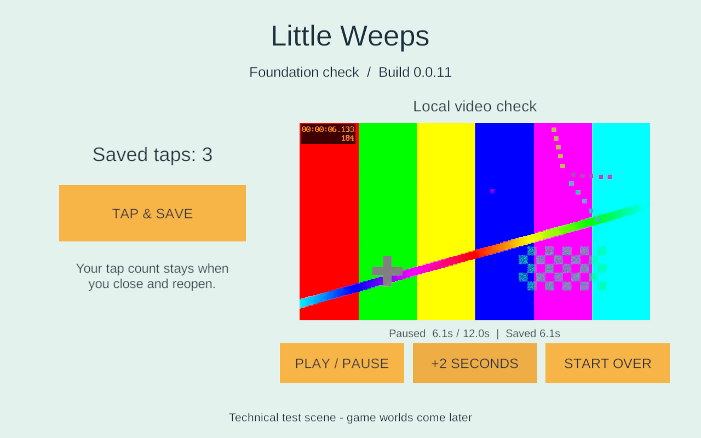
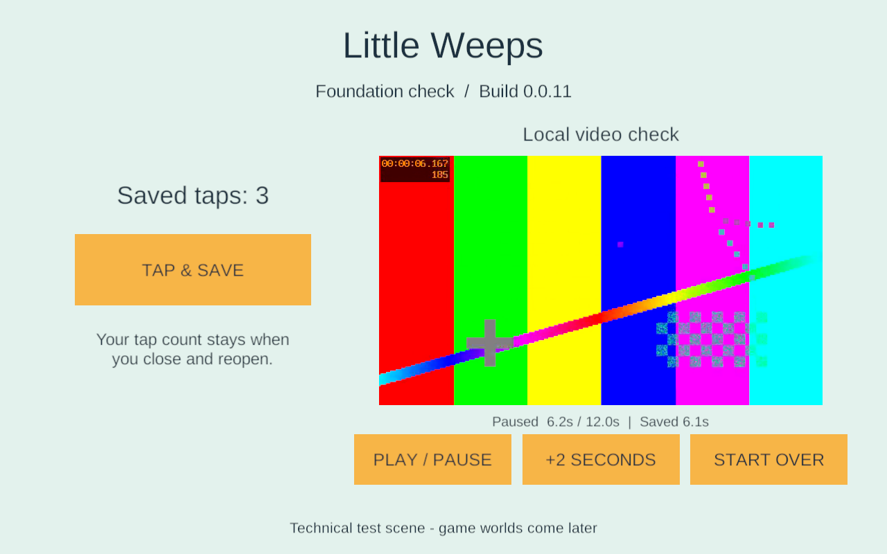

# Android 16 KB investigation — 23 September 2026

G1 task, supporting **FAMILY-01** and **TV-01**. No game content, networking, editor version or native build settings changed.

**Result:** the exact 0.0.11 APK installs and runs in a new Android 15 emulator reporting 16,384-byte pages. Injected taps, local video playback/pause/skip and force-stop/reopen recovery worked. A separate ELF diagnostic finds no declared writable bytes outside RELRO within the page-rounded RELRO ranges of its seven libraries. **This does not close native ARM64 16 KB qualification:** the x86_64 emulator runs this ARM64 APK through `libndk_translation.so`. The original strict inspection and its failed result are preserved.

## What the original warning means

The original inspector applies Google's documented `(VirtAddr + MemSiz) % 0x4000` rule. Six of seven libraries have non-aligned raw RELRO ends. Google describes a potential failure when page-rounding makes subsequent writable data read-only. The APK's ZIP and LOAD alignment already passed. [Android page-size guidance](https://developer.android.com/guide/practices/page-sizes).

The reviewed Bionic implementation rounds RELRO protection to page boundaries and separately handles LOAD padding. That makes the surrounding writable memory ranges relevant, not just the raw end address. [Pinned Android linker source](https://android.googlesource.com/platform/bionic/+/b1a578a43032061379080689bae8b970ed3f142e/linker/linker_phdr.cpp#1097). LLVM's published change describes a layout with separate writable LOAD segments and RELRO padding. [LLVM PR 66042 discussion and patch](https://lists.llvm.org/pipermail/llvm-commits/Week-of-Mon-20230911/1203975.html).

**Our inference from those sources and this APK:** the simple raw-end check may overstate the problem for these particular segment layouts. For example, `libmain.so` declares RELRO and its containing RW LOAD from `0x8f20` to `0xa000`. A 16 KB rounded range is `0x8000`–`0xc000`; the next writable LOAD starts at `0xd150`, outside it. No declared writable data occupies the padding that would become read-only. This is a geometry observation, not an exception approved by Unity/Google and not a complete model of every Android linker or the ARM translator.

| Library | Raw RELRO end | Rounded end | Writable bytes outside RELRO in rounded range |
| --- | --- | --- | --- |
| lib_burst_generated.so | 0x60000 | 0x60000 | None found |
| libc++_shared.so | 0x143000 | 0x144000 | None found |
| libgame.so | 0x29000 | 0x2c000 | None found |
| libil2cpp.so | 0x3abe000 | 0x3ac0000 | None found |
| libmain.so | 0xa000 | 0xc000 | None found |
| libswappywrapper.so | 0x39000 | 0x3c000 | None found |
| libunity.so | 0x139e000 | 0x13a0000 | None found |

`Tools/inspect_android_relro.py` reads the actual ELF64 program headers inside a hash-checked APK. It reports LOAD alignment/congruence, RELRO containment and rounded-start/end overlap with declared writable bytes, including BSS. It never labels the APK Android-compatible and does not replace `Test-AndroidArtifact.ps1`. Eight synthetic regression tests cover separate LOAD padding, writable tails, start rounding, BSS, low alignment, offset/address incongruence, malformed headers/bounds and interval unions. All passed. [Machine-readable geometry](evidence/android-16kb-review-2026-09-23/relro-geometry.json). The existing `llvm-readelf` headers remain in [the original evidence directory](evidence/android-first-build-2026-09-23/apk-inspection.json).

## Actual emulator test

The game owns a new AVD, `LittleWeeps_G1_API35_16KB`, under ignored `LocalData/AndroidAVD`. It uses the already-installed Android 15 / API 35 Google APIs 16 KB x86_64 image, revision 5, and emulator 37.1.11. No existing AVD or SDK installation was changed. It ran without a window or host audio, with SwiftShader, 2 cores and 2 GB configured memory. The page-size test environment follows [Google's emulator guidance](https://developer.android.com/guide/practices/page-sizes#test).

Observed facts:

- `getconf PAGE_SIZE`: **16384**. ABI list: `x86_64,arm64-v8a`; native bridge: `libndk_translation.so`.
- Installed package: `com.littleweeps.familyplayset`, version **0.0.11 / 11**, ARM64, non-debuggable, min API 26 / target API 36. Default Android Debug certificate; this remains an isolated test artifact.
- Pulled the installed `base.apk` back and matched its SHA-256 to the build manifest: `5a31db0c215eaea1e2b51efd9b7962be7cd1c7d49391c3a61fbf26e392a3a3d5`.
- Dismissed Android's first-run full-screen explanation. The foundation screen rendered. Three ADB-injected taps increased the visible counter from 0 to 3; Unity's log confirmed each saved value.
- The generated H.264/AAC clip displayed changing frames. Play/pause and +2 seconds produced a paused **6.1-second** bookmark. These checks use injected input; they do not qualify physical touchscreen feel or audible output.
- Force-stopped only this package, reopened it and visually confirmed **3 taps**, **Saved 6.1s**, a decoded frame near **6.2s**, and paused playback. The embedded video times differ by one frame after seeking. Android's exit record reports USER REQUESTED / FORCE STOP for the previous process, not a native crash. The new process stayed running during inspection.
- Emulator EGL capability and codec diagnostics appeared in logs, but the observed UI and clip rendered. Do not interpret this short functional run as long-session stability or physical-device performance evidence.





[Runtime record](evidence/android-16kb-review-2026-09-23/runtime.json). Raw logs remain in `LocalData/Verification/littleweeps-16kb-*-logcat.txt`; their hashes are recorded. This was not an in-place update to a different app version. The AVD data is retained for later checks; its emulator is stopped at the end of the task.

## Decision and next work

Keep Unity **6000.3.24f1** and its pinned NDK unchanged. Do not patch vendor `.so` files, disable RELRO or mark the strict inspection as passed. The investigation narrows the concern but the ARM translator prevents treating this run as conclusive native ARM64 evidence.

Samsung pairing and inventory are now complete: SM-S948U1, Android 16 / API 36, 4,096-byte pages. A run on this phone can qualify its 4 KB configuration, but cannot close the native 16 KB gate. Establish the game's stable private Android signing/recovery path before family installation, then build and test a fresh signed app and an in-place update while observing retained data. If native 16 KB testing exposes a fault, pursue a supported Unity/toolchain fix with a minimal reproduction and the captured segment evidence. An emulator-only smoke pass is insufficient grounds to suppress the existing warning.

The initial connection was rejected. After the user supplied the temporary pairing details, `adb pair` and connection to `192.168.1.126:42821` succeeded. Read-only inventory verified Android 16 / API 36 and 4 KB pages. The active Android user is 0 and this game package is absent there. The first package query encountered Samsung protected-user permissions; explicitly inspecting only the active user succeeded. No attempt was made to access the protected profile. No phone app was installed or modified; pairing credentials were not written to project files. [Phone connection record](evidence/android-16kb-review-2026-09-23/phone-connection.json). The iPad checks and remaining G1 gates remain pending separately.

## Repeat the diagnostic

From the game root:

```powershell
uv run python -m unittest discover -s Tools -p test_android_relro.py -v
uv run python Tools/inspect_android_relro.py Builds/Android/G1-0.0.11/LittleWeeps.apk --expected-sha256 5a31db0c215eaea1e2b51efd9b7962be7cd1c7d49391c3a61fbf26e392a3a3d5 --output LocalData/Verification/android-relro-new-review.json
```

Use a new output filename: the diagnostic refuses to overwrite prior evidence. A zero exit means no issues found by this limited geometry diagnostic, not an Android release gate pass.
