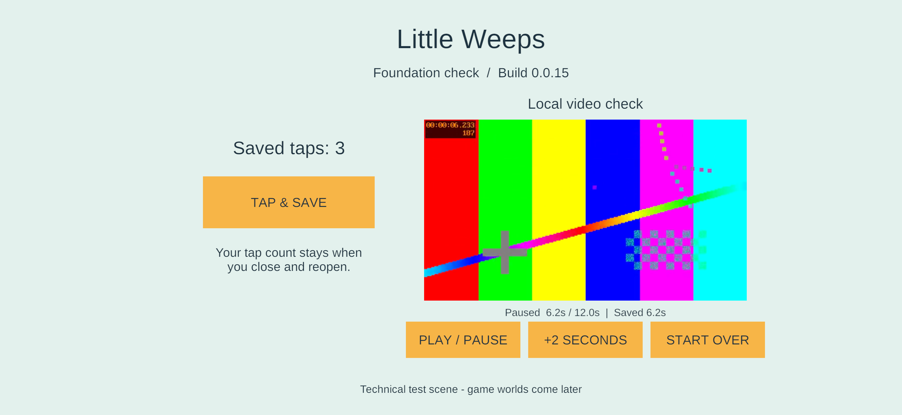

# Android signing and phone update — 23 September 2026

Bounded **G1** task for **FAMILY-01 / TV-01**: establish this game's signing identity, install the foundation fixture on the Samsung, and prove a normal update preserves observed saved data. The user's reported clipped title is fixed in the installed update.

**Result:** family-signed **0.0.14 → 0.0.15** installed and launched on **SM-S948U1, Android 16 / API 36, 4 KB pages**. The updated screen shows the complete title and footer. **3 saved taps and the paused 6.2-second video bookmark survived** both a force-stop/reopen of 14 and the in-place update to 15. The update was signed using the local recovery copy of the key. No uninstall, clear-data, downgrade or unrelated-app operation occurred.

This remains the technical foundation screen, not a playable world. G1 is not complete: other devices, off-device recovery and the separate native ARM64 16 KB gate remain open. The user confirmed physical touch and audible output on build 15.

## Stable identity and protected recovery

- Package: `com.littleweeps.familyplayset`.
- Public certificate SHA-256: `3aa42982bf8955ae45eb7d669e9202dccd1b108e6ebc6ca7aeff993b46d4c49d`.
- RSA-3072 / SHA256withRSA, 10,000-day certificate validity; alias `littleweeps-family`.
- Primary private storage: `C:\Users\sephi\AppData\Local\LittleWeeps\Signing\Android`.
- Local recovery: `C:\Users\sephi\Documents\Little Weeps Recovery\Android Signing`.
- Both directories have inheritance disabled and allow only the current Windows user and SYSTEM. The primary password is protected with Windows DPAPI. The recovery folder contains the encrypted PKCS12 key, public certificate and a portable password file; its confidentiality depends on keeping that protected folder private.
- Only the public fingerprint/alias/package are tracked in `Tools/android-family-signing.json`. Private key, password and machine-specific registration are outside Git. No other app's key was used.

`Initialize-AndroidSigning.ps1` creates the identity once, copies and hashes the local recovery material, and refuses to regenerate when an incomplete or different registration exists. A second initialization confirmed the original identity was retained. Access rules were read back and verified. **The recovery copy was exercised:** build 15 used it to sign a different APK; certificate verification and the actual in-place phone update passed. This is a proven local recovery copy, not a verified independent/off-device backup.

Android updates need a consistent app signing identity. The supported `apksigner` route accepts a keystore, can write a separate output APK, and verifies its resulting signature; alignment must precede signing. [Android app signing](https://developer.android.com/studio/publish/app-signing), [apksigner reference](https://developer.android.com/tools/apksigner).

## Build and installation workflow

`Build-AndroidFamily.ps1` always builds the requested fresh source/version through the pinned Unity runner, then signs a separate APK under `Builds/AndroidSigned/G1-0.0.N`. It preserves Unity's original intermediate artifact under `Builds/Android`. It refuses reused build directories and missing/changed keys. The password is passed in a temporary process environment variable, never as a command-line value or written into Unity settings. The signing script restores the previous environment on exit.

Each accepted signed build verified its signature, pinned certificate, ZIP alignment, and all **449 non-signature ZIP payload entries** against the original Unity APK. Signed build/source/artifact manifests and signing evidence are retained. The original debug certificate is replaced on the signed output; the installed package is signed solely by the pinned family key and remains a non-development IL2CPP/ARM64 build, min API 26 / target API 36.

`Install-AndroidFamily.ps1` reconnects the recorded paired phone, requires the expected model/main user/4 KB configuration, validates the selected APK hash, identity, non-debuggable state and certificate, and checks any existing installed package's certificate/version before updating. It uses `adb install -r --user 0`, pulls the installed APK back to compare the exact hash, and launches the exact game activity. Identical bytes are reported as **already current**, not updated. UI and saved-data verification remain separate from installation success.

The installer is deliberately a **4 KB physical-device probe** while the separate 16 KB finding remains open. `Test-AndroidArtifact.ps1 -Signing Family` now validates the family certificate as well as retaining the strict 16 KB checks. Both 14 and 15 still report the same six raw RELRO-end flags; both independent geometry diagnostics find no declared writable overlap. This phone run does not close native 16 KB qualification. [Earlier investigation](android-16kb-review-2026-09-23.md).

## Observed evidence

| Check | Result |
| --- | --- |
| Fresh Unity 14 and 15 builds | Both succeeded, zero build-summary errors/warnings |
| Build 14 signer | Primary family key; signature verified |
| Build 15 signer | Recovery copy; same certificate verified |
| Installed APK bytes | Pulled APK exactly matches intended signed artifact for both versions |
| Initial saved input | Three ADB-injected taps changed the visible counter 0 → 3; Unity log confirmed saves |
| Local video | Decoded test pattern displayed; play/pause and +2 seconds reached paused 6.2 seconds |
| Force-stop/reopen 14 | Visible 3 taps, decoded paused frame, Saved 6.2s |
| In-place update 14 → 15 | Visible new version, same 3 taps and paused Saved 6.2s |
| Phone layout | Complete title, version, controls and footer visible in 15 |
| Physical fingers / audible test tone | User confirmed that tapping works and the test tone is audible on build 15 |
| Long sessions / all hardware / native 16 KB | Not qualified by this short phone test |

Signed APK SHA-256:

- **14:** `15bb240e934ba019365b0141ea1255b5d001c4234f4d18b14c67f590ce0fc252`.
- **15:** `bbe4463cb4de2f4790ba16f3af2293efc07879fc389cc76f32441d1d5da75c0d`.

[Install 14](evidence/android-phone-g1-2026-09-23/install-14.json), [update 15](evidence/android-phone-g1-2026-09-23/update-15.json), [primary signing](evidence/android-phone-g1-2026-09-23/signing-14.json), [recovery signing](evidence/android-phone-g1-2026-09-23/signing-15.json), [visual/save observations](evidence/android-phone-g1-2026-09-23/verification.json).



## Defects resolved

The previous CanvasScaler width/height compromise allowed the reference layout to extend beyond a wide phone's height. The fixture now uses **Expand**, which fits the full reference layout inside the screen. This behavior was checked against the installed UGUI `CanvasScaler.cs` implementation and verified on the actual 3120×1440 phone screenshot after updating. It is a responsive layout fix, not a phone-specific vertical offset.

The first signing wrapper on build 13 used a case-insensitive PowerShell dictionary and incorrectly rejected valid case-distinct ZIP filenames (for example, `res/GR.xml` and `res/gR.xml`). The payload comparison now uses ordinal case-sensitive keys. Build 13 remains incomplete and was never installed; fresh 14/15 completed the corrected pipeline. The artifact inspector's signing-output variable was also renamed to avoid a PowerShell case-insensitive collision with its new `Signing` parameter. Unity restarted ADB during building, so the installer now reconnects using the existing pairing before device checks.

## Repeat on Windows

Use a new build number; keep this Unity project saved and closed:

```powershell
./Tools/Build-AndroidFamily.ps1 -BuildNumber 16
./Tools/Install-AndroidFamily.ps1 -BuildNumber 16
```

These commands are examples for the next fresh build; **16 has not been built**. `-UseRecoveryKey` on the build command repeats the recovery-signing route. The install command alone does not build or claim a new version. If the phone's wireless port changes, refresh the ignored device record with the newly confirmed endpoint; never substitute another device or app.

Next G1 work: complete the outstanding iPad save/update/device checks and saved platform profiles, and verify independent recovery storage. Preserve the native ARM64 16 KB qualification gate. All mixed-device play, iPad hosting, independent rooms and the complete content goal sheet remain later required work.
