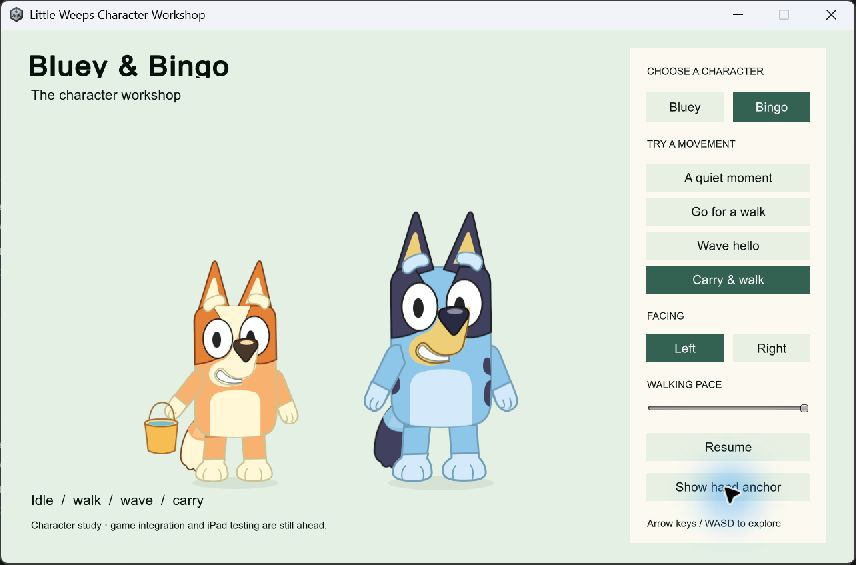

# ART-PREP-02 — Bluey and Bingo Unity workshop

**Later update:** the user requested integration into the real game and accepted the Android prototype on build 100, noting stiff animation. Build 101 restores the solo Creek button. [Current implementation and device evidence](character-phone-switch-2026-09-25.html). The workshop evidence below retains its original scope.

**September 25, 2026 · Goal IDs CHAR-01 / ITEM-02 · Corrected character study implemented and technically verified; visual acceptance and production integration remain open.**

The isolated Unity workshop now uses separate Bluey and Bingo layered artwork guided by the official reference catalog. It replaces the generic blue pup that the user rejected. Both characters support idle/blink, walking, waving, carrying, facing changes and floor-based depth ordering. Switching the selected character preserves the movement root and carried presentation. Passing the checks below does not establish user approval, final likeness, completed ART-PREP-02 or G6.

## Research applied

The governing documents are the [55-section goal sheet](../bluey-game-research-2026-09-23.md), [build guide](../family-playset-build-guide-2026-09-23.md) and [current decisions](../current-decisions.md). The user referred to a roughly 60-page research PDF; the matching PDF has not been located, so this record identifies the source documents actually read rather than claiming to have read that file.

Goal-sheet section 4 supplies the first-character order, official references and editable-layer requirements. The Toca/Piknik supplement explicitly requires recognizable 2D Bluey character style. Section 17 supplies the separation between player identity and replaceable visuals. The [source-art requirements map](../../SourceArt/Characters/README.md) connects these requirements to the implementation and remaining work.

The new artwork uses the box-shaped torso/head silhouette, large oval eyes, character-specific face patches, brows, muzzle, paws, tails and blue/navy or orange/cream colors. Bingo has a smaller visual scale. These are newly authored studies from inspected references, not official rigs or approved final art. The unused generated atlas and rejected generic Unity import remain outside the active asset tree.

## Open it

Double-click `Play-CharacterWorkshop.cmd` in the project root. It opens the latest locally verified native workshop. Choose Bluey or Bingo, then idle, walk, wave or carry. Left/Right, walking pace, Pause/Resume and the hand-anchor overlay help inspect motion. Arrow keys or WASD move around the floor; the companion shows overlapping depth order.

The standalone preview is a separate product, **Little Weeps Character Workshop**. The family app, server and physical devices were not updated. Prepared family client 98 and its physical acceptance remain unchanged.

## What was built

- Editable `SourceArt/Characters/bluey.svg` and `bingo.svg`, plus a shared pivot/export contract. Each exports 12 tightly cropped transparent PNG layers, crop origins, pivot metadata and source/sprite hashes. Each character uses 520,520 RGBA bytes before engine overhead; this is an asset-size count, not a device-memory measurement.
- `BlueyView.prefab` and `BingoView.prefab`, with separate face, eyes, muzzle, arms, feet, body and tail layers. The fixed floor pivot and hand attachment belong to the visual hierarchy. The box-shaped face does not swivel as a detached head.
- `CharacterMotion`, a read-only adapter from displayed positions. The workshop uses the existing `Walking.Step` rules. A changed player/area/visit key or a large position correction clears velocity history instead of producing a false sprint.
- `CharacterView`, which consumes pose, speed and facing and only moves visual joints. A bucket attaches to the hand and counter-rotates to remain upright in both facings. Confirmed carry wins over waving. `SortingGroup` keeps the character and prop together during depth crossings.
- A separate scene, release builder, native check runner and interactive launcher. The builder verifies source/sprite hashes, records source hashes including the editable art, restores family settings and rejects semantic settings changes.

## Verification evidence

| Check | Result and scope |
| --- | --- |
| Unity import and compilation | Unity 6000.3.24f1, exact `Little weeps game/Unity/FamilyPlayset` project, release Windows build `art-prep02-006`; zero errors and warnings. [Build](evidence/art-prep02-2026-09-25/build-summary.json) |
| Motion transitions | First sample, existing walking speed/facing, idle-facing retention, wave, carry priority, area change, correction and long-frame reset passed. |
| Attachment and isolation | 2,880 deterministic pose samples across two characters, four poses and two facings preserve root position/rotation/scale and floor pivot. Grip, upright carry, stationary feet, release and depth ordering passed. These are pose samples, not rendered performance frames. |
| Character changes | Bluey → Bingo → Bluey preserves the selected root, position, facing and carried presentation without duplicating the prop on the companion. This fixture does not exercise a real profile, network inventory or activity. |
| Native checks | All 29 passed. [Results](evidence/art-prep02-2026-09-25/runtime-checks.json) |
| Rendering and visible controls | Native camera renders and the interactive controls were reviewed separately. [Visual record](evidence/art-prep02-2026-09-25/visual-review.json). Hidden-window images use explicit camera rendering and do not capture GUI controls. |
| Source boundary | Existing family runtime/settings unchanged; new scene, assets and presentation code only. [Boundary](evidence/art-prep02-2026-09-25/source-boundary.json) |

Early attempts exposed background pausing and unreadable hidden-window backbuffers. Enabling background execution for this fixture and explicitly rendering its camera resolved those verification problems. The rejected generic-art build is not the acceptance evidence for the corrected art.

## Rebuild

1. After editing the SVG or contract, run `uv run --offline python Tools/Export-CharacterStudy.py --node <node.exe> --node-modules <node_modules>`. Node's `sharp` dependency provides rasterization.
2. Close this Unity project, then run `Tools/Build-CharacterWorkshop.ps1 -RunId <fresh-id>`.
3. Run `Tools/Test-CharacterWorkshop.ps1 -RunId <same-id>` and inspect its scene renders. Successful checks update the local launcher receipt. Build products and logs remain ignored.
4. Open `Play-CharacterWorkshop.cmd`. The Unity scene is `Assets/FamilyPlayset/Scenes/CharacterWorkshop.unity`; **Little Weeps → Character Workshop → Rebuild isolated scene** reconstructs the prefabs and scene.

## Remaining work

ART-PREP-02 remains open for visual feedback. Do not advance to G5 on technical checks alone. Production artwork still needs individually authored directions, occlusion, reach/use, talk/happy/seated poses, animation polish, the full roster, game integration and physical A10/child acceptance. Mirroring this study does not prove asymmetric production views.

G5 then establishes versioned rooms, creations, reusable item/container rules and safe returns with separate local/server persistence. Family build 98 signing/install/offline/rejoin checks remain on the [return checklist](return-checklist-ipad-lan-2026-09-24.html). PC/VPS remains the shared authority; offline edits remain private.

Implementation reference: Unity's [SortingGroup API](https://docs.unity.com/en-us/engine/6000.3/script-reference/unityengine/rendering/sortinggroup) explains grouping characters assembled from multiple SpriteRenderers. Runtime results above establish only this workshop's tested behavior.
