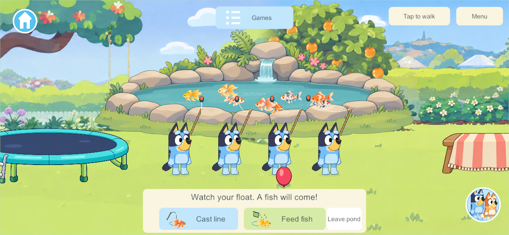
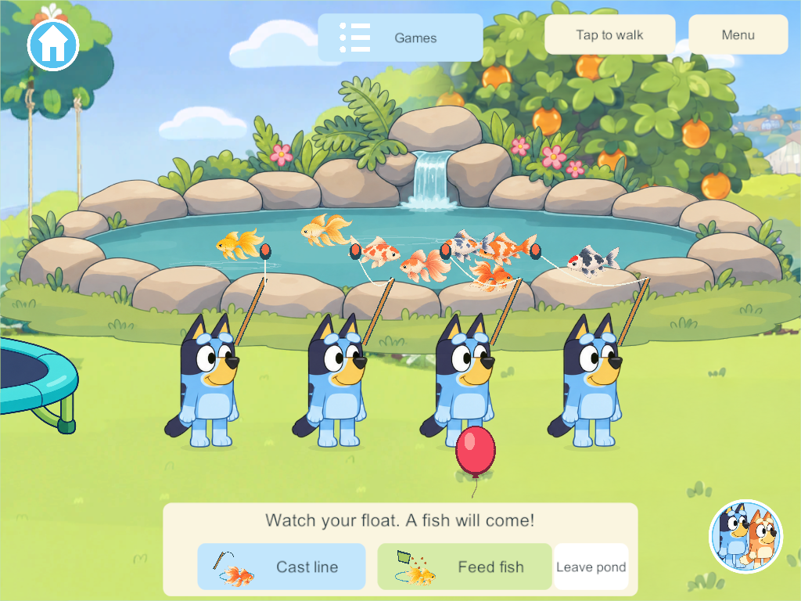
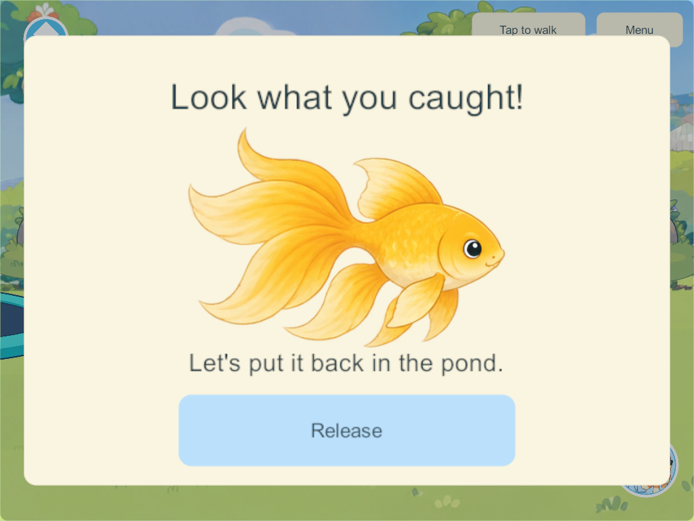
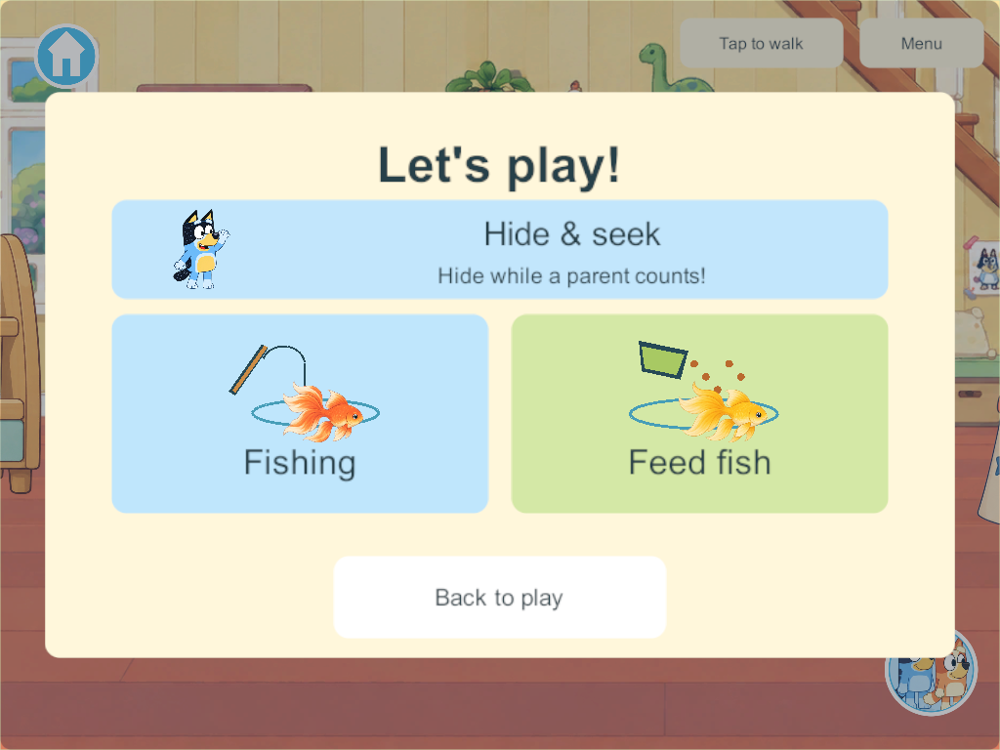

# Shared backyard pond — implementation and placement correction

September 30, 2026 · FISH-01 / Y-12 / Y-13 · Windows candidate **285**

The Games menu has separate **Fishing** and **Feed fish** picture cards. One tap sends the player directly to an available bank spot and begins casting or feeding. The original full-sized pond sits in the open stretch between the trampoline and picnic table/blanket bench. The camera centers on the pond while either activity is active; all four players stand along its front bank. The old painted pond, useless pink pool and stray foreground stones are removed from the background. The picnic table and its hiding spot move 240 units right to x3150.

Eight painted koi/goldfish swim in one authoritative pond. Rods cast with a curved line and float. Fish bite after varied short waits; one **Reel in** tap opens the catcher’s close-up and **Release** returns that same fish. Feeding gathers available fish and clears bounded pellets. Water/cascade motion and quiet original synthesized ambience continue during ordinary nearby play. Players can switch, walk away, travel or disconnect independently.

Six focused core groups pass: additive migration, four shared casts/exclusive catches, feeding/replay, independent departure/walking and recovered temporary leases. The Unity build passes old-save and actual JSON field checks. Seven native four-client groups pass through the real picture controls, including direct travel/start, varied bites, catch/release, feeding alongside catches, independent disconnect/Leave and idle water. Phone 1280×591 and iPad 1024×768 screenshots were visually inspected. [Native result](evidence/backyard-pond-2026-09-30/result.json).

Candidate 281 was rejected for oversized placement over the shed and a bush hiding players; 285 corrects placement without shrinking the artwork and replaces the crude fish. Source art, exact prompts and alpha-bound sprite metadata are retained in `SourceArt/Home/Pond`. Original water/float sound sources are in `SourceAudio/Pond`.

Schema 36 adds authoritative fish/rod/food state, clears temporary participation on reopen and preserves existing world fields. The isolated candidate snapshot contains concurrent Zoo/outfit/roster dependencies and uses content 39; current branch compatibility is 42 from other work. This task updates source and the isolated Windows candidate only. No family device, signing identity, enrollment, save or live server was modified. Preserve the branch/main integration hold. Physical-device audio/usability/performance, family visual review and exact episode likeness remain open; creek fishing remains unbuilt.

[Applied research](backyard-pond-research-2026-09-30.html) · [Home tracker](../home-world-feature-tracker.html)

The repository-wide document consistency check recognizes this pond record and resolves its links, but remains blocked by five unclassified records from concurrent beach, creek, daycare, dinosaur-phone and park work. Those unrelated records are outside this task; the pond runtime and focused checks pass.
