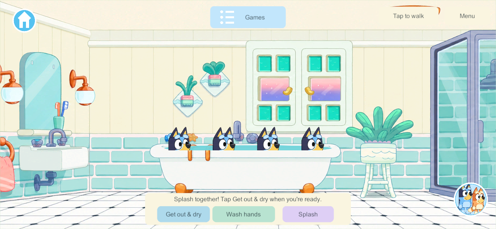
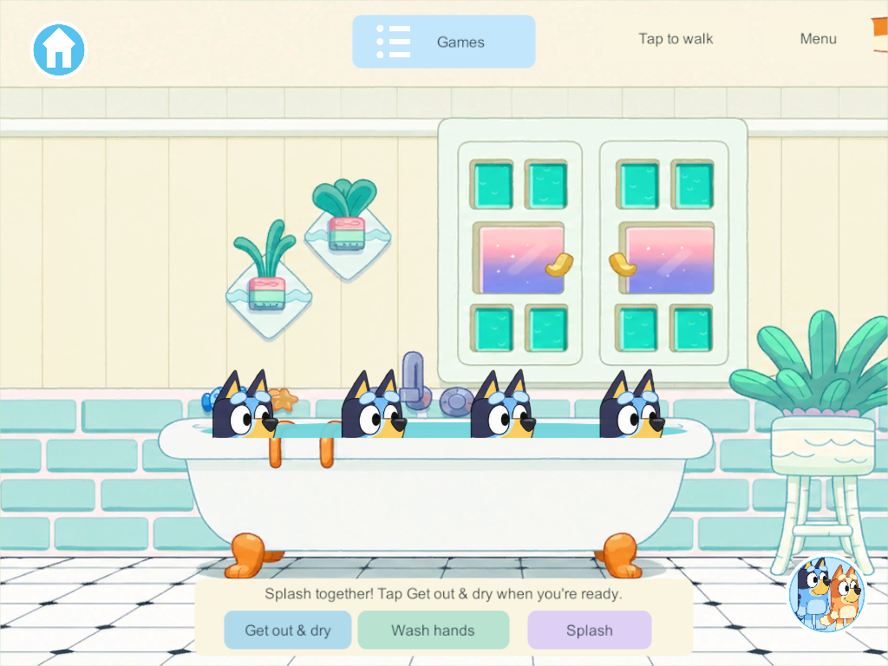
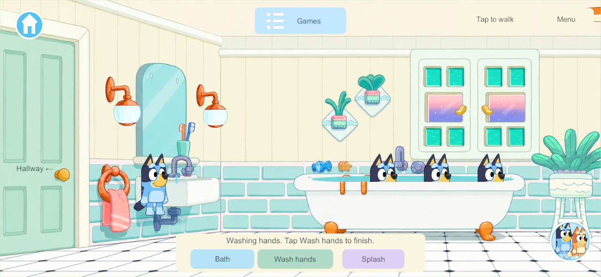

# Heeler bathroom: research and first playable room

Goal IDs: H-06, H-01, WORLD-01. September 30, 2026.

## What the show reference establishes

The [official Heeler house wallpaper collection](https://www.bluey.tv/make/blueys-house-wallpapers/) links a [full bathroom background](https://www.bluey.tv/wp-content/uploads/2025/04/bathroom.png), visually inspected for this task. It shows cream vertical wall panels over pale turquoise rectangular tiles, a pale floor with small dark corner diamonds, a white claw-foot bath with orange feet/handles, a sink with exposed plumbing, tall aqua mirror, orange globe-lamp brackets and a coral towel ring. The window has turquoise and pink/lavender panes. A lavender-framed glass shower stands on the right; small plants, a mint stool, toothbrush cup and fish/star bath decorations complete the room.

[Burger Shop, Season 2 Episode 31](https://www.bluey.tv/watch/season-2/burger-shop/) confirms Bluey and Bingo playing together in the bath, Dad joining their pretend shop, and towel drying afterward. This supports relaxed shared bath play and future movable bath toys. It does not establish four positions, a room doorway location, or this game's wider framing.

The upstairs door at the right end of the existing landing and widened four-player bathtub are implementation choices. The research does not establish an exact canonical floor plan or claim that laundry belongs inside this bathroom. The inspected wallpaper shows no toilet, so this first room does not add one arbitrarily.

## First implementation

- A mint fish/star door at the far right of the upstairs landing enters the new shared bathroom. The four bedroom doors remain available; the bathroom returns to the hallway.
- Generated wide artwork retains the recognizable fixture layout and palette. The foreground bath rim samples the original room pixels; moving water, ripples and splash drops are separate layers.
- Four exclusive bath spots share one room. Bath/Splash controls, bath exit and four sink positions use existing authoritative player leases. Moving, leaving the room or disconnecting releases only that player's participation.
- Existing belongings may travel through the doorway. Temporary fixture leases clear on recovery while the bathroom location, house, bedrooms and belongings remain.
- Bathroom remains part of Home for navigation and the world-specific Games menu; it is not a seventh world or a new mini-game card.

[Room and hallway artwork with exact built-in image_gen prompts](../../SourceArt/Home/Bathroom/README.md).

## Verification and delivery

The focused core check passes on both the integration checkout and the isolated bathroom source: Home retention, schema admission, four bath leases, competing use, splash/sink/exit, independent hallway departure/disconnect and recovery. Unity's native old-save/JSON/art-import checks pass. Windows release **318** passes the focused native four-client check: real hallway doorway, four shared bath spots, splash, sink use, independent hallway exit and disconnect, with phone/iPad composition inspected. [Result](evidence/bathroom-2026-09-30/result.json).

The repository-wide plan checker reports eight unclassified concurrent research records; it reports no missing bathroom link or classification. These unrelated records were preserved.

The release check uses an isolated copy of completed source plus this bathroom, avoiding unfinished concurrent features. Bathroom admission uses schema 39/content 46 and requires a future matching coordinated server/client delivery. No phone, iPad or live family server was updated; the main integration hold remains.

## Still unfinished

H-06 remains **Partial**. Laundry machines, clothing wash/hang/dry/return state, dressing/bedtime links, real movable towels/storage and bath toys are not implemented. The bath is already filled; faucet filling/draining and usable shower remain future work. “Get out & dry” currently exits the bath, without a saved wetness system or towel animation. Sink/hand and towel pose polish remains open. Generated visual likeness needs family acceptance; native screenshots establish rendering and placement only.

Next bathroom slice: interactive faucet/drain, shower water/door and movable bath toys/towels, followed by the separately planned laundry and clothing states.
