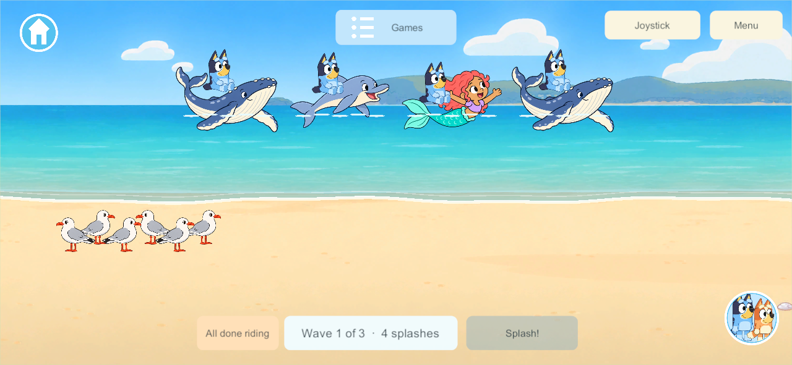
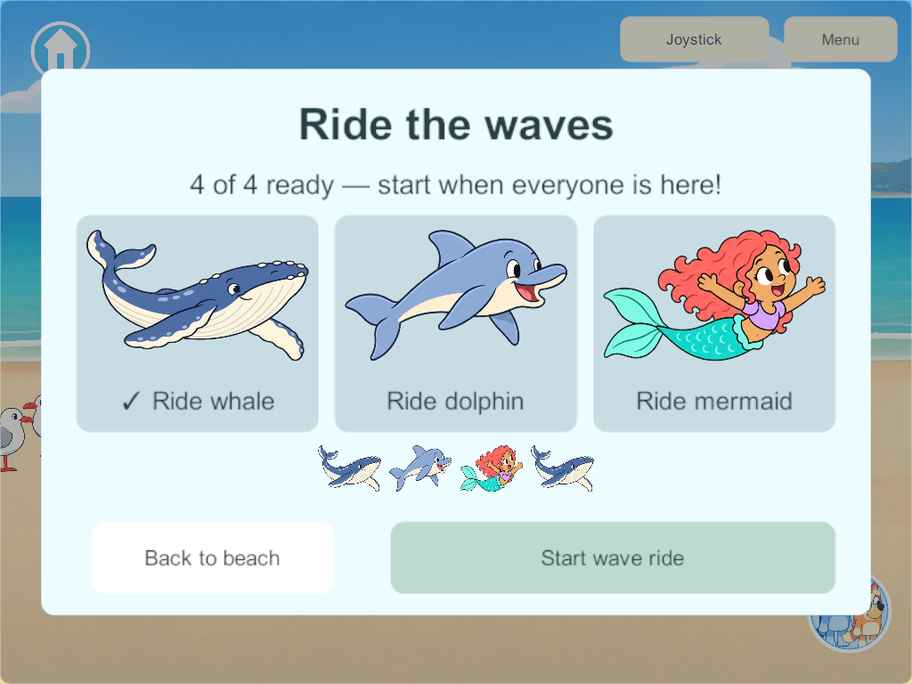
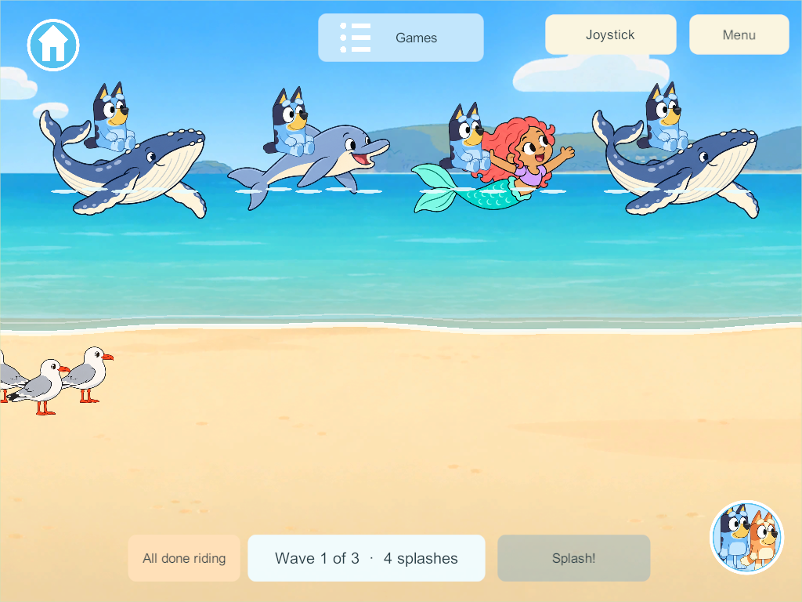

# Ride the waves — beach mini-game

September 30, 2026. Requested extension to **BCH-03 / OUT-01 / G7-B**: ride the prepared whale, dolphin and light-brown Hispanic mermaid visitors. This adds a new game to the beach **Games** menu while retaining the original ten beach activity IDs and the eight other planned activities.

## Play

Open Games → Ride the waves. Choose a pictured sea friend to become ready. Up to four family players choose their own visitor within **one shared convoy**. Friends at the beach see a Join wave ride invitation; the card shows the four ready choices. Anyone aboard can press Start wave ride once everyone is ready.

One authority broadcasts a three-second countdown and a 24-second route through three waves. Every rider rises on the same wave schedule. Tap Splash during the broad wave window to add a splash to the shared total, once per child per wave. There is no loss condition or competitive score. Private offline solo uses the same rules.

All done riding returns only that child to their boarding position. Travel and disconnect also remove only that child; the remaining convoy keeps its round, route and splash total. Late arrivals wait for the next ride. The route ends with everyone back at their own beach point, ready to walk or deliberately start another shared ride.

## Implementation and delivery boundary

- `BeachWaveRide.cs` adds bounded lobby, seats, common age, visitor choices, saved return positions and cooperative splash masks inside the existing shore state. Four actors/seats are unique; stale starts and duplicate splashes are rejected.
- The existing reliable fragmented shore stream carries the small ride record. The unreliable walking packet is unchanged. No client hosts or merges offline edits.
- `SoloWaveRide.cs` adds the pictured menu/card, ready badges, family invitation, controls, four supports and seated character presentation. Each visitor's prepared airborne drawing rocks and lifts beneath its rider; the random offshore sightings retain their existing three-stage artwork and intervals.
- Saved children stay in the valid beach walking strip; visual ocean positions do not bypass world bounds. Additive migration retains prior characters, rooms, belongings and shore timing/RNG. Checkpoints retain a common ride and resume its age; disconnected seats release through the normal session lifetime.
- Candidate schema **43**, content **55**, protocol **3** require a future coordinated app/server delivery. Concurrent candidates use different additive schemas/content meanings; reconcile their fields before integration. Preserve the existing main integration hold. This task does not install devices or change the live family server.

## Verification

Windows **350** server/client releases succeed with zero build errors or warnings. Focused core rules and Unity JSON migration/retention checks pass. One completed native four-client check passes pictured boarding with all three visitor choices, shared countdown/round, four attached riders on phone/tablet layouts, cooperative splashes, independent All done/travel/disconnect, automatic shore return, restored walking and deliberate replay. Source hashes match the checked artifact; visitor artwork is unchanged from 307.

[Native result](evidence/beach-wave-ride-2026-09-30/result.json) · [Unity JSON](evidence/beach-wave-ride-2026-09-30/unity-json-check.json) · [Build summary](evidence/beach-wave-ride-2026-09-30/build-summary.json) · [Source/art check](evidence/beach-wave-ride-2026-09-30/source-check.json). Family visual acceptance and physical-device playtesting remain open.

## Related records

[Beach additions](../beach-world-wishlist.md) · [Waves, prints and random sightings](beach-waves-2026-09-30.html) · [Visitor sheets and editable layers](sea-visitor-models-2026-09-30.html) · [Core evidence](evidence/beach-wave-ride-2026-09-30/core.json).
