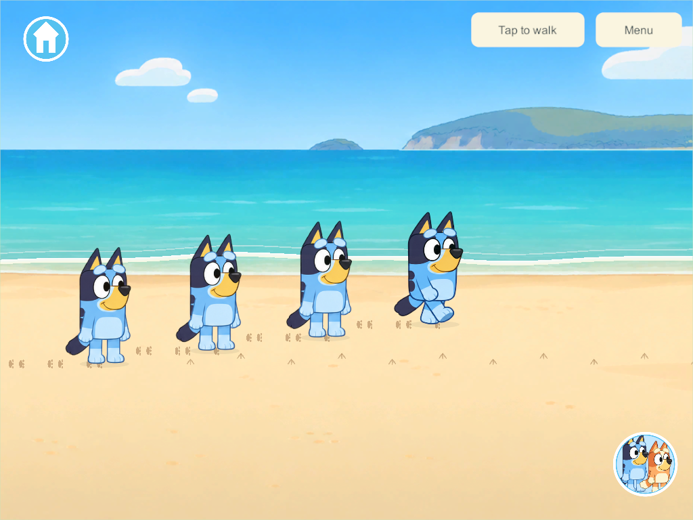
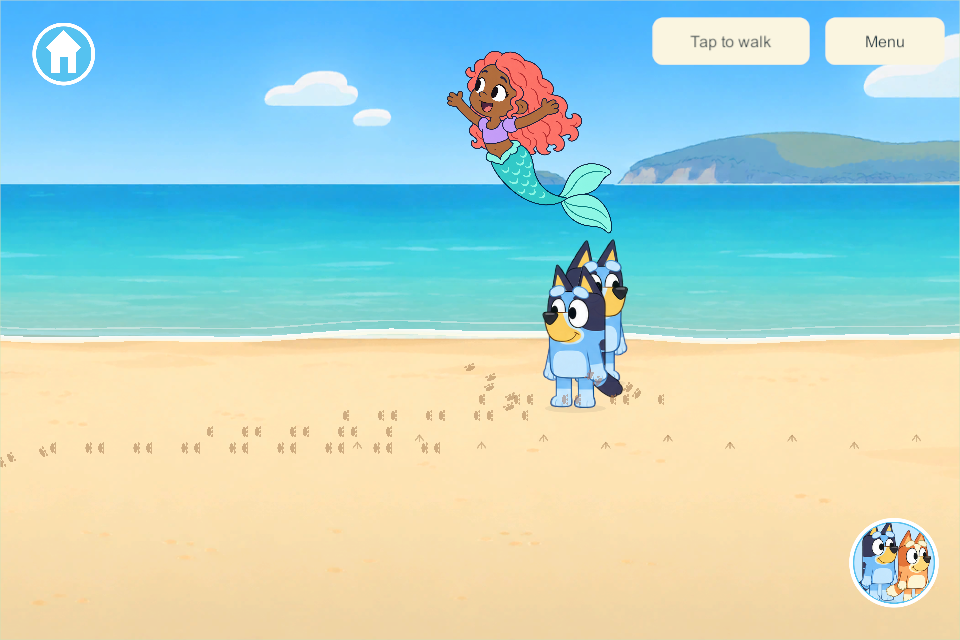

# The Beach: waves, footprints and random sea visitors

September 30, 2026 · BCH-03 / OUT-01 / G7-B · User-prioritized implementation following Seagull surprise.

**Later artwork correction:** [Sea visitor model sheets](sea-visitor-models-2026-09-30.html) add the user's light-brown Hispanic mermaid direction and three distinct emerging/airborne/re-entry drawings per visitor. The single-drawing descriptions and captures below record the initial 304/305 milestone; the follow-up is presentation only.

The user requested waves and walking footprints, plus whales, dolphins and mermaids jumping out at random intervals. This first playable slice shares those interactions across up to four players in the same beach world, with the same rules available for private offline play.

## Applied research

NOAA describes the swash zone as beach that becomes wet and dry as waves advance and return. This supports a readable incoming foam edge, shallow wash and retreat rather than a fluid simulation. The game uses a gentle nine-second cycle and erases only temporary wet-sand footprints. That timing and the small wash range are authored play choices. [NOAA shoreline glossary](https://www.weather.gov/safety/ripcurrent-science).

NOAA records humpback breaching and dolphin leaping as surface behaviors. They support distinct whale and dolphin silhouettes and an offshore rise/arc/re-entry animation. Our smiling drawings, appearance rates and positions are fictional staging rather than a wildlife simulation. Mermaids are explicitly the requested fantasy visitor. [Humpback behavior](https://www.fisheries.noaa.gov/species/humpback-whale) · [Dolphin aerial behavior](https://www.fisheries.noaa.gov/species/spinner-dolphin?page=1).

The original goal sheet already specifies layered 2D waves, touch ripples, wet-only footprint fading, independent exits and protection of saved creations. The code does not touch castles, room records, stored pictures or inventory. Castles/toy bobbing remain separate future activity work. [Goal sheet section 37](../bluey-game-research-2026-09-23.md#37-the-beach-collecting-building-and-playing-together).

## What exists

- Continuous moving foam and shallow-water ribbons on both beach stretches, aligned with new unobstructed shoreline art.
- Actual authoritative walking emits alternating paw prints every 30 world units. All four players share the same trail field; each child has a 48-print allocation. Dry prints gradually retire after three active beach minutes. Wet prints fade over 1.3 seconds when washed.
- Tapping the illustrated water makes shared expanding ripples. Distance checks, a short input cooldown, one ripple per child and a two-second lifetime bound repeated taps.
- One whale, dolphin or mermaid rises, arcs, lands and splashes offshore. The initial wait and subsequent quiet gaps are random **18–42 active beach seconds**; each event lasts 4.8 seconds. Consecutive sightings use different types. The authority chooses one type, direction and position near an occupied beach stretch; clients do not roll their own animals.
- A saved random generator and next-event time retain the common schedule across save reopen. Empty beaches pause without a wall-clock catch-up burst. A player travelling/disconnecting does not restart siblings' event or wipe their trails.
- Generated source PNGs, exact prompts and named editable OpenRaster layers are retained. Whale, dolphin and mermaid animation currently transforms one prepared drawing per visitor. [Artwork and prompts](../../SourceArt/Beach/Shore/README.md).
- Beach character presentation removes the legacy 45-unit lab art offset so feet meet the authoritative footprint/wet-sand plane. Other areas keep their existing alignment.

## Shared state and delivery

Schema **40**, content **46**, protocol **3**. These IDs are above the concurrent schema-37/content-44 candidates inspected when starting. The candidate continues the isolated seagull implementation on `codex/beach-waves`; it does not integrate the concurrent pond, Zoo, creek-boats, wheels or Daycare branches. Future integration must reconcile each candidate's distinct schema/content meaning and preserve every field.

The snapshot adds `shore` and copies/validates its trails, ripples, walking remainder and sighting schedule. A separate reliable shore stream batches changed state at most four times per second and sends a clock sample about once a second. This avoids putting growing trail arrays in the existing 1200-byte walking datagrams. Clients interpolate presentation between authority samples and retain newer shore state when an older reliable snapshot arrives.

No phone, iPad or live-family-server rollout occurred. Compatibility requires a coordinated future server update under the existing policy. The main integration hold remains in force.

## Verification

Focused core checks pass for additive migration with retained profiles/rooms/objects, four shared trails, alternating paws, wet-only washing, nearby ripple/range limits, randomized three-type schedules, no immediate repeat, independent departure, JSON reopen, 48-print bounds, empty-beach pause and detached reads. The actual Unity JSON checks also pass for legacy migration, RNG and all three visitor records with prints/ripples. [Core evidence](evidence/beach-waves-2026-09-30/core.json).

Windows **304** client/server release builds have zero errors/warnings. One native four-client disposable loopback family passes real joystick footprints, shared trails, washing, real water taps, a common random sighting, independent travel/disconnection and observing all three requested visitors. Phone 960×640 / 1280×591 and tablet 1024×768 layouts render clean transparency and remain within the three-tile scenery-cache budget. [Native result](evidence/beach-waves-2026-09-30/native-304/result.json).

Windows **305** adds only the beach character-floor alignment correction after inspecting those captures. Its focused follow-up checks the changed floor interaction and phone/tablet presentation; the shared rules/network source are identical to 304. [Final build](evidence/beach-waves-2026-09-30/build-summary.json) · [Floor follow-up](evidence/beach-waves-2026-09-30/native-305/result.json).

The eight other named beach activities remain planned. Gull calls and richer visitor poses/sounds are optional polish; family art acceptance and actual-device delivery remain open.

## Requested riding follow-up

[Ride the waves mini-game](beach-wave-ride-2026-09-30.html) extends these visitors with a beach Games entry, one four-player lobby/countdown/convoy and independent returns. Its Windows 350/schema 43/content 55 evidence is separate from the original 304/305 shoreline milestone below. The random sightings and their three-stage art remain available.
