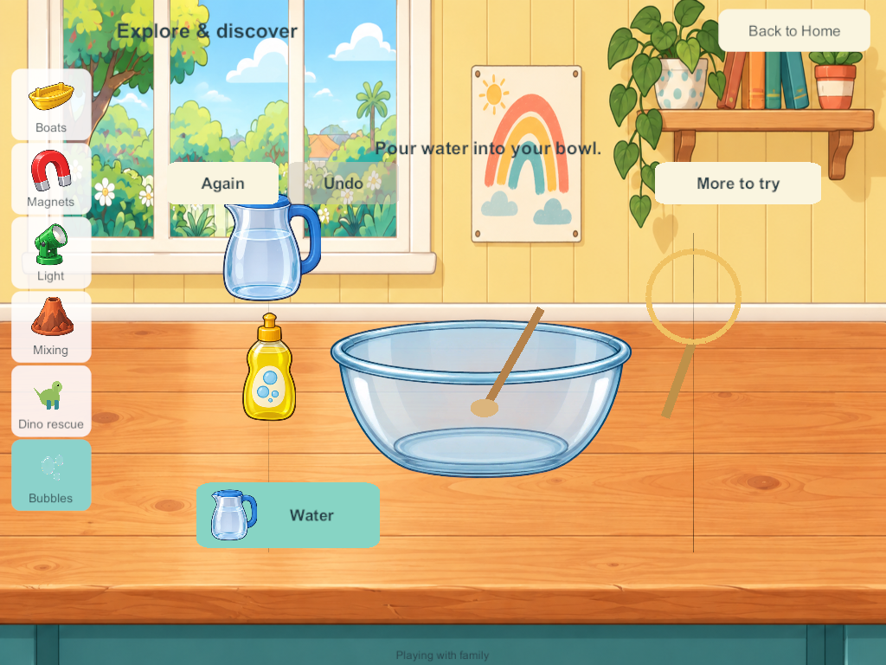
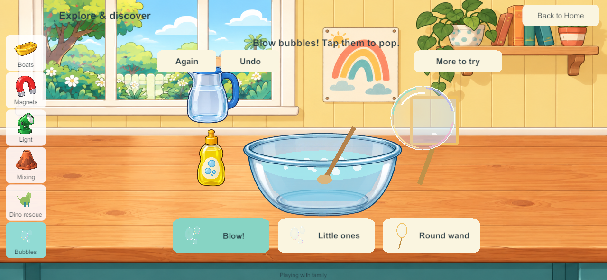
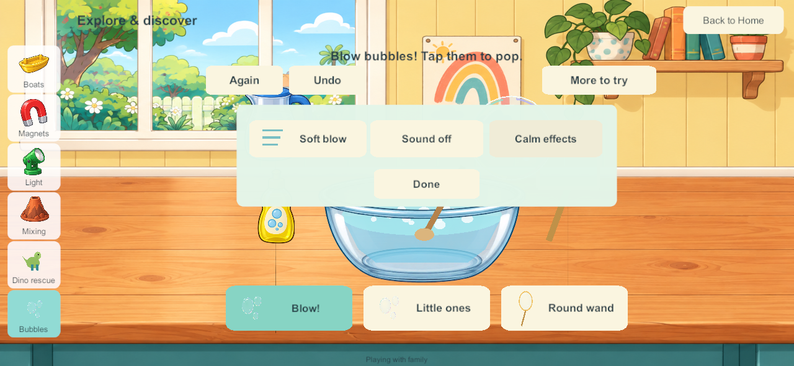

# Bubble lab in the Home science area

September 28, 2026. SCI-06 / LAB-01 / SP-12. This bounded slice brings the accepted bubble prototype into the Unity game. The liquid-color lab, native reader controls, remaining science prototypes and wider Home scope stay tracked.

## Research applied

The [bubble research](science-hammer-labs-2026-09-28.html), [child-flow research](science-kids-flow-2026-09-28.html) and [accepted picture controls](home-picture-controls-2026-09-28.html) were read before implementation. This applies existing reviewed research; it does not claim a fresh external research round or physical child acceptance.

The Exploratorium's [soap explanation](https://annex.exploratorium.edu/ronh/bubbles/soap.html) informs the preparation loop: **Water → Soap → Stir → Dip → Blow**. Neither an empty bowl nor an undipped wand makes bubbles. This uses illustrative portions, not a measured mixture formula. Its [bubble-shape explanation](https://annex.exploratorium.edu/ronh/bubbles/shape_of_bubbles.html) informs round free bubbles from both round and square wands. [Thin-film colors](https://annex.exploratorium.edu/ronh/bubbles/bubble_colors.html) inform translucent pastel rims and highlights instead of solid colored balls.

The existing child-flow study and Toca exploration references inform direct apparatus taps, pictured alternatives, one emphasized useful next action, at most three main tools and optional extras. This is a design inference; child usability remains to be observed.

## Native play

Walk to the downstairs **Science** bench and choose **Bubbles**. Tap the water jug, soap bottle, bowl and wand, or follow the large pictured button. The button changes to the next useful action. After preparation, choose a big bubble or little bubbles and a round or square wand. Tap flying bubbles to pop them. More to try contains soft/strong air, sound and calm effects. Again starts a new mixture; Undo restores the previous change.

One dip consumes a portion of the saved mixture and coats the wand for several blows. Big bubbles use more film. An empty wand must be dipped again. Once the mixture is used up, New mix offers another preparation without deleting bubbles still flying. Bubbles rise, drift and leave naturally; no score, failure or timed demand is added.

The illustrated workshop, jug, soap and glass bowl reuse accepted native art. Bubble rims, film, wand, stirring and pouring use bounded UI meshes. Brief optional pour/tap effects reuse native science audio; final listening acceptance remains open. No speech starts automatically. Browser spoken hints and the fan/wind control are not included in this native slice and remain tracked. The free bubbles always remain round.

## Four-player authority and saves

Production **schema 20 / content 21** adds one saved bubble tray per profile. Each holds mixture ingredients, solution and film, chosen size/shape/air, a monotonic bubble ID counter, up to eighteen live bubbles and one undo record. Optional records use bounded arrays compatible with Unity JSON. Only the owning profile can edit the tray. Existing command receipts prevent duplicate actions; tray revisions reject stale edits, and non-reused bubble IDs prevent a late pop from targeting a new bubble.

The PC remains the only shared authority. Other players can prepare, pop, leave or reset independently. Bubbles continue their short lifetime while another activity is open. Reconnecting loads authority state; private solo progress remains separate. Old saves gain the new trays without replacing rooms, objects, previous science/coloring progress or identities.

Analytic bubble paths are rendered locally at up to thirty redraws per second. The authority publishes state on actions and expiry, not a reliable update per animation frame. Counts, lifetime, clocks and undo depth are bounded; no bubbles become unlimited persistent world objects. Local preferences retain the science sound/calm settings.

## Validation and delivery

Windows and signed Android candidate **192** are built. Native, private-solo and isolated recovery checks pass. No live family server, device installation, enrollment or personal save has been changed by this task.

- [Matching source and artifacts](evidence/bubble192-2026-09-28/source-artifact-checks.json): every one of the 110 Unity C# source files matches the Windows build, signed Android build and final working source. All 351 Windows files and the signed APK match their artifact hashes. Unity importer whitespace-only changes were removed without changing artwork.
- [Android inspection](evidence/bubble192-2026-09-28/android-artifact-inspection.json): Little Weeps package/version, non-development release, pinned family signature and ZIP/LOAD alignment pass. The full static inspection remains failed at the existing 16 KB RELRO alignment gate. Physical 16 KB runtime/A10 qualification is not claimed. The artifact is `Builds/AndroidSigned/G3-0.0.192/LittleWeeps.apk`; it has **not been installed**.
- [226 core test groups](evidence/bubble192-2026-09-28/core-results.json) pass, including ordered preparation, conserved mixture/film, bounded particles, size/shape/air, additive migration, four-player isolation, stale/duplicate/foreign input, monotonic IDs, deep copies, corrupt-state rejection and time-step behavior.
- The [combined stress payload](evidence/bubble192-2026-09-28/combined-payload.txt) is **97,663 bytes**, below the 100,000-byte view budget: full kitchen, four maximal coloring histories, sixteen filled chemistry trays, four ice undo states and 144 current/undo bubble records with wide clock/ID values. Recovery chunk reassembly and validation also pass. This is a constructed bound check, not measured physical performance.
- [Seven native four-client groups](evidence/bubble192-2026-09-28/native-results.json) pass: actual 191→192 saved-world migration, direct apparatus touch, big/little bubbles, square wand, direct popping, one-pointer protection, independent reset/undo/travel, expiry beneath another station, phone/tablet layout captures, lifecycle settings and server restart/rejoin.
- [Private native solo](evidence/bubble192-2026-09-28/solo-results.json) passes saved preparation, consumed film, bubble expiry while viewing boats and cold reopen with retained undo/sound/calm settings.
- [Seven isolated recovery groups](evidence/bubble192-2026-09-28/recovery-results.json) pass with all four prepared bubble trays: byte-exact file backup/restore/rollback, invalid bundle refusal, interruption protection, reconstruction with original enrollment and four-client reconnect without packet-queue warnings. Candidate 192 is admitted by the recovery helper; the production server was not changed.
- [Plan consistency](evidence/bubble192-2026-09-28/plan-checks.json) passes after updating the goal sheet, build record, feature tracker, audit generator and generated pages. All 339 feature entries, 35 master requirements and 55 research chapters remain accounted for.
- [Restart comparison correction](evidence/bubble192-2026-09-28/restart-comparison-note.json): the first native run failed an exact parsed-double comparison because Unity JSON changed a clock by about 0.000000000000004 seconds. The test now permits 1e-12 for analytic clocks/birth times only; all IDs, portions, history structure and other records remain exact. The full repeat passes. No production fix was needed for this test comparison.

These are native Windows release screenshots resized to tablet/phone aspect ratios, visually inspected for layout. They are not physical Android/iPad evidence. Android remains last verified at **188**; iPads/server remain last recorded at **171**, iPhone **101**. No fresh device/server inventory was requested or performed.

## Remaining scope

SCI-06 remains Partial: fan/wind tools, broader shared catching/fan play and physical child/A10/audio acceptance remain open. The original nine science stations and all fifteen browser prototypes remain in the backlog. The existing book/audio/shared-play hold on main integration and Android 16 KB qualification limits remain.

**Next bounded task:** bring the accepted liquid-color lab into Home with red/yellow/blue portions, visible pouring and blending, dilution, independent four-player persistence and the same picture controls. Native reader controls follow. Device review and sustained mixed-device qualification remain required.
