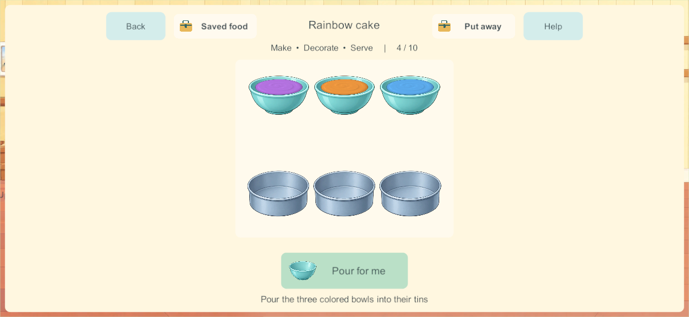
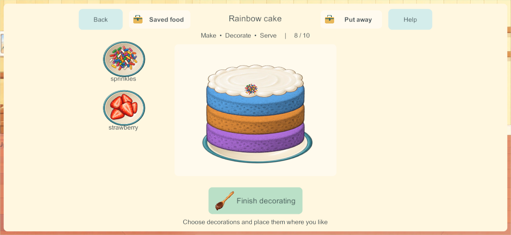

# Four distinctive cake activities

September 28, 2026. CAK-01 / CAK-03 / CAK-04 / CAK-05, the next bounded slice of the [Home finishing sequence](home-finishing-research-2026-09-28.html). Implementation passes the scoped core and native checks below; independent recovery qualification remains open. This report does not claim a device deployment or completion of all fifteen cooking recipes.

## Research applied

The publisher-led [staged cooking research](kitchen-staged-cooking-research-2026-09-27.html) and [Home finishing research](home-finishing-research-2026-09-28.html) require food transformations, phase-specific ingredients, direct manipulation and pictured assistance. The existing chocolate cake remains version 1. Newly selected duck, heart, rainbow and carrot cakes use distinct version-2 paths.

| Primary reference | Applied design |
| --- | --- |
| [Women's Weekly: the original duck cake](https://www.womensweeklyfood.com.au/recipe/baking/duck-cake-recipe-33049/) | Preserve the recognizable body/head assembly and popcorn decoration. For accessible pretend play, the game uses two shaped tins, places the head, spreads icing, then adds icing beak/eye shapes. This simplifies the real recipe's cutting and support construction; it is not a real cooking tutorial. |
| [Betty Crocker: rainbow layer cake](https://www.bettycrocker.com/recipes/rainbow-layer-cake/4969fed8-141e-45f5-9a04-e03addd20fbb) | Divide colored batter before baking and assemble the baked layers. The child chooses three colors in order from six pictured bowls; the order remains visible in the cake and survives serving/storage. Three layers and included color sachets are our preschool-game choices, not requirements established by the source. |
| [CBeebies Big Cook Little Cook: carrot cake](https://childrens-binary.files.bbci.co.uk/childrens-binarystore/cbeebies/BigCookLittleCook_S01_E20_Docs_CBIN289N01_RecipeCardRabbityCarrotCake.pdf) | Prepare the carrot before incorporating it into batter. Two visible chopping directions precede stirring, pouring, baking and icing. No raw-carrot icon substitutes for the prepared pieces during mixing. |

Heart cake uses the previously requested heart mold and pink icing, followed by freely placed strawberries. All four activities use counted cake mix, egg and milk; carrot cake adds counted carrot. Colors belong to the premix kit and duck features to the consumed icing, avoiding untracked loose objects or a hidden infinite ingredient source. Decorative additions still consume individual stock units.

## Play and persistence

| Cake | Visible sequence |
| --- | --- |
| Duck | Ingredients → stir → pour into body/head tins → bake → place head → spread icing → add beak/eyes → popcorn decoration → slice → share |
| Heart | Ingredients → stir → pour into heart mold → bake → pink icing → strawberry decoration → slice → share |
| Rainbow | Ingredients → stir → choose three bowl colors → pour three tins → bake → place each layer → icing → decoration → slice → share |
| Carrot | Ingredients → chop carrot → stir → pour → bake → icing → decoration → slice → share |

The pictured assistance animates the same bounded progress as gestures. It cancels when the child closes the activity. Four cooks keep independent trays. The server advances oven time and settles safely after departure. Stale phase/color/layer tokens cannot apply a delayed touch to the next choice. Shared ingredients retain their counted identities; serving moves unique portion bits.

Schema 24/content 25 enables the new recipe versions. Existing versions 0 and 1, stored foods, drawings, room state and enrollment migrate unchanged. The existing record and collection codec already retain all required fields. Version 2 defines `step` as recipe-specific preparation bits or a bounded base-7 sequence of three color choices; it is not an old generic recipe index. `layers`, mixing/pouring progress, coverage and cut masks retain their explicit meanings. No new unbounded history or wire array is introduced.

## Artwork

`SourceArt/Home/Kitchen/cake-families.png` and its Unity Resources copy contain twelve preparation components. The unmodified RGBA original, exact prompt and tool provenance are retained in `cake-families.manifest.json`. Runtime slicing uses inspected silhouette bounds, since the generated atlas does not follow exact equal cells. New frosting masks and tints preserve the authored shapes. Accepted characters, controls and other Home art are unchanged.

## Verification record

[All 259 core groups pass](evidence/cakes207-2026-09-28/core-results.json), including five new family-cake groups: four independent full recipes with restore at every phase; old-dish migration; stale/invalid color choices; ready-base post-bake work; stored/served creation invariants and malformed-state rejection. Windows candidate **207** passes [six native four-client groups](evidence/cakes207-2026-09-28/native-results.json): recipe-specific input palettes; retained rainbow choices and distinct molds; four safe server bakes including a departing cook; assembly/icing/decoration; eight served portions plus four saved remainders; cold restart with four rejoining cooks retrieving the same food. [Windows source check](evidence/cakes207-2026-09-28/windows-source-check.json) matches all game C# source and the new art/shader.

[Visual review](evidence/cakes207-2026-09-28/visual-review.json) found and corrected overlapping header hit areas and yellow sponge tint turning blue layers green. Header targets now remain separate and at least 44 native pixels at the tested phone/tablet sizes; three colored bowls match the resulting layers.

The first [independent recovery attempt](evidence/cakes207-2026-09-28/recovery-attempt.json) stopped before backup validation because [Windows Application Control blocked the new validator executable](evidence/cakes207-2026-09-28/recovery-blocker.json); a second normal launch after the Android build was blocked as well. No data-invalid finding was produced, no world was replaced and security settings were not changed. Build 207 is **not** added to the production recovery allowlist on this evidence. Ordinary native cold restart/rejoin passing does not replace that qualification.

The signed Android **207** release is ready and its [game source and new art/shader match](evidence/cakes207-2026-09-28/android-source-check.json). It is not installed. Phone, iPads and the live family server remain unchanged. Physical child usability, audio, mixed-device performance, the inherited Android 16 KB issue, all five pizza flows, all five meal flows and the next ramp activity remain open. Main integration remains held.

