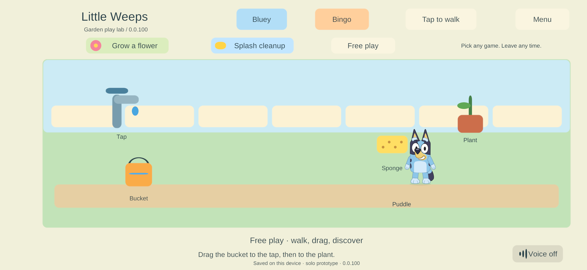
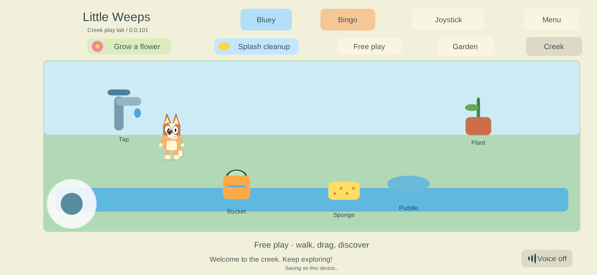

# Bluey, Bingo and Creek in the family game

**CHAR-01 / ITEM-02 / WORLD-01 / TRAVEL-01 · September 25, 2026 · User-requested integration for phone testing.**

The user explicitly requested replacing the real game's placeholders and installing the result on their Android phone for testing. This advances the character integration ahead of the previous visual-review/G5 order for this bounded test; it does not mark G5 or the full character-art requirements complete.

## Change

The Garden/Creek game canvas now draws the layered Bluey and Bingo artwork used by the corrected native workshop. The selection buttons show their names. Both local and remote player views consume the same displayed positions as before, with idle, blink, walking, facing and carry-arm poses.

The existing `blue-pup` and `orange-pup` identifiers remain the save/network contract, mapped to Bluey and Bingo only in presentation. Character selection retains the gameplay root, position, identity, activity, movement input and item holder. Every character image ignores raycasts, keeping ground movement and drag controls available. The real bucket/sponge still use the existing pointer and ownership system; the workshop's demonstration bucket is never duplicated in the game. Free dragging continues to follow the finger, rather than forcibly snapping a dragged tool to the character's hand.

The build verifies the editable source/contract/sprite hashes and bundles explicit sprite references in two `CharacterArt` resources. The view reuses `CharacterMotion` and `CharacterView`; no runtime download is needed. Official references and outstanding artwork requirements remain in the [source-art specification](../../SourceArt/Characters/README.md).

## Verification

- Fresh release Windows solo build **100**, Unity 6000.3.24f1; zero errors or warnings.
- Seed, reopen and damaged-primary recovery scenarios passed. The seed additionally asserts that the real game instantiates Bluey and then Bingo with all 11 presentation layers while preserving a held prop. [Seed](evidence/character-phone100-2026-09-25/seed.json) · [Resume](evidence/character-phone100-2026-09-25/resume.json) · [Recovery](evidence/character-phone100-2026-09-25/recover.json).
- Native Input System mouse/touch interactions, cancellation, drag ownership, target hints and layout checks passed. [Input](evidence/character-phone100-2026-09-25/input.json).
- Fresh family-signed ARM64 Android release **100** compiled with zero errors/warnings. Signing preserved all 401 payload entries. The installed and replacement certificates matched the pinned family key; the installer updated **83 → 100** with `adb install -r --user 0`, pulled the installed APK back, matched its hash and launched the exact package. [Build](evidence/character-phone100-2026-09-25/build-summary.json) · [Installation](evidence/character-phone100-2026-09-25/installation.json).
- Physical Samsung screenshot confirms build 100, Bluey artwork and Bluey/Bingo buttons in the actual game. The original solo primary/backup remain byte-identical. The active paired world retains its world/player identity, all toy records and player activity/zone; its revision advances from 490 to 492 with recorded Bingo/Bluey switches and player movement during user touch input. Whole-directory byte identity is not claimed. [Phone verification](evidence/character-phone100-2026-09-25/phone-verification.json).
- Build **100** includes the previously prepared build 98 continuity and saving fixes; physical acceptance of those fixes remains distinct from checking the character update.

The inspected Android log included one dex-finalizer AssertionError; the same process continued rendering and receiving input. No Unity exception was present in that segment. This observation is recorded separately and is not a crash-free or sustained-performance claim.

## Phone feedback and Creek restoration

On build 100 the user reported: **“Its working great! A bit odd they very stiff lol but looks great for prototype”** and asked to restore the missing Creek button. This is positive acceptance of the prototype appearance and switch, with animation stiffness explicitly retained as polish work.

The Creek button was hidden for ordinary local solo worlds, which still used the garden-only save schema. Shared play and saved continuation adventures already exposed it. Build **101** exposes Garden/Creek in ordinary solo, accepts the existing two-area schema and uses the existing additive `SoloWorld.WithAreas` upgrade: old garden/player/receipt state is retained, and five Creek toys are appended once. World authority and offline separation are unchanged. The area heading now identifies Creek correctly in solo play.

Fresh Windows 101 seed/reopen/recovery scenarios pass, including clicking the actual Creek and Garden buttons, keeping Bingo selected, finding exactly five Creek tools, preserving the entire garden tool state across the round trip, and retaining exactly ten world tools. A separate **100 → 101** native save/update/recovery run passes with the same profile/world identity and prior garden progress. [Travel run](evidence/character-phone101-2026-09-25/travel-seed.json) · [Old-save update](evidence/character-phone101-2026-09-25/update-resume.json) · [Recovery](evidence/character-phone101-2026-09-25/update-recover.json).

The Samsung was then updated **100 → 101** with the pinned family signing key and exact APK read-back verification. The physical screenshot shows **Creek play lab / 0.0.101**, both navigation buttons, Bingo and the Creek tools. The active world's identity and all five old garden toy records are unchanged; five Creek toys are added. The separate original solo primary/backup remain byte-identical. The user was already interacting during observation, so this is not a claim that every active file remained unchanged. [Installed artifact](evidence/character-phone101-2026-09-25/installation.json) · [Phone and retained-state check](evidence/character-phone101-2026-09-25/phone-verification.json).

## Apple rollout and shared play

The user requested the same update on both iPads connected to the Mac and asked about wireless iPhone installation. Fresh release **101** transferred with all **3,094** export files hash-verified. Before installation, both iPads and then the iPhone had read-only Documents/preferences backups on the Mac and Windows, with every local backup hash verified.

The first Mac signing attempt stopped with `errSecInternalComponent`. The user ran the prepared **Finish-Little-Weeps-101.command** helper locally; the release then succeeded. Strict code signature, expected app/team identity, all six native bridges and provisioning coverage for all three devices passed. All **39 signed app files** were hashed and rechecked before installation. [Signing](evidence/character-apple101-2026-09-25/signed-verification.json).

| Device | In-place update | Retention and launch verification |
| --- | --- | --- |
| iPad 7 | 95 → 101 | All **324 existing Documents files** and every prior preference preserved before launch. iPadOS initially denied launching with a security/trust message; the user subsequently opened it. Native runtime 101, paired identity and readable saved worlds verified. [Record](evidence/character-apple101-2026-09-25/ipad7-update.json). |
| iPad 9 | 79 → 101 | All **1,096 existing Documents files** and every prior preference preserved. Native inventory/launch, runtime 101 and paired identity verified. [Record](evidence/character-apple101-2026-09-25/ipad9-update.json). |
| iPhone | 79 → 101, USB | All **36 existing Documents files** and every prior preference preserved. Native inventory and launch passed. The app then reported unpaired; the original protected player credential was matched to its pre-update saved profile/world and restored through the create-only Keychain inbox. No new profile or world was generated. Runtime 101, paired status and the original server connection passed. [Record](evidence/character-apple101-2026-09-25/iphone-update.json). |

The iPhone was initially absent wirelessly. The user connected it by USB; it was paired with the Mac before its backup/update. This update does not establish wireless installation or unattended renewal. Wireless reachability after cable removal is a separate check.

The device helpers now accept the iPhone label. Backups validate every existing solo world instead of assuming `family-local` exists: this iPhone had only its established paired branch. The optional enrollment restoration path verifies the original backup hashes, device/build identity and saved player/world before copying the existing protected credential. It does not create or replace an existing Keychain entry.

When the user asked about playing together, the current server was stopped. Its existing **91** release was started through the parent controller with the original verified world, preserving checkpoint revision **1906** at startup; the existing parent helper was resumed. **All four physical players joined** the same authority. No server binary update or world reset occurred. [Server readiness and admission](evidence/character-apple101-2026-09-25/family-server.json) · [Deployment summary](evidence/character-apple101-2026-09-25/deployment-status.json).

## Scope still open

This is the existing gameplay fixture with its character visuals replaced, not the completed home/backyard environment. The user accepts the character prototype; softer movement and final animation quality remain open. Independent side/back views, additional poses, full roster, illustrated environments, G5 rooms/items, A10/iPad performance, and sustained mixed-device qualification remain open. The server remains build 91; all four physical clients are now 101. Apple visual/touch quality still relies on user testing; no automated Apple screenshot acceptance is claimed.

Follow the [current decisions](../current-decisions.md) and [build guide](../family-playset-build-guide-2026-09-23.md). Shared authority remains PC/VPS only, and offline worlds remain separate.
