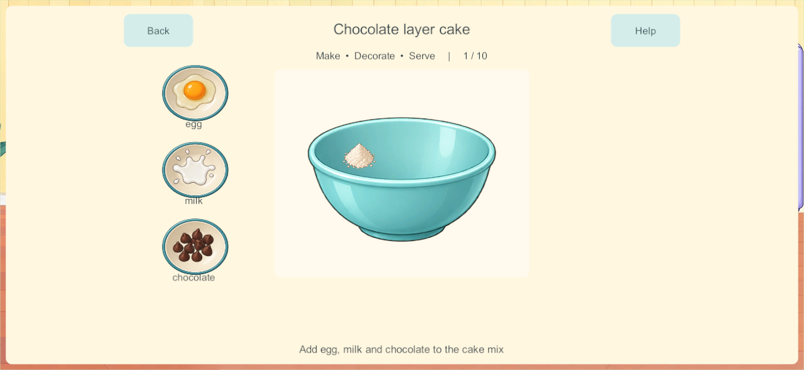
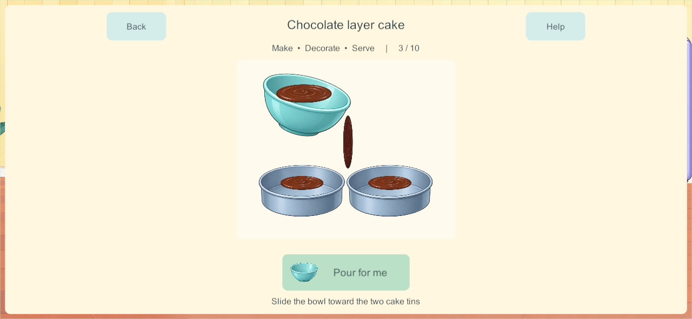
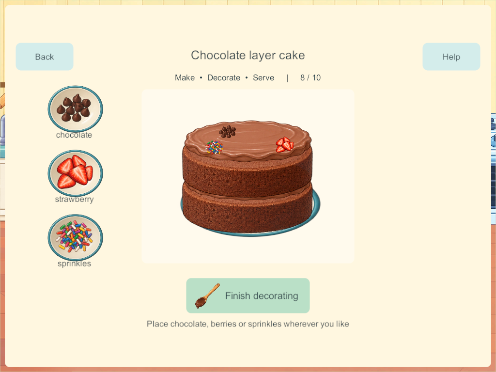

# Chocolate cake: real preparation stages — September 27, 2026

**Implemented in candidate 171; phone delivery and physical acceptance are recorded below.** This is the first bounded delivery from the [cooking-process research](kitchen-staged-cooking-research-2026-09-27.html), covering CAK-02 / H-08–09 / COOK-01. It does not complete the other fourteen cooking activities, Home, or physical child acceptance.

## What changed

Choose **Cook → Cakes → Chocolate layer cake → Make from the beginning**. A newly started cake follows these activities:

1. Add egg, milk and chocolate to a counted cake-mix portion. The new cake-mix package is an explicit simplified premix, not imaginary sugar/butter deducted from unrelated ingredients.
2. Stir inside the bowl. A broad stroke follows the spoon and mixes the separate ingredients into smooth chocolate batter. Partial work is retained; a tap on the pictured tool performs a short assisted stirring sequence.
3. Pour the same batter into two tins. The bowl empties as the tins fill. Closing the activity retains the transferred fraction. The bowl and tins are presentations of one mixture, so there is no second full source batter left behind.
4. Bake in a real available oven position. Two layers visibly rise and settle into a ready state. Icing is not a baking prerequisite. Leaving the room does not stop another cook's cake.
5. Add icing, spread the first layer's filling, and place the second sponge layer. Spread the exterior icing over nine forgiving saved regions.
6. Place chocolate, strawberries and sprinkles. Their chosen positions remain with the creation.
7. Cut across and down, then share up to four unique portions on the existing real plates. The tray loses each served portion. Taste consumes food; washing reuses the empty dish.

Mixing, pouring, spreading, stacking and cutting have different visible states. Optional tap assistance performs the same activity over time. Repeated taps during assistance cannot skip the next activity; manual gestures commit a completed stage only on release. A local stage token includes the food identity, so stale touches cannot operate on a later stage or a reused tray.

Named recipes now show their own ingredient lists instead of appending the entire pantry. New normal recipes reject unrelated direct additions at the authority too. Chocolate cake further filters by current stage: batter ingredients first, icing after baking, decorations after assembly. The other recipes retain their prototype preparation sequences, including their remaining timing defects; narrowing their lists does not make those activities complete.

The pictured recipe chooser provides a deliberate **Experiment: mix anything** alternative. That saved mode permits unusual combinations without silently enabling them in a normal cake. Ready-made base remains a separate explicit choice; it starts at the baked-layer finishing activity rather than posing as completed hands-on preparation.

## Applied research

The [research report](kitchen-staged-cooking-research-2026-09-27.html) records the primary developer sources and child-interaction studies. This implementation applies distinct preparation/finishing activities, direct food manipulation, visible intermediate results, forgiving targets, tap alternatives and persistent partial work. Gesture distances and assistance durations are prototype tuning values, not scientifically established toddler thresholds.

Built-in imagegen supplied an unchanged transparent atlas with an empty bowl, batter surface, empty tin, plain sponge layer, icing surface and spoon. [Source atlas](../../SourceArt/Home/Kitchen/cake-stages.png) · [Exact generation prompt and provenance](../../SourceArt/Home/Kitchen/cake-stages.manifest.json). Runtime geometry slices the inspected atlas bounds; layering and icing masks follow saved food state. No character source was changed.

## Persistence and four-player behavior

**Schema 15 / content 16 / build contract 17.** A single bounded cake-mix stock package is added in cupboard slot 17. Existing world objects, rooms, recipe ingredients, portion identities, receipts and enrollment remain intact.

New chocolate cakes use recipe version 1 with a named stage, mixed fraction, poured fraction, layer count, icing coverage and cut mask. Additions record their phase so batter ingredients do not reappear as decorations. Normal/Experiment mode persists. Progress transactions are bounded, idempotent through existing request receipts, and serialized by the PC/VPS authority. Four independent trays and heating positions remain available; there is no kitchen-wide activity lock.

**Compatibility choice:** old completed and unfinished dishes remain recipe version 0 and finish using their existing rules. This deliberately avoids guessing whether old icing was batter or decoration, charging existing ingredients again, or deleting unusual combinations. It is a conservative alternative to the research's proposed per-step conversion. Start a **new** chocolate cake to use the new process. The migration tests cover every legacy recipe step and retain its exact prior food data.

The current schema supports exact saved partial progress and the established private-offline/shared-authority boundary. Reconnection must load server state without importing private cooking edits. The production server recovery allowlist is unchanged; disposable test qualification does not authorize replacing the live family server.

## Validation

- **193 core checks passed**, including every legacy recipe/step, named recipe filtering, explicit experiments, full-capacity ingredient reservation, partial mixing/transfer, stale/repeated commands, four cooks, competing last stock and conserved serving. [Core results](evidence/cake171-2026-09-27/core-tests.json).
- **Three native four-client touch groups passed on 170**: actual recipe/batter controls; manual mixing, interrupted pouring and independent baking; filling/stacking/icing/decoration/cutting and four conserved portions. [Native results](evidence/cake171-2026-09-27/native170.json). The same three groups also passed on final **171**, including phone/tablet screenshots. [Final native results](evidence/cake171-2026-09-27/native171.json).
- **Three native continuity/recovery groups passed on 170**, using an actual 166 world with an unusual unfinished cake, all four original enrollments, partial private mixing, cold reopen, authoritative rejoin, backup and restore. [Continuity results](evidence/cake171-2026-09-27/continuity170.json). The only subsequent gameplay change reserves milk/icing capacity in Experiment mode; migration and recovery code are unchanged. This does not extend the production recovery allowlist.
- Final Windows/Android **171** game source, art/audio/package inputs and every artifact hash matched. [Artifact records](evidence/cake171-2026-09-27/artifacts.json). Both platforms use release builds.

Native and core checks do not establish child usability, A10 performance or sustained mixed physical-device acceptance. The desktop stress run emitted transport send-queue warnings while four clients were active; the complete functional tests passed, but sustained network/performance qualification remains open.

## Device delivery

Samsung was updated in place from **166 to 171** using the fresh signed release. Installed APK bytes and signing identity match; the kitchen visibly opens on the phone. All **16 primary saves and 16 backups remain**, with 15 primary saves byte-identical. The active world migrated from schema 14 to 15, preserving all 117 prior object identities, players, rooms and ownership and adding one counted cake-mix package. Fifteen recorded post-update cooking actions explain four consumed ingredient units and the original dish/plate being eaten and washed; the remaining prior object data is unchanged. [Installation and retention record](evidence/cake171-2026-09-27/android-update.json) - [Phone kitchen](evidence/cake171-2026-09-27/android171-kitchen.png).

Visible launch and save retention are verified. Physical acceptance of the new chocolate-cake flow is still open. Start a **new Chocolate Layer Cake** to try it; existing dishes keep their legacy rules.

The user then requested both iPads be updated. Fresh release iOS export **171** was source/hash verified and transferred to the Mac (3,098 export files). Native compilation reached signing, where macOS returned `errSecInternalComponent`; local signing-key approval is required through the prepared `Finish-Little-Weeps-171.command` desktop helper. Gabriel's iPad 7 backup verified 557 files. Eduardo's iPad 9 became connected after the first data-copy timeout; its fresh backup verified 1,602 files. Both backups are saved on the Mac and Windows. The desktop signing helper is open, waiting for local key access. **Neither iPad has been installed yet.** [Current iPad delivery record](evidence/cake171-2026-09-27/ipad-update.json).

The last deployed family server remains 128/content 5 and is not changed by this task. New 171/content 16 clients require a matching server for shared play; private local play remains available. iPhone remains 101. Sustained mixed-device/A10 and production recovery qualification remain open.

## Remaining work

- Apply the proven stages to duck, strawberry-heart, rainbow and carrot cakes, including their distinct shapes and assembly.
- Build real pizza dough preparation/rolling/spreading and the separate pan/pot processes for meals. All fifteen recipes remain in the menu and backlog.
- Record actual child first use, phone feel, A10 memory/frame time, sustained mixed devices and lifecycle tests.
- Add short optional spoken cooking guidance and richer quiet sound effects. Help currently gives a written cue plus a local tool demonstration where applicable; it is not narrated cooking guidance.
- Improve pouring/portion presentation from family feedback; preserve the ingredient identity and portion conservation contracts.
- Orders, food album, drinks, picnic packing and broader Home features remain open.

The next bounded recipe slice is the other four cakes. CAK-02 remains subject to physical acceptance; COOK-01 and Home remain Partial.

## Native visual evidence

