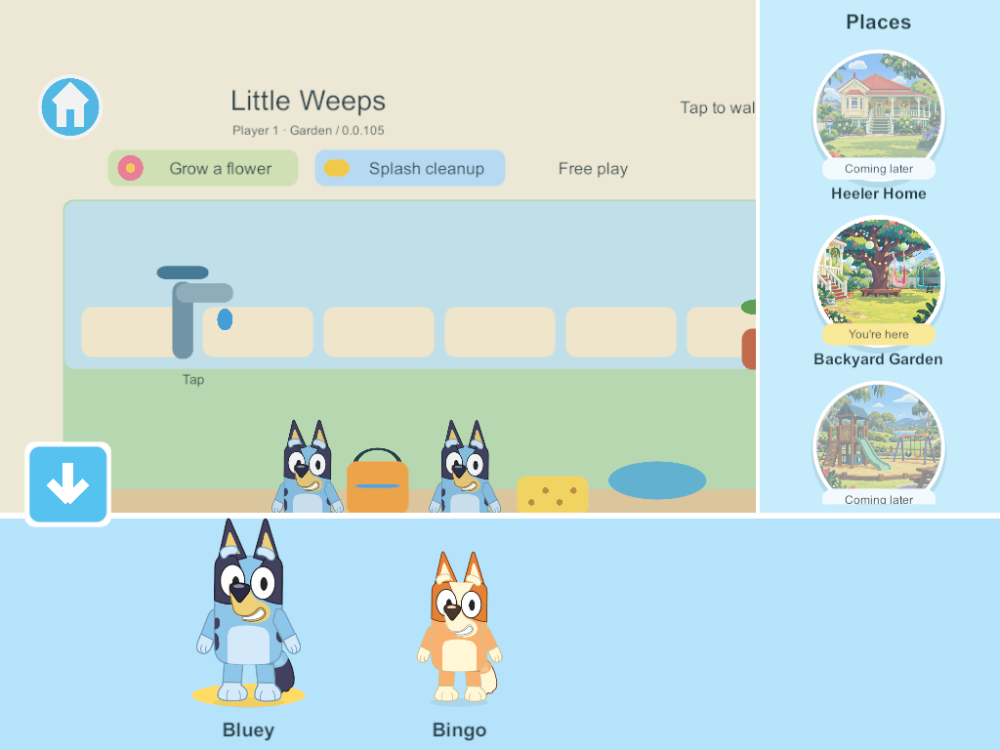
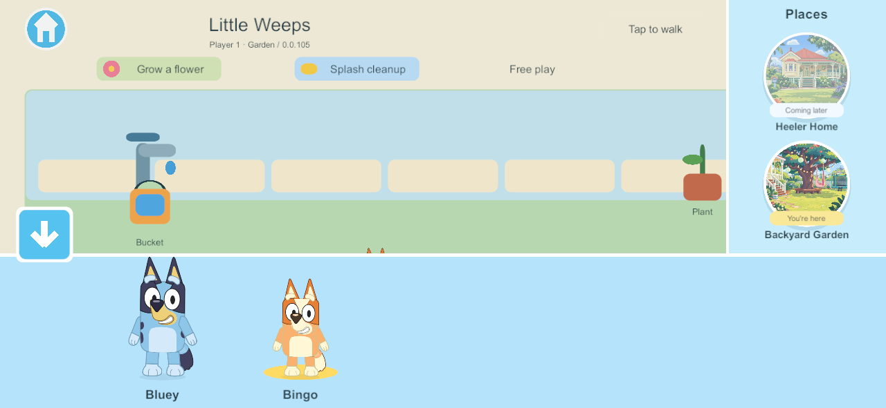
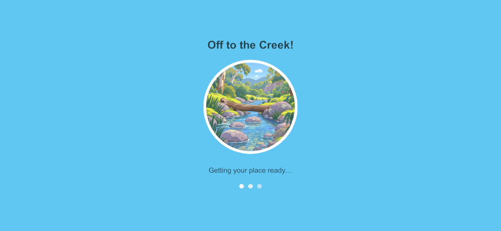
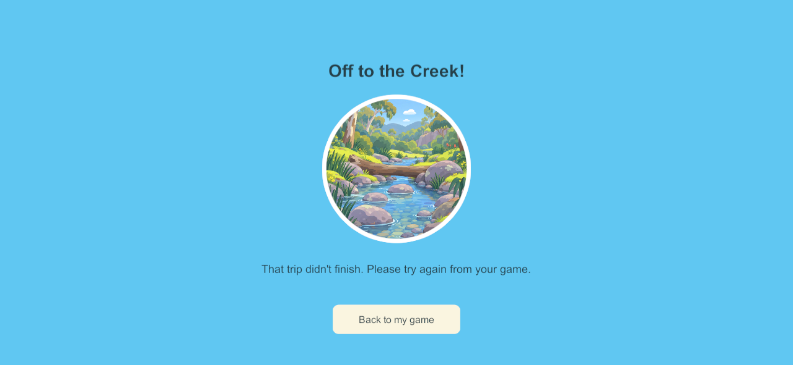
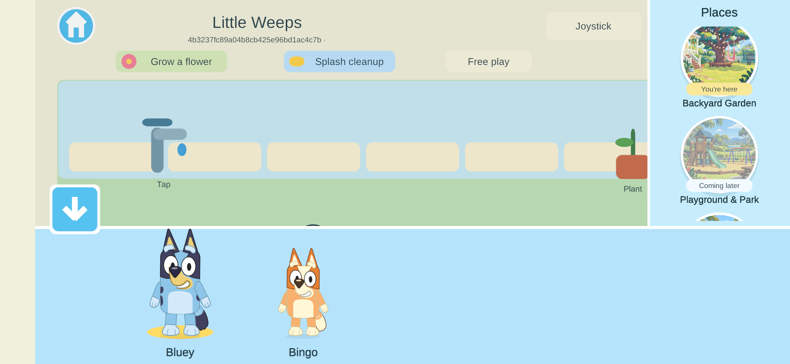
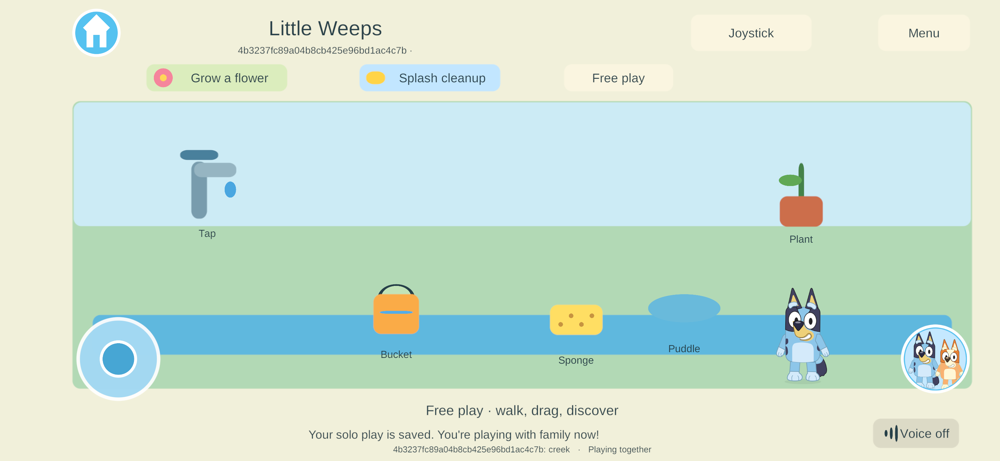

# Combined chooser and world loading — native Windows 105

**NAV-REF-02 · September 25, 2026 · CHAR-01, WORLD-01, WORLD-02; G2/G6 presentation.** The family circle now opens one chooser: characters across the bottom, places down the right side. The down arrow closes both. Choosing an available place opens a destination loading screen before play resumes. This implements the user's latest layout decision, superseding NAV-REF-01's separate world browser. [Current decisions](../current-decisions.md) and the [build guide](../family-playset-build-guide-2026-09-23.html#18-current-work-record-and-research-basis) govern the next work.

## What is implemented

- Horizontal full-body Bluey/Bingo selection retains the existing stable player/profile and character commands. The vertical rail uses all six existing circular illustrations; Garden and Creek are playable, while four unfinished destinations remain disabled and labelled “Coming later.”
- Both the family circle and home button open the same chooser. Opening it stops walking and settles pickup gestures; swiping or cancelling a touch does not select an entry. The loading screen blocks underlying play input.
- Solo travel saves before departure and after arrival. Shared travel waits for the command acknowledgement and confirmed destination. Presentation is refreshed before controls return. There is no fake percentage or fixed cosmetic wait.
- A rejected or unacknowledged trip has bounded failure handling and a Back to my game control. Uncertain shared commands are not resubmitted or rolled back blindly. Existing session recovery remains responsible for reconciliation.
- Travel and menus affect only the selecting client. A sibling can continue walking and using shared objects.

## Native evidence

Fresh Windows server and client **0.0.105** both compiled with zero errors/warnings. The focused test uses Unity Input System touch events and actual UGUI hit testing against isolated disposable worlds. It never accesses the live family server or physical devices.

| Acceptance group | Result |
| --- | --- |
| Combined layout, full-body cast, inactive previews, stable avatar identity and safe swipes/cancellation | Passed |
| Opening during walking/pickup, arrow close and restored controls without replayed gestures | Passed |
| Vertical place browsing and acknowledged Garden/Creek round trip; sibling movement/bucket use and retained state | Passed |
| Wide-phone layout, lost acknowledgement despite received destination state, local loading input shield, failure/back recovery and sibling continuity | Passed |
| Private offline departure/arrival saves, verified checkpoint checksum and reopening in Creek | Passed |

[Five-group test result](evidence/combined-chooser-2026-09-25/result.json) · [Fresh build summary](evidence/combined-chooser-2026-09-25/build-summary.json) · [Source/asset hash verification](evidence/combined-chooser-2026-09-25/source-verification.json) · [Shared arrival stages](evidence/combined-chooser-2026-09-25/shared-arrival.json) · [Solo checkpoint evidence](evidence/combined-chooser-2026-09-25/solo-arrival.json).

Reproduce with `uv run --offline Tools/Test-CombinedChooser.py 105` from the project root, retaining the immutable build. The script declares its cryptography dependency for disposable enrollment. The initial run without that dependency passed the four shared/menu groups but could not create the solo fixture; the complete rerun passed all five. No core rules changed; the earlier 104 rules evidence remains historical rather than being claimed as a new run.

## Reviewed native captures

1024 × 768 tablet layout:

1280 × 591 phone layout:

The loading capture deliberately drops the test acknowledgement so the real waiting state remains visible:

## Limits and next work

Both prototype area views are already resident. **105 does not implement scenic asset streaming, unloading or an older-iPad memory budget.** The thumbnail artwork is not a finished playable world. Only two characters exist, so wider layouts do not yet need to scroll the cast to reveal additional characters. Phone and tablet captures are Windows viewport checks, not physical mobile qualification.

At completion of the native menu work, the family server/helper remained **91** and all four mobile clients **101**. That task made no mobile rollout, enrollment changes, family-save edits or live-server restart. The subsequent Android update is recorded below. The incomplete saved-bedroom branch remains separate.

Next: build the six long, attractive walkable scenic shells, with no new other-world activities; then concentrate on the connected house/backyard, rooms and interactions. Add measured destination asset loading/release behind this transition before qualifying the full scenic worlds. Preserve independent cameras, durable world state and the older iPad performance requirement.

## Requested Android update — 101 → 105

A fresh non-development ARM64 family-signed Android **105** was built from the current menu source and installed over **101** with `adb install -r --user 0`. Both signing identities match the pinned family key; the installed APK was pulled back and its hash matches the exact fresh artifact. Native 105 launched, connected to the existing family world, and the combined chooser was opened and visually verified on the Samsung. The user was playing during observation.

All **15** previous save/enrollment files remain, with **10 byte-identical** immediately after launch. Both original solo world identities and all their player/toy records are unchanged; the paired solo save updated only its idle timers. All **three private continuation world saves** are byte-identical. Shared recovery files refreshed on connection; no saved data was cleared or enrollment replaced. [Phone verification](evidence/combined-chooser-2026-09-25/android105/phone-verification.json) · [Installed artifact](evidence/combined-chooser-2026-09-25/android105/installation.json) · [Build](evidence/combined-chooser-2026-09-25/android105/build-summary.json).

Current deployment: Samsung **105**, iPad 7/iPad 9/iPhone **101**, family server/helper **91**. This is a scoped phone update and menu/save check; sustained performance and the remaining physical-device acceptance are still open.

## Phone control placement — builds 106 and 107

The user’s phone screenshots showed the family circle crowding the left joystick. **106** moved the circle to the lower-right. The user then requested a joystick placement/appearance correction: **107** moves it farther left and slightly down, opposite the family circle, and adds matching blue-and-white styling. The joystick hit area, input calculations and movement behaviour are unchanged.

Both fresh family-signed release updates passed certificate matching, in-place installation, exact installed APK read-back and launch. The actual phone screenshot confirms the final placement. The user replied **“perfect!”** after 107. A follow-up automated drag was skipped when the phone had switched back to chat; no test touch was sent to another app. No new movement-regression result is claimed.

All **17** existing save/enrollment files were retained through 107, **12 byte-identical** after launch. Both original solo world identities and their complete player/toy records remain unchanged; only the paired save’s idle timers refreshed. [106 delivery](evidence/combined-chooser-2026-09-25/android106/installation.json) · [107 delivery](evidence/combined-chooser-2026-09-25/android107/installation.json) · [107 retained-state evidence](evidence/combined-chooser-2026-09-25/android107/phone-verification.json).

Current deployment: Samsung **107**, both iPads and iPhone **101**, family server/helper **91**. Next is the user-requested six-world scenery pass.
