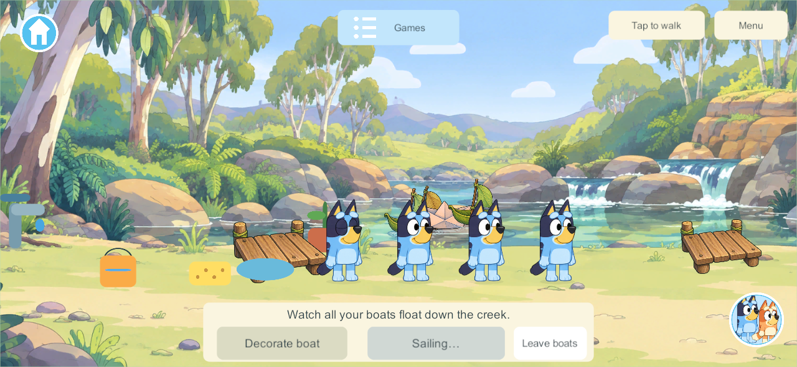

# Creek boat motion correction — September 30, 2026

CRK-05 / OUT-01. The boat drawing previously stopped 0.12 seconds past each shared snapshot, then jumped when the next snapshot arrived. Reliable world updates are sparse, which made the freezing repeat during a voyage.

The client now keeps a continuous visual clock between updates. Incoming samples correct its speed gently (at most 10%); they do not snap its position. Repeated renders do not advance time twice. A different family, restarted authority or offline play resets to the appropriate clock. The server still owns launching, arrival, retrieval and saved creations.

The focused .NET check reproduces over 700 frozen frames with the old formula and verifies continuous motion with one-second and fourteen-second update gaps, bounded corrections, resets and offline behavior. Existing boat rules also pass.

Isolated Windows release **351** compiled with zero errors/warnings from delivered baseline `71fd07c` plus this fix. One native four-client check passes phone/iPad voyages, retrieval, shared arrivals and independent departure. Every recorded moving frame advances; 100 ms spans measure clock rate and actual drawing speed. Test timestamps come from the same clock sample as the boat drawing, avoiding unrelated LateUpdate recorder scheduling. [Exact results](evidence/creek-boat-smoothing-2026-09-30/result.json).

This is client presentation only: content52/schema42 remain compatible with installed server340. No phone, iPad or live-server installation occurred. The exact tested artifact remains under `LocalData/BoatSmoothingTask/source/Builds/NetworkProbe/G3-0.0.351`; other chats' numbered artifacts are separate. An initial 347 motion run required corrected test timestamps before final qualification on351.

Source is isolated on `codex/creek-boat-smoothing`; preserve concurrent checkout work and the main integration hold. Next: include the fix in the next requested device update, then family playtesting.
