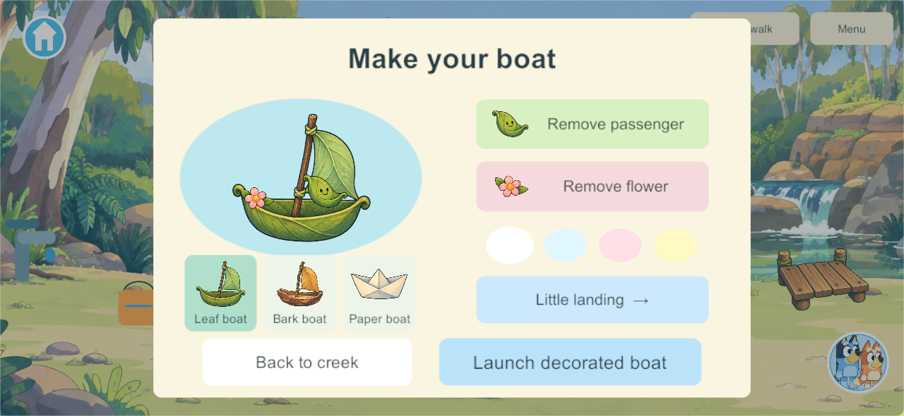
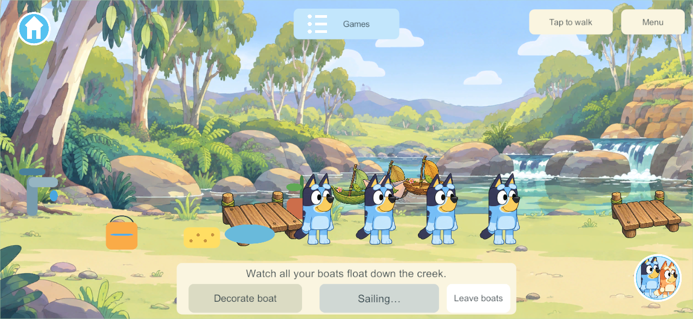
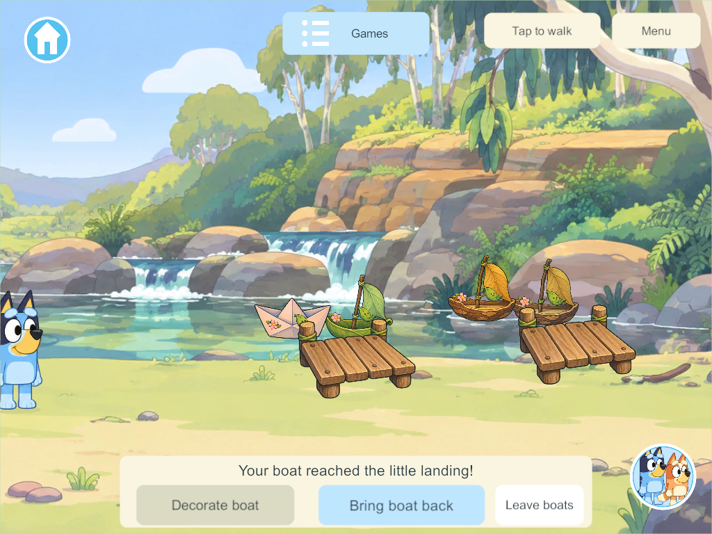
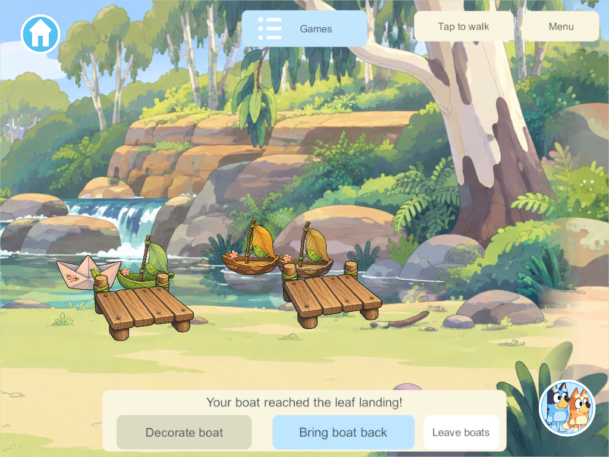

# Creek Boat Research and Playable Build

The user selected leaf, bark and paper boats for the creek: decorate them, add passengers and float to docks. This task implements that shared playset within the existing illustrated creek. It covers boat play only; the other creek activities remain in the [creek feature list](../creek-world-feature-list-2026-09-30.md).

## Research and design choices

The official [Bluey Barky Boats craft](https://www.bluey.tv/play/how-to-play-barky-boats/) uses a floating bark base, a twig mast, a leaf sail and decorations, then sends boats along the water with family or friends. That supports recognizable natural materials and repeatable play. Its racing idea is not part of this slice; the user's goal sheet specifies gentle boat deliveries without elimination.

The official [homemade Creek play tray](https://www.bluey.tv/blog/how-to-make-a-homemade-creek/) puts boats among leaves, rocks and greenery and suggests paper or cardboard when bark is unavailable. That supports the three hull choices and the warm wooden landings. Our leaf passenger, colour choices, two destinations and animated retrieval are game design adaptations, not claims about features in the show or the craft.

The [goal sheet, section 38](../bluey-game-research-2026-09-23.md#38-the-creek-rocks-water-and-gentle-discovery), requires leaf passengers, authored current routes, reachable docks and persistent decorations. The [Toca/Piknik supplement](../toca-piknik-interaction-research-2026-09-23.md#6-a-concrete-object-catalog-for-our-game) treats decorated boats as toys that remain usable after creation. The latest [project instructions](../../AGENTS.md) require up to four players together, with independent departures.

Chosen design: one shared creek and one authority clock, with four persistent boats. Players decorate their own creations in the same river. This is direct object free play with no rounds, race timer or elimination. Each launch uses the common authority clock; a client does not create a private game or decide when a boat arrives.

## What is implemented

- Enter Creek and tap **Boats** to approach the launch. Up to four players have separate bank spots within the same shared playset.
- Tap **Decorate boat** to choose leaf, bark or folded paper, select one of four pastel tints, add or remove a leaf passenger and flower, and choose the little or leaf landing. The preview uses the same layered artwork as the creek boat.
- **Launch boat** sends the creation along a gentle fourteen-second authored current. Small bobbing, rocking and bounded ripple meshes animate the presentation.
- Boats stop at their selected reachable dock. **Bring boat back** retrieves the boat along the same route in five seconds. Decorations survive retrieval and further launches.
- Siblings see all boats and their attachments. Editing another player's creation is rejected. In-flight boats cannot be replaced or reset by decoration commands.
- Walking away, travel or disconnection ends only that player's attendance. Already launched boats continue to land; the other players keep playing.
- Old saves upgrade additively to schema 37. Boat hulls, tints, attachments, destination, completed trips and logical voyage state are saved. A reopened moving boat waits at a reachable dock; returning boats reopen at the launch. Temporary attendance clears. Existing world, player, toy and pond records are retained.

Content 43 admits the new boat command and replicated state; it follows the concurrent pond content-42 correction. This shared rule/save addition needs compatible clients and authority. This task does not replace the live family server or install a device app.

## Artwork and interaction

Built-in image_gen produced a transparent illustrated atlas with three hulls, a wooden dock, leaf passenger and pink flower. Explicit sprite bounds preserve curled leaf tips and dock posts; hull, passenger, flower and ripples remain separate runtime layers. [Source image, exact prompt and sprite layout](../../SourceArt/Creek/Boats/README.md).

The workbench uses large picture choices, a live preview and safe-area scaling at phone and iPad proportions. The first native screenshots exposed boats and docks floating above the water; the placement correction lowers them to the painted creek, reduces hull scale and spreads the launch positions. Compilation and behavior success alone did not qualify that first visual pass.

## Verification and remaining scope

The focused core checks cover additive migration, four shared boats and two landings, protected edits, action replay, snapshot isolation, departure, retrieval, relaunch, JSON reopen and stale-area rejection. Unity-native JSON checks also cover old saves and reachable restoration with retained decorations.

Windows **288** client/server release builds pass with zero errors/warnings. The final native four-client check passes decoration through real touch controls, all three hulls and four colours, both landings, four boats in one river, departure without interrupting siblings, retrieval, relaunch and independent travel. Phone/iPad workbench and scene captures pass review; the camera keeps each player's ready boat and far landing visible. [Native results](evidence/creek-boats-2026-09-30/result.json) · [Build and focused core evidence](evidence/creek-boats-2026-09-30/verification.json).

Candidate 288 includes concurrent park/zoo work and advertises content 44/schema 37. The isolated creek commit is based on the completed pond content-42 baseline and adds content 43/schema 37. Its core compiles without those unrelated working-tree edits; Windows Application Control blocks execution of the separate snapshot test DLL. No policy bypass was attempted. The focused core runtime checks and final native checks pass from the shared checkout with the boat source matching candidate 288. These are development-source results, not a device or live-server rollout. Preserve the existing main integration hold.

## Native views

These screenshots show the actual Windows release player at phone and iPad dimensions.

## Next work

Physical-device playtesting and family visual acceptance remain open. Later boat expansion can add more decorations, arranged landing points or cooperative parcel delivery. Those are retained backlog ideas, not claims about the first slice. No creek fishing, log crossing, stepping-stone construction or other creek activity is completed by this task.
