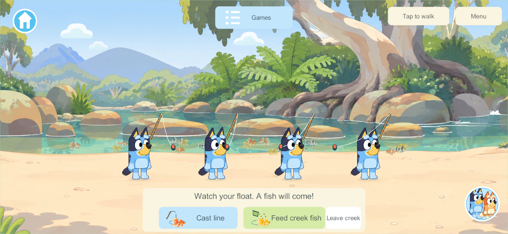
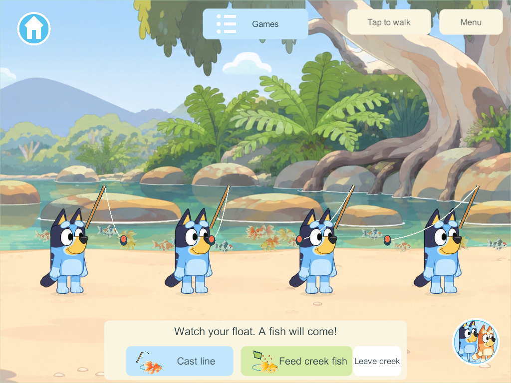
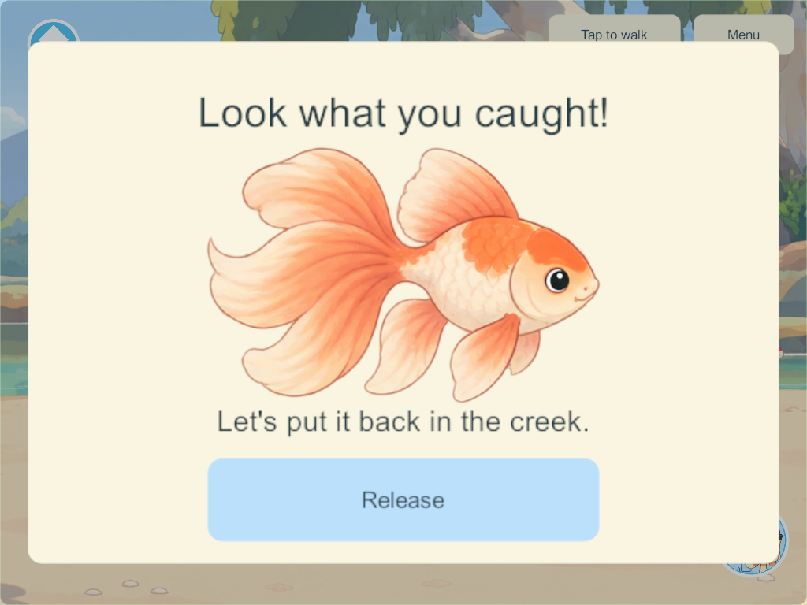

# Expanded creek fishing

User-selected scope: reuse the Homeworld fishing pond feature and code at a much larger creek scale. Goal IDs: CRK-02 / FISH-01 / WORLD-01.

## Play

Enter Creek, open **Games**, then choose **Creek fishing** or **Feed creek fish**. The selecting player goes straight to a free bank spot and starts. Four players use the same creek and fish population. Tap the water or **Cast line**, wait for the bite cue, tap **Reel in**, look at the painted fish and **Release** it. Feeding gathers available fish while siblings continue fishing.

The creek reach spans 1,840 world units, compared with the backyard pond's 760. Its population contains 20 fish instead of eight; four bank spots are spaced 260 units apart. The illustrated creek stays natural: no enlarged stone garden pond is pasted into it. Smaller, softened fish, gentle ripples, floats, casting lines and running-water sound reuse the existing pond assets and lightweight drawing code. Phone and iPad controls scale within the safe area.

## Reused rules and retained worlds

The existing pond authority now accepts a habitat definition for its geometry, population and bank positions. Both habitats use the same random-bite, exclusive catch, easy-reel, release, bounded-feeding, ticking and cancellation code. They have separate saved fish records and random streams; catching or feeding in one never consumes the other's fish. The backyard keeps its existing coordinates, population and cast spacing. Creek boats remain a separate shared activity.

Schema 38 adds `creekFishing` without replacing existing world/player/pond/boat records. Reopening releases temporary catches, feeding and rod leases while retaining the fish population and the rest of the world. Walking, travel or disconnection clears only that player's participation. Content 45 admits the new command/state; a future shared rollout requires matching clients and authority.

The original float-selection, species album and observation-bowl proposals remain future ideas. This implementation follows the user's chosen Homeworld pond loop.

## Verification

Windows **293** release client/server builds pass with zero errors/warnings. Seven focused core groups pass from the isolated delivered source, including the unchanged backyard loop, additive upgrade, 20 creek fish, wide casts, exclusive catches, feeding bounds, independent departure, separate habitats and reopening. Unity-native old-save/JSON checks pass.

The final native four-client pass uses real touch controls: creek-only picture cards at phone/iPad sizes; four distinct bank spots and automatic casts; four different bites, easy reel and catch close-ups; release/feeding alongside sibling catches; independent departure and Homeworld pond travel; existing boats alongside creek fishing. The polished phone/iPad screenshots were inspected. [Native results](evidence/creek-fishing-2026-09-30/result.json) · [Build/rules summary](evidence/creek-fishing-2026-09-30/verification.json).

Candidate 290 established the gameplay loop; its first screenshot review exposed crowded fish, so 293 reduces the fish size and softens their underwater appearance. An automated tap originally reached the client before its bite control appeared; the final test waits for the visible control. Build 293 uses an isolated integration of the completed Homeworld pond, world-specific menus, park riding and creek boats, excluding concurrent unfinished park-tag/Zoo edits. The shared checkout retains those other chats' work.

No phones, iPads or live family server were updated. Physical playtesting remains open; preserve the main integration hold.

## In-game views

