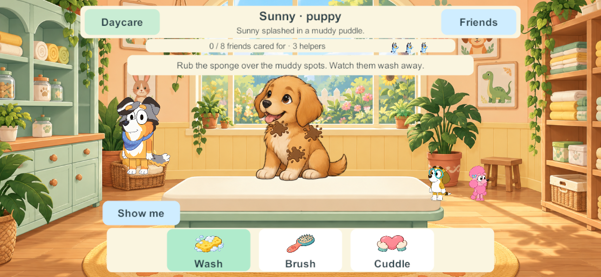
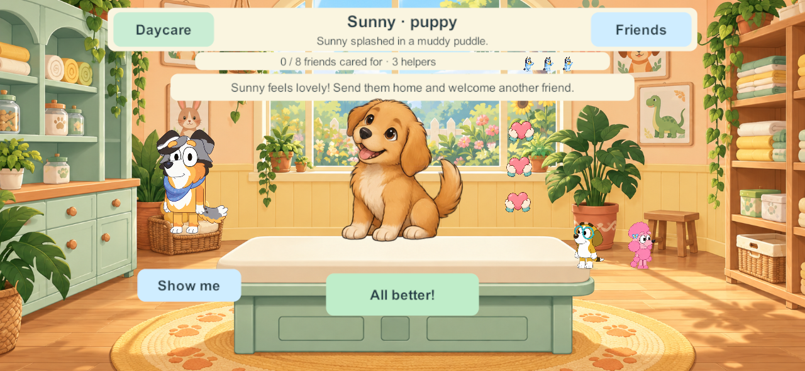
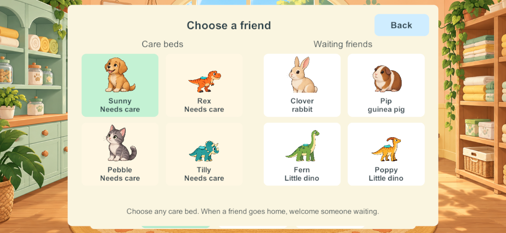

# Daycare animal care clinic — October 1, 2026

Goal IDs: DAY-01 / LEARN-01 / FAMILY-01. The user selected the Toy vet wishlist idea, then explicitly replaced plush toys with living household pets and the existing dinosaurs at a small, cute size. This record follows that correction. The activity is **Animal care clinic**, reached through Daycare → Games, with a separate shared clinic scene.

## Research and design decisions

The research examines actual care-game precedents, preschool play guidance, the project's existing animal assets, Unity touch events and persistent multiplayer state. Publisher descriptions establish what those products offer; the decisions below are our adaptation, not claims that the publishers endorse this implementation.

| Primary source inspected | Concrete finding | Application in Little Weeps |
| --- | --- | --- |
| [Toca Boca: Toca Pet Doctor within Toca Boca Jr](https://www.tocaboca.com/kids/toca-boca-jr) | Distinct animal needs invite cleaning, attention and care; the collection targets ages 2–6. | Make the need visible on the patient, with tools that produce visible changes. Avoid a collecting quest disguised as care. |
| [Dr. Panda Hospital, developer page](https://drpanda.com/games/DrPandaHospital/index.html) and [developer's Google Play listing](https://play.google.com/store/apps/details?id=com.tribeplay.pandahospital) | Waiting room → patient care → a comfortable departure, varied patients, sequencing, animation/sound feedback, no timed score. | Four care beds plus a waiting queue; players decide whom to welcome next. Clean before bandaging, shared care pictures, gentle patient reactions. We do not copy the hospital's injections, bone treatment or invasive procedures. |
| [Sago Mini Pet Cafe: letter to parents](https://sagomini.com/article/pet-cafe-letter-to-parents/) | Direct dragging, quick feedback and animal reactions support low-pressure matching and counting. | Drag tools onto the animal, rub visible spots, see bubbles and disappearing dirt, count three cuddle hearts. This is an interaction precedent, not a veterinary game. |
| [NAEYC: The Power of Playful Learning](https://www.naeyc.org/node/4596) | Guided play can extend children's care scenarios while preserving the child's decisions. | Calypso offers a spoken explanation and moving tool demonstration; the demonstration does not complete care or require waiting for a lecture. |
| [NAEYC: Principles of Child Development and Learning](https://www.naeyc.org/node/3796) | Choice, discovery and enjoyment underpin meaningful play; adults can model without taking over. | Choose a patient/tool, ask for help, give comfort, organize the queue or leave. No failure timer, punishment or compulsory age mode. |
| [CLI Engage Family: Pet Care](https://cliengagefamily.org/pet-care/) | Care play includes naming a pet and exploring how to look after it. | Named, recognizable household animals with pictured needs. The user specifically chose living representations instead of the source's suggested stuffed-animal prop. |

The age-three path is a large picture/tool → visible body action → a reaction. The age-six extension is deciding which pictured needs remain, observing clean-before-bandage order and organizing waiting patients into empty beds. Both children can help the same animal, use any prepared player avatar, and change jobs without starting personal rounds. These are design intentions; research and automated checks do not prove enjoyment or learning outcomes for the family.

### Actual vet-game comparison and the update

The comparison includes primary publisher listings, Bubadu and Dr. Panda treatment screenshots viewed in their Google Play galleries, and a care frame from [Toca Boca’s official gameplay trailer](https://www.youtube.com/watch?v=sAKmk1U9dp0). These are screen/trailer observations and published descriptions; we did not install or play those commercial apps.

| Actual game | Evidence observed | Little Weeps before this revision | Change applied |
| --- | --- | --- | --- |
| [Toca Pet Doctor](https://www.tocaboca.com/kids/toca-boca-jr) | The publisher describes 15 animals with distinct problems. The official trailer frame focuses on a chick and an ice bag, with the current care action prominent. | The four tool pictures existed, but generic marks overlapped and the visit had no individual context. | Each patient has a short visit story; the selected treatment reveals its own body marks. The single tool row shows only that patient’s pictured needs and completion ticks. |
| [Dr. Panda Hospital](https://play.google.com/store/apps/details?id=com.tribeplay.pandahospital) | The listing describes greeting, bringing patients to beds, then discovering and treating needs. A gallery image isolates a mouth and a toothbrush with visible foam. | Welcoming a waiting animal filled a bed without opening that animal’s care view. Several kinds of marks covered the same spots. | Welcoming selects that patient and its first needed tool. Washing shows dirt and bubbles; brushing shows fur tangles or dinosaur dust. The unrelated marks stop obscuring the active treatment. |
| [Bubadu Doctor Pets](https://play.google.com/store/apps/details?id=com.bubadu.doctorpets) | A gallery image shows a large dog, specific body problems and a tool applied at one point. The developer describes a diagnosis/treatment loop and a happy high-five afterward. | An unplaced translucent bandage looked like an existing dressing. Automatic reactions could suppress an explicit Listen request. The ending clip existed but did not play. | A small peach scratch becomes an opaque bandage only after placement. Animals keep grounded breathing/expression reactions; Stroking a comfortable patient bypasses the automatic reaction cooldown. The common eight-patient ending now speaks and celebrates. |

Little Weeps keeps the requested wash, brush, bandage and cuddle scope, living household animals, all four existing small dinosaurs, Calypso and one shared clinic for four family members. The commercial games supply presentation/interaction precedents; their assets are not imported. Our choices remain low-pressure, with no timer or score. The pictured tool sequence is visible to younger children while older children can open Friends to organize the waiting queue and clean before covering a scratch. Focus/pause cancellation prevents a held tool from continuing unnoticed.

### Phone layout correction after the family screenshot

The user rejected the crowded, low-contrast dashboard in candidate404. Its successful care-rule tests did not establish acceptable presentation. The revised screen makes one patient the focus, moves the four beds and waiting queue into a separate Friends sheet, removes the duplicate need row and separate Listen control, covers/hides walking/navigation controls and reveals All better only when care is complete. Selecting a waiting friend opens that patient’s treatment view. A comfortable animal responds to a direct stroke; pictures, sounds and Calypso supply help without more permanent controls.

[Apple UI design guidance](https://developer.apple.com/design/tips/) recommends readable text, sufficiently large touch targets, contrast and alignment. [Apple’s button guidance](https://developer.apple.com/design/human-interface-guidelines/buttons) gives a minimum 44×44-point hit area. This Unity layout uses substantially larger logical care targets (205×104), bold 26-point logical labels, spacing, and opaque cream/white cards behind dark ink. Logical Unity units are not proof of physical-device points. [W3C contrast guidance](https://www.w3.org/WAI/WCAG22/Understanding/contrast-minimum.html) supports measuring foreground/background contrast instead of relying on a colorful scene. Opaque cards prevent scenery from lowering text contrast; the dark ink/cream and dark ink/selected-green pairs are recorded in the focused evidence. Phone/tablet screen and gesture checks cover the revised composition; physical-device/family reading acceptance remains pending.

### Technical research applied

- [Unity uGUI supported events](https://docs.unity3d.com/Packages/com.unity.ugui@2.0/manual/SupportedEvents.html): pointer down, drag and release use one event path for mouse and touch. Tool dragging and selecting a tool then rubbing the patient both use that path. One local finger owns its gesture until release or cancellation.
- [Unity screen-to-local rectangle conversion](https://docs.unity.com/en-us/engine/6000.3/script-reference/unityengine/recttransformutility/screenpointtolocalpointinrectangle): convert using the event's camera into normalized coordinates on the actual care surface, avoiding screen-resolution assumptions. Core and client share the animal's interaction landmarks.
- [Unity persistent network state](https://docs.unity3d.com/Packages/com.unity.netcode.gameobjects@2.4/manual/basics/networkvariable.html): late joiners need the current persistent state, rather than only past transient events. Little Weeps retains its existing PC-authority snapshot/command architecture; this task does not replace it with another framework. Patient progress, bed allocation and NPC cast belong to the saved authority. Cursors, hints, demonstration and local patient selection belong to the client.
- [Unity PlayOneShot](https://docs.unity3d.com/6000.3/Documentation/ScriptReference/AudioSource.PlayOneShot.html): use bounded audio sources and short care Foley. Stroking a comfortable patient explicitly plays its voice, bypassing the automatic reaction cooldown; a separate Listen button is removed in the simpler layout.

## Implemented activity

Eight living patients: Sunny the puppy, Pebble the kitten, Clover the rabbit, Pip the guinea pig, and small versions of the existing T. rex, triceratops, brachiosaurus and parasaurolophus. The four dinosaur sheets and existing dinosaur voices are reused unchanged. Pets have separate resting/expression and walking atlases. Waiting animals move using walking poses; patients arrive at the cushion, then blink or react while settled.

One Start brings connected family members already in Daycare into one shared clinic. Four beds initially hold two pets and two dinosaurs; four more wait. Any player can select any occupied bed and help the same patient. A single large tool row shows the selected patient’s washing, grooming, bandaging and cuddling needs. The selected treatment reveals its own marks. Three muddy areas visibly fade with sponge strokes and bubbles. Grooming clears fur tufts or dinosaur dust. A visible peach scratch is replaced by a bandage dragged onto it after required cleaning. Cuddles show three hearts. A comfortable patient can go home, opening a bed for a waiting animal the family chooses. All eight departures complete one common clinic day. Only an explicit Another clinic day resets care and selects a new varied classmate cast.

Calypso joins the clinic and demonstrates with a moving tool and spoken prompts. Two saved, distinct prepared child NPCs greet/watch; player choices never filter their selection. The four family helper portraits show current participation. Arrival, independent Return, disconnection, reconnection and reopening retain the patients, partial care and queue. Starting another Daycare activity releases only the switching player through existing travel rules.

Schema48/content63/protocol3: new saved clinic fields and shared rules require coordinated compatible client/server delivery. Existing worlds, patient dinosaur-world state, toys and player enrollment are retained through additive migration. No phone, iPad or live-server update is authorized or performed by this source task.

## Art and sound provenance

Original built-in imagegen creates the sunny room, living pet atlases and care-tool atlas. PNGs are copied into Resources unchanged; runtime crop/foot metadata avoids adjoining sprite fragments and registers grounded animation. [Prompt and hash records](../../SourceArt/Vet/manifest.json) identify the selected files. The earlier plush draft was rejected by the user and is not used in the game.

Pet calls use credited CC0 recordings: [dog bark by ipears1](https://freesound.org/people/ipears1/sounds/118072/), [cat meow by tuberatanka](https://freesound.org/people/tuberatanka/sounds/110011/), and [guinea-pig greeting by RICHERlandTV](https://freesound.org/people/RICHERlandTV/sounds/435748/). [Source/license/edit hashes](../../SourceAudio/Vet/pet-calls.json) are retained. Rabbit movement uses quiet project-designed rustling Foley. Dinosaur calls reuse the existing approved assets. Seven short instructions use an original locally generated adult voice; [text, model, prompt and hashes](../../SourceAudio/Vet/manifest.json) are recorded. Cheerful Daycare music is reused.

## Verification and delivery

- **Windows407** client and dedicated test server compile with zero build errors/warnings. The focused Unity checks pass additive47 retention, shared same-patient care, four helpers, late joining, independent exit, reconnect, partial JSON reopen, all eight patients, deliberate replay and stale-round protection. [Build/source evidence](evidence/daycare-animal-clinic-2026-10-01/build-and-source.json).
- **Windows406:** six native four-client groups pass the complete care loop with actual pointer rubs, tray-to-body bandage drags and cuddles for every household pet and all four existing dinosaurs. They cover the common menu start, clean-before-bandage feedback, late fourth, independent Return, disconnect/reconnect, saved-server reopening, waiting choices and common ending/replay. All 11 test-process exits are zero. [Full activity result](evidence/daycare-animal-clinic-2026-10-01/native-all-eight-406.json).
- **Windows407:** two focused native groups pass final phone/tablet composition, large tool controls, separate Friends choices, real care and All better taps, completed hearts clear of the instruction strip, late fourth and independent departure. All five process exits are zero. Its only runtime change since the full406 run is the client heart position; Core/network/save rules and all assets are byte-identical. [Final layout result](evidence/daycare-animal-clinic-2026-10-01/native-layout-407.json).
- Opaque text color pairs measure **8.14:1–11:1** contrast. Logical hit targets and native screen sizes are recorded; this does not qualify physical touch-point sizes. [Contrast record](evidence/daycare-animal-clinic-2026-10-01/ui-contrast.json).
- The documentation consistency check retains thirteen pre-existing unclassified reports elsewhere. The clinic report is classified and introduces no scope/link conflicts; the overall legacy check is not reported as passing.

Initial402 inspection/test failures caught floating drawings, separate care marks, sprite-edge fragments, damaged Unicode and a suppressed explicit sound request. These are repaired. The user rejected404’s crowded layout despite its passing care tests;406 replaces that dashboard, and407 keeps completed hearts beside the patient rather than across the instructions. Candidate405’s compilation caught an Action/UnityAction helper mismatch, corrected before406. Existing unrelated Creek shutdown messages remain outside this task; zero process exits are not a claim that every old activity is exception-free.

Generated art and voice remain candidates for family feedback. Physical touch, audio balance and enjoyment on the family’s devices remain unverified until an authorized update and playtesting. This task updates checked source; it does not install phones/iPads or replace the live server. The clinic requires coordinated schema48/content63 delivery. Other Daycare wishlist activities and the wider Daycare/story backlog remain open.
