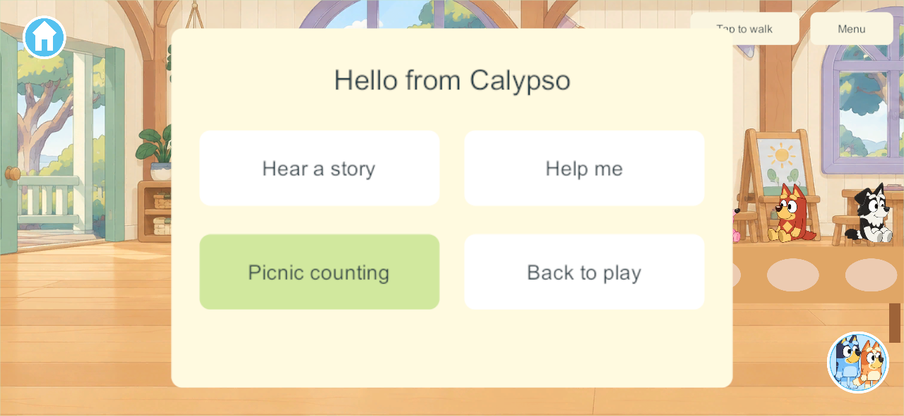
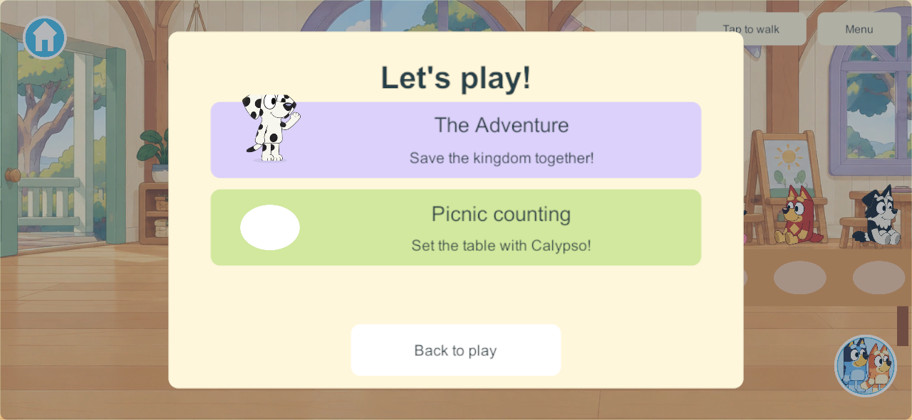
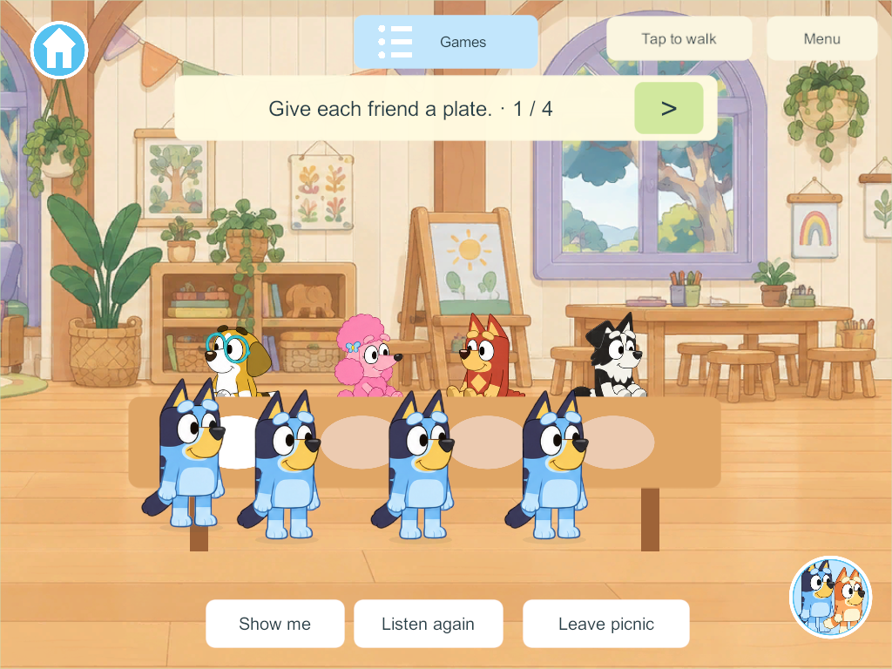
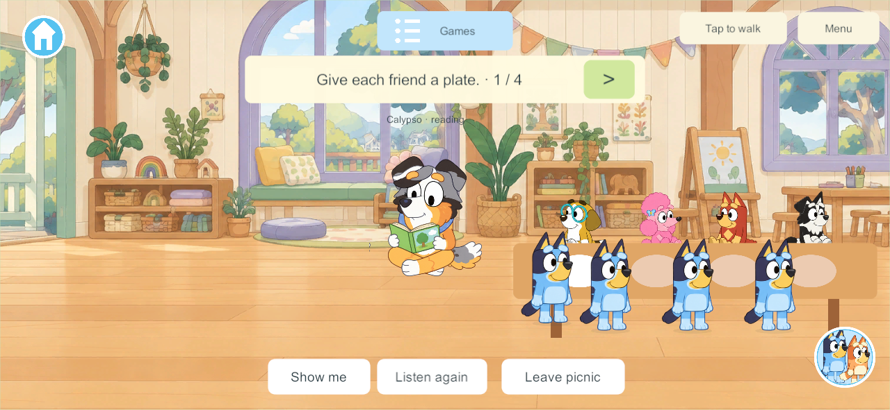

# Calypso and shared picnic counting

This is the next bounded Daycare slice after The Adventure, under DAY-01, LEARN-01, LRN-05 and NPC-01/G7-C. It adds Calypso and one usable lesson without claiming the full school or twelve-station batch complete.

## Research and adaptation

[Calypso’s official character page](https://www.bluey.tv/characters/calypso/) identifies Bluey’s gentle teacher, who encourages imaginative play, storytelling and independent discovery. The [official Calypso episode](https://www.bluey.tv/watch/season-1/calypso/) describes her bringing the children’s games together. The project’s section 40 routine and section 41 counting loop are the implementation basis. The new story, prompts, help and counting mechanic are our adaptation; no episode dialogue or actor performance is copied.

## What now works

One Calypso actor moves along authored anchors through greeting, reading, observing, helping and resting. A tap opens Hear a story, Help me, Picnic counting and Back to play. Her generated standing/waving/reading/resting drawings preserve the official reference identity; a full walking cycle remains artwork work. Her body stays in the room when local instructions play, and help does not prevent the table from working elsewhere.

Daycare Games has The Adventure and Picnic counting. The latter starts or joins the existing table directly, with a common three-second welcome and four pictured guests: Honey, Coco, Rusty and Mackenzie. Tap a place or the large arrow to walk to it and place a plate. Each committed empty place counts once; duplicate actions cannot count twice. Original recorded lines say one through four. Show me guides the current player to the next empty place. Listen again and Leave picnic remain available. The completed table offers Set it again for one deliberate shared replay.

Up to four family players contribute to one table. Starting/joining moves only the requesting player; late arrival keeps the round and plates. Leaving, travel and disconnection remove only that participant. Calypso’s clock advances while a connected player is in Daycare; an unattended picnic welcome is suspended. When everyone leaves Daycare its whole clock and checkpoint suspend. Returning resumes the existing table, including after authority restart. All tasks are available to one child too, with the prepared guests always present.

The actor uses authoritative clock samples through the existing motion lane without revising the transaction state every frame. Reliable changes own the checkpoint, membership and plate mask. New state is additive schema 39, with content 47 for the shared command/checkpoint/clock fields. The Adventure and previous world/item identities survive upgrade. Source is isolated on `codex/daycare-calypso` over `codex/daycare-adventure`; the live authority and family devices are unchanged. Preserve the main integration hold.

## Verification

Core checks pass for additive upgrade and retained Adventure/item identities, four contributors, no forced enrollment, common welcome, duplicate-count protection, late joining, independent exit/disconnect, bounded teacher help, JSON reopening, empty suspension and explicit replay. Unity JSON checks pass the same shared state and exact helper-timer rounding boundary. Windows 306 passes one focused four-client release gameplay/routine/restart/replay run. Windows 307 supplies the final guest-contact and arrival-spacing visual check. [Native result and exact scope](evidence/daycare-calypso-counting-2026-09-30/result.json). The final phone/tablet capture review passes; family visual/listening review remains open.

Generated artwork/voice listening and physical-device acceptance remain family playtesting work. A complete walk cycle, friend board/full classmate routines, optional day board, eleven other stations, 1–3 guest difficulty choices, deeper arithmetic, drag interactions and reviewed Spanish remain open. Next bounded task: talking-book station using the existing book system.

## Native views

