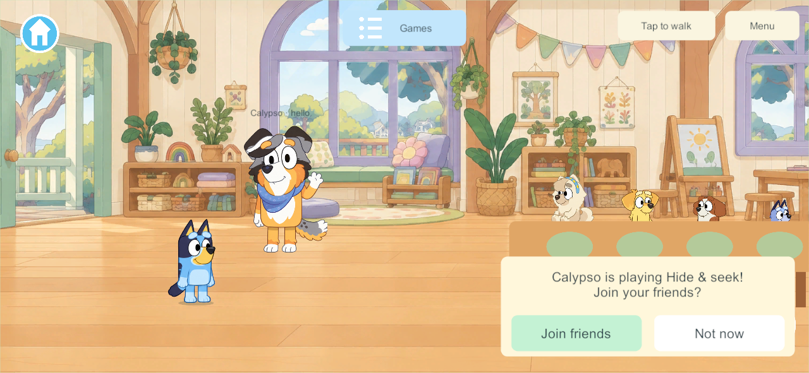
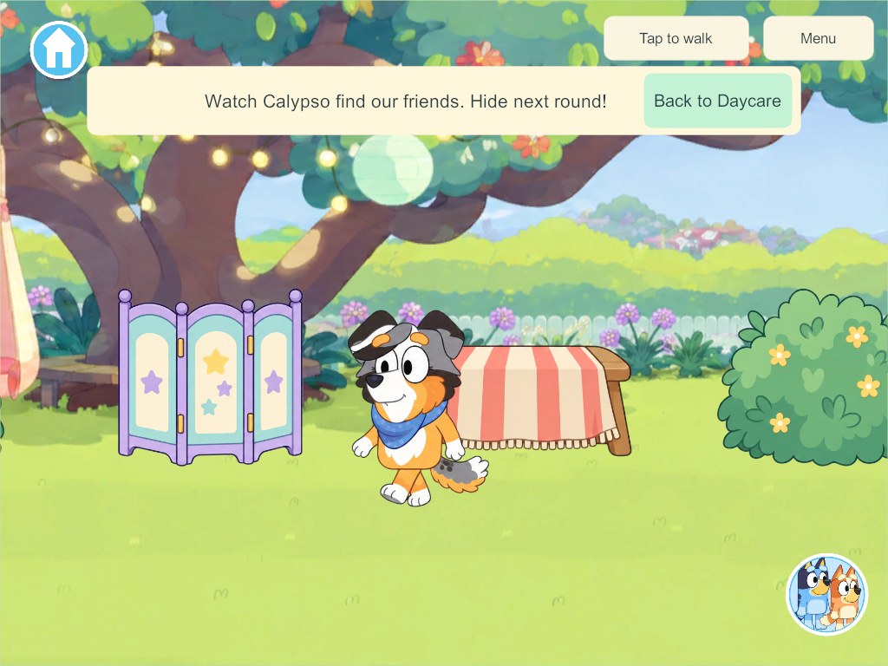
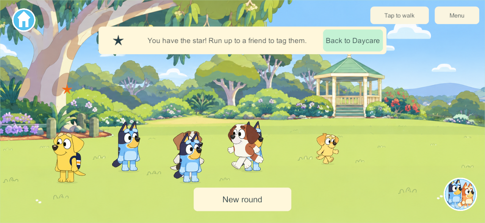
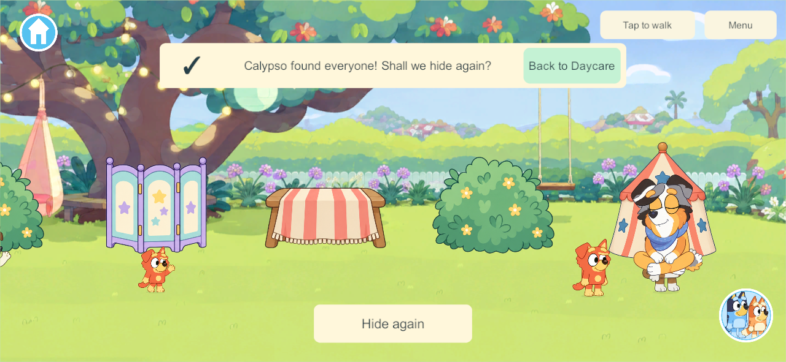
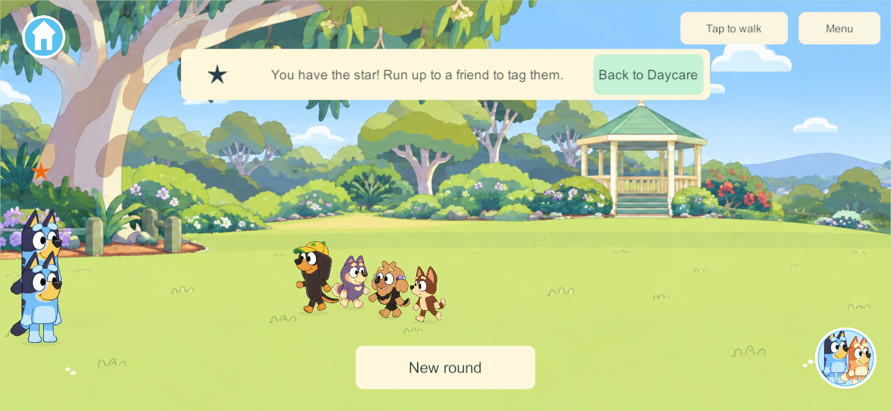

# Daycare Hide & seek and Tag — October 1, 2026

Scope: DAY-01 / HIDE-01 / HIDE-03 / NPC-01 / FAMILY-01. The user requests the existing Home hiding game and outdoor Tag as separate Daycare-menu activities, with four random classmates, optional invitations and Calypso as seeker.

## Play

- **Hide & seek with Calypso:** selecting the menu card enters an internal garden map. Everyone shares 15 seconds to hide. Tap a glowing cover to walk there and hide. Four NPC children choose distinct random places and physically walk into them. Calypso walks a shuffled route, stops to inspect each cover and reveals its occupants. Non-hiders watch; a late arrival after the count watches until the next round. Come out or move withdraws only that child. Hide again starts one new shared round.
- **Tag with friends:** selecting the menu card enters a separate green. After a shared three-second count, the star identifies the chaser. Authority-owned swept proximity transfers it, with a 2.5-second grace period. Four NPCs flee, chase and offer attainable turns; they are active runners even with one human. Arrivals have separate positions. New round replaces the NPC cast for the group.
- Other admitted players currently in Daycare receive a compact **Join friends / Not now** card. Accepting moves only that child. Declining stays dismissed for the round. Late Daycare arrivals can receive the current invitation; reconnecting from the actual activity resumes it. Starting another club replaces older outstanding club invitations.
- Both support four humans plus four NPCs. The authority saves each cast, hiding choices, route, common clock and roles. Leaving, disconnecting or reopening does not reroll the group. Human avatars never filter the NPC pool and can match an NPC.

## Existing implementation reviewed

`Core/HideAndSeek.cs` supplies the common 15-second window, cover inspection and no mid-search hiding behavior. The current outdoor Tag implementation is `Core/ParkTag.cs` and `Client/SoloTag.cs`, in **Park**, rather than Creek. Its swept-contact and grace rules are reused. Existing Home broadcast and Park presence-based joining remain their own contracts; the new Daycare clubs use the user's explicit invitations.

The maps reuse existing prepared clean lawn/park artwork under distinct internal map IDs. Six runtime covers use existing tent, bush, folding-screen and blanket-bench artwork. NPCs use the prepared character roster and the existing motion/animation presentation; Calypso uses her eight-frame walk atlas. No new generated raster assets or background characters were added. Both maps use the brighter Daycare score. The search camera follows Calypso while children hide or watch.

Final visual sampling uses the original pose-sheet dimensions (2172 × 724), so Unity's 2048-pixel import limit cannot crop the far-right sitting pose. Walking artwork is unchanged.

## Checks and delivery

Windows411: release client and dedicated server compile with zero errors/warnings. Focused Unity rules pass additive schema48 retention, invitation/decline/late fourth, varied casting independent of avatars, random covers and physical seeking, no late hiding, independent exits, deliberate replay, JSON reopening, Tag contacts and sole-client reconnect. The existing build-hook JSON and animation checks also pass.

The native411 run uses one disposable authority and four release clients at phone/tablet dimensions. Real UI touches exercise scrolling to both cards, accepting/declining, walking into covers, withdrawing, returning, replaying and steering. The four gameplay groups pass, including all four NPC reveals, teacher walk drawings, animated Tag runners/star transfers, reconnect and a cold saved-server reopening. All eleven native process exits are zero. Contact fixture placement supplements actual Tag steering to make the authority-contact check bounded.

Final412 changes teacher sampling and its dimension metadata only; Core/network/club rules match411. Final412 compiles with zero errors/warnings and passes two four-client hiding/presentation groups, with five zero process exits. A saved-round pose review uses two native clients and confirms the whole teacher drawing on phone/tablet, with three zero exits.

[Full native gameplay](evidence/daycare-hide-and-tag-2026-10-01/native-411.json) · [Final presentation](evidence/daycare-hide-and-tag-2026-10-01/native-412.json) · [Whole teacher pose](evidence/daycare-hide-and-tag-2026-10-01/teacher-pose-412.json) · [Build/source comparison](evidence/daycare-hide-and-tag-2026-10-01/build-and-source.json)

Schema49/content64/protocol3 adds two saved activity records and motion fields. This requires coordinated compatible client/server delivery when requested. No physical phone/iPad, installed desktop game or live family authority was changed. Family visual acceptance remains separate.

Next: requested device/server delivery and family playtesting. The four other Daycare wishlist activities and broader Home/outdoor goals remain open.

Document consistency reports only the thirteen pre-existing unclassified authored records; the new report is classified and its local links resolve.

## Tag runner wall correction — October 1

The reported wall-running came from recalculating a fleeing destination every tick. An NPC reached the edge, stepped inward toward the fallback center, then immediately received another outward destination. Runners now commit to a short authority-owned route, choose destinations inside an inset lawn rectangle, turn inward near the sides and vary direction, distance and lane. Occasional approaches keep a child's tag attainable. New chasers or rounds invalidate the previous route. Transient route memory restarts after restoration; saved cast, membership, round and positions remain unchanged. The prior movement/checkpoint bounds guard is retained.

Windows413 release server/client compile with zero errors/warnings. The focused Unity test covers both walls, four corner starts and human/NPC chasers across2400 ticks: no stopped runner, no persistent edge residence, repeated turns and different lanes, with an independent exit. The representative four-client run passes32 seconds with children placed at opposite walls, no runner edge residence, horizontal spans1217–1780 and lane spans101–123, changing walk drawings, actual authority tag contacts and one child's return without interrupting the round/cast. All five native process exits are zero. Fixture commands place humans at walls; NPC trajectories and contacts use the real rules.

[Native results](evidence/daycare-hide-and-tag-2026-10-01/tag-routes-413.json) · [Sanitized route traces](evidence/daycare-hide-and-tag-2026-10-01/tag-route-traces-413.json) · [Build/Core evidence](evidence/daycare-hide-and-tag-2026-10-01/tag-route-build-413.json)

Content65 records changed shared movement rules; schema49/protocol3 remain unchanged. This source fix requires coordinated client/server delivery. The installed412 family server and physical devices were not changed by this task. Next: coordinated delivery when requested and family playtesting; broader Daycare wishlist work remains open.

## Deterministic Tag build-gate repair — October4

The458/459 build failures recorded the original edge assertion but no seed. New seeded instrumentation reproduces the same failure on seed70: runner3 at(2320,240) receives goal(1526,218) and remains above y230 for24 ticks. The identical failure occurs against the full58-file pre-Sandcastle9d3ea80 Core export; the routing method is unchanged since October1a2d9c9d. Thus the Sandcastle record's independence claim is now supported by reproduction/source comparison. This is an existing delayed-edge-recovery gameplay defect, with an unrecorded randomized gate, rather than an invalid assertion.

`ClubRunGoal` now commits edge runners to a short inward waypoint before continuing normal varied routes. Speeds, chaser/contact/grace, casts, shared progress and save fields remain. Fixed test seeds70/0/413/458,9600 ticks, preserve all displacement/edge/variety thresholds and add seed/corner/episode/goal diagnostics. Existing1200-tick bounds/reopening tests also pass. Standard full-game463 runs the normal gate, including actual Unity JSON migration and DaycarePlay checks, then builds both release profiles with0errors/0warnings. Four actual native clients pass stopped synthetic corner-checkpoint reopening,32-second movement/animation trace, tag transfers and independent departure; ten exits0, no runtime exceptions. Phone/tablet captures inspected.

[Full diagnosis, old/current reproduction, normal-gate markers, source/artifact comparison and native trace](evidence/daycare-hide-and-tag-2026-10-01/tag-gate-repair-2026-10-04/README.md). Only Tag route, its editor test, content and build version differ from462; all accepted Sandcastle inputs are retained. Shared movement content72/schema53/protocol3 requires a future separately authorized coordinated rollout. Installed451/452, real saves/security and saved interactive preview selection remain unchanged.463 is ready for isolated local parent playtesting; physical comfort/fun are not inferred. Stop after this repair.
