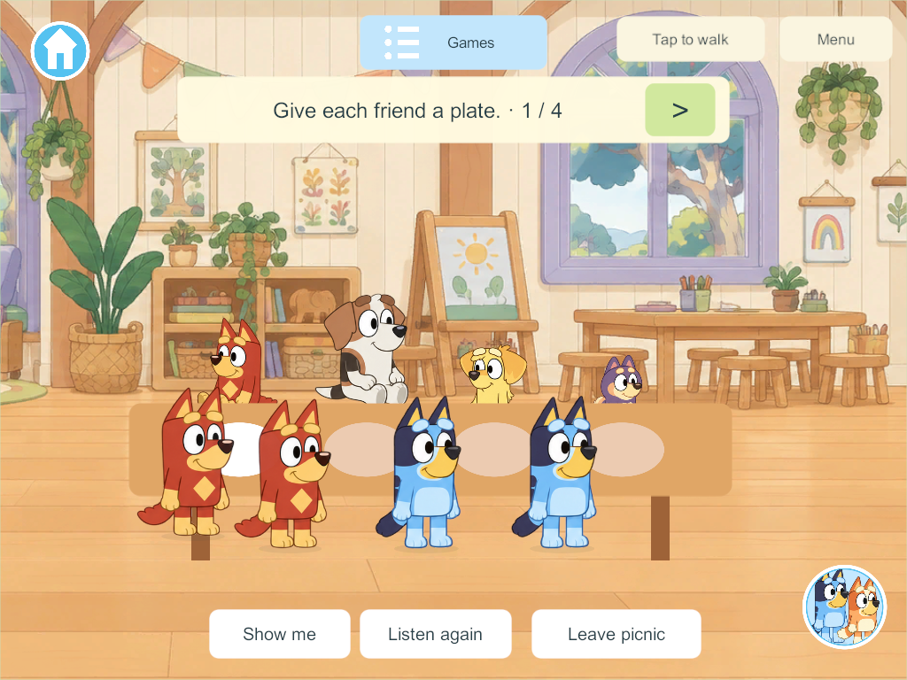
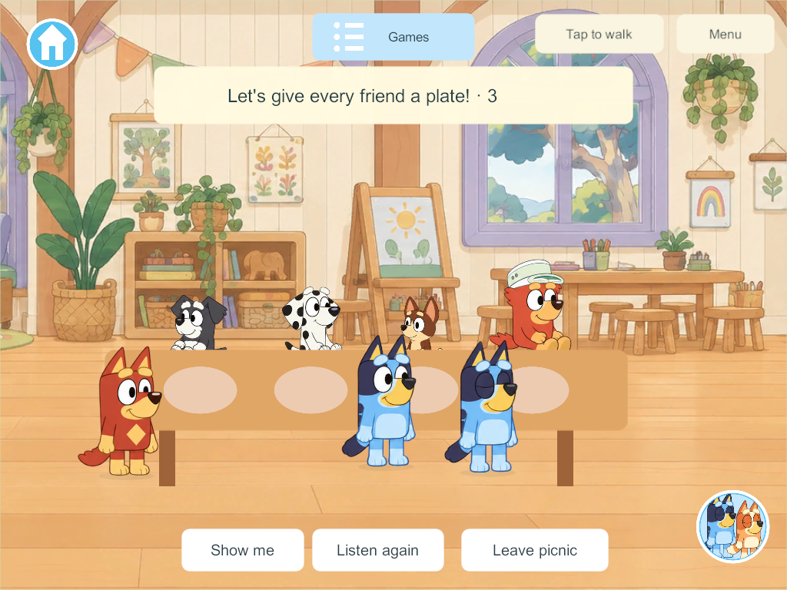

# Varied random Daycare NPCs

The September 30 user correction applies to every Daycare game: use a mixed random cast, avoiding repeated Blueys or one repeated character. The Adventure now fills its nine NPC roles from the prepared child roster; picnic counting picks four different guests. Calypso remains the named teacher.

Player characters never affect NPC selection. Bluey and Bingo remain in the NPC pool even when players choose them, and a player can switch to the same character as an NPC without changing the cast. Draws exclude Bandit/Chilli and the previous round's NPC faces. The three Terriers count as one visual family, so a cast can contain only one of them. The prepared roster has 33 distinct child visual identities, enough for a completely different nine-role replay.

Only the authority chooses characters. Their saved IDs travel with the shared checkpoint and determine the artwork on every client. Joining, leaving, disconnecting and reopening retain the exact cast and current progress. Explicit shared replay chooses different friends; a late join or avatar change does not reroll an active cast. Existing saves gain casts additively without resetting world identities or completed plates/story steps.

Windows candidate **309**, schema **40** / content **48**, compiled successfully. Focused Adventure and picnic core checks pass, including the full NPC pool retaining Bluey/Bingo, players matching NPCs, replay variety and saved identities. Unity JSON checks pass the schema-39 upgrade and exact cast reopening. [Five native four-client groups](evidence/daycare-random-npcs-2026-09-30/result.json) pass for varied rendered characters on every client, two players choosing a current NPC character in each game, late joins, independent exit/disconnect, shared replay and native authority restart with both casts retained. [Build summary](evidence/daycare-random-npcs-2026-09-30/build-summary.json). The disposable run is recorded in that result; no live-world data was used.

Source stays on `codex/daycare-calypso`, with concurrent checkout work and the main integration hold preserved. No phone, iPad or live-server installation occurred. Wider Daycare stations/stories and family artwork/audio acceptance remain open. Next: the talking-book station.
