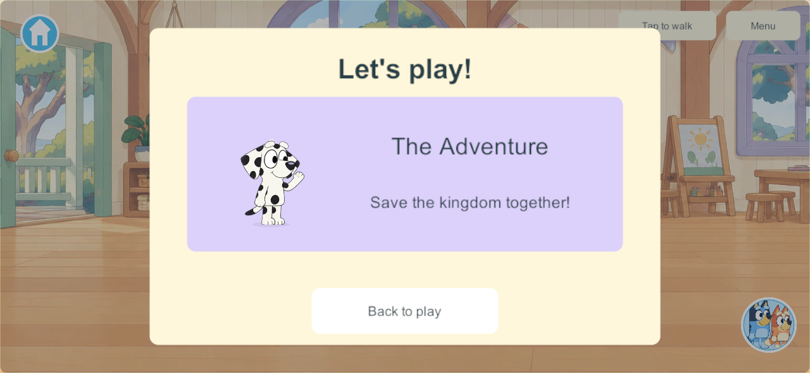
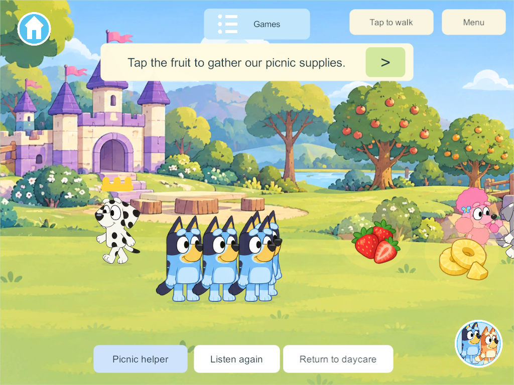
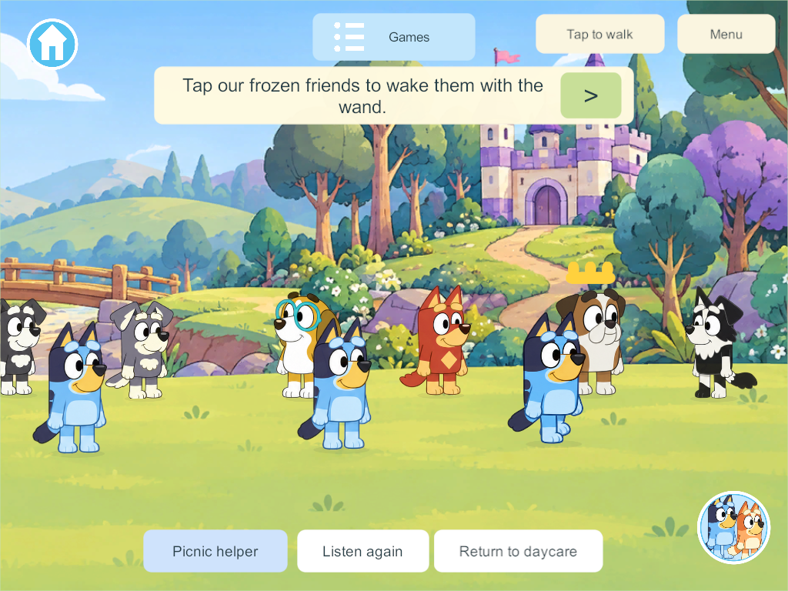
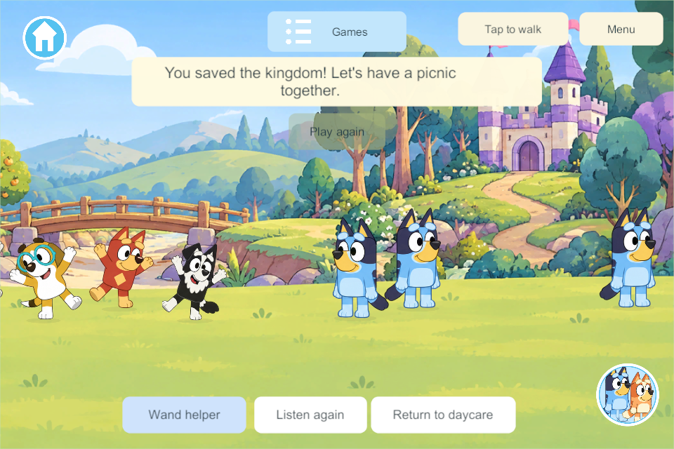

# Daycare The Adventure mini game

The user requested research and implementation of The Adventure, reuse of prepared characters as NPCs, and a Daycare Games menu entry that starts the story directly. They reaffirmed that up to four players must come and go freely. This is the first bounded imagination-story implementation under IMG-01 and G7-D; the other eight stories remain planned.

## Research and adaptation

The [official episode synopsis](https://www.bluey.tv/watch/season-1/the-adventure/) describes Bluey and Chloe changing roles during a kingdom adventure, finding food, encountering Terriers and a fairy, and recovering a wand to free frozen characters. [Chloe's official character page](https://www.bluey.tv/characters/chloe/) supports her imaginative role play and fondness for tennis balls. These sources establish the inspiration, not the proposed mini-game mechanics or new NPC casting.

The goal sheet's section 42 proposed gathering three picnic supplies, opening a bridge, rescuing NPC statues and sharing a feast. This implementation adapts that into six shared phases: a three-second welcome, three picnic fruits, three bridge planks, a tennis-ball distraction and wand recovery, waking three friends, then a celebration. There is no damage or compulsory freezing of a human player. The story uses original short spoken instructions rather than episode dialogue.

## What the player does

In Daycare, open Games and select The Adventure. That starts the existing story or joins its current checkpoint; it does not move another player. A separate story area contains a kingdom panorama and the existing prepared cast. Tap a fruit, plank, ball, wand or frozen friend and the player walks into reach before performing the action. All players contribute to the same supplies, bridge and rescue state. A large arrow walks to the next unfinished task when its prop is offscreen.

Chloe is the Kindly Queen, Coco the friendly fairy, the three Terriers bridge helpers, Winton the pretend Greedy Queen, and Honey, Rusty and Mackenzie the friends to wake. This casting is our adaptation. Actors greet, help, walk along authored routes, watch the ball, change from frozen to awake, and gather for the ending. They use existing runtime artwork and animations.

Player roles are pictured through the shared scene and labeled Explorer, Builder, Wand helper and Picnic helper. Roles are optional pretend identities, can be changed and do not gate anyone's actions. Any prepared player character can perform any task. Return to daycare remains available throughout. Play again deliberately starts one new shared story after the ending.

## Four players and persistence

One authority owns the phase, start time, membership and committed contributions. Players joining midway receive the current story; exits, travel and disconnection release only that player's membership. The story clock advances while at least one connected participant attends, and suspends when nobody is participating. Reopening restores the checkpoint; selecting the menu entry resumes it. NPC functions are always present and never require a human to hold an essential role.

Story clocks use the existing motion channel without advancing the transaction revision every frame. Only visible transitions change the revision. A late clock packet can update only the matching round and phase, and cannot replace membership or completed actions.

Schema 38 adds the story checkpoint, with content 45 for the new shared zone, commands and clock fields. The release candidate includes the completed pond baseline; unrelated unfinished Zoo/Creek work remains separate. A device delivery requires coordinated compatibility with the family authority. No live server, phone or iPad is updated by this implementation task; preserve the existing main integration hold.

## Verification record

Core checks pass for additive upgrade and retained item/world identities, four shared contributors, late joining, independent exit/disconnect, JSON reopen, empty suspension, resume, explicit replay and rejected out-of-step actions. Native Unity JSON checks verify the same new fields and the installed panorama.

Windows 300 exposed a dangling ResetZoo call in the completed pond baseline; the isolated source removes the unavailable call. Windows 301 exposed clock revisions changing every frame during joining. The clock handling was corrected. Candidate 305 includes the final controls and a compatibility version distinct from concurrent work. A repeated native run exposed a Unity JSON rounding boundary on the eight-second distraction timer; candidate 305 allows one millisecond of save precision tolerance and adds the exact-value core/Unity regression check. Windows 305 passes the four-client shared gameplay groups and a separate reopening/replay check of that same saved world. [Result and precise limits](evidence/daycare-adventure-2026-09-30/result.json). One client returned a nonzero exit during test cleanup after the server stopped; it had completed the gameplay checks and recorded a clean stopped status. The separate saved-checkpoint run exits normally. The harness now closes clients before the server. Failed candidates are not delivered.

Family visual/listening acceptance and physical-device playtesting remain open. The nine-story catalog, general daycare teacher/classmate routines, optional day board and twelve lesson stations are not completed by this one story.

## Native views

