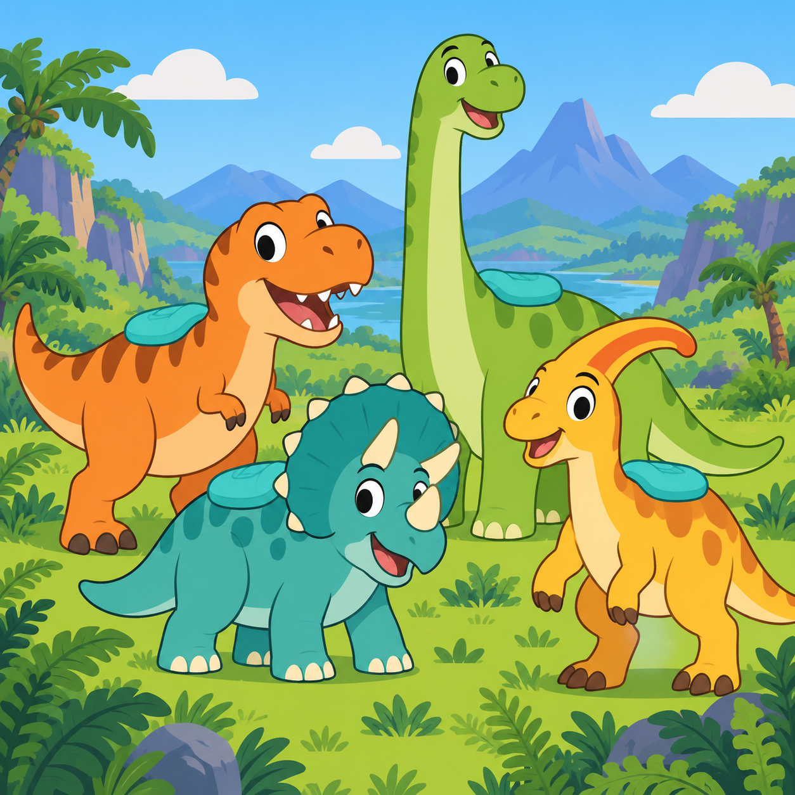
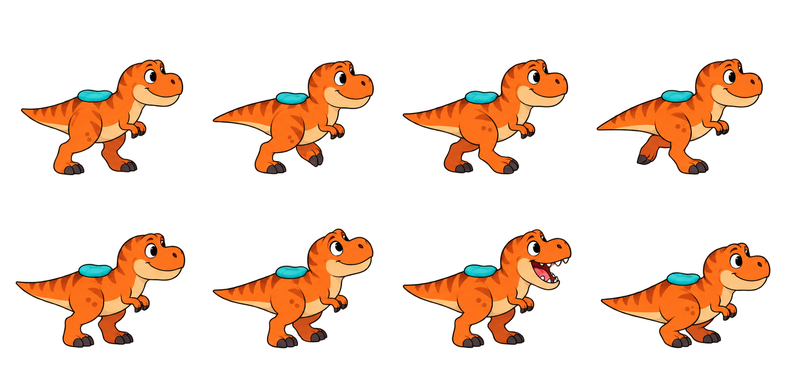
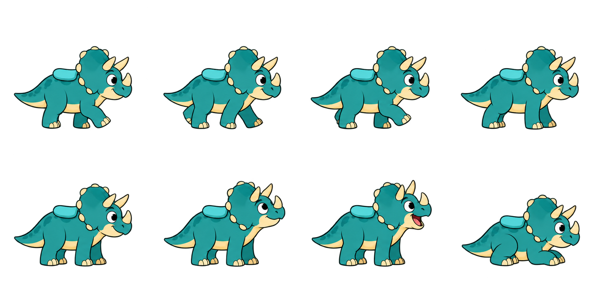
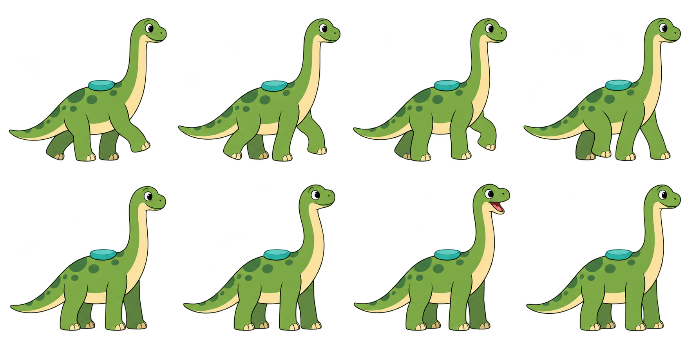
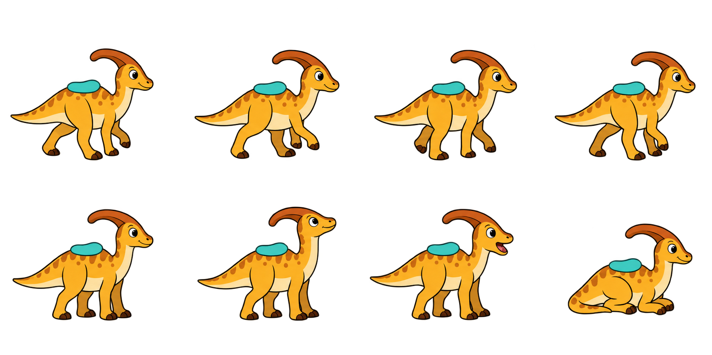
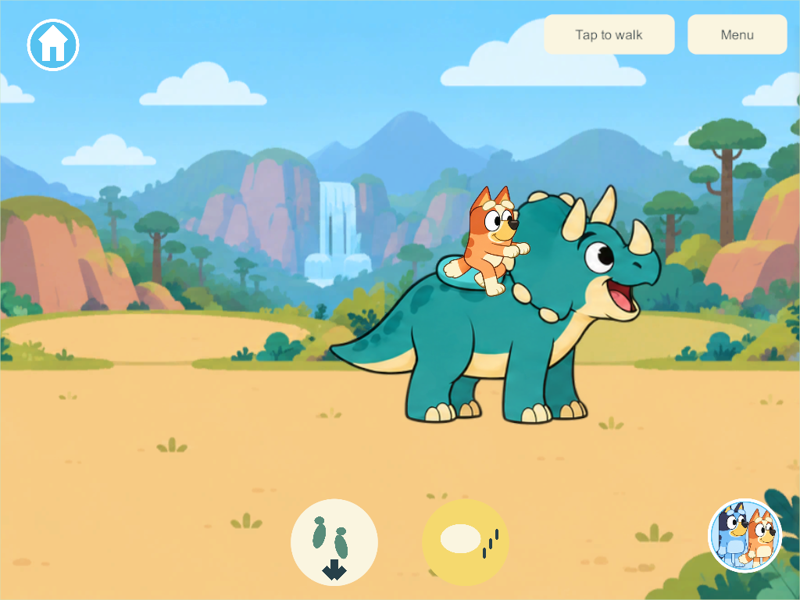

# Dinosaur World research and first riding implementation

The requested new destination is a shared prehistoric valley where children can choose a dinosaur, ride it with the existing walking controls, hear its approved Home-book call and get off independently. This first version contains T. rex, Triceratops, Brachiosaurus and Parasaurolophus. It extends WORLD-01, WORLD-02 and FAMILY-01. The separate twenty dinosaur toys and Dinosaur Discovery Mat remain required work.

This report distinguishes museum evidence, engine/input evidence and the game's authored choices. Riding extinct animals, their friendly colors, cushions and compressed relative sizes are fantasy design. They are not paleontological claims. Research accessed September 30, 2026.

## Species evidence and model sheets

| Dinosaur and primary evidence | Recognizable model features | Authored game implementation | Existing approved book sound |
| --- | --- | --- | --- |
| [Tyrannosaurus, Natural History Museum](https://www.nhm.ac.uk/discover/dino-directory/tyrannosaurus.html): large carnivorous theropod, two legs, about 12 m, Late Cretaceous | Large head, two tiny arms, powerful hindlegs and balancing tail | Orange, friendly two-legged walking atlas; cushion above hips, outside the neck/head silhouette | `effect-0.wav` |
| [Triceratops, Natural History Museum](https://www.nhm.ac.uk/discover/dino-directory/triceratops.html): plant-eating ceratopsian, four legs, about 9 m, Late Cretaceous | Three horns and broad frill | Teal four-legged atlas; cushion behind frill so rider is not seated in horns | `effect-1.wav` |
| [Brachiosaurus, Natural History Museum](https://www.nhm.ac.uk/discover/dino-directory/brachiosaurus.html): plant-eating sauropod, four legs, about 22 m, Late Jurassic | Long neck, small head, tall forequarters | Green long-necked atlas; cushion on torso, not neck; slightly taller picture rather than literal museum scale | `effect-3.wav` |
| [Parasaurolophus, Natural History Museum](https://www.nhm.ac.uk/discover/dino-directory/parasaurolophus.html): plant-eating ornithopod, two or four legs, about 9 m, Late Cretaceous | Backward crest, beak and long tail | Golden four-legged walk, cushion behind neck/crest. This was selected rather than placing a rider through Stegosaurus plates | `effect-10.wav` |

The Jurassic Brachiosaurus and the Cretaceous species are deliberately mixed in an imaginative world. The starter selection gives four visibly different silhouettes and four already approved calls. It is an initial roster, not a claim that only four species should ultimately exist. No museum source establishes human riding, these exact gaits, cartoon colors or the game speeds.

Each transparent model sheet has four walk poses above idle, looking, calling and resting poses. Source PNGs, original outputs, exact initial/edit prompts and generated-file provenance are preserved under `SourceArt/DinosaurWorld/`. The runtime sheets are equal-cell 4 × 2 atlases. Edited T. rex, Triceratops and Parasaurolophus outputs keep heads/tails within cells; the original Brachiosaurus already fits. They remain generated drafts for family visual review.

## Valley layout and interaction choices

The world menu gains a seventh circular picture destination, Dinosaur World. The valley is 4,800 game units wide, presented as two 2,400-unit landscape panels. Its initial mounts stand at x = 600, 1,800, 3,000 and 4,200. Independent cameras follow each child. This arrangement gives all four children a different nearby mount while leaving room to ride together.

The authored floor corridor is x = 280–4,520 and y = 70–230. Wide margins keep whole dinosaur bodies inside the world and leave space below the interface. Ferns, conifers, distant mountains and a waterfall are scenery; they do not imply those four species inhabited one historically accurate place. The two panels currently reuse one illustration. A visible seam or repeated landscape is a presentation limitation to review, rather than a claim of a finished biome.

As with the existing park fixtures, one tap on the animal places the child on its cushion directly. Existing joystick or tap-to-walk input now moves dinosaur and rider together. A second tap on the same mount keeps riding. Children get off using a dedicated circular footprints/down-arrow button; the separate speech-picture button requests its call. Held toys must be put down first, preserving possessions instead of moving them across areas accidentally.

[Android's accessibility guidance](https://developer.android.com/guide/topics/ui/accessibility/apps) recommends at least 48 dp touch targets. That informed generous 140-unit action circles and 420 × 400 animal targets, but canvas units are not Android dp. The native viewport checks establish picture visibility and usable UGUI targets; physical-device dp sizing and family comfort require device playtesting. No text reading is needed to select a world or dinosaur.

## Keeping the rider attached during motion

[Unity's sorting guidance](https://docs.unity3d.com/6000.3/Documentation/Manual/2d-renderer-sorting.html) establishes that drawing order determines which 2D objects cover others. This game renders its actors through UGUI, so it uses its existing sibling-depth sorter rather than adding a SpriteRenderer SortingGroup package. Dinosaur body and rider receive the identical ground-plane depth. The rider is drawn above its support, and closer walkers can pass in front.

Every generated pose has different transparent margins. A constant guessed vertical lift would make feet hover and the rider slide off the cushion. The implementation instead measures a normalized foot baseline and the cyan cushion's contact point in every cell. Those measurements are saved in `seat-landmarks.json` and used by `DinosaurLandmarks.cs`. These are asset measurements, not anatomy assumptions. Images register their foot to the ground; the rider root registers to that frame's cushion; left-facing flips both the image and the socket.

Bluey and Bingo reuse the existing park rider poses, copied unchanged into this world's resource ownership. Their authored seat pixels become the picture pivot. The remaining starter characters use the existing supported sitting pose; those fallback poses need separate family visual acceptance. A mounted dinosaur uses the same displayed player position as its rider, including existing network interpolation/prediction, so the view does not mix a raw server body with a smoothed child. The whole assembled body stays at the ground depth even though the child is above it.

## Four players and varied dinosaur behavior

[Unity's authority explanation](https://github.com/Unity-Technologies/com.unity.multiplayer.docs/blob/main/docs/terms-concepts/authority.md) distinguishes authority over shared objects from client presentation. That principle is applied to the game's existing custom server; no new network package or client-host architecture is introduced. One shared state owns the four dinosaurs' positions, facing, random stream and call events. Four independent copies of solo riding would not satisfy the request.

Each dinosaur uses the existing temporary player-fixture lease, allowing one rider per animal and four riders at once. A competing mount request is rejected; tapping an already owned mount is idempotent. A compact movement packet carries quarter-unit positions for unoccupied dinosaurs and rider indexes/facing flags; occupied bodies use the exact player samples. This keeps the existing datagram size limit while avoiding transaction-revision churn. Calls and mount changes remain reliable events. Continuous motion keeps the lease instead of the ordinary walking behavior that exits a sofa/park fixture. The same riding-floor function runs in server motion, private solo and client anticipation. Stale movement input retains the existing timeout. Changing character does not create a second dinosaur.

Without a rider, each animal rests for a varied interval and picks a fresh bounded destination near its current position. This is an authority-owned persisted xorshift stream, not a fixed repeating route or separately rolled route on each device. Roaming stops while ridden and resumes from the actual dismount point. It is a simple authored wandering behavior for the first version, not a researched reconstruction of extinct-animal daily schedules. Feeding, obstacles, jumping, races and dinosaur-specific missions are not implemented in this slice.

Getting off, changing area or disconnecting releases only that child's mount. Siblings continue riding their own mounts. On saved-world restore, dinosaur positions and random state persist, while temporary rider leases clear through the existing recovery rule. The additive migration preserves the complete prior Home, Zoo, toys, progress, IDs and receipts. Schema 36/content 39 are this isolated branch's compatibility values; concurrent newer root schemas must be reconciled during integration rather than downgraded or silently admitted to an incompatible server.

## Reusing and checking the book sounds

The exact approval record is `SourceAudio/Books/ApprovedDinosaurCalls/2026-09-30/manifest.json`. The user selected these calls on September 30. The world copies the four runtime Home-book WAVs byte-for-byte into `Resources/DinosaurWorldAudio/`; no replacement synthesis, candidate 230 rejected calls or unapproved internet sounds are introduced. Separate resource paths let this world unload its own clips without invalidating an open book's resource. The original manifest's source/rights notes remain attached to the assets.

The [Natural History Museum's Jurassic audio resource](https://www.nhm.ac.uk/schools/teaching-resources/key-stage-1/dinosaurs-and-fossils/jurassic-sounds.html) describes its dinosaur sounds as reconstructions. That supports treating extinct-animal calls as imaginative sound effects, not authentic recordings. It does not license the existing third-party approved clips or prove these four species sounded like their book effects. No museum audio was downloaded for this build.

[Unity's PlayOneShot documentation](https://docs.unity3d.com/6000.3/Documentation/ScriptReference/AudioSource.PlayOneShot.html) explains that one-shot playback does not cancel existing sounds. Unbounded taps would therefore stack calls. The implementation instead uses two reusable audio voices with stop/play, a server-owned three-second cooldown per dinosaur and quiet playback gain with existing narration ducking. Mount/call events are replicated once; arriving clients do not replay old calls. Sounds unload on departure and stop while suspended. A 3-second cooldown is an authored control choice, not an animal vocalization frequency.

## Verification and remaining scope

Focused core checks cover additive migration, detached state reads, four shared mount leases, competing/repeated taps, continuous movement/facing, input timeout, bounds, call cooldown, independent get-off/travel/disconnect, JSON recovery, retained random streams and malformed-state rejection. The unchanged Zoo focused checks also pass after the new core integration. Unity additionally loads all four atlases/calls and the picture destination, round-trips four mounted players and checks recovery releases their leases while keeping the dinosaurs.

Windows **306** passes six [native four-client groups](evidence/dinosaur-world-2026-09-30/results.json), using full 32-character family profile IDs. All four native mount/sound checks, two-way steering, exclusive/repeated taps, shared calls, independent get-off/travel/disconnect, world texture unloading, pause/resume and exact book-audio hashes pass. The [build record](evidence/dinosaur-world-2026-09-30/build-evidence.json) verifies the compiled runtime source hashes. The four individual mount screenshots and Bandit fallback were visually inspected. The clustered tablet view demonstrates shared depth, with the fourth dinosaur partly outside that particular camera. Those checks use an isolated loopback server and disposable test family; they do not update the persistent family server or installed phones/iPads. Final artwork approval, physical listening, device performance and integration with the concurrent pond/creek/bike/outfit branches remain separate from this first riding build. Preserve the existing main integration hold.

