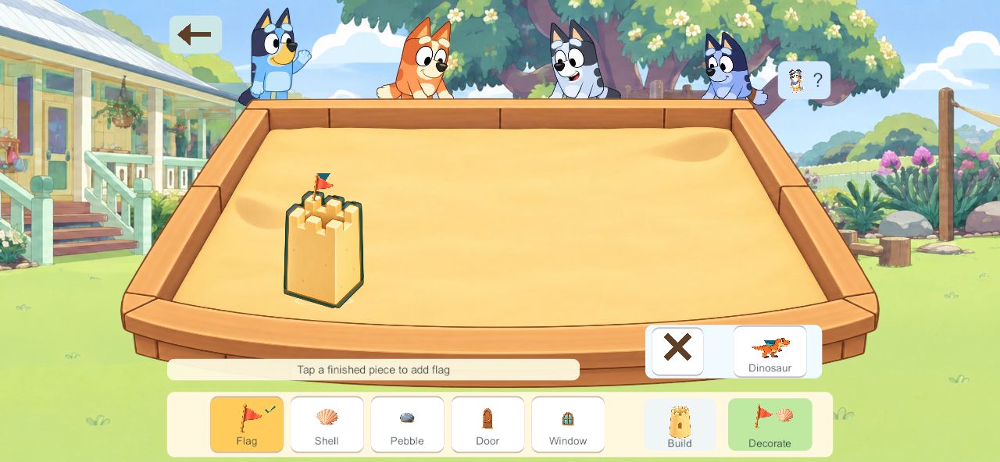
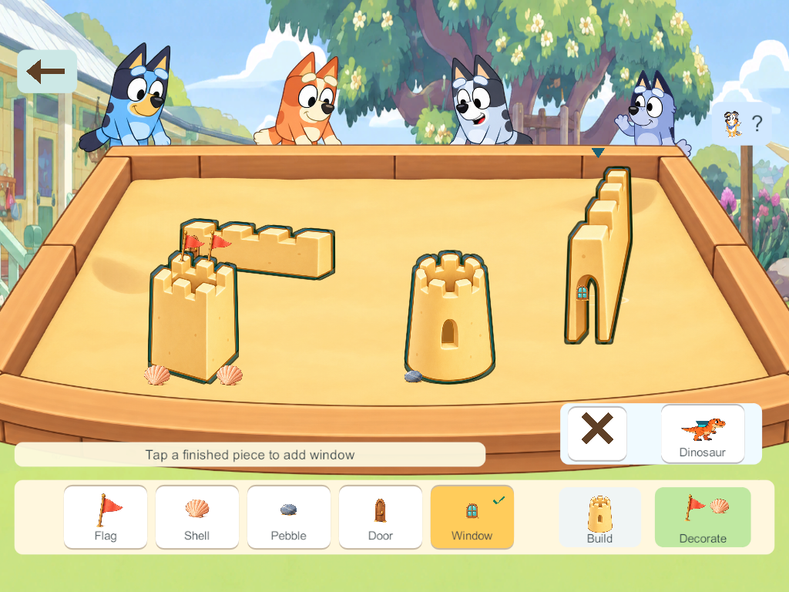

# Sandcastle direct placement — October 4, 2026

Owner: DAY-01 / LEARN-01 / FAMILY-01, focused parent usability correction after Stage6. Evidence consumers: implementation record and parent review. Retain as dated gameplay evidence; do not treat these synthetic saves as live family data.

**PASS: fresh455, production Daycare activity, four actual simultaneous native clients.** Windows client/server release errors0/warnings0; 2321 recorded Unity inputs verified against current source. Phone aspect1280×592 and tablet1024×768. Input travels through actual Unity Touchscreen/InputSystem UGUI pointer events. This is not a physical Android/iPad run. Existing410 rule/migration checks and applicable Stage6 authority evidence are reused: all59 recorded non-meta Core inputs match build450. Protocol3/content70/schema52 remain unchanged.

The accepted parent feedback supersedes routine mould Confirm and decoration socket/Attach requirements. Choose a mould → tap valid sand immediately submits the captured snap and selects the new bucket. Choose a decoration → tap its suitable painted region directly chooses the nearest empty compatible socket. Actual eligible pieces have a contrasting outline; no ordinary white socket boxes/plus signs or Attach button. Optional tray drags use the same route, with actual decoration art following the drag. Continued intentional decoration taps retain the chosen kind. Cancel is separate from the dinosaur control after capture review exposed overlap.

[Executed acceptance receipt](result.json) records10 focused groups: tap construction/repeated decorations; four-client round/square/wall/rotated-gate contributions; boundary/occupied feedback; cancelled gestures/tray swipe/UI drop; optional drop; destructive/reset consent; rapid taps/exact network redelivery; competing decoration convergence; Leave/activity transition; native disconnect/reconnect. The receipt has zero runtime exceptions. The first453 attempt completed five groups before a harness receipt lookup failed; public snapshots omit command receipts. The assertion now reads the isolated checkpoint with the existing delete-sharing observer.454 compiled the layout/diagnostic correction; final455 includes disabled-drag and pointer-generation guards and executed all groups. No historical partial run is called a complete pass.

## Actual current captures

| Player state | Phone | Tablet |
| --- | --- | --- |
| Normal empty entry | [Phone](phone-empty.png) | [Tablet](tablet-empty.png) |
| Placed bucket and Scoop/Water/Tip | [Phone](phone-direct-bucket-tools.png) | [Built through inputs](tablet-built-through-input.png) |
| Direct decoration, eligible outline, usable tray | [Phone](phone-direct-decoration.png) | [Tablet](tablet-direct-decoration.png) |
| Continued shared construction/combined props | [Phone](phone-shared-result.png) | [Tablet](tablet-shared-result.png) |
| Safe invalid attempts | [Occupied](phone-occupied-cue.png) / [full flags](phone-full-flag-gentle-cue.png) | [Boundary](tablet-boundary-cue.png) |

[Actual45-second gameplay recording, SILENT](actual-direct-placement-silent.mp4). Actual native canvas frames captured during the first client's input journey and encoded in chronological timing order,1280×592. Exported video frames at3/12/27/40seconds were inspected; building, direct flags/shells, participant feedback, continued shared construction and retained destructive confirmation are visible. No generated concept/composited gameplay or audio track; audio listening remains separately pending from Stage6.

Other useful captures: [actual decoration drag preview](phone-decoration-drag-preview.png), [optional mould drag preview](phone-optional-drag-preview.png), [combined flags/shells](phone-combined-decoration-dragged.png), [retained removal confirmation](phone-destructive-confirmation-retained.png). Ordinary player controls stay visible; no prototype fixture/developer overlay.

## Scope and limits

Existing six fixed sockets remain: two flag positions, two shell/pebble positions, two door/window positions. Placement uses a140-local-unit generous compatible region and existing piece-depth masking. It does not provide free-position decorations or replace an occupied prop. Removal/reset remain explicit; moving an existing piece retains its previous preview/confirm route. Physical finger comfort, child comprehension and parent subjective approval require family playtesting; native screenshots do not establish them.

Artwork is retained. This usability task tests current source locally and preserves installed apps, the live authority and real saves. The preceding authorized rollout remains server451/phone452; the455 usability candidate is source/local-test delivery only. The tested entry is ordinary Daycare Games → Sandcastle Club; this is integrated production code, not the isolated prototype scene. Reproduce scoped acceptance with `uv run --offline --with cryptography python Tools/Verification/Test-SandcastleDirectPlacement.py --build 455`. Its launcher creates a fresh isolated loopback authority with synthetic saves and generated test tokens. Private lab outputs remain under `LocalData/SharedGarden/1b0d12bfb800468cb0d2e80ddc9c6ea7/`.
