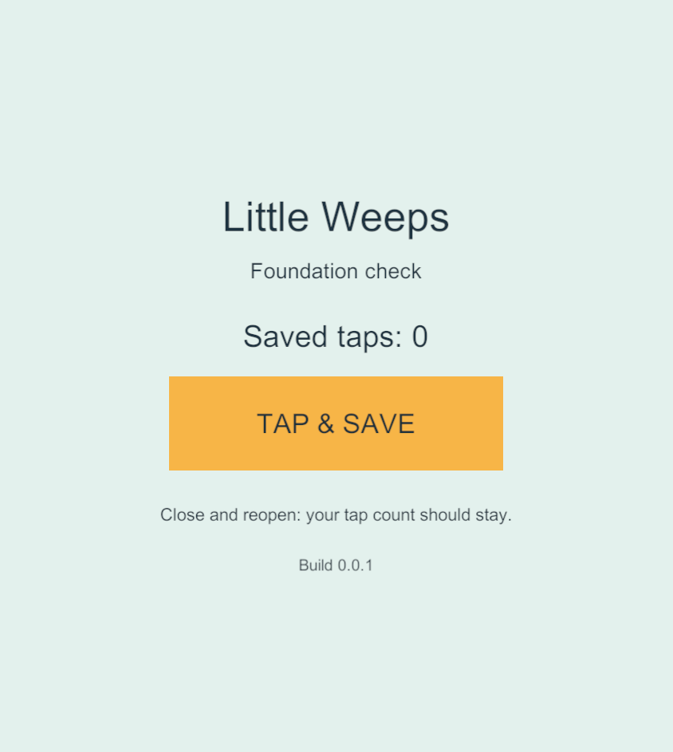
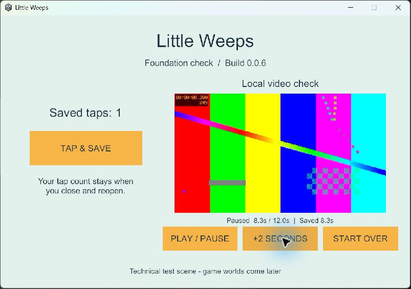

# G1 — project and device foundation

Started 23 September 2026. In progress; no device qualification is complete.

Current work (latest user steering, 23 September): iPad trust is deferred again until the user has time; continue the Windows Android/server build setup. **Latest result:** all seven Android dependency archives are verified and the user-owned SDK toolchain is installed, registered and repeat-checked. The Android Unity module installer remains at its welcome screen and did not respond to automated input; the user was asked to complete its manual steps. Both Android and Windows Server build preflights still report missing Unity modules. No APK/server artifact is built yet. Windows 0.0.9 remains verified; iPad 0.0.1 remains installed with first launch blocked by its signing/trust check. G2 and later game features have not started.

## Boundary and tools

- Root: `C:\Users\sephi\Desktop\Little weeps game`.
- Unity project target: `Unity/FamilyPlayset` under this root.
- Old `Meeps game` remains unrelated. Its connector was read only to diagnose the reported error; no old game assets or settings are imported.
- Windows: Unity 6000.3.6f1 and 6000.5.0f1 already installed. Side-by-side 6000.3.24f1 is now installed and registered in Hub; editor executable reports revision 4e7b9b5b6244. It is not yet device-qualified.
- Candidate 6000.3.24f1 / revision 4e7b9b5b6244 verified against the official release page and release API. Windows exports the Xcode project; the Mac only needs Xcode for the current route. If Unity is later used on the Mac, use the same editor patch. Bloom stays disabled during this foundation work.
- Blender 5.0.1, native MCP protocol 9 / add-on 1.7 responded successfully on 23 September.
- Codex CLI 0.155.0-alpha.16.3 exists under the desktop app's versioned bin directory. That directory is absent from the normal user PATH, explaining the shortcut error. The new resolver locates it directly on each launch. The launcher passed a live Blender-only reconnect with a normal Windows user/machine PATH, and PowerShell syntax validation passed. Both desktop shortcuts now point here.
- Git 2.53.0.windows.1 and Git LFS 3.7.1 available.
- Samsung SM-S948U1: Android 16 / API 36 verified through ADB. No new-game app installed yet.
- A2602 iPad 9: connected by cable, paired and Developer Mode enabled. Live device inventory reports iPadOS 18.6.2 (22G100); this supersedes the earlier reported OS pairing. Signed foundation 0.0.1 is installed; first launch was blocked by the device's signing/trust check. A2197 iPad 7 and A2484 iPhone remain untested.
- Mac SSH authenticated successfully after correcting authorized_keys from a directory to a file. Live inventory: macOS 26.3.1 (25D2128), arm64, Xcode 26.6 (17F113), developer directory /Applications/Xcode.app/Contents/Developer, about 247 GiB free. No Unity Hub editor directory on Mac.

## Exit checks

| Check | Result |
| --- | --- |
| Correct isolated root | Verified |
| Local Git baseline and source policy | Baseline committed locally as 674c1f6; version 0.0.2 build settings recorded as d021213. Ignore/LFS rules are present. No external backup configured. |
| New tool launcher; exact Unity project verified | Live full shortcut passed from normal Windows PATH. Blender responded; Unity MCP reported the new root, Unity 6000.3.24f1 and ready-for-tools. |
| Matching editor, small package lock and saved profiles | 6000.3.24f1 and package lock exist. URP 17.3.0, Input System 1.20.0, UGUI 2.0.0, Test Framework 1.6.0; editor MCP 9.7.3 pinned. Saved Windows Foundation profile is built and verified; other platform profiles remain pending. |
| Touch/save scene and local-video probe | Native Windows mouse input, saved taps, profile retention, local H.264/AAC decoding, play/pause/seek/restart and bookmark recovery passed. Touch, audio perception and video behavior on mobile remain unverified. |
| Android release launch and update retaining seed data | Pending |
| Android SDK tools and APK inspection preparation | Exact Java/NDK/SDK/CMake versions installed in the user's Little Weeps toolchain folder; SDK Manager inventory and repeat preparation passed. APK inspection script syntax passed. Unity Android module installation and actual APK checks remain pending. |
| Native launch on each iPad via Mac | Mac Release 0.0.1 compiled, signature verified and installed on A2602. First launch returned a device signing/trust rejection; developer trust check requested. A2197 remains untested. |
| Free provisioning renewal observation started | Pending |
| Build/test scripts and source/artifact evidence | Explicit profile/target, numbered outputs, build summaries, source-file hashes and artifact hashes. Windows checks passed on 0.0.5 → 0.0.6 and 0.0.6 → 0.0.9. Android/server commands and server lifecycle test are prepared, but missing modules prevent native qualification. Mobile in-place installation/update checks remain pending. |

Local Git history is not an off-device backup. Keep private media and signing credentials outside this repository; do not reuse another app's keys. Establish and verify an external recovery destination before family distribution.

## Setup recovery evidence

The first Hub download failed with `socket hang up`; its retry left the editor paused. The completed portion was preserved and resumed from Unity's official download URL in ignored LocalData. The completed installer matched Unity's published MD5, had a valid Unity Technologies SF Authenticode signature, and was installed side-by-side using Unity's documented silent installer. Other editors were not replaced. Verification is in `LocalData/Logs/unity-installer-verification.json`.

Automatic approval review rejected a combined custom template-extraction/module-install command with only `blocked by policy`. It did not run. The narrower standard Unity `-createProject` / `-cloneFromTemplate` command succeeded using the bundled Universal 2D 6.1.6 template in the new project path. The iOS module was installed from Unity's verified, signed installer; successful iOS export confirms it works. Android/Windows IL2CPP/server modules still require setup and qualification.

The Mac initially rejected authentication because `~/.ssh/authorized_keys` was a directory. The user preserved that directory as a backup and created the required key file. Remote inventory succeeds through `Tools/Check-Mac.ps1`. The Windows SSH key and Mac signing key remain outside source control. Xcode now recognizes a valid Apple Development signing identity after its intermediate certificate became available; no custom trust override was applied.

Sources: [Unity 6000.3.24f1](https://unity.com/releases/editor/whats-new/6000.3.24f1), [Hub CLI reference](https://docs.unity.com/en-us/hub/hub-cli-reference), [Codex MCP](https://learn.chatgpt.com/docs/extend/mcp?surface=cli), plus the local installed executables and live Blender/ADB responses recorded above.

Update: standard Unity project creation and FoundationSetup.Create both finished successfully with return code 0. The initial touch/save fixture and core/runtime assembly boundary compile and run. A programmatically invoked button event saved count 1; stopping and re-entering Play Mode restored count 1 and its profile identity. This proves the Editor fixture only, not physical touch or a native in-place update. It uses a small PlayerPrefs smoke-test value, not the final multiplayer world-save system.

## Build evidence — 23 September 2026

- Windows standalone 0.0.1: succeeded via Unity MCP, non-development Mono build, 0 errors / 1 reported warning, about 96 MB. Output: `Unity/FamilyPlayset/Builds/Windows/G1-0.0.1/LittleWeeps.exe`. Native launch has not been checked.
- iOS 0.0.1 export: succeeded, IL2CPP, device SDK, non-development build. Summary: `Builds/iOS/G1-0.0.1/build-summary.json`; Unity reported 0 errors / 0 build-summary warnings. Import logs contain package shader precision warnings, so the full log is retained in ignored `LocalData/Logs`.
- Xcode export archive SHA-256 matched on Windows and Mac: `34e9b942083a3adfd03e0466423f264b53f535777d4868c247bf419bc7b2d830`.
- iOS 0.0.2 export also passed with 0 reported errors/warnings, preparing the in-place update check. Its archive SHA-256 matched on both machines: `fb5e5fb731912a15ba4912a994a093dd3c0c2c439277ede7d9f3853365c84d6d`. It is extracted in the separate Mac `Builds/G1-0.0.2` directory; native compilation of this version has not started.
- Mac destination: `/Users/nayster/Developer/LittleWeeps/Builds/G1-0.0.1/Xcode`. Only the export and build summary were transferred; no Windows Library or unrelated project was copied.
- Mac build: Release / Unity-iPhone scheme / automatic Personal Team signing. Native compilation completed, but the first SSH build failed at signing with `errSecInternalComponent`; a keychain query also returned `User interaction is not allowed`. A local Mac Terminal retry uses `Tools/Build-iOS-Mac.sh` and prompts for keychain access only on the Mac. No password is stored or sent to Windows. Awaiting that build's result. Logs and DerivedData stay under `/Users/nayster/Developer/LittleWeeps`.

Native mobile launches, physical touch, remaining platform profiles, mobile video/update checks and free-provisioning renewal observation remain G1 work. Windows-only evidence below does not satisfy these device gates. A successful initial Personal Team install does not establish automatic renewal.

Signing references: [Apple guidance for errSecInternalComponent](https://developer.apple.com/forums/thread/712005), [Apple signing intermediate certificates](https://developer.apple.com/help/account/certificates/wwdr-intermediate-certificates). The initial compile also reported placeholder app-icon and generated build-script warnings; a finished app icon is not part of this fixture.

## Reconnect regression and immediate next action

An additional cold-start check exposed MCP 9.7.3 leaving its cached transport session as `pending` even while live project tools worked. The helper now acknowledges transport state, and the launcher additionally uses the project-checked MCP client to require a live project-info response matching the new root. Both a reconnect with apps open and a full Unity close/reopen passed from the normal Windows PATH. No Unity console errors were returned after compilation. The editor-only change occurred after the two iOS exports and does not change their player content.

Earlier Mac deferral ended when the user reported completing the local password step. **Finish-iPad-Build.command** returned build exit 0, and `codesign --verify --deep --strict` passed. The signed 0.0.1 app is now installed; the remaining immediate blocker is the device's first-launch signing/trust rejection. See the current iPad evidence below. Passwords were not requested or transferred to Windows.

## Windows-only continuation

The saved **Windows Foundation** Build Profile was created through Unity's supported UI and stored at `Assets/BuildProfiles/Windows Foundation.asset`. Native builds use this explicit profile, not whichever platform was last selected. The fixture now includes a generated 12-second H.264 Constrained Baseline / AAC local clip, 640×360 at 30 FPS, plus play/pause, skip and restart controls. No external video or network service is needed. Creation command: `Tools/Create-VideoProbe.ps1`.

Opt-in verification uses a new GUID namespace for each run, separate from normal `foundation.*` preferences. `Tools/Test-WindowsFoundation.ps1` checks seeded button events, an unchanged profile/tap count after process restart, decoded video frames, pause, seeking, leave/reopen bookmarks, and a different app build using the same saved data. This remains a small PlayerPrefs fixture, not the final recoverable multiplayer save system or complete TV library.

### Observed results

- Fresh Windows builds **0.0.5 and 0.0.6** succeeded with the saved profile, non-development Mono configuration, zero reported build errors/warnings. Each has a build summary, source manifest and artifact manifest under `Builds/Windows/G1-0.0.N`.
- The first native check on 0.0.3 caught a video resume defect. A freshly prepared Windows decoder could finish seeking before it displayed the saved frame. The controller now waits for the requested frame, prevents premature checkpoint writes and returns paused. The fix passed in 0.0.5 and 0.0.6.
- Automated run `f8cce936d3204f5c964aaa29a84338ff`: seed on 0.0.5, restart 0.0.5, then launch 0.0.6. **All three passed**, preserving the same profile, 3 taps and a 4.0-second bookmark. Each phase decoded at least 15 video frames. Records: [seed](evidence/windows-g1-2026-09-23/seed.json), [restart](evidence/windows-g1-2026-09-23/resume.json), [new version](evidence/windows-g1-2026-09-23/update.json). Raw logs remain in ignored `LocalData/Verification`.
- Real Windows mouse checks on 0.0.6: tap 0 → 1, video play and pause at 6.3 seconds, skip to 8.3 seconds. Force-terminated only this test app, reopened it, and visually verified **1 tap and the same paused 8.3-second bookmark**. Start Over then returned playback and its bookmark to 0.0 seconds.
- Native preview visually checked at the actual Windows window size. Unity was reopened and its exact new project connection verified afterward. No Mac, iPad or Android-device actions occurred during this Windows continuation.
- Known limit: the generated diagnostic clip produces a Windows Media Foundation color-primaries warning; it decodes and passes timing checks, but final imported media will need explicit color metadata. The automated hidden-player screenshot is best effort; the image below is the separate, visible native check.

The Windows update check launches two fresh versions against the same application preferences; it is not an Android APK or iPad installation test. This evidence does not qualify older iPad performance, final save-file corruption recovery, multiplayer, audio quality, the full TV library or the complete game.

### Repeat the Windows workflow

Double-click **`Play-Foundation.cmd`** at the game root to open the last verified Windows preview (now 0.0.9). It checks artifact hashes before launching and avoids opening duplicate copies. The preview is a technical fixture with a generated test clip.

With Unity saved and closed, build with `Tools/Build-Foundation.ps1 -Target Windows -BuildNumber N` using unused numbers, then run `Tools/Test-WindowsFoundation.ps1 -FirstBuild N -UpdatedBuild M`. Build failure or test failure stops the flow; no old artifact is substituted. Ordinary preview data and automated test namespaces are preserved separately.

Implementation references: [Unity Build Profiles API](https://docs.unity3d.com/6000.3/Documentation/ScriptReference/BuildPlayerWithProfileOptions.html), [video preparation](https://docs.unity.com/en-us/engine/6000.3/script-reference/unityengine/video/videoplayer/preparecompleted), [frame-ready callbacks](https://docs.unity.com/en-us/engine/6000.3/script-reference/unityengine/video/videoplayer/frameready). Runtime evidence above, rather than documentation alone, establishes what passed on Windows.

## Android/server build preparation and Windows regression

See [the platform setup record](platform-build-setup.md) for implemented commands, server scene, installation blocker, supporting sources and the exact continuation sequence. Windows 0.0.9 built with zero reported errors/warnings, and run `b18b274af9c4413da4fd162155fc692b` passed seed/restart/update/video checks from 0.0.6 → 0.0.9. The build wrapper now waits only for Unity, avoiding a hang on its persistent compiler child. No Android or native dedicated-server build has passed yet; no networking feature is implemented. The Android installer was subsequently launched on request, but its completion has not been verified. This remains separate from the resumed iPad qualification.

## First native iPad installation

On 23 September, after the user completed the local Mac keychain step, the existing 0.0.1 export produced a signed Release app. Build log: `/Users/nayster/Developer/LittleWeeps/Logs/g1-ios-0.0.1-local-20260923-212019.log`; Xcode exit 0 and strict/deep signature verification passed. This is the earlier tap/save fixture, not the newer Windows video fixture.

The app was absent before installation. `devicectl` then installed `com.littleweeps.familyplayset` and independently reported version 0.0.1 / build 1 on the connected iPad 9 running iPadOS 18.6.2. Developer Mode is enabled. The subsequent launch failed with CoreDevice 10002 / FBS Security, naming invalid signature, inadequate entitlements or a profile not explicitly trusted. Because local signature verification passed, the next check is the device's developer-trust setting; this is not yet a proven trust-only diagnosis. The user was asked to check Settings → General → VPN & Device Management and open Little Weeps after trusting their developer profile. No app was uninstalled and no device data was cleared.

Sanitized evidence: [first installation](evidence/ipad-g1-2026-09-23/first-install.json). Raw install, installed-app and failed-launch JSON remain in the game's Mac `Logs` directory. The actual embedded provisioning profile was created 23 September 2026 at 21:15:06 UTC and expires 30 September at 21:15:06 UTC. Automatic renewal is not configured or proven by this installation.

Next acceptance steps: resolve the launch rejection; confirm physical taps and saved count; relaunch to check persistence; install the separately signed 0.0.2 update over the app and confirm the same saved count remains. Device UI and saved values must be observed before claiming these pass. [Apple developer-trust guidance](https://help.apple.com/xcode/mac/current/en.lproj/dev96a12fb84.html), [running on a device](https://help.apple.com/xcode/mac/current/en.lproj/dev5a825a1ca.html).

Update preparation: the already transferred 0.0.2 export was compiled remotely while waiting for the device trust check. Native compilation reached signing, but `UnityFramework.framework` signing returned `errSecInternalComponent`, Xcode exit 65. Log: `/Users/nayster/Developer/LittleWeeps/Logs/g1-ios-0.0.2-20260923-223023.log`. This update was not installed or claimed as signed. Use the proven local Mac Terminal signing route for build 2 when continuing; completing the earlier build-1 password prompt did not establish that remote signing works for later builds. Do not weaken keychain protections to bypass this.
