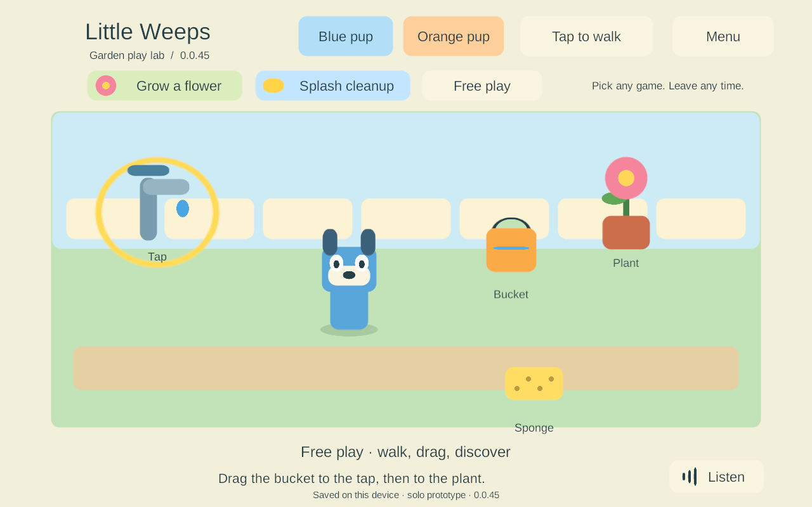
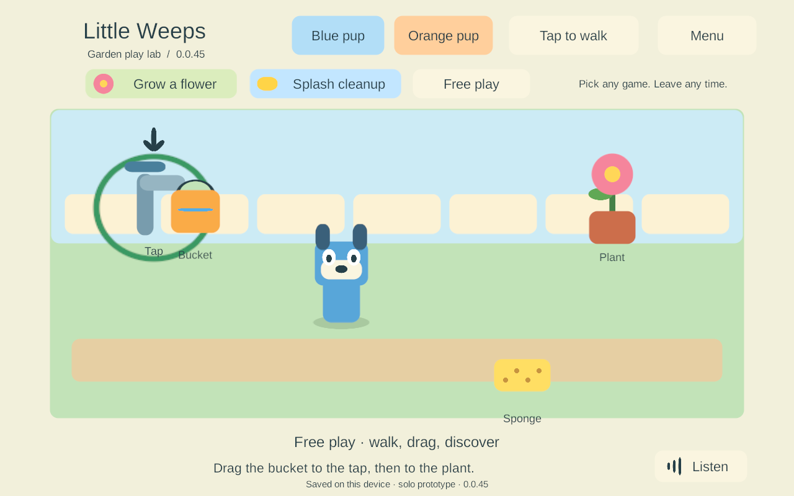

# G2 picture hints for existing garden interactions

> **Historical implementation record — current scope changed September 25.** PC/VPS is the sole shared authority; clients continue private solo if disconnected and load server state on rejoin. G4/AUTO-02 device hosting and automatic offline imports are removed. The dated results below remain evidence, but their old “next”, “required” and device-version statements are not the active plan. Use [current decisions](../current-decisions.md), the [build guide](../family-playset-build-guide-2026-09-23.html#18-current-work-record-and-research-basis) and the [current return checklist](return-checklist-ipad-lan-2026-09-24.html).

<!-- historical-record-start -->
24 September 2026. Bounded **ITEM-02 / ACT-01 / CLEAN-01** work: explain the existing drag interactions visually, including when speech is disabled. No new game area, network behavior or save schema was introduced.

## Behavior

Picking up a prop shows yellow rings around stations that can currently do something useful. An empty bucket suggests the tap; water in the bucket suggests a plant that still needs it; a sponge suggests a puddle with water remaining. A full bucket does not suggest refilling, and a watered plant or cleared puddle does not show a misleading success target.

Inside the existing drop radius, the ring becomes green and a picture arrow points down. The arrow makes the change distinguishable without relying only on color. Hints are static, do not block touches, do not move objects by themselves and disappear on drop, menu opening, focus loss or canceled gestures. They are advisory; the authority still validates all actions. No pointer, reservation or saved-world state is changed by asking for a hint.

These screenshots are from the local PC Android emulator, build 45. They are actual rendered prototype screens, not final game artwork or physical-device photos.

## Checks and builds

| Check | Observed result |
| --- | --- |
| Pure rules | **21 passed**. The new check compares suggested destinations with actual water/cleanup changes across all bucket and station amounts; querying must leave the snapshot unchanged. [Results](evidence/solo-hints-2026-09-24/rules.json) |
| Windows 43 input | Full virtual mouse drag and simultaneous touch tests passed at 1280×960. All three station rings were checked for correct active state, input transparency and the hovered arrow. Drop, menu interruption and canceled touches removed hints. [Input](evidence/solo-hints-2026-09-24/windows-input-43.json) |
| Settings update | Native **41 → 43** retained Voice off, Joystick, player/world identity and play state; toggling and replay still passed. [Settings](evidence/solo-hints-2026-09-24/settings-update-43.json) |
| Garden update/recovery | Separate **41 → 43** seeded garden update and corrupt-primary backup recovery passed. [Update](evidence/solo-hints-2026-09-24/garden-update-43.json), [recovery](evidence/solo-hints-2026-09-24/garden-recover-43.json) |
| iPad preparation | Non-development IL2CPP **export 44** inspected on Windows; 3,033 artifact hashes verified. Same iPhone/iPad identity, ARM64, landscape and iOS 15 minimum. **No native Xcode build, signature or install.** [Inspection](evidence/solo-hints-2026-09-24/ios-export-44.json) |
| Android emulator | Non-development IL2CPP ARM64 **45**, debug certificate for this isolated emulator only. Actual installed 30 bytes matched the prior artifact, signer matched, `install -r` preserved the exact complete save, and installed 45 bytes matched the fresh APK. The game launched and displayed the saved avatar, grown flower, bucket and cleaned puddle. [Runtime record](evidence/solo-hints-2026-09-24/android-runtime-45.json) |
| Android input/restart | A timed injected swipe visibly showed both hint states and filled the bucket. After Voice off, force-stop/reopen retained the entire updated checkpoint and the visible Voice off setting. [Preference after restart](evidence/solo-hints-2026-09-24/voice-after-restart.png) |

Build summaries and source/artifact manifests accompany the results. Windows preview: `Builds/WindowsSolo/G2-0.0.43`. Current iPad export: `Builds/iOSSolo/G2-0.0.44/Xcode`. Emulator-only APK: `Builds/AndroidSolo/G2-0.0.45/LittleWeepsSolo.apk`. Physical installations remain unchanged.

## Limits and next gate

The emulator uses Android 15/API 35, x86_64 and ARM64 translation with 16,384-byte pages. The same **six strict RELRO flags remain unresolved**; identity, signature, ZIP and ELF LOAD checks passed, but the full static gate did not. [Inspection](evidence/solo-hints-2026-09-24/android-inspection-45.json). Neither this run nor a translated emulator qualifies native ARM64 16 KB behavior.

The Android system and Bluetooth processes logged startup failures before the game's first launch; the emulator recovered and the scoped game checks completed afterward. [Timing context](evidence/solo-hints-2026-09-24/runtime-context.txt). This is not evidence of long-session or emulator-system stability. The app was closed, storage synced and only the owned emulator process stopped; its data remains available.

No Mac, iPad, iPhone or physical Android phone was accessed. The emulator ran without audio output. Human voice quality, physical touch, child comprehension and older-iPad performance remain open. Follow the [device checklist](g2-device-checklist.md) next, starting with iPad 9 and then iPad 7. Keep G1/G2 gates open and avoid producing more rooms before this interaction design receives device/child feedback.
<!-- historical-record-end -->
