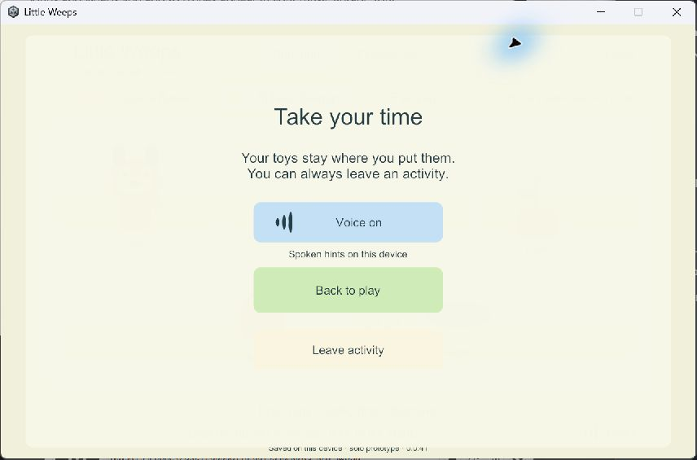

# G2 local voice preference and refreshed iPad export

> **Historical implementation record — current scope changed September 25.** PC/VPS is the sole shared authority; clients continue private solo if disconnected and load server state on rejoin. G4/AUTO-02 device hosting and automatic offline imports are removed. The dated results below remain evidence, but their old “next”, “required” and device-version statements are not the active plan. Use [current decisions](../current-decisions.md), the [build guide](../family-playset-build-guide-2026-09-23.html#18-current-work-record-and-research-basis) and the [current return checklist](return-checklist-ipad-lan-2026-09-24.html).

<!-- historical-record-start -->
24 September 2026. Bounded follow-up for the goal sheet's **controls, speech and device settings**, supporting ACT-01 and TRAVEL-01. G1/G2 device gates remain open.

## Behavior

The garden menu now has a large Voice on/off button with a sound picture and a crossed-out state. Voice starts enabled. Switching it off stops the current hint immediately and prevents activity, movement and Listen from starting another. Listen visibly becomes unavailable while voice is off. Reenabling voice waits for a new request; it does not replay an old hint.

Voice and movement preferences use device-local keys, separately from the world's checkpoint. A child's choice will not change another future client's audio. Windows tests have GUID-specific preference keys and save folders. No normal family preferences are changed by those tests. During separate visual inspection, voice was toggled and restored to its original on setting.

## Evidence

- Fresh non-development **Windows 41**: [build summary](evidence/solo-settings-2026-09-24/windows-41-build-summary.json), source and artifact manifests alongside it.
- Real Input System menu clicks, immediate stop, muted replay suppression, reenabling without stale autoplay and unchanged world state: [seed](evidence/solo-settings-2026-09-24/settings-seed.json).
- Full exit and reopening restored Voice off, Joystick, the same world/player, orange avatar and garden activity: [resume](evidence/solo-settings-2026-09-24/settings-resume.json).
- Full mouse/two-touch/OS-cancellation checks and layout bounds passed at [1280×960](evidence/solo-settings-2026-09-24/input-tablet.json) and [960×540](evidence/solo-settings-2026-09-24/input-small.json). Settings input/reopening also passed at [1920×900](evidence/solo-settings-2026-09-24/settings-wide.json).
- Existing garden progress survived **39 → 41** and a damaged-primary recovery: [update](evidence/solo-settings-2026-09-24/update-41.json), [recovery](evidence/solo-settings-2026-09-24/recover-41.json).
- [Hard-stop recovery](evidence/solo-settings-2026-09-24/crash-result.json) still passed. Blocked-load diagnostics now explicitly report Blocked with UTC, replacing build 39's misleading default Missing field: [locked-primary result](evidence/solo-settings-2026-09-24/blocked-primary.json).
- Windows-generated iPad/iPhone **Xcode export 42** includes the save-reader fix and voice preference. [Inspection](evidence/solo-settings-2026-09-24/ios-export-42.json) checked 3,032 artifact hashes, unchanged app identity, ARM64, landscape, iOS 15 minimum and generated core/client/adapter code. Output: `Builds/iOSSolo/G2-0.0.42/Xcode`.

Build 40's initial automated menu check failed because the newly reactivated graphics had not entered the raycast list in the same frame. The visible menu worked. The test now waits for the real button's raycast before injecting a click; build 41 passed. The failed run is retained under ignored LocalData, not counted as acceptance.

## Limits and repeat

The export is unsigned and has not been compiled in Xcode or installed. No Mac or physical phone/tablet was accessed. Speech tests ran with a muted AudioSource to avoid playing through the PC speakers. Human listening and child comprehension remain device checks. Full volume controls, final icons, Spanish, multiplayer and the complete settings screen are future work.

Run `Tools/Test-SoloPrototype.ps1 -BuildNumber N -SettingsOnly` on a fresh successful Windows build advertising verification contract 3. It creates isolated storage and checks native input plus full-process restart. The core suite remains at 20 passed tests; no pure world-rule changes were needed for this preference.
<!-- historical-record-end -->
