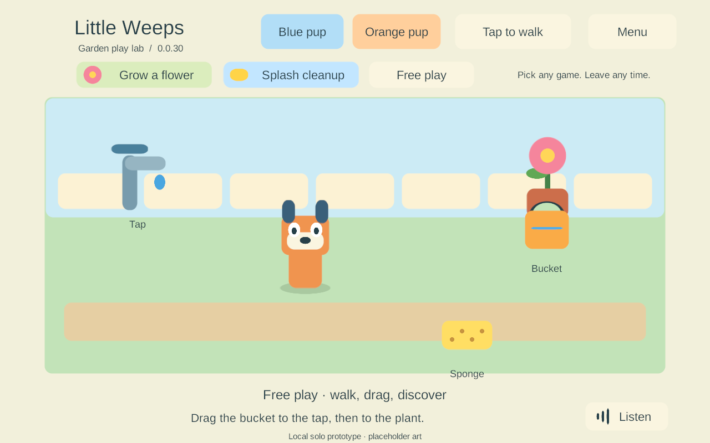

# G2 — solo interaction prototype

Updated 24 September 2026. Provisional work authorized by the user while the Mac and physical mobile devices are unavailable. G1 remains open; neither G1 nor G2 is declared passed.

## Play the current Windows prototype

Double-click **Play-SoloPrototype.cmd** at the project root. The verified preview is **0.0.35**. Play-Foundation.cmd still opens the separate G1 video/tap fixture, build 22. The launcher checks hashes before starting and prevents duplicate normal previews.

Click the ground to walk, or select Joystick. Drag the bucket onto the tap and then the plant. Drag the sponge over the puddle three times. Choose either pup at any time. Grow a flower and Splash cleanup are optional prompts; Free play and the menu let you leave without resetting the toys. Listen replays the current English hint.

The illustrations and narrator are placeholders. This one garden is a rules prototype, not the complete Heeler home, full game or multiplayer.

## Completed bounded task

Goal references: **CHAR-01, ITEM-02, ACT-01, CLEAN-01, TRAVEL-01**, movement/input and spoken prompts. These have partial implementation evidence; their full device/co-op/content acceptance remains pending.

- A Unity-independent C# authority owns the world. The UI submits commands with stable player/object IDs, request IDs and expected revisions. One prop has at most one holder; a player holds one prop. A bounded checkpointed receipt list remembers duplicate accepted commands. Snapshots are copies, not writable access to authority state.
- Both movement choices coexist with toy dragging. A second pointer cannot steal the active drag. Avatar changes retain player identity and the held toy. Menus, focus loss and canceled touches release the gesture without completing the pending interaction.
- The illustrated floor uses depth sorting; dragged props render on top. Water quantities, a growing flower and a shrinking puddle are rule results. Activities do not gate these interactions.
- Versioned checkpoints have SHA-256 integrity checks, bounded size, staged writes and a previous-good copy. Invalid originals are retained during recovery. Wholly corrupt or future-version saves stop rather than creating a replacement world. Transient holds are released on restore. This single-writer prototype is not the final shared-world journal or reconciliation system.
- Five bundled English WAV hints were generated locally with Windows Microsoft Zira Desktop. Replay replaces the previous hint; menu/focus/pause stops it. Build 35 has one active audio listener and passes playback/start/replace/stop checks with the test source muted. Human audio quality and child understanding remain untested.

## Acceptance evidence

| Check | Observed result | Evidence |
| --- | --- | --- |
| Core rules and save adapter | 16 tests passed, including 3,000 deterministic random actions; holder races, idempotent pour, stale/invalid commands, invalid snapshots, staged-write/checksum recovery and future-format preservation | [Rules](evidence/solo-prototype-2026-09-24/rules.json) |
| Full Unity Input System | Build 34 passed three consecutive fresh runs. Build 35 passed again with the audio fix: timed virtual mouse drag, simultaneous virtual joystick/toy touches, menu interruption and OS-style canceled touch | [Current input](evidence/solo-prototype-2026-09-24/windows-input-35.json); [34 run 1](evidence/solo-prototype-2026-09-24/windows-input-34-1.json), [run 2](evidence/solo-prototype-2026-09-24/windows-input-34-2.json), [run 3](evidence/solo-prototype-2026-09-24/windows-input-34-3.json) |
| Native Windows update/recovery | Seed on 29, resume on 35, then deliberately truncate only this run's isolated primary save. Same world/player, orange avatar, watered flower, empty bucket and cleaned puddle survived; backup recovery reported Recovered | [Seed](evidence/solo-prototype-2026-09-24/windows-seed-29.json), [update](evidence/solo-prototype-2026-09-24/windows-update-35.json), [recovery](evidence/solo-prototype-2026-09-24/windows-recover-35.json) |
| Rendered input | Windows 24/34 screens inspected and mouse avatar/prop clicks observed. Timed injected Android swipes filled, poured and cleaned in build 28. Fast Windows automation drags were unreliable and are not counted as human touch evidence | Screenshot above; raw records in ignored LocalData |
| Android emulator restart/update | Force-stop/reopen 28 retained the complete JSON snapshot. In-place 28 → 30 retained the complete snapshot, matching signing identity and installed APK bytes. Build 30 visibly rendered that state and accepted an avatar switch without changing toys or identity | [Installation](evidence/solo-prototype-2026-09-24/android-update-30.json), [runtime](evidence/solo-prototype-2026-09-24/android-runtime-30.json) |
| Android limits | Non-development IL2CPP ARM64, debug certificate for this isolated emulator only. Identity/signature, SDK/ABI and ZIP/ELF LOAD checks pass. The same six strict RELRO flags remain failed | [Unchanged strict findings](evidence/solo-prototype-2026-09-24/android-inspection-30.json) |
| Narration | Five valid clips. Build 35 additionally checks one listener, playback progress and replacement/stop. Build 30's audio was unqualified and lacked the listener subsequently fixed in 35 | [Clip metadata](evidence/solo-prototype-2026-09-24/narration.json), Windows 35 results above |

Build records and source/artifact manifests are in the same evidence directory. Outputs remain ignored under Builds/WindowsSolo and Builds/AndroidSolo. Failed attempts remain in LocalData/Verification, including Windows 31–33's disabled virtual pointer. Installed Input System source identified the background-device behavior; custom test-only layouts permit hidden-player input without changing the normal game's focus policy. Hidden-player screenshots were unreliable, so rendered evidence uses separate native observations and the emulator capture.

The emulator was **LittleWeeps_G1_API35_16KB**, Android 15/API 35 with 16,384-byte pages, x86_64 and libndk_translation.so. This is translated ARM64 execution, not native ARM64 16 KB qualification. No Mac or physical mobile device was accessed. The emulator was stopped after closing its app and syncing its filesystem; its data remains.

## Repeat the checks

With Unity saved and closed, use unused build numbers:

~~~powershell
.\Tools\Build-SoloPrototype.ps1 -BuildNumber N
.\Tools\Test-SoloPrototype.ps1 -BuildNumber N -InputOnly
.\Tools\Test-SoloPrototype.ps1 -BuildNumber N -UpdatedBuildNumber M
dotnet run --project Tools/SoloRules.Tests/SoloRules.Tests.csproj --configuration Release -- LocalData/Verification/new-rules-run
~~~

N and M are distinct, successfully built Windows versions. Each player test creates a GUID save namespace. Normal preview saves live under %USERPROFILE%\AppData\LocalLow\Little Weeps\Little Weeps\SoloPrototype\family-local; G1 preferences are separate. Android prototype files use the application's SoloPrototype/family-local directory. Tests never uninstall, clear data or touch the family's physical installations.

Core: Code/Core/SoloWorld.cs. Disk adapter: Code/Adapters/CheckpointStore.cs. UI/input/narration: Code/Client. Saved scene: Scenes/SoloPrototype.unity. These paths are under Unity/FamilyPlayset/Assets/FamilyPlayset. Tools/Create-SoloNarration.ps1 generates the temporary offline hints without playing them through the PC speakers.

## Current task and remaining gates

Layout follow-up completed on Windows build 36: all button/text rectangles, including the hidden menu, fit the actual viewport at **1280×960**, **1920×900** and **960×540**. Full mouse/two-touch/cancellation input checks and muted narration checks passed at each size. [Tablet](evidence/solo-prototype-2026-09-24/layout-tablet-36.json), [wide phone](evidence/solo-prototype-2026-09-24/layout-wide-36.json), [small landscape](evidence/solo-prototype-2026-09-24/layout-small-36.json). These are Windows window dimensions, not device safe-area or physical-touch qualification.

Next bounded Windows-only task: measure and reduce unnecessary snapshot allocations in the per-frame presentation path. Preserve the authority boundary and recheck saved play. Desktop allocation evidence will not be presented as older-iPad performance qualification.

G1 still needs older-iPad qualification, independent backup, native ARM64 16 KB investigation and mobile renewal/device checks. G2 needs actual-device gestures, audio quality and observation of both children. Spanish, final characters, full settings/world wheel, final rooms, network transport, pairing/discovery, iPad hosts, shared-world recovery, offline reunion and the remaining mini-games are not implemented. Do not batch-produce content or declare multiplayer ready from this prototype.
