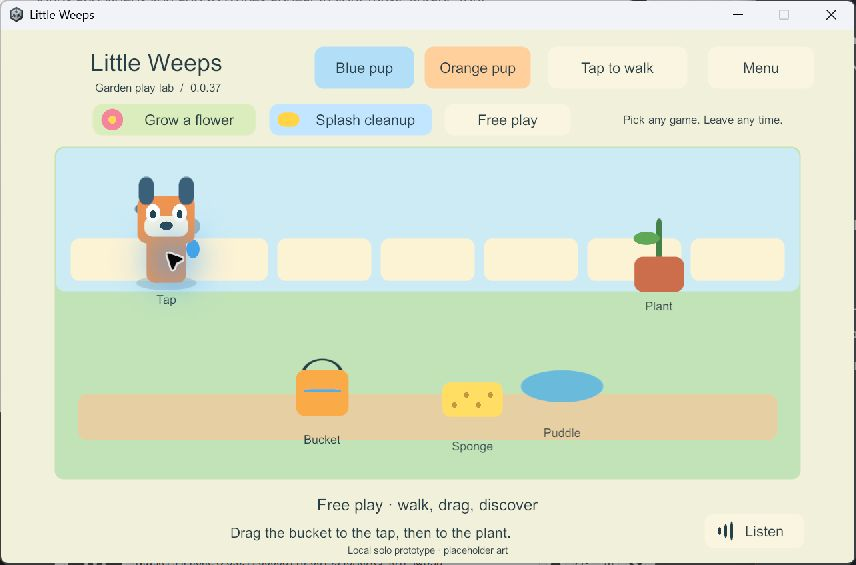

# G2 — solo interaction prototype

**Current-status pointer, September 24:** this file retains dated implementation history. Use the [main plan audit](../family-playset-build-guide-2026-09-23.html#19-implementation-audit-and-remaining-work) for the consolidated device/build ledger, all feature statuses and next task; earlier “next” and “unavailable” statements below belong to their recorded stage.

**Latest device follow-up:** garden 56 now also runs on **iPad 7 / iPadOS 18.7.10**. The user reported repeating the newer iPad's checks successfully with smooth play; an actual restart retained every save byte and recorded preference. Its installed-app inventory query still has a CoreDevice communication error. [Older iPad results and limits](ipad7-garden-2026-09-24.md). This does not close quantified performance, media, child usability, renewal or the complete G1/G2 gates.

Updated 24 September 2026. Provisional Windows work was authorized while the Mac and physical mobile devices were unavailable. The user has now returned: **solo garden 56 is installed on iPad 9**, physical layout/touch/voice, simultaneous joystick/drag, menu/screen-lock cancellation, remembered settings and offline solo checks passed; closing/reopening retained the exact complete garden save. [Current iPad record](ipad-garden-2026-09-24.md). Remaining physical/performance checks and child usability are still open; neither G1 nor G2 is declared passed.

## Play the current Windows prototype

Double-click **Play-SoloPrototype.cmd** at the project root. The verified preview is **0.0.55**, the same solo garden after the shared-presentation follow-up. Close an older preview first. Play-Foundation.cmd still opens the separate G1 video/tap fixture, build 22. The launcher checks hashes before starting and prevents duplicate normal previews.

Click the ground to walk, or select Joystick. Drag the bucket onto the tap and then the plant. A yellow ring marks useful destinations; a green ring and arrow show when a drop is in range. Drag the sponge over the puddle three times. Choose either pup at any time. Grow a flower and Splash cleanup are optional prompts; Free play and the menu let you leave without resetting the toys. Listen replays the current English hint. Menu → Voice on/off remembers speech on this device and stops it immediately when disabled.

The illustrations and narrator are placeholders. This one garden is a rules prototype, not the complete Heeler home, full game or multiplayer.

## Completed bounded task

Goal references: **CHAR-01, ITEM-02, ACT-01, CLEAN-01, TRAVEL-01**, movement/input and spoken prompts. These have partial implementation evidence; their full device/co-op/content acceptance remains pending.

- A Unity-independent C# authority owns the world. The UI submits commands with stable player/object IDs, request IDs and expected revisions. One prop has at most one holder; a player holds one prop. A bounded checkpointed receipt list remembers duplicate accepted commands. Snapshots are copies, not writable access to authority state.
- Both movement choices coexist with toy dragging. A second pointer cannot steal the active drag. Avatar changes retain player identity and the held toy. Menus, focus loss and canceled touches release the gesture without completing the pending interaction.
- The illustrated floor uses depth sorting; dragged props render on top. Water quantities, a growing flower and a shrinking puddle are rule results. Activities do not gate these interactions.
- Versioned checkpoints have SHA-256 integrity checks, bounded size, staged writes and a previous-good copy. Invalid originals are retained during recovery. Wholly corrupt or future-version saves stop rather than creating a replacement world. Transient holds are released on restore. This single-writer prototype is not the final shared-world journal or reconciliation system.
- Five bundled English WAV hints were generated locally with Windows Microsoft Zira Desktop. Replay replaces the previous hint; menu/focus/pause stops it. Build 35 has one active audio listener and passes playback/start/replace/stop checks with the test source muted. Human audio quality and child understanding remain untested.

## Acceptance evidence

| Check | Observed result | Evidence |
| --- | --- | --- |
| Core rules and save adapter | 16 tests passed, including 3,000 deterministic random actions; holder races, idempotent pour, stale/invalid commands, invalid snapshots, staged-write/checksum recovery and future-format preservation | [Rules](evidence/solo-prototype-2026-09-24/rules.json) |
| Full Unity Input System | Build 34 passed three consecutive fresh runs. Build 35 passed again with the audio fix: timed virtual mouse drag, simultaneous virtual joystick/toy touches, menu interruption and OS-style canceled touch | [Current input](evidence/solo-prototype-2026-09-24/windows-input-35.json); [34 run 1](evidence/solo-prototype-2026-09-24/windows-input-34-1.json), [run 2](evidence/solo-prototype-2026-09-24/windows-input-34-2.json), [run 3](evidence/solo-prototype-2026-09-24/windows-input-34-3.json) |
| Native Windows update/recovery | Seed on 29, resume on 35, then deliberately truncate only this run's isolated primary save. Same world/player, orange avatar, watered flower, empty bucket and cleaned puddle survived; backup recovery reported Recovered | [Seed](evidence/solo-prototype-2026-09-24/windows-seed-29.json), [update](evidence/solo-prototype-2026-09-24/windows-update-35.json), [recovery](evidence/solo-prototype-2026-09-24/windows-recover-35.json) |
| Rendered input | Windows 24/34 screens inspected and mouse avatar/prop clicks observed. Timed injected Android swipes filled, poured and cleaned in build 28. Fast Windows automation drags were unreliable and are not counted as human touch evidence | Screenshot above; raw records in ignored LocalData |
| Android emulator restart/update | Force-stop/reopen 28 retained the complete JSON snapshot. In-place 28 → 30 retained the complete snapshot, matching signing identity and installed APK bytes. Build 30 visibly rendered that state and accepted an avatar switch without changing toys or identity | [Installation](evidence/solo-prototype-2026-09-24/android-update-30.json), [runtime](evidence/solo-prototype-2026-09-24/android-runtime-30.json) |
| Android limits | Non-development IL2CPP ARM64, debug certificate for this isolated emulator only. Identity/signature, SDK/ABI and ZIP/ELF LOAD checks pass. The same six strict RELRO flags remain failed | [Unchanged strict findings](evidence/solo-prototype-2026-09-24/android-inspection-30.json) |
| Narration | Five valid clips. Build 35 additionally checks one listener, playback progress and replacement/stop. Build 30's audio was unqualified and lacked the listener subsequently fixed in 35 | [Clip metadata](evidence/solo-prototype-2026-09-24/narration.json), Windows 35 results above |

Build records and source/artifact manifests are in the same evidence directory. Outputs remain ignored under Builds/WindowsSolo and Builds/AndroidSolo. Failed attempts remain in LocalData/Verification, including Windows 31–33's disabled virtual pointer. Installed Input System source identified the background-device behavior; custom test-only layouts permit hidden-player input without changing the normal game's focus policy. Hidden-player screenshots were unreliable, so rendered evidence uses separate native observations and the emulator capture.

The emulator was **LittleWeeps_G1_API35_16KB**, Android 15/API 35 with 16,384-byte pages, x86_64 and libndk_translation.so. This is translated ARM64 execution, not native ARM64 16 KB qualification. No Mac or physical mobile device was accessed. The emulator was stopped after closing its app and syncing its filesystem; its data remains.

## Repeat the checks

With Unity saved and closed, use unused build numbers:

~~~powershell
.\Tools\Build-SoloPrototype.ps1 -BuildNumber N
.\Tools\Test-SoloPrototype.ps1 -BuildNumber N -InputOnly
.\Tools\Test-SoloPrototype.ps1 -BuildNumber N -UpdatedBuildNumber M
dotnet run --project Tools/SoloRules.Tests/SoloRules.Tests.csproj --configuration Release -- LocalData/Verification/new-rules-run
~~~

N and M are distinct, successfully built Windows versions. Each player test creates a GUID save namespace. Normal preview saves live under %USERPROFILE%\AppData\LocalLow\Little Weeps\Little Weeps\SoloPrototype\family-local; G1 preferences are separate. Android prototype files use the application's SoloPrototype/family-local directory. Tests never uninstall, clear data or touch the family's physical installations.

Core: Code/Core/SoloWorld.cs. Disk adapter: Code/Adapters/CheckpointStore.cs. UI/input/narration: Code/Client. Saved scene: Scenes/SoloPrototype.unity. These paths are under Unity/FamilyPlayset/Assets/FamilyPlayset. Tools/Create-SoloNarration.ps1 generates the temporary offline hints without playing them through the PC speakers.

## Current task and remaining gates

Latest Windows follow-up completed: a separate **shared garden 57** now uses this presentation with a PC server and two native Windows clients. Its 10 UI scenarios and build 54's 10 four-client transport scenarios passed; 30 core/save/session/queue tests pass. **Solo 55** passed full input and **49 → 55** save/update/recovery. Refreshed unsigned **iPad solo export 56** passed Windows inspection and supersedes 50. [Shared garden results and images](g3-shared-garden-2026-09-24.md). The normal solo save is separate; the shared preview does not yet connect physical devices or replace the G1/G2 gates.

Windows-only follow-up while the user is away: a separate provisional G3 **server/four-client loopback probe 48** passed shared-holder, late-join, identity, departure and explicit restart/rejoin checks; all **25** rules/save/session tests pass. The garden remains solo: regression build **49** passed tablet-shaped input and **43 → 49** save/update/recovery. Refreshed unsigned **iPad export 50** passed Windows inspection; it supersedes export 44 and still requires Mac compilation/signing and actual-device checks. [Network probe evidence and limits](g3-network-probe-2026-09-24.md). G1/G2 physical gates remain open; this is not permission to count G3 complete or remove required iPad hosting.

Earlier completed G2 task: **ITEM-02 / ACT-01 / CLEAN-01**, static picture hints for useful drop targets. **21 core tests passed**, Windows **43** passed native input/hint cancellation and **41 → 43** garden/settings update and recovery. Refreshed iPad **export 44** passed Windows inspection; local Android emulator **30 → 45** retained its exact complete save, rendered both hint states, filled the bucket and retained Voice off after force-stop/restart. [Picture-hint evidence and limitations](g2-picture-hints-2026-09-24.md). At that task, preview 43 and uncompiled iPad export 44 were current; the follow-up above supersedes them with 49 and 50. The next required gate is physical iPad/child acceptance, not additional rooms or broad multiplayer presentation.

Completed Windows-only speech/settings follow-up: **Windows 41**, remembered local voice choice, immediate stop, actual menu input, restart, three viewport layouts and 39 → 41 saved-play recovery passed. [Settings evidence](g2-settings-2026-09-24.md). Refreshed **iPad export 42** passed Windows inspection and supersedes export 38 for the next device task. It remains unsigned and uncompiled in Xcode. That follow-up completed in Windows 43 and emulator 45, recorded above.

Completed Windows-only follow-up: **ITEM-02 / TRAVEL-01**, [native crash recovery and unreadable-save barriers](g2-recovery-2026-09-24.md). Fixed a reproduced path-classification bug; all 20 core tests, native forced termination/reopen, blocked-file checks, 37 → 39 save/update/recovery and tablet-shaped input checks passed. Later exports 42 and 44 include this fix; native device testing remains pending.

Layout follow-up completed on Windows build 36: all button/text rectangles, including the hidden menu, fit the actual viewport at **1280×960**, **1920×900** and **960×540**. Full mouse/two-touch/cancellation input checks and muted narration checks passed at each size. [Tablet](evidence/solo-prototype-2026-09-24/layout-tablet-36.json), [wide phone](evidence/solo-prototype-2026-09-24/layout-wide-36.json), [small landscape](evidence/solo-prototype-2026-09-24/layout-small-36.json). These are Windows window dimensions, not device safe-area or physical-touch qualification.

Allocation follow-up completed on Windows build 37. Presentation now requests detached player/toy copies without copying the checkpoint's command history every update. All **18** core tests pass, including protection against view mutations. In a .NET 9.0.17 measurement of 1,000 reads with 128 receipts, idle player reads fell from **7,824,000 to 48,000 allocated bytes**, and render-state reads from **7,824,000 to 392,000 bytes**. This measures only the C# read path, not total frames, Unity rendering, battery use or iPad performance. [Measurement](evidence/solo-prototype-2026-09-24/presentation-allocations.json), [18 rules](evidence/solo-prototype-2026-09-24/rules-presentation.json). Full tablet-shaped input/narration/layout checks and the **35 → 37** save/update/recovery suite pass: [input](evidence/solo-prototype-2026-09-24/presentation-input-37.json), [update](evidence/solo-prototype-2026-09-24/presentation-update-37.json), [recovery](evidence/solo-prototype-2026-09-24/presentation-recover-37.json).

iPad preparation completed on Windows: saved **iPad Solo Prototype** Build Profile produced non-development IL2CPP Xcode export **38**, with zero build-summary errors/warnings. The independent inspection verified 3,032 artifact hashes, the original app ID, iPhone/iPad device targets, ARM64, minimum iOS 15.0, landscape orientation and generated current core/client/checkpoint C++ code. [Inspection](evidence/solo-prototype-2026-09-24/ios-export-38.json). Output: `Builds/iOSSolo/G2-0.0.38/Xcode`. This is unsigned source/export data, not an installable IPA or completed native build. No Mac was accessed. Existing G1 Mac helpers use a G1 path and must be adapted explicitly before using this G2 export.

Next device-dependent task: use the [G2 device checklist](g2-device-checklist.md) to compile/sign the prepared export, preserve the existing installation and test iPad 9 controls, narration and saved garden state. Qualify iPad 7 when available. Do not call G2 passed until those device/child checks have evidence. Windows-only follow-ups should remain small and avoid locking in content or multiplayer presentation before that feedback.

G1 still needs older-iPad qualification, independent backup, native ARM64 16 KB investigation and mobile renewal/device checks. G2 needs actual-device gestures, audio quality and observation of both children. Spanish, final characters, full settings/world wheel, final rooms, physical-device network clients, pairing/discovery, iPad hosts, shared-world recovery, offline reunion and the remaining mini-games are not implemented. The Windows shared garden exercises real transport and a playable interface; it does not finish these requirements. Do not batch-produce content or declare family multiplayer ready from this prototype.
