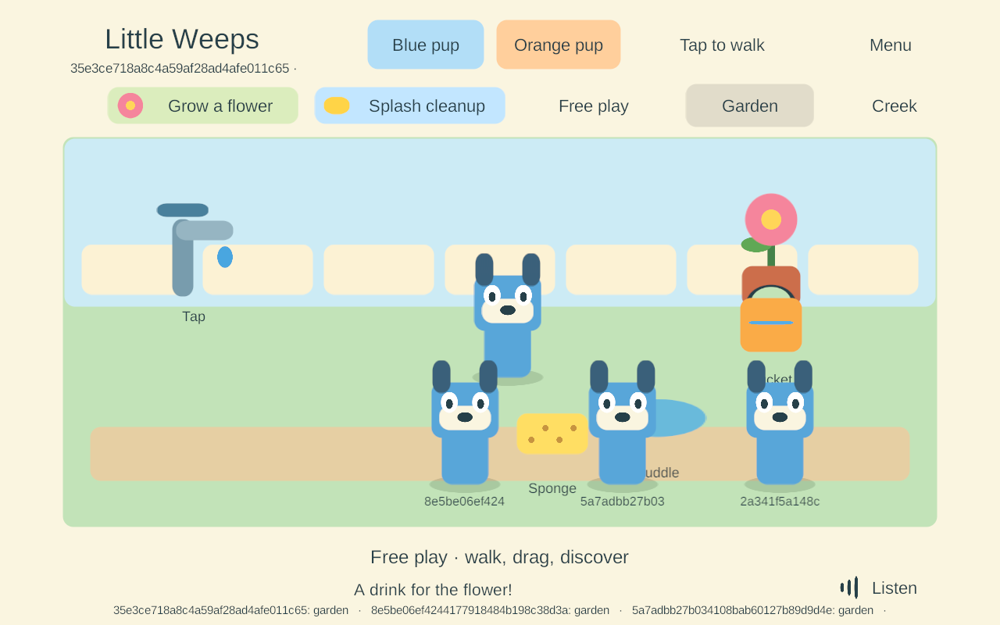
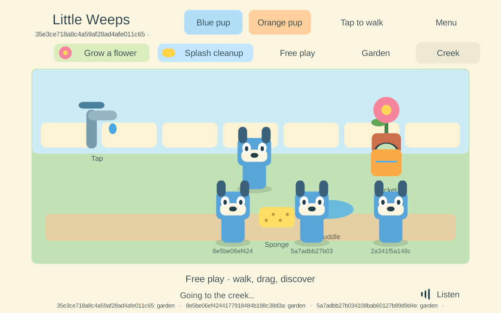

# G3 — Android automatic family connection

> **Historical implementation record — current scope changed September 25.** PC/VPS is the sole shared authority; clients continue private solo if disconnected and load server state on rejoin. G4/AUTO-02 device hosting and automatic offline imports are removed. The dated results below remain evidence, but their old “next”, “required” and device-version statements are not the active plan. Use [current decisions](../current-decisions.md), the [build guide](../family-playset-build-guide-2026-09-23.html#18-current-work-record-and-research-basis) and the [current return checklist](return-checklist-ipad-lan-2026-09-24.html).

<!-- historical-record-start -->
Goal IDs: **AUTO-01, JOIN-01, FAMILY-01, NET-02**, with WORLD-01/02 and ITEM-02 regressions. This is the next bounded G3 task from the build guide; G4 hosting and content production have not started.

**Result:** family-signed Android **78** automatically discovered and joined the actual Windows **77** PC server alongside three Windows players. Ordinary Android touch input moved the player, filled/poured the shared bucket and traveled between Garden and Creek. Backgrounding released its held item and left siblings playing; the same Android process automatically rejoined with current state. Force-stop/relaunch retained its protected pairing. These are **Android 15 emulator results**, not a pass on the Samsung or four physical mobile devices.

The iPads remain on solo **56**. Their prepared iOS candidate **74** and Mac signing helper are unchanged. The user-visible Windows **68** preview and saved family world were not replaced. [Return checklist](return-checklist-ipad-lan-2026-09-24.html).

## What changed

Android uses `NsdManager` through the existing discovery interface, browsing `_lw-playset._udp` for the enrolled authority and matching the same TXT format as Windows/iOS. The current API 34+ path uses a cancelable service-info callback; older Android uses a separate legacy resolver. Results are bounded and disposed browsers ignore late callbacks. IPv4 endpoints are qualified here. An interface index is recorded, but explicit multi-network socket routing and IPv6 remain open. Android documents NSD as a cross-platform DNS-SD facility and recommends stopping discovery when an activity pauses. [Android NSD guidance](https://developer.android.com/develop/connectivity/wifi/use-nsd), [service-info callbacks](https://developer.android.com/reference/android/net/nsd/NsdManager.ServiceInfoCallback).

Discovery still grants no trust. The client uses the enrolled CA/server name and its own player credential inside the existing DTLS connection. The native credential vault encrypts the client record with AES-256-GCM using an app-owned Android Keystore key. Ciphertext is stored atomically in private `getNoBackupFilesDir()` storage. The vault accepts an identical enrollment retry, refuses another player's replacement, and preserves damaged storage for parent review instead of resetting identity. Android Keystore controls key access; this emulator does not establish hardware-backed protection on the Samsung. [Android Keystore](https://developer.android.com/privacy-and-security/keystore), [private no-backup storage](https://developer.android.com/reference/android/content/Context#getNoBackupFilesDir()).

The development enrollment tool checks the **exact installed family-signed APK**, then sends only the selected player's credential through ADB standard input. It never prints that credential or writes it as plaintext on Windows. On next launch, the app validates the inbox, stores it under Keystore protection, and deletes the inbox only after success. Compiled backup/device-transfer rules exclude the temporary inbox. This uses an already authorized debugging connection; the finished parent pairing/revocation screen is still pending.

The Android profile builds a non-development ARM64 IL2CPP release, min API 26 / target API 36, with the existing package and family signing identity. API 36 uses `INTERNET` for local access; this build does not add Bluetooth, location, nearby-device or API 37 permissions. A target-37 upgrade must add and qualify the appropriate parent permission flow. Denied/failed discovery currently leaves solo available without repeating permission prompts. [Android local-network permission guidance](https://developer.android.com/privacy-and-security/local-network-permission).

Android now uses the same mobile foreground/reconnect path and device preferences as iOS. Desktop control files are not active on either mobile platform. Unpaired launch uses the existing solo save; paired server-absent launch uses a separate offline branch. **Continuous joining from that initial offline branch, prolonged-outage shared-to-solo transition and offline merging remain unimplemented.**

## Acceptance evidence

| Check | Actual result |
| --- | --- |
| Native storage/discovery | **24 passed** using the exact production Java sources in an isolated instrumentation package: persistence across processes, identical retry, replacement refusal, six malformed/server inputs, ciphertext storage, corruption protection, inbox handling, three browse/dispose cycles, family/protocol rejection and resolution of the **actual Windows advertisement**. [Result](evidence/android-lan-2026-09-24/native-24.json). |
| Signed release build | Android 78: Unity 6000.3.24f1, zero Unity errors/warnings, release IL2CPP ARM64. Existing family key verified; all 401 payload entries unchanged by external signing. [Build](evidence/android-lan-2026-09-24/build-78.json), [signing](evidence/android-lan-2026-09-24/signing-78.json), [APK hash](evidence/android-lan-2026-09-24/artifact-78.json), [compiled backup rules](evidence/android-lan-2026-09-24/backup-rules-78.json). |
| Android + three Windows clients | **Seven checks passed**: automatic encrypted join, touch movement visible to peers, bucket fill/pour, independent travel, siblings continuing through Android backgrounding, same-process foreground rejoin, cold process restart with pairing/save retention. The APK was pulled/read back and hash-matched. No endpoint override, relay, embedded test credential or Android game debug hook was used. [Results](evidence/android-lan-2026-09-24/shared-7.json), [connection](evidence/android-lan-2026-09-24/connection-78.json). |
| Held-item and offline follow-up | Real Android Home/background released the held bucket while three peers stayed connected. After intentionally stopping only the test server, cold launch reached solo; touch movement saved its separate branch and left the old solo save unchanged. [Result](evidence/android-lan-2026-09-24/offline-78.json). |
| In-place update | Signed 76 → 77 preserved the seeded solo save byte-for-byte; 77 → 78 retained enrollment and the original solo save and joined the server. [Update](evidence/android-lan-2026-09-24/update-76-77.json), [78 admission](evidence/android-lan-2026-09-24/cross-platform-78.json). |
| Windows regression | Windows 77: all **11 encrypted LAN/admission/fallback** cases and all **seven four-client reconnect** cases passed. [LAN](evidence/android-lan-2026-09-24/lan-77.json), [reconnect](evidence/android-lan-2026-09-24/reconnect-77.json). |
| Source provenance | Production C#/Java/Objective-C++/assembly-definition files match the Android 78 build manifest. Tools and docs were expanded afterward; generated Unity whitespace was normalized. [Review](evidence/android-lan-2026-09-24/source-review-78.json), [source manifest](evidence/android-lan-2026-09-24/source-78.json). |

## Corrections made during qualification

- Build 75 compiled but displayed an empty scene because the shared-client assembly excluded Android. Android was added and the build now rejects a missing player assembly. **75 is not a usable candidate.**
- The initial native fixture and adapter used `schema` as the TXT key, while the established Windows/iOS wire format uses `v`. Their isolated fixture passed, but real PC discovery did not. The adapter/fixture were corrected and an independent actual-Windows-advertisement check was added. **77 is superseded for Android; 78 is the qualified candidate.**
- A temporary emulator relay experiment failed registration and was removed. Successful final gameplay used direct native discovery and the actual encrypted PC connection. No relay code ships in the game or test package.
- Provisioning's installed-APK path validation was corrected to accept Android's generated `~~` directories. The initial rejection transferred no credential.

These observations are retained to distinguish native fixture checks, release gameplay and physical-device qualification. The emulator had an Android system restart during its initial setup before these game checks; historical system-process errors are not reported as current game crashes. The final game process stayed running through the bounded acceptance checks; this is not a long-session stability claim.

## Still required

1. Finish local Mac signing of **iPad 74**, back up/update/enroll both iPads and perform their actual permission, touch and lifecycle checks.
2. Update the real Samsung in place with its original family identity, verify old foundation data retention, enroll it as the third player, then add the iPhone as the fourth. Validate phone safe areas, Wi-Fi/cellular routing, permission restrictions and sustained performance. The legacy API 26–33 discovery path remains untested.
3. Complete initial offline-to-shared joining and safe extended-outage solo transitions. Parent setup/replacement/revocation/certificate renewal remains open. This PC launcher is still a development harness, not an installed Windows service.
4. G4 still requires **both iPads hosting**, full recovery checkpoints, handoff and abrupt-loss/returning-host convergence. G5 still owns rooms, item returns and safe branch reconciliation.

The new isolated emulator lives in `LocalData/AndroidAVD/LittleWeeps_G3_AndroidLAN.avd`. It reports API 35 and 16,384-byte pages but executes this ARM64 app through translation on x86_64. That does not qualify native ARM64 16 KB behavior or Samsung performance. No existing AVD, physical device, Mac installation, firewall rule or family save was changed.

## Reproduce

Use a fresh build number with `Tools/Build-AndroidLAN.ps1 -BuildNumber N`; it builds and signs an unchanged release payload with the pinned family key. The development enrollment helper is `Tools/Enroll-AndroidFamily.py --serial DEVICE --family WORLD --player 3 --build N` after installing and launching the unpaired app. It refuses an established or unresolved enrollment.

`Tools/Test-AndroidFamilyBridge.py --serial emulator-5580 --family WORLD` compiles the actual Java sources into an isolated test APK and checks the current Windows advertisement. `Tools/Test-AndroidSharedSession.py` checks an already prepared isolated family/emulator; its documented preconditions include three Windows peers and the 1280×800 viewport. Neither tool is a substitute for the physical-device checklist.
<!-- historical-record-end -->
