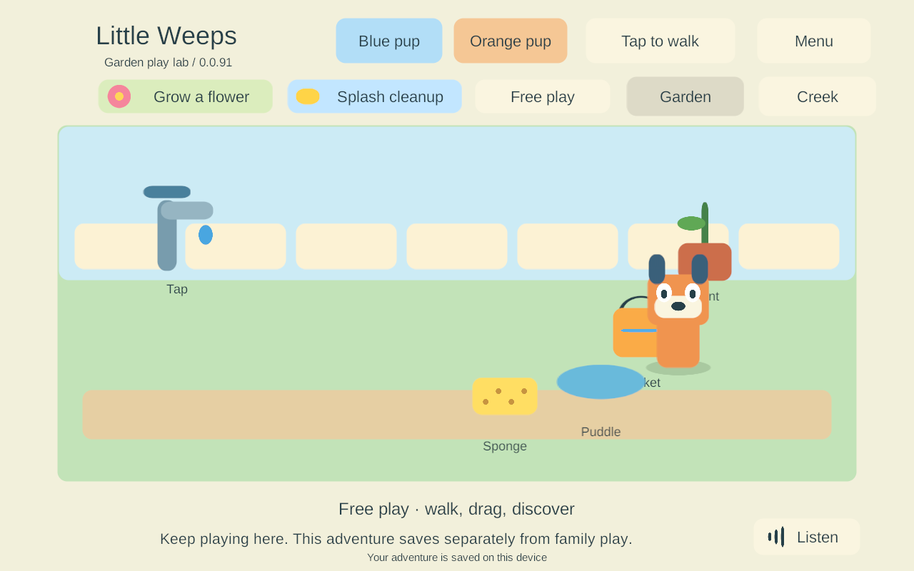

# Android release recovery in the project emulator

> **Historical implementation record — current scope changed September 25.** PC/VPS is the sole shared authority; clients continue private solo if disconnected and load server state on rejoin. G4/AUTO-02 device hosting and automatic offline imports are removed. The dated results below remain evidence, but their old “next”, “required” and device-version statements are not the active plan. Use [current decisions](../current-decisions.md), the [build guide](../family-playset-build-guide-2026-09-23.html#18-current-work-record-and-research-basis) and the [current return checklist](return-checklist-ipad-lan-2026-09-24.html).

<!-- historical-record-start -->
**G3-REC-06 · FAMILY-01 / NET-02 / AUTO-01 · September 25, 2026 · build 91.**

This is independent Windows work while G3-REC-05 waits for the Mac and iPads. It tests the prepared Android release in the retained project-owned emulator with an isolated PC authority and three Windows siblings. No Mac, phone, iPad or live-family server is updated. The research still requires four mixed devices, independent activities, full offline play and eventual iPad hosting/reconciliation; this task supplies one additional bounded recovery proof.

## Update and environment

The existing `LittleWeeps_G3_AndroidLAN` AVD was cold-booted with its data retained. Its installed family-signed build 79 was verified before updating to the exact prepared **91** release with `adb install -r`. Both installed/new signing fingerprints match the pinned family certificate; the installed new APK was read back and its SHA-256 matches `1e8f7af73d04dcd35eb3dd8fdd6f5527d26e101bec9165c5bd7de1f79eceef4f`.

Both original and paired solo saves, including their backups, remained byte-identical across installation. Externally accessible test app files and the prior installed APK were backed up under ignored `LocalData/Verification` before updating. Keystore contents were not exported or replaced. Runtime then reported build 91, retained its enrolled test profile, automatically discovered the isolated server and stored a durable recovery checkpoint.

The environment is **Android 15 / API 35, 1280×800, 16,384-byte pages, x86_64 with `libndk_translation.so` running the ARM64 APK**. This is not native ARM64 hardware. The existing failed strict RELRO static result remains unchanged. Emulator touch injection cannot qualify physical multitouch feel, audible speech or sustained A10 performance.

## Runtime acceptance

**All six release runtime groups passed.** The suite exercises ordinary ADB touch/Home/launch input; no verification hooks, replacement pairing or test credentials are added to the Android app. Three Windows clients use the existing isolated test harness. Only the retained Android test world's authority can be intentionally terminated.

| Accepted emulator scenario | Result |
| --- | --- |
| In-place update and original player identity | Exact signed 79 → 91 artifact update; all four old save/backup files retained; original Keystore enrollment rejoined without reenrollment. |
| Four-player checkpoint and shared input | Android walking/dragging reached the authority; three Windows siblings remained connected. The durable replica contained both areas, four players, 128 receipts and an active item-return timer. |
| Real Android Home/foreground | Same process resumed automatically; siblings kept changing the world; the resumed checkpoint contained those changes. |
| Abrupt isolated server loss | Local adventure opened automatically, stale held objects were released, and ordinary drag input saved a new bucket position. |
| Force-stop and cold offline launch | Same adventure reopened with the moved bucket; a new touch change saved into that adventure, proving the reopened scene was using it. |
| Menu-safe reunion and saved work | An open menu delayed shared presentation. Joining retained the local adventure separately; its menu entry and original-solo entry worked while siblings continued. |
| Repeated outage | A later outage created another adventure from the newer authority; the first adventure remained byte-identical. |

The table includes the separate installation check; the runtime suite groups these into six cases. In the final run the recorded replica was **23,264 bytes**, with **128 receipts and 1 active timer(s)**. Local continuation was observed **12.359 seconds** after intentional termination. These are individual emulator observations, not latency promises or physical-device performance measurements.

[Installation/retained-data record](evidence/android-recovery-2026-09-25/update-79-to-91.json) · [Six runtime groups](evidence/android-recovery-2026-09-25/runtime-91.json) · [Source/artifact provenance](evidence/android-recovery-2026-09-25/source-provenance.json) · [Final-process log inspection](evidence/android-recovery-2026-09-25/log-inspection.json).

The final process log contained none of the checked fatal-exception, native-signal, out-of-memory or ANR patterns. This does not establish all-process or sustained crash-free operation. Test screenshots and durable files independently show the retained placement and active local scene.

Two initial setup failures were corrected before the complete pass: input delivery was mistakenly counted as authoritative completion, and the historical emulator fixture lacked the newer isolated-test purpose marker. The harness now waits for confirmed actions and explicitly identifies the retained test AVD/world/history before using the existing isolated controller path. Production parent startup/network checks and firewall settings are unchanged. [Initial attempts](evidence/android-recovery-2026-09-25/initial-attempts.json).

All 148 qualified Unity C# files and the prepared APK are unchanged. This milestone adds repeatable emulator tooling and acceptance evidence; it does not introduce new game behavior or claim a physical-device release.

## What remains on the family-device checklist

- Native Mac compilation/signing of the prepared iOS 91 export, followed by an in-place older-iPad update and actual recovery checks. The newer iPad and phones follow.
- Real mobile lock/suspension behavior, physical input/audio, four-device lifecycle/ownership/travel and sustained frame-time/memory measurements.
- Native ARM64 16 KB qualification and the existing static RELRO concern; this emulator cannot close either by itself.
- Qualified server deployment during an empty family session; recovery activation, unattended iPad renewal and an actual independent backup/second-account restore.
- G4 iPad hosting and automatic host recovery, G5 reconciliation/rooms/item policy, then representative finished content. Preserving a separate local adventure is not automatic merging.

No extra user action is needed while away. [Return checklist](return-checklist-ipad-lan-2026-09-24.html) · [Current plan](../family-playset-build-guide-2026-09-23.html#18-current-work-record-and-research-basis) · [Prepared mobile artifact evidence](g3-mobile-recovery-builds-2026-09-25.html).
<!-- historical-record-end -->
