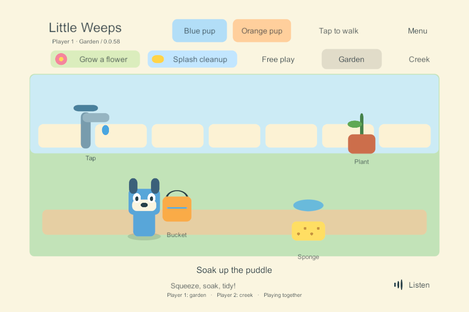
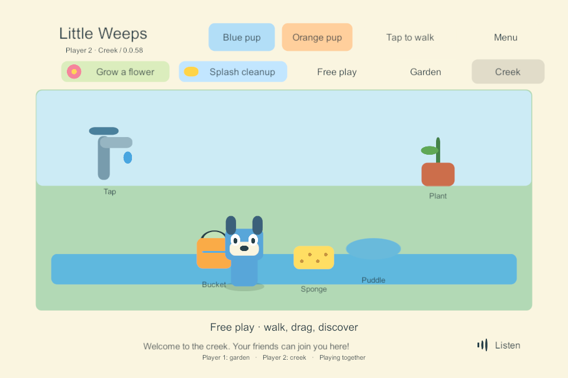

# G3 — independent areas

24 September 2026. Implemented bounded task: **WORLD-01, WORLD-02 and ITEM-02**. Windows shared build **58** adds two independently visited test areas (Garden and Creek). Existing shared saves, local solo behavior and another player's interaction are preserved. This is an incremental proof within goal-sheet sections 50–51, not completion of their entire acceptance matrix or G3.

## Behavior and design

Each player has one authoritative area and an increasing visit number. Garden/Creek buttons change only that player's membership, entrance position and activity. The other player's view, hold and activity remain intact. The small prototype keeps both presentations available locally, so it does not yet exercise asynchronous scene/asset loading. A presence line shows where connected family members are, while detailed toy and avatar rendering is restricted to the viewer's area.

Commands capture area and visit when input is queued. A delayed action from a prior visit stays invalid after returning to the same area, even if its global revision is updated during a retry. Pickup and drop also check the item's and target's area. Travel receipts remain idempotent. The latest destination selected while a transition is pending wins; input pauses only for that traveler while pointer cancellation and the accepted transition settle.

The ten authored test props have stable IDs: the five original garden IDs stay unchanged, plus five separately identified creek props. They are not respawned when a player enters. These buckets/sponges are **essential station tools**: an uncommitted drag is canceled before UI travel. A direct authoritative travel while holding one settles it at that area's rack, preserving its contents and clearing its lease. Another player's hold is unaffected. This does **not** implement a portable spare bucket or the later automatic idle-return system.

Shared save schema 2 is an explicit, once-only upgrade from the existing schema-1 garden: it preserves world ID, players, original toys, contents, activity and durable receipts, then adds the creek's initial props. Protocol/content version 2 rejects old clients. Normal solo play stays schema 1 in its existing separate storage; Windows solo **59** was rebuilt and checked for regression. The installed native iPad solo **56** was not changed.

## Executed checks

| Check | Evidence and result |
| --- | --- |
| Rules, saves, command queue and admission | **36 passed**, including six new area/migration cases. [Results](evidence/independent-areas-2026-09-24/rules-36.json) |
| Four native Windows players with real UGUI/Input System input | **8 area scenarios passed**: separation while another holds/uses a sponge; remote/invalid access rejected; arrival sees current held/filled bucket; second-finger travel before pickup acknowledgement; obsolete visit rejection; four split/gather and empty-room retention; latest travel choice; departure/rejoin and complete restart restoration. [Results](evidence/independent-areas-2026-09-24/areas-58.json) |
| Existing garden controls | **10 UI scenarios passed** on 58, including multitouch, cancellation, contention and stopped-server behavior. [Results](evidence/independent-areas-2026-09-24/garden-ui-58.json) |
| Existing four-client network checks | All **10 passed in the final run** on 58. Earlier reconnect stalls remain an unresolved reliability diagnostic below. [Passing run](evidence/independent-areas-2026-09-24/network-58.json) |
| Old shared world | Native **57 → 58** upgrade preserved all original progress/receipts; a second restart retained the exact expanded world without a second migration. [Upgrade](evidence/independent-areas-2026-09-24/upgrade-57-to-58.json) |
| Saved preview route | Reopened the complete settled world and both profiles exactly. [Resume](evidence/independent-areas-2026-09-24/preview-resume-58.json) |
| Normal solo regression | **59** passed full synthetic mouse/touch input at **1280 × 960**; **55 → 59** saved-progress update and damaged-primary recovery passed. [Input](evidence/independent-areas-2026-09-24/solo-input-59.json), [update](evidence/independent-areas-2026-09-24/solo-update-55-to-59.json), [recovery](evidence/independent-areas-2026-09-24/solo-recovery-59.json) |
| Native Windows build outputs | Server/client **58** and solo **59** built with zero summary errors/warnings. [Shared build](evidence/independent-areas-2026-09-24/shared-build-58.json), [solo build](evidence/independent-areas-2026-09-24/solo-build-59.json). Source manifests and harness hashes are retained alongside these results. |

The snapshots below are renders of the actual native UGUI canvases during the separated-player test. They are not pictures from an iPad or a finished art pass.

## Open reliability finding and next task

Three earlier runs of the legacy headless networking suite on 58 timed out waiting for a returning client's initial snapshot after its prior process was killed. The same check also failed on the unchanged **54** binary. A later complete run on 58 passed with no networking code fix. The separate native UI suites also passed departure/rejoin. **The intermittent stall is not resolved, and neither an engine bug nor a test-harness cause has been proven.** [Failed runs and scope](evidence/independent-areas-2026-09-24/open-reconnect-diagnostic.json). The old network report has a legacy `independentAreasImplemented: false` field; that suite does not exercise travel. The dedicated area result above is the evidence for this implementation, and future legacy reports use the clearer `independentAreasExercised` label.

Next bounded task: instrument and reproduce the intermittent initial join/rejoin stall, distinguish transport connection from admitted profile and received snapshot, then qualify a bounded recovery path before LAN/device multiplayer. Preserve the current functional area checks. Required iPad hosting, automatic discovery/joining and host switching remain in the plan.

## Preview and repeatable checks

`Play-SharedGarden.cmd` opens shared **58**, using the existing separate preview world; **Garden** and **Creek** are at the top of each window. Different areas show only that area's characters and props. Choose the same area to meet. `Play-SoloPrototype.cmd` selects verified solo **59**. The user's shared world was backed up before changing the preview selection; the installed iPad apps stay at 56.

The interactive launcher opened the existing user preview with server/client build 58. Both clients agreed with the server; original player and toy state matched the pre-upgrade backup. The two windows were left open for the user. [Preview update evidence](evidence/independent-areas-2026-09-24/interactive-preview-upgrade.json).

~~~powershell
dotnet run --project Tools/SoloRules.Tests/SoloRules.Tests.csproj --configuration Release -- LocalData/Verification/new-area-rules-run
python Tools/Test-IndependentAreas.py 58
python Tools/Test-SharedGarden.py 58
python Tools/Test-NetworkProbe.py 58
python Tools/Test-AreaUpgrade.py 58
.\Tools\Test-SoloPrototype.ps1 -BuildNumber 59 -InputOnly -Width 1280 -Height 960
.\Tools\Test-SoloPrototype.ps1 -BuildNumber 55 -UpdatedBuildNumber 59
~~~

Scope remains explicit: placeholder test areas, existing water/cleanup activities, full small-world snapshots and loopback Windows networking. Portable borrowed props, six authored worlds, asset streaming/interest management, iPad-host recovery, LAN discovery and physical multiplayer qualification remain later tasks. Installed iPad build 56 is unchanged.
