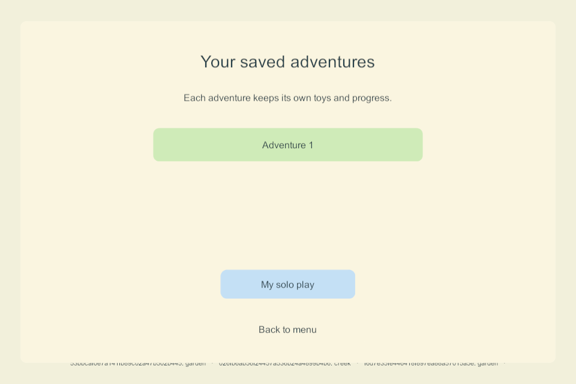

# Automatic local continuation and saved adventures

**G3-REC-02 · NET-02 / AUTO-01 · September 25, 2026 · Windows build 90.** The prototype now continues locally after a prolonged server loss using its last verified complete checkpoint. Each outage creates a separate saved adventure. Rejoining family play preserves that adventure and the older solo save. This is a Windows qualification milestone; the live family server and phones/tablets were not updated.

## Behavior implemented

- After **ten observed foreground seconds disconnected**, a paired client with a valid recovery checkpoint switches to a local adventure at a safe input boundary. Transport loss detection adds time before this clock starts; background time is not counted. This is a custom prototype threshold, not a zero-delay guarantee.
- The adventure contains both current prototype areas, all four profiles, the retained receipts and idle clocks. It has a new world/branch ID and an immutable copy of its common shared checkpoint. The selected child's profile and location are retained. Temporary item holds are released, absent players are not drawn, and local walking, dragging, watering/cleanup, timers and area travel use the existing rules.
- The older paired solo draft is separate. The shared replica, adventure files and selected-adventure pointer also have separate paths. Save writes are checksummed, staged and read back; failed writes do not silently open an empty replacement. A new install without a checkpoint keeps ordinary solo play available.
- Cold launch resumes a selected adventure, including after an app crash while holding a toy. Restart releases the crashed pointer's hold before play resumes. Multiple outages retain distinct adventure files; there is no automatic history deletion.
- Discovery continues during automatic continuation. Rejoining waits for the current gesture to finish and the local save to succeed, then displays the server's authoritative world. It never uploads a whole local snapshot over the family world. **Menu → Saved adventures** can reopen the preserved work; **My solo play** restores the original solo draft. Deliberately opening saved play stops automatic joining for that session until **Find my family** is chosen.
- Unsettled queued commands are exported with their original request IDs into a separate local interrupted-action archive before the queue is cleared. They are unresolved intentions, not accepted events, and are never automatically replayed. The queue's copy/no-replay behavior is unit-tested; deliberate lost-ack/native archive failure scenarios remain in the next qualification task.

This implements a safe subset of the goal sheet's outage/reunion design in sections 35 and 45. Automatic joining with preserved, reopenable work is present. Importing compatible edits, resolving conflicting creations, bounded reunion during continuous input, an accepted-event tail, NPC role substitution and both iPads hosting remain required work. The saved-adventure menu uses prototype text; picture/voice navigation and child usability belong to G2/G6.

## Evidence

| Check | Result and scope |
| --- | --- |
| [Fresh Windows 90 server/client builds](evidence/local-continuation-2026-09-25/build-90.json) | Unity 6000.3.24f1; zero build errors or warnings. [All current Unity C# sources match the compiled source manifest](evidence/local-continuation-2026-09-25/source-provenance.json). No package upgrade. |
| [67 core/storage checks](evidence/local-continuation-2026-09-25/rules.json) | Includes eight new groups for foreground outage timing, immutable bases, stale holds, branch selection/restart, separate histories, identity/rollback refusal, disk denial, corrupt/future formats and unresolved command identity. |
| [Six native continuation groups](evidence/local-continuation-2026-09-25/native-90.json) | Four enrolled DTLS clients, first launch without server/checkpoint, authority crash, independent local worlds, non-first-profile interactions and travel, client crash with held toy, restart, gesture-safe reunion, saved-work menu, original solo access and a second outage. All four entered local play in one observed **12.703 seconds after authority termination**, including detection and sequential harness observation. This is one desktop observation, not a mobile timing budget or percentile. |
| [Four staggered-version combinations](evidence/local-continuation-2026-09-25/compatibility-90.json) | 90/79, 79/90, 90/83 and 83/90 server/client admission, pickup/fill and shared views pass. Legacy peers do not negotiate recovery checkpoints. |
| [Four-player native movement](evidence/local-continuation-2026-09-25/motion-90.json) | Receipt-stressed recovery traffic remains active. Remote moving-frame fraction 1.0; median 16.65 ms; p95 visual speed 240.34 against the existing <420 threshold; p95 delay behind received positions 0.212 seconds against <0.4. Desktop loopback, not physical Wi-Fi or A10 performance. |
| [Server backup/restore regression](evidence/local-continuation-2026-09-25/server-recovery-90.json) | Isolated live backup, exact restore/rollback, invalid archive refusal, interrupted-recovery protection, damaged-primary repair and missing-directory reconstruction. The qualified source-build ceiling is 90; this does not activate a deployment. |
| [Deployment scope](evidence/local-continuation-2026-09-25/deployment-scope.json) | Actual family authority remains its original build 83 process. Parent page target remains 85 with automatic recovery Off. No Mac, phone or iPad was accessed. |

The early native harness required an exact float match for a screen-to-world drop and attempted a pickup before its delayed test travel acknowledgment settled. Those harness errors were corrected with a positional tolerance and the actual pending-operation boundary. Build 89 then passed; final 90 includes the reviewed malformed-selection fallback and adds the held-toy crash and repeated-outage checks. Failed test worlds remain separate from family data.

## Limits and next task

Only completed recovery checkpoints are used; a recently rendered or accepted action may not yet be replicated. Retained command intentions are not a complete event journal or automatic conflict solution. Disk-full/access-denial behavior at native transition time, admission rejection, sustained packet loss and individual-client network partitions need further qualification. Deliberately using a saved adventure stays local until finding family again; a fresh app launch resumes it while seeking the server normally.

No Apple/Android recovery build is installed. The ten-minute earlier soak was on 85, not this new continuation flow. Mobile atomic storage, A10 frame/write costs and real lifecycle behavior still require native builds and device checks. iPad hosting/election/handoff and G5 reconciliation remain mandatory; G1/G2/G3 are still partial.

**Next bounded task: G3-REC-03 — outage failure matrix.** Qualify native lost acknowledgments/archived intentions, denied branch/selection writes, background/foreground timing and rejected admission without erasing saved work or replaying actions. Then prepare coordinated mobile recovery builds and complete physical qualification. Existing parent activation, independent backup, renewal and VPS tasks remain in the ordered guide.

[Main build guide](../family-playset-build-guide-2026-09-23.html#18-current-work-record-and-research-basis) · [Return checklist](return-checklist-ipad-lan-2026-09-24.html)
