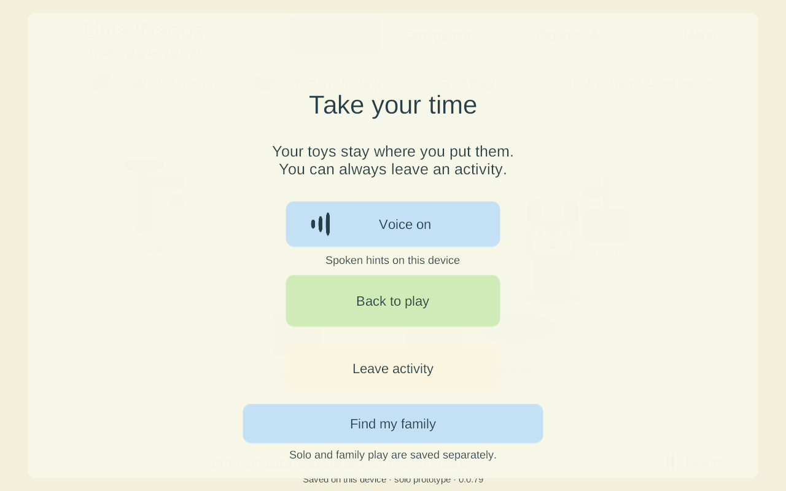
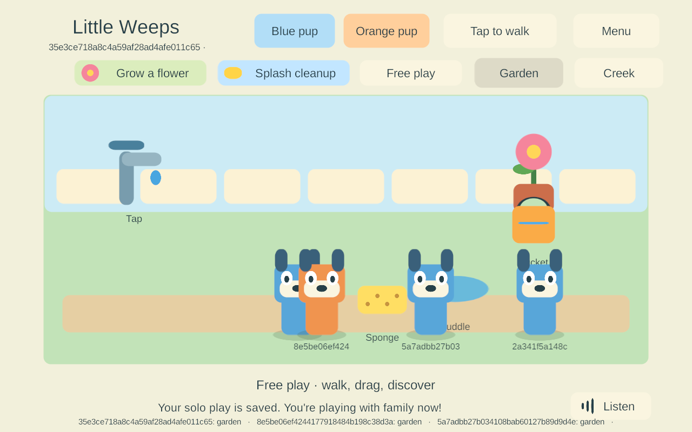
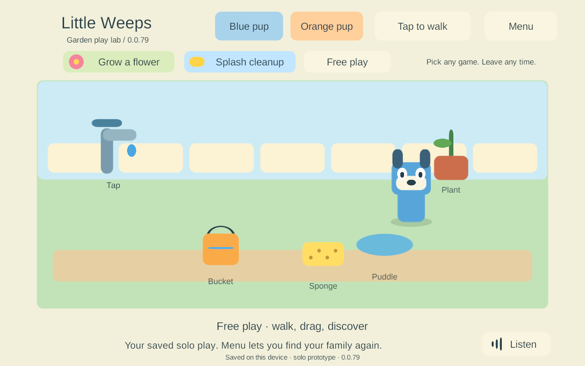

# G3 — automatic joining from saved solo play

**Build 79; September 24, 2026. Implemented and qualified on Windows and the project Android emulator.** A paired child can play the garden immediately while discovery runs. If the PC appears later, the same app receives a trusted shared snapshot and switches at a safe moment. The child's solo play remains saved separately and can be opened again from Menu. G3 remains partial; neither iPad has received this build.

This bounded task follows **AUTO-01, JOIN-01, FAMILY-01, NET-02 and TRAVEL-01**, particularly goal-sheet sections 44–45, and G3 in the [build guide](../family-playset-build-guide-2026-09-23.html#9-first-implementation-work-queue). It changes session startup and presentation, not the game requirements or networking framework.

## Behavior now implemented

1. After engine startup, an enrolled app opens its existing device-local branch while native discovery runs. There is no additional ten-second network wait before the garden appears. Discovery/admission failures retry with bounded backoff while the app is foregrounded. Explicit enrollment/version rejection stops retries and leaves solo play usable.
2. A valid, encrypted server snapshot is required before showing shared play. A held pointer/toy, moving character, open menu or pending transaction prevents the switch. A one-second quiet interval follows local actions. Joining can wait indefinitely while the child keeps interacting; it does not take a toy out of their hand.
3. The branch is committed through the existing durable checkpoint store before switching. If writing fails, the child stays in the current local world and can keep playing; the transition retries later. The server never receives an implicit upload of this branch.
4. Menu → **Play by myself** restores that saved solo world and releases the family connection after outstanding input settles. Siblings keep playing. Menu → **Find my family** re-enables automatic discovery. Explicit solo choice survives background/foreground within the same app process; a cold launch defaults to automatic family discovery again.
5. One screen component, canvas, event system and narration source serve both modes. Old UI children are disabled before deferred destruction, pointer state is cleared, and generated UI resources are owned and disposed. Repeated switching does not stack canvases or audio sources.

The paired local branch is `SoloPrototype/paired-{world}-{profile}/world.save`. The earlier unpaired `SoloPrototype/family-local/world.save`, this branch and the server checkpoint remain separate. Keeping them separate is the current preservation rule, **not offline reconciliation**. Shared actions stay on the server; choosing solo restores the device's solo draft, rather than cloning the latest shared world. G5 will handle merging, conflicts and personal rooms.

The transport may admit the player before presentation can switch, so siblings can see that player's stationary shared avatar while the local child finishes a drag/menu. No local actions are applied to that avatar. Parent setup/status UX and picture/spoken mode instructions still need their planned work.

## Acceptance evidence

| Qualification | Result and evidence |
| --- | --- |
| Windows client and dedicated server 79 | Fresh builds, zero reported errors/warnings. [Build summary](evidence/offline-join-2026-09-24/windows-build.json). |
| New late-join flow | **7 cases passed:** immediate local startup, later native server discovery, held-drag/menu deferral, real staged-save write failure/recovery, three solo/shared round trips, foreground pause/resume adapter, cold reopen and explicit revocation. [Results](evidence/offline-join-2026-09-24/windows-offline-7.json). Several conditions share a case. |
| Existing connection contracts | **11 encrypted LAN cases** and **7 four-client reconnect cases** passed, including invalid enrollment/certificates, changed server port/epoch, sibling continuity and no replay of a stale drop. [LAN](evidence/offline-join-2026-09-24/windows-lan-11.json), [reconnect](evidence/offline-join-2026-09-24/windows-reconnect-7.json). |
| Existing garden input | **10 cases passed:** delayed pickup/drop, item contention, canceled/menu touch, walking, multi-touch joystick/drag, activities, departure and rejoin. [Results](evidence/offline-join-2026-09-24/shared-garden-10.json). |
| Android release 79 | Non-development ARM64 IL2CPP release, original family signing key, 401 payload entries unchanged by signing. [Build](evidence/offline-join-2026-09-24/android-build.json), [signing](evidence/offline-join-2026-09-24/android-signing.json). |
| Android update 78 → 79 | Installed APK hash equals the fresh artifact; existing certificate checked before `install -r`; original and paired solo saves remained byte-identical before launch. [Update](evidence/offline-join-2026-09-24/android-update.json). No uninstall or data reset. |
| Actual release Android path | **4 cases passed** with ordinary ADB touch/Home input and three native Windows peers: local edits after timeout; late PC discovery with menu deferral; solo restoration and real background/foreground; cold automatic rejoin with enrollment/drafts retained. No debug hooks, IP override or packet relay. [Results](evidence/offline-join-2026-09-24/android-offline-4.json). |
| Source provenance | All **45 production source/config files** under game code/native plugins matched their recorded manifests for Windows, Android and the iOS export. Test runners/docs were finalized afterward; Unity-generated whitespace was cleaned without changing settings semantics. [Verification](evidence/offline-join-2026-09-24/source-verification.json). |
| iPad candidate 79 | Fresh non-development Xcode export, zero Unity errors/warnings. The initial transfer timed out at a stale address; the user supplied the current address and the saved SSH identity verified. All 3,092 exported files verified, and native compile/link passed with six bridge symbols present. Signing, enrollment, installation and physical qualification remain pending. [Export](evidence/offline-join-2026-09-24/ipad-export.json), [transfer](evidence/offline-join-2026-09-24/ipad-transfer.json), [native build](evidence/offline-join-2026-09-24/ipad-native.json). |
| Records and cleanup | [129 local links/anchors and all 35 top-level goal IDs](evidence/offline-join-2026-09-24/doc-validation.json) checked. Isolated test processes and emulator stopped; saved data retained and the existing preview untouched. [Cleanup](evidence/offline-join-2026-09-24/cleanup.json). |

Android evidence uses the project-owned API 35, 16 KB x86_64 emulator with ARM translation. This establishes that the release build calls Android NSD/Keystore and handles that emulator's real activity lifecycle. It does not qualify the Samsung, native ARM64 16 KB behavior, iPad permissions/lifecycle or four physical mobile devices. Windows pause tests call the shared foreground adapter; they are not physical iOS tests.

## Screens checked

The existing lab art and profile IDs remain temporary. Menu controls fit the tested 1280×800 viewport. Long shared-player identifiers still need the planned friendly names and child-oriented UI.







## Reproduce the independent checks

The scripts use fresh isolated Windows families and verify exact built artifacts. The Android test requires an already enrolled project emulator, the matching fresh signed APK installed, and its isolated PC server initially stopped. It does not enroll a physical device or replace an existing enrollment.

```powershell
uv run --with cryptography python Tools/Test-FamilyOfflineJoin.py 79
uv run --with cryptography python Tools/Test-FamilyReconnect.py 79
uv run --with cryptography python Tools/Test-FamilyLAN.py 79
uv run python Tools/Test-SharedGarden.py 79
uv run python Tools/Test-AndroidOfflineJoin.py --family <isolated-world-id> --build 79 --windows-build 79
```

## Still required, in plan order

- Finish local signing of **79**, verify/back up both iPads, update in place and enroll two separate profiles; then check actual local-network permission, touch, safe transition, lock/return and saves. The new 79 helper is open on the Mac. The older iPad backup is verified on both computers; the newer iPad connection/backup is still pending. The old 74 helper does not contain this work. See the updated [return checklist](return-checklist-ipad-lan-2026-09-24.html).
- G3 prolonged shared-outage flow: currently it reconnects with shared actions unavailable; Menu allows the saved solo draft. Automatically recovering into local play from a previously shared session needs its own preservation/UX proof. Also parent enrollment/status UI, route changes, actual mixed devices and sustained A10 measurements.
- G4 complete recovery checkpoints, both iPads hosting, handoff and abrupt host loss. None is replaced by this PC-server work.
- G5 offline reconciliation, rooms, creations, containers and item-return/stock policies; G6/G7 content and child-friendly presentation; G8 renewal and release checks.

Mac tools now use ignored local routing metadata when its IP changes, while retaining strict verification against the original Mac SSH host identity. The new app-data backup tool copies only this app’s Documents/preferences, validates its save checksum and verifies the transferred backup on Windows; it never resets device data.

This task used the existing source-backed architecture and inspected the installed code, then produced new implementation evidence. It is not a new survey of external vendor recommendations. The user's current Windows preview and physical devices were not replaced.
