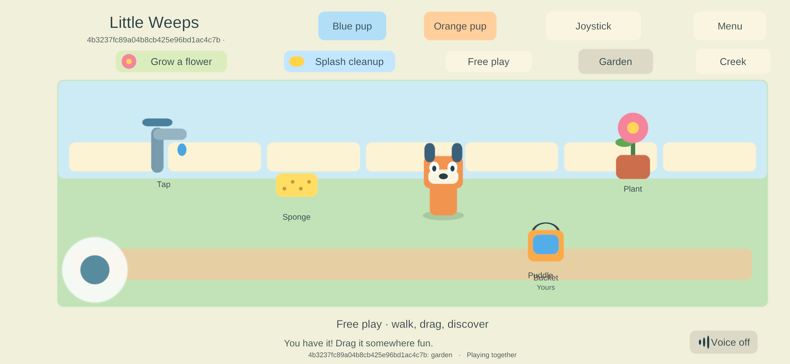

# Persistent home server — build 83

> **Historical implementation record — current scope changed September 25.** PC/VPS is the sole shared authority; clients continue private solo if disconnected and load server state on rejoin. G4/AUTO-02 device hosting and automatic offline imports are removed. The dated results below remain evidence, but their old “next”, “required” and device-version statements are not the active plan. Use [current decisions](../current-decisions.md), the [build guide](../family-playset-build-guide-2026-09-23.html#18-current-work-record-and-research-basis) and the [current return checklist](return-checklist-ipad-lan-2026-09-24.html).

<!-- historical-record-start -->
Goal **NET-02**, G3. User request: explain the two-hour cutoff and make normal home hosting keep running during family play.

## Why it stopped

The Windows networking prototype shared one lifetime check between automated probes (240 seconds) and interactive sessions (7,200 seconds). `Start-FamilyLAN.py` launched the family authority as an interactive session, so the laboratory deadline also stopped the home server. This was a test-runner limit, not a Unity, iPad, multiplayer or licensing requirement. The phone/timer correction in build 82 did not change it.

## What changed

- Normal enrolled home-server launches now explicitly request **persistent hosting**, and verify that the server acknowledged it. There is no time limit or empty-player shutdown in that mode.
- Automated probes retain their original deadlines. Persistent mode requires an enrolled, interactive authority; a client or unpaired test cannot silently opt into it.
- With nobody connected, garden activity timers pause while the server remains available. This is separate from process lifetime.
- The existing single-writer save lock, durable checkpoints and controlled quit path remain. A second authority cannot open the active save.
- `Restart-FamilyServer.py` refuses to replace an occupied server, checks process identity, stops an idle server cleanly, backs up its save/enrollment locally, verifies the checkpoint and compares all existing saved fields after restoration. It never uninstalls clients or creates new family identities.
- A reviewed administrator helper grants only the selected server executable inbound UDP from **LocalSubnet**. It disables only the matching build's first-run block rules. It does not turn off Windows Firewall, change other apps' rules or open a router port.

The PC must remain powered on, awake and connected. This does not yet install a Windows sign-in task, service or crash supervisor, and does not implement required iPad hosting. "Persistent" means the server no longer exits on a test timer; it is not a guarantee against operating-system shutdowns or power loss.

## Evidence

| Check | Result |
| --- | --- |
| Core rules | **52 passed**, including exact timed-test boundaries and persistent lifetime values through 30 days. [Results](evidence/persistent-server-2026-09-24/core-52.json). |
| Windows build | Client and dedicated server **0.0.83** built successfully with zero build errors. [Summary](evidence/persistent-server-2026-09-24/windows-build-83.json). |
| Runtime lifetime and recovery | **6 checks passed**: timed probes still expire; persistent runtime crosses the former boundary while empty; four players join and interact; a duplicate writer is refused; controlled restart preserves state and all four client processes rejoin; the last departure leaves an available unchanged world. [Results](evidence/persistent-server-2026-09-24/native-lifecycle-83.json). |
| Staggered client updates | **83 server / 79 client** and **79 server / 83 client** pass admission, pickup, filling and shared state. [Results](evidence/persistent-server-2026-09-24/compatibility-83.json). |

The native cutoff test supplies an explicit verification-only elapsed offset to the same lifetime branch. It is **not a real two-hour soak**. The production launcher supplies no offset. No new physical-device restart/soak acceptance is claimed. Build 83 includes build 82's garden timers; older 79 clients can interact with that state but do not display the new return cue. Their wider phone layout still requires a client update.

## Deployment status

**Applied on September 24 after the user confirmed everyone was off the server.** The user approved Windows elevation. The reviewed rule allows the exact build 83 executable inbound UDP from LocalSubnet; the matching first-run block rules are disabled. A read-only verification confirmed the applied scope. The helper initially compared the first character of a scalar CIM address instead of the full address; that verification bug is fixed without requiring another permission change.

The original family server is now running **0.0.83 in persistent mode**. The deployment tool backed up the original checkpoint/enrollment, verified its checksum, and compared every existing field after restoration: all four players, ten items, progress, positions and receipts were preserved. [Applied deployment evidence](evidence/persistent-server-2026-09-24/deployment-applied-83.json). The earlier [pending record](evidence/persistent-server-2026-09-24/deployment-pending.json) remains historical evidence of the canceled first prompt.

### Samsung updated to 83

A fresh non-development Android release was built from the current runtime source and signed with the existing family key. Build **79 → 83** installed in place; the installed APK hash and signer matched exactly, and the exact package launched. A PowerShell 5 issue that treated successful ADB download progress as failure was corrected to use the native exit code. [Installation evidence](evidence/persistent-server-2026-09-24/android-install-83.json).

The phone discovered the PC server automatically, reused its existing enrollment, received the shared world and displayed the game. Both client and server recorded admission with no transport receive error. It later disconnected; the server remained available. This is one physical Android join, not a complete device lifecycle or long-duration qualification. [Connection evidence](evidence/persistent-server-2026-09-24/android-connection-83.json).

The native screenshot was inspected: the title and controls are visible, the floor uses the wider display, and the game reports playing together. No new manual speech/multitouch check is claimed. The original local solo primary/backup are byte-identical. The separate paired solo branch retains its world/player identity and every existing item field; its position advanced through 21 accepted walking commands between observations. Additive resetPending=false fields are expected. No rollback was performed. [Save comparison](evidence/persistent-server-2026-09-24/android-save-retention-83.json). Private Android settings could not be read directly.

The server's garden timers are now active, and Android has their visual cue and wider layout. iPads and iPhone remain on **79** and were not accessed during this update. Older clients can use the updated authority but do not show the new reset cue or phone layout.

## Next

Update Apple clients when available, then continue parent-facing start/stop/status, Windows sign-in startup, prolonged-outage recovery and real sustained device measurements. The PC must remain awake; there is no time-based exit in home-server mode, but no automatic restart service has been installed. Keep the full goal sheet and required G4 iPad hosting/recovery unchanged. G1/G2/G3 are not declared complete.
<!-- historical-record-end -->
