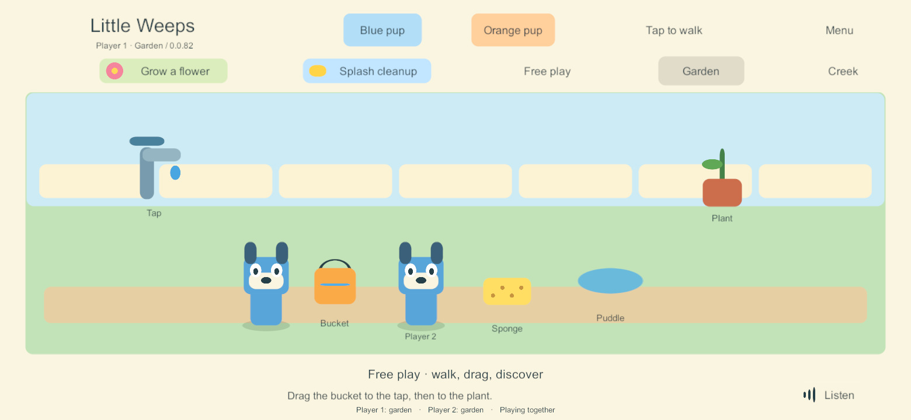

# G3 correction — wider phone play and repeatable garden activities

**User-directed scope: FAMILY-01, ACT-01, ITEM-03, ITEM-02.** This follows the four-device build 79 check. The user reported excessive side space on Samsung/iPhone while both iPads looked good, and asked for timers because items and quests were not resetting. This is a narrow correction to the existing garden fixtures. The full G5 catalog, personal possessions, creations, rooms, containers and return policies remain separate work. Arrival-only cue cancellation and authored spoken return hints also remain in that broader policy; this fixture protects actual held/use interactions.

## Implemented in build 82

- On wide landscape safe areas (aspect ratio above 1.85), expand the board and scenery horizontally and distribute the controls. Keep character, prop and text proportions, fixed world coordinates, notch-safe placement and the existing tablet geometry.
- The same unused bucket/sponge returns to its home position after **three minutes**, preceded by a **five-second picture/text cue**. A returned bucket empties and a returned sponge dries. No additional item is spawned.
- A fully watered flower or completely cleaned puddle becomes available again after **one minute of eligible inactivity plus the five-second cue**. Partial progress is preserved. Completion and rearming do not remove a player from their chosen activity.
- Holding a tool protects it; holding the relevant tool protects its completed station in that area. Picking up during a cue cancels it. Meaningful item interactions start a new grace period. Merely walking or changing avatars does not keep every prop alive.
- One authority owns the shared clocks and commits visible changes before publishing. Solo uses the same rules. Clocks are saved, pause when nobody is connected, and do not catch up from a device wall clock. Solo pauses its clocks while its menu/app is paused.

Clock metadata is additive and optional: earlier saves start fresh grace periods while preserving their IDs, contents, placements, progress and receipts. The current timer policy only recognizes the existing garden tools and repeatable station fixtures. It must not be generalized to saved plants, personal decorations or creations without the later content policy. Shared clock checkpointing is bounded to five seconds when otherwise idle; an abrupt loss can restore that most recent saved elapsed time. Host transfer/recovery remains G4.

## Qualification record

- [Core rules](evidence/phone-layout-resets-2026-09-24/core-51.json): **51 checks passed**, including seven new maintenance cases covering timing, cue cancellation, held-item protection, another player's station protection, independent areas, saved elapsed time, absence, stale/replayed commands and older saves.
- First Windows build **80** passed responsive layout checks but its test recorder encountered a transient Windows file replacement conflict. Build **81** retries that observation next frame, without replaying the user's game action. Build 80 is not selected for delivery.
- Build **81** passed [six real-time layout/reset checks](evidence/phone-layout-resets-2026-09-24/full-timers-81.json), with no accelerated clock: the tool cue appeared at about 180 seconds and the return followed five seconds later. Another player's held Creek bucket survived, and a second watering round succeeded.
- Both staggered-update directions passed [basic 79/81 compatibility](evidence/phone-layout-resets-2026-09-24/compatibility-81.json). Older clients do not display the new cue; older servers do not run timers.
- Final **82** additionally excludes disabled old UI objects during a solo/family layout rebuild. It passed [ten shared-control checks](evidence/phone-layout-resets-2026-09-24/shared-82.json) and [seven offline/rejoin checks](evidence/phone-layout-resets-2026-09-24/offline-join-82.json), including three solo/family cycles with phone/tablet resizing. The retained-gameplay comparison excludes idle-clock metadata that is now expected to advance; clock retention is covered separately by the core tests.
- [Final 82 layout checks](evidence/phone-layout-resets-2026-09-24/layout-82.json): the floor occupies **94.46%** of the safe width at 1560 x 720 and **94.38%** at 1280 x 600. All visible controls stay inside the reported safe area. Both tablet checks retain the original 1120-unit board width. These are actual Unity Windows renders at phone/tablet aspect ratios, not native phone/notch acceptance.
- Windows server/client and the signed Android release **82** built without errors or warnings; the matching iOS export and [Mac native compile/link](evidence/phone-layout-resets-2026-09-24/ios-native-82.json) passed. Apple-generated warnings are retained; the unsigned app supports iPhone/iPad, has the correct app identity and links the native family bridge. An unsigned IPA is packaged/hash-verified for subsequent Sideloadly signing; it is not installed. [Build/source record](evidence/phone-layout-resets-2026-09-24/builds-82.json). All compiled C# sources match current files. The core world, session and network authority files are byte-identical to the full real-time 81 timer check; the final layout-only fix does not change their timer rules.

## Final phone preview

[Tablet comparison](evidence/phone-layout-resets-2026-09-24/tablet-82.png) · [Tool return cue](evidence/phone-layout-resets-2026-09-24/tool-cue-81.png)

## Delivery and remaining work

At build 82 preparation, the children were still using the shared 79 session and deployment was deferred. That historical status is superseded by the user-authorized server/Samsung 83 deployment below: timers are active on the authority and the wider native Android layout is verified. Apple client updates remain pending. Existing app/family identities and saved worlds are retained.

This build 82 correction did not remove the two-hour runner limit. The later [build 83 persistence task](g3-persistent-server-2026-09-24.html) implements and tests that removal; server and Samsung deployment is now complete after user approval; Apple client updates remain pending. Neither task completes G3/G5. Broader per-device lifecycle, sustained performance, parent setup, iPad hosting/recovery and content remain in the main guide.

The regenerated guide/reports passed local link, anchor and image checks. All 35 goal IDs remain mapped. Python helpers parse, `git diff --check` passes after removing Unity-generated YAML whitespace, and only the app version/build counters changed in project settings.

## Deployment update

On September 24 the user authorized updates after everyone left the server. The PC authority and Samsung now run build 83, which includes this correction. The native Android screen was inspected and automatic family joining/save preservation were checked. iPhone/iPads remain on 79. See the [applied deployment record](g3-persistent-server-2026-09-24.html).
