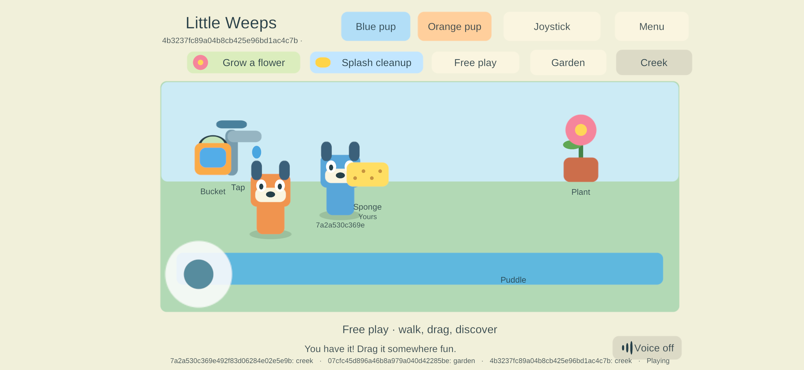

# G3 — physical Samsung and iPhone on family build 79

**Goal IDs: FAMILY-01, AUTO-01, JOIN-01, ITEM-02 and NET-02.** This follows the [two-iPad checks](g3-ipad-79-2026-09-24.html). The user ended iPad hands-on time and made the Samsung and iPhone available. No further iPad actions were requested.

## Samsung — installed, admitted and physical controls passed

The SM-S948U1 updated **15 → 79** in place using the original family signing identity. The selected release APK matches its build manifest and current production sources; the installed APK was pulled back and hash-matched. It remains a non-development ARM64 IL2CPP release, min API 26 / target API 36. The observed device has 4 KB pages; this does not qualify native ARM64 16 KB behavior.

The phone received the third profile from the existing family enrollment. Android Keystore reported paired, consumed the inbox, and native NSD discovered the existing PC authority. The app received authenticated shared state with three profiles in its roster, including the two already-connected iPads; receive errors were zero. This is real cross-platform admission, not four-person gameplay qualification.

The user answered **“yes”** to the full-layout, walking, bucket fill/pour and audible Listen check. [Samsung evidence](evidence/phones79-2026-09-24/samsung-update-admission.json).

Accessible external files were backed up before installation. Android's foundation preferences are private; exact prior tap/bookmark retention was not independently read back after this update. The existing package was updated with `install -r`, the same signer, and no uninstall or reset. Do not turn that mechanism into a claim of independently observed private-preference retention.

## iPhone — update, preference retention, admission and controls passed

The iPhone 13 Pro Max received **20 → 79** through Sideloadly over USB. The IPA was packaged from the verified signed Mac build, supports both iPhone and iPad, and was hash-verified after transfer to Windows. Sideloadly kept the existing Apple Team and exact bundle ID, with automatic bundle-ID rewriting, custom entitlements, tweak injection and Info.plist overrides off. Its final result was Done / 100%; the native app query independently identified build 79.

Before updating, this app's Documents and preferences were read over the trusted USB app-container connection. All three existing preference values matched after the update. The fourth family profile was staged through USB, without printing credentials or replacing an existing identity. [iPhone update evidence](evidence/phones79-2026-09-24/iphone-update.json).

After launch, the native enrollment status was paired and the one-time inbox was absent. Bonjour discovery, authenticated connection, first snapshot and shared presentation were observed against the original PC authority. The local checkpoint was preserved, the received snapshot listed all four family profiles, and receive errors were zero. The user answered **“yes all devices are working my kids are playing on the ipad”** to the iPhone full-layout, walking, bucket-dragging and audible Listen check. [Admission and physical feedback](evidence/phones79-2026-09-24/four-mobile-admission.json).

## All four physical clients on one authority

A separate read of the PC authority confirmed **both iPads, Samsung and iPhone concurrently connected** with four distinct enrolled profiles. The original server process and authority epoch remained in use while the phones joined. This closes the four-device admission check and records the reported working phone controls; sustained frame-time/memory measurements and detailed four-device lifecycle/content acceptance remain open. The children are now using the iPads; no further iPad test or session restart was requested.

**Operational limit found:** `NetworkProbe.cs` stops an interactive Windows qualification run after 7,200 seconds. The sampled server uptime was about 4,324 seconds, so this session is not an always-on home service. The next bounded Windows task is to provide an explicit persistent home-server mode while keeping automated probes bounded, preserving the authority lock/checkpoints and validating controlled restart/rejoin. Apply its replacement to the live session after the children finish. No server restart was performed for this record.

## Repeatable tooling and next checks

`Install-AndroidFamily.ps1` now accepts `-BuildProfile G3` and an explicit `-Serial`, while preserving the original G1 default, exact artifact/signature checks, model checks, downgrade refusal and in-place update behavior. It passed the actual Samsung 15 → 79 update. `Enroll-iPhoneFamily.py` uses the already trusted USB pairing, requires the exact installed app/version and matching pre-update backup, checks retained preferences/documents, refuses an existing identity or inbox and stages only one client's record. It uses `pymobiledevice3==11.19.1` and the device's native app-container service; credentials remain out of source/output.

Next: finish the bounded PC home-server work above, then complete the remaining mixed-device checks when available. Detailed Samsung/iPhone movement and exclusive props, independent areas and lifecycle still need their checks. The solo round trip passed on the tested iPad, but repetition on each device is unspecified. Initial joining while the server is initially absent, sustained measurements and parent setup remain open. Required iPad hosting/recovery remains G4. Unattended free signing renewal remains unqualified. G1/G2/G3 remain partial.

The changed Python files pass parsing, the Android installer passes PowerShell parsing and its real update run, and the iPhone enrollment tool passed the actual transfer/retention checks followed by native inbox consumption. The regenerated guide and current reports retain all 35 goal IDs and pass 142 local link/anchor/image checks. No Unity runtime code changed in this milestone, and no live-server restart was performed.
