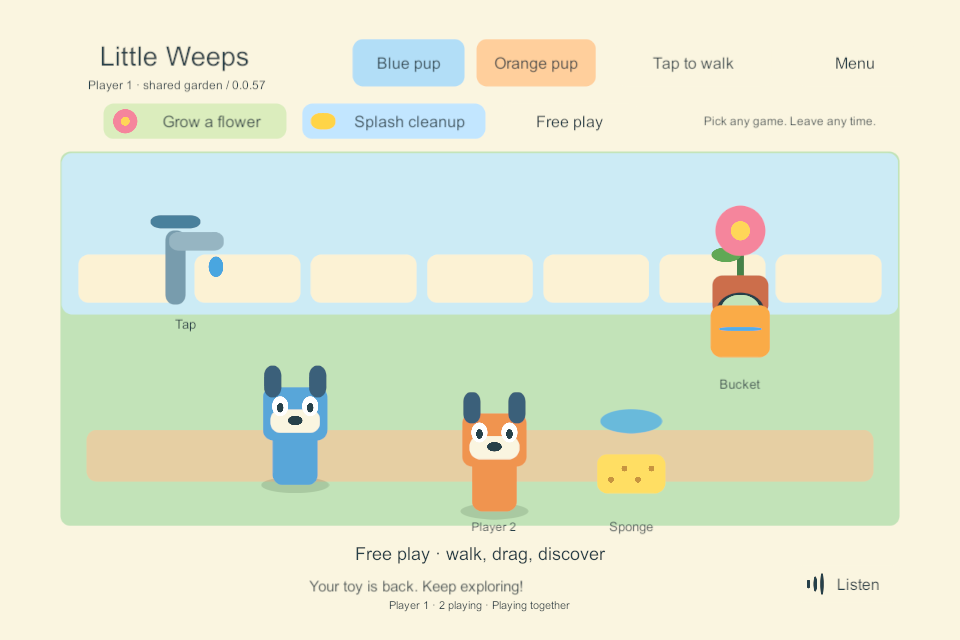
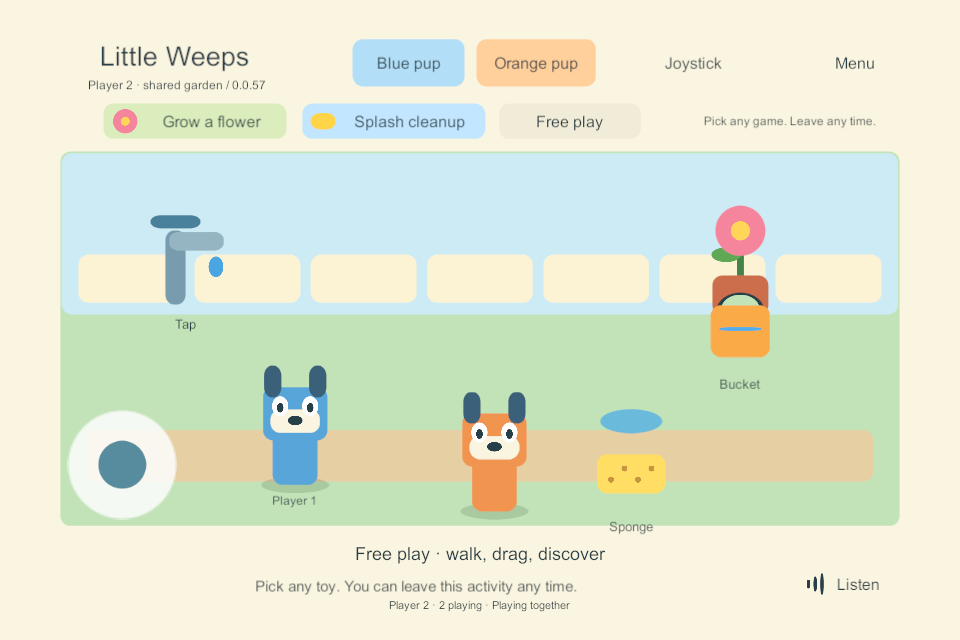

# G3 preparation — playable shared garden on Windows

24 September 2026. Completed bounded Windows task: **FAMILY-01, JOIN-01, CHAR-01, ITEM-02, ACT-01**. The user asked to connect the tested PC networking to the garden controls. No Mac or physical mobile device was accessed. G1/G2 device gates and the full G3 exit criteria remain open.

## What changed

The existing garden presentation can now use either its original local authority or an injected shared session. The shared session sends commands to the separate PC authority; clients render confirmed snapshots and connected player identities. Solo storage and preferences keep their existing paths. Shared preview data uses its own GUID directory under `LocalData/SharedGarden`, and settings use a separate player/session prefix.

Pickup immediately shows a translucent pending toy. The server must grant the hold before a drop or interaction can commit. A quick release is remembered until that answer arrives; canceling or opening the menu queues a release instead of a pour. A rejected pickup restores the confirmed toy and explains that a friend is using it. Walking, character switching and optional activity state also pass through the same authority.

Each connected profile has its own visible pup. An accepted holder can broadcast a temporary drag position for others to see, checked against its connection, item, current pickup ID and increasing pose sequence. Drag previews are not saved world positions and cannot transfer water. Dropping commits placement and interaction together. Old previews are discarded when the lease ends, so an old drag cannot move a newly picked-up bucket.

The per-client queue permits one outstanding command. Explicit stale-revision rejections can retry against the fresh snapshot; unknown outcomes never become a new operation ID. Walking destinations can coalesce, while pickup, drop and cancellation are retained. Cancellation has priority and continues through stale responses. Disconnecting settles pending callbacks and disables shared interactions; it does not pretend that an unconfirmed action was saved.

## Verification record

**Shared build 57 passed all 10 native UI scenarios.** Build 54 also passed the existing 10 four-client networking scenarios; 57 changes the shared disconnect wording, with the same server/session rules. Both 57 binaries built with zero summary errors/warnings. The independent rules suite passes **30** checks, including queue ordering, stale rebase, duplicate acknowledgements, movement coalescing and disconnect cleanup. [UI result](evidence/shared-garden-2026-09-24/ui-57.json), [four-client result](evidence/shared-garden-2026-09-24/network-54.json), [rules](evidence/shared-garden-2026-09-24/rules-30.json), [build](evidence/shared-garden-2026-09-24/network-build-57.json).

| Native UI scenario | Observed result |
| --- | --- |
| Two connected gardens | Both drew the two admitted characters |
| Finger released before pickup response | Pending release filled the bucket once and released the hold |
| Shared drag and contention | The second renderer displayed the holder's moving toy and could not steal it; pouring then changed both views |
| Canceled touch / menu during pickup | The canceled gesture did not fill or move the bucket; a second finger opened the menu and canceled the pending hold |
| Walking / character switch | Tap walking and the orange avatar reached the authority; the other renderer showed the new character location |
| Joystick and dragging together | Separate touch IDs walked and used the sponge through the shared queue |
| Optional activities | Cleanup could start and be left without resetting the watered plant |
| Client termination | The abandoned hold cleared, the other renderer hid that avatar and accepted another cleanup action |
| Explicit return | The reopened client's renderer showed the current world |
| Server loss | The view reported the stopped connection and refused new shared interactions |

The launcher resume route was tested against the completed isolated session: both rendered profiles reopened with the exact complete world, including avatar, placements, flower and cleanup state. [Resume evidence](evidence/shared-garden-2026-09-24/preview-resume-54.json).

The reused solo presentation was rebuilt as **55**. Tablet-shaped full input checks and **49 → 55** saved-play update/damaged-primary recovery passed. [Solo input](evidence/shared-garden-2026-09-24/solo-input-55.json), [update](evidence/shared-garden-2026-09-24/solo-update-55.json), [recovery](evidence/shared-garden-2026-09-24/solo-recover-55.json). Refreshed **solo iPad export 56** passed Windows inspection of all **3,083** files. It remains unsigned, uncompiled in Xcode and not installed; this is not a mobile multiplayer export. [iOS inspection](evidence/shared-garden-2026-09-24/ios-export-56.json).

Both actual UGUI canvases were rendered to offscreen targets inside the native Windows players and inspected. This avoids the missing swap-chain screenshot in hidden test windows; these are not physical-device screenshots.

Early test failures are preserved under ignored `LocalData/SharedGarden` and as compact records alongside the accepted evidence: build 51 exposed a control-file sharing race; build 52 exposed transient atomic-replacement contention in the Python harness, followed by a synthetic mixed mouse/touch menu test that did not open the menu. The menu test now uses a second touch, matching the target two-finger tablet gesture, and explicitly verifies the menu opened. Build 53 completed the preceding UI interactions but exposed unavailable hidden-window screenshot capture. Build 54 uses the live-canvas offscreen rendering above. None of these failed runs is counted as an accepted build. [Exact successful harness hashes](evidence/shared-garden-2026-09-24/tested-harnesses.json) are separate from each native build's source/artifact manifests.

## Preview and limits

Double-click **Play-SharedGarden.cmd** for verified build **57**. It opens two native Windows garden windows and their loopback server. Arrange the two windows side by side. Each represents a different player; they share the bucket, sponge, plant and puddle. Closing both clients stops this preview's server. The launcher remembers the separate preview world for the next launch and prevents duplicate servers. Run the shortcut again while one window is still open to reopen only the missing player. **Play-SoloPrototype.cmd** now opens the independently verified solo build **55**.

The updated launcher was exercised on build 57: preview update retained the complete world; Player 1 was closed normally, then the shortcut reopened just that player. Player 2 and the server retained their exact process IDs and world state. Both interactive windows remain open for the user. [Launcher/rejoin evidence](evidence/shared-garden-2026-09-24/launcher-rejoin-57.json). The first launcher check caught a request arriving while Unity was still exiting; the controller now retains that request through normal shutdown. Other isolated test processes were closed.

This is still a Windows-only play lab with placeholder art, one room, full-state replication and temporary test credentials. The listener remains restricted to 127.0.0.1; no firewall/router changes or real family pairing are made. The preview has a two-hour process guard. It is not the always-on family service, LAN discovery, remote play, automatic reconnect or automatic host switching.

The UI fixture adds a deliberate **250 ms acknowledgement delay** and uses process-local Input System mouse/touch devices. This exercises pending input without human help. It does not measure real network latency, real child touch, iPad performance or mobile lifecycle behavior. Server restart/rejoin and leaving remain distinct: other players can continue when a client exits, while server loss makes the affected clients inactive until a new session is opened.

Next bounded task: independent logical areas and per-player travel, while preserving the same authority and shared-object ownership. Native discovery/parent pairing and iPad hosting remain separate required tasks; resume [iPad qualification](g2-device-checklist.md) when the devices are available. Do not expand all six content worlds from a one-room Windows result.

## Repeat the qualification

Use an unused build number with Unity closed:

~~~powershell
.\Tools\Build-NetworkProbe.ps1 -BuildNumber N
python .\Tools\Test-SharedGarden.py N
python .\Tools\Test-NetworkProbe.py N
dotnet run --project Tools/SoloRules.Tests/SoloRules.Tests.csproj --configuration Release -- LocalData/Verification/new-rules-run
~~~

The launcher's saved-session route also has `Tools/Test-SharedGardenResume.py N RUN_ID OUTPUT_JSON`; use only a successfully completed isolated shared-garden test run. Normal preview state, test credentials and process logs remain ignored under LocalData. Source and artifact manifests pin the actual native outputs; the compact accepted evidence and images above are tracked with this record. Windows export 56 remains in `Builds/iOSSolo/G2-0.0.56/Xcode` for the next actual iPad task.
