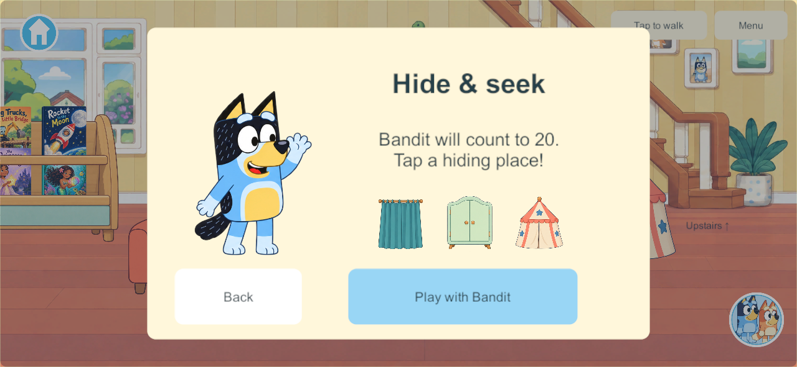
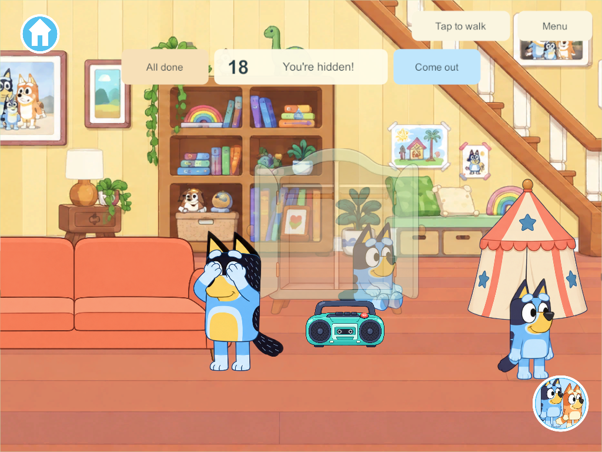

# Downstairs hide-and-seek — HS-1

September 28, 2026. Goal IDs: HIDE-01, HIDE-03 and the seeker-role portion of NPC-01; Home H-13, H-15, H-16 and H-17. This is the first downstairs Bandit game. Chilli, clue options, wider Home search, human seekers and everyday parent routines remain required follow-ups.

## What the child does

In the downstairs living area, tap **Hide & seek** or Bandit, then **Play with Bandit**. Bandit covers his eyes. A large visible number counts down from 20. Tap a pictured **Hide** button at the curtain, sofa, wardrobe or tent; the character walks there and enters the space. The local view shows a translucent cutaway and “You're hidden!” Other players cannot see the hidden character or their held object.

Bandit walks along the clear floor and checks hiding spaces, including empty ones. He pauses to inspect before finding someone and gives a friendly wave. **Come out**, **All done** and **Hide again** remain simple local choices. There are no scores, elimination screens or forced restarts. Someone who has not chosen a hiding place remains protected while ready siblings keep playing.

The curtain is beside the reading area, clear of the shared book rack. Two independent nooks use the original sofa artwork and dimensions. The wardrobe has two distinct compartments; the tent has one. There are **six spaces for four players**. The normal four sofa seats remain separate. The new game controls occupy a second row while playing, leaving the movement setting and Menu accessible.

## How the research became working systems

The [applied research](hide-and-seek-research-2026-09-28.html) provides the larger design. These specific decisions govern this slice:

| Research requirement | HS-1 implementation |
| --- | --- |
| Four independent hiders | One authoritative record per saved profile, with participation cycle, preparation time and one atomic slot lease. Bandit does not consume a human-player slot. |
| Late joining without restarting siblings | Each join/re-hide receives a personal 20-second preparation period. Joining an existing activity does not reset Bandit or another player. |
| A parent cannot cheat with hidden coordinates | Target selection uses a bounded alternating coverage sweep across all six legal slots. It does not use occupant positions or identities. Occupancy is checked only after arrival and a completed 1.5-second inspection. |
| Server-owned countdown and actions | The same Core simulation runs privately and on the headless PC authority. Audio and animation never decide count completion, slot claims or finds. |
| Safe visible navigation | A fixed foreground floor rail connects the six inspection anchors. This pilot has no movable structural cover or dynamic blockers; loose toys and children cannot block an exit. A multi-room portal graph and dynamic recovery remain later work. |
| Real cover and possessions | Hidden remote avatars and held-prop views are suppressed; local cutaways show the current character. Avatar changes preserve the profile's hiding state. Entry/exit conserves the existing held item's identity and holder. |
| Independent exits and lifecycle | Come out, walking, All done, leaving the search area, room/world travel, backgrounding and disconnect release only that participant. Siblings continue. |
| Safe reopen | Saved active roles are suspended and occupied players settle at valid exits. Returning players deliberately join again. Existing room, kitchen, creation and enrollment data are retained. |
| Avoid abandoned mini-games | Five unused minutes release an unready or found participant. Active hidden players are resolved by the search rather than having their creations or belongings deleted. |
| Easy picture-led controls | One start card, one row of local status/exit controls, pictured hiding buttons, automatic approach and a prominent countdown. No unimplemented parent-choice button. |

The first route is deliberately a predictable sweep in alternating directions. It supplies fair complete coverage without pretending that sight, hearing, clue scoring or full parent routines already exist. Sight/sound personality, clue controls and Chilli belong to HS-2. The compact space extends from the curtain at X -4900 to the tent at X -3150. A related old ±4800 input limit was corrected so automatic destination walking uses the current saved world's actual bounds; direction controls retain their existing behavior.

The parent checks each slot even if it is empty. Existing core replay checks relocate hidden occupants while retaining the same observations and confirm that the chosen targets remain identical until a genuine inspection finds someone. Stationary single-hider coverage across both sweep directions and all six slots has a measured longest search of **20.10 simulation seconds**, after preparation. Moving/re-hiding players and larger future search areas are not covered by that timing claim.

## Authority, saves and rendering

Schema **28**, content **29** add one inactive hide-and-seek record and four profile records to an existing four-player world. Old schemas normalize Unity's empty inline class representation before validation. New saves validate finite clocks, legal phases, unique slot occupancy, roster identity and actual player placement. Restore clears transient roles without regenerating items or rooms.

Commands append a new `SoloAction.HideAndSeek` value, preserving old action numbers. Existing receipts provide idempotence and revision/visit checks. Durable transitions use the normal reliable snapshot path; bounded 10 Hz activity samples carry the current parent/count presentation. Samples must match the authority epoch, round and current world revision. Older snapshots cannot rewind a matching more recent activity sample. Offline work stays private and reconnect still loads PC authority without merging edits.

NPC sprites use one six-cell atlas. Three new furniture props use one closed/open atlas; the sofa reuses its accepted asset. The source atlases, official reference, exact built-in imagegen prompts and candidate status are in [the art manifest](../../SourceArt/Home/HideAndSeek/manifest.json) and [art notes](../../SourceArt/Home/HideAndSeek/README.md). The recognizable Bandit identity follows the [official character reference](https://www.bluey.tv/characters/bandit/). Accepted Bluey/Bingo art and movement are unchanged. Generated Bandit animation is a first candidate, with limited separation between its two walking drawings; family visual acceptance remains open.

Client hiding is scoped to this NPC-seeker game. Hidden state still exists in the authoritative snapshot; a future human-seeker mode must separately qualify presentation and any required data filtering.

## Sound limitation

The first game has original gentle countdown/reveal chimes, local mute handling and no repeated historical cue playback on connection. Nonparticipants do not receive those cues. Existing world music and book narration remain.

**Parent speech is unfinished.** The existing local Qwen VoiceDesign workflow was attempted for an original warm parent voice. Windows Application Control returned WinError 4551 while loading `torch.dll` or a dependency, before any speech file was generated. No policy was changed and no blocked executable was rerouted. [Audio notes and reproducible chime source](../../SourceAudio/HideAndSeek/README.md) distinguish the working cues from the blocked voice work. Physical listening acceptance is also open.

## Verification and delivery

Candidate **223** passes all qualification below:

| Check | Result and evidence |
| --- | --- |
| Core rules | [294 groups pass](evidence/hide-and-seek223-2026-09-28/core-results.json): migration, four hiders, atomic requests, late readiness, fair routes, possessions, avatars, exits, lifecycle, inactivity, validation and destination bounds. |
| Actual Unity JSON | [Seven groups pass](evidence/hide-and-seek223-2026-09-28/unity-json.json): old-schema normalization and all six hidden-slot round trips. |
| Four native release clients and headless server | [Six groups pass](evidence/hide-and-seek223-2026-09-28/results.json): pictured taps, cover visibility, countdown/search/find, independent departures, same-slot rejection, held items, avatars, pause/travel and cold restart. |
| Native private solo | [Two groups pass](evidence/hide-and-seek223-2026-09-28/solo-results.json): automatic approach and full loop; safe reopen preserving toys, rooms and creations. |
| Pacing and traffic | [Worst stationary single-hider coverage 20.10 seconds](evidence/hide-and-seek223-2026-09-28/pacing.txt); largest observed activity sample 791 bytes. Native logs showed no exceptions or queue warnings in this run. |
| Windows and signed Android release | [Both succeeded](evidence/hide-and-seek223-2026-09-28/build-verification.json). Each matches 684 compiled-source/art/package files; all 351 Windows artifacts and the signed APK match their recorded hashes. |
| Samsung update | [223 installed over 216](evidence/hide-and-seek223-2026-09-28/android-update.json), exact installed APK and pinned signing identity verified. All 21 primary saves, 21 backups and 12 enrollment/configuration records were byte-identical after installation. The locked display currently prevents visible gameplay verification. |

Native checks use disposable worlds. Earlier runs exposed an obstructed curtain, crowded controls, the old destination boundary, an invitation hit area intercepting hiding taps and a private-save dirty flag after restoration. Candidate 223 includes those corrections and passes both complete native scripts.

The phone update includes the world music introduced in 217. No family server, Mac or iPad was updated; server/iPads remain last recorded at 171 and iPhone at 101. Shared family play needs a coordinated matching-server/client rollout. Independent production recovery remains blocked by the previously recorded Windows validator policy; native cold restart is not a substitute for that qualification. Physical mixed-device play, child usability, sound and A10 performance remain open, along with the existing Android 16 KB qualification issue.

The branch integration hold remains in force. The next bounded task is HS-2: Chilli, meaningful sight/sound observations, optional clues and parent speech once the local voice workflow can run. HS-3 expands qualified paths through Home; HS-4 preserves human-seeker play and fuller parent routines. The complete Home backlog remains unchanged.
