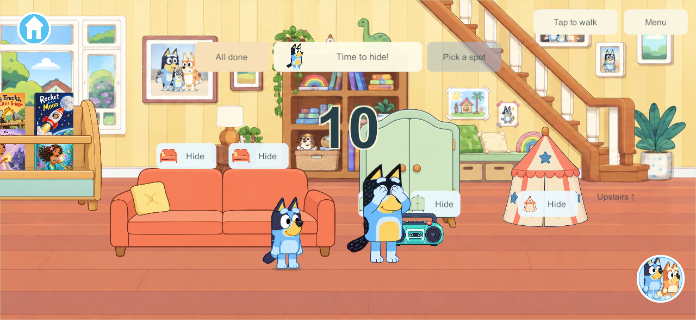
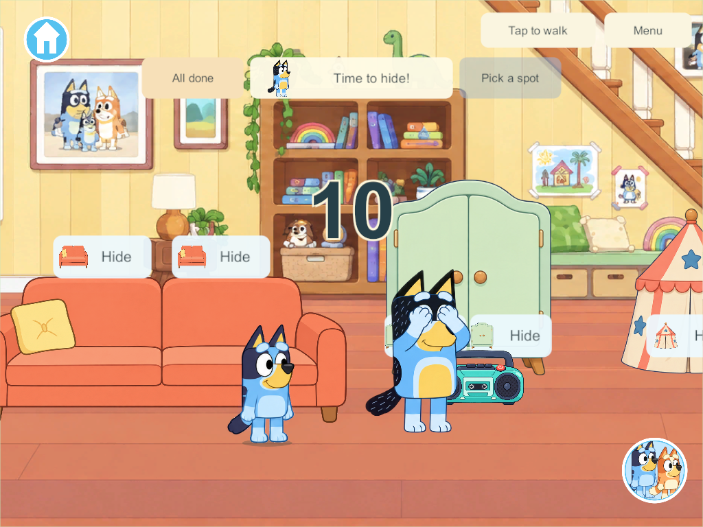
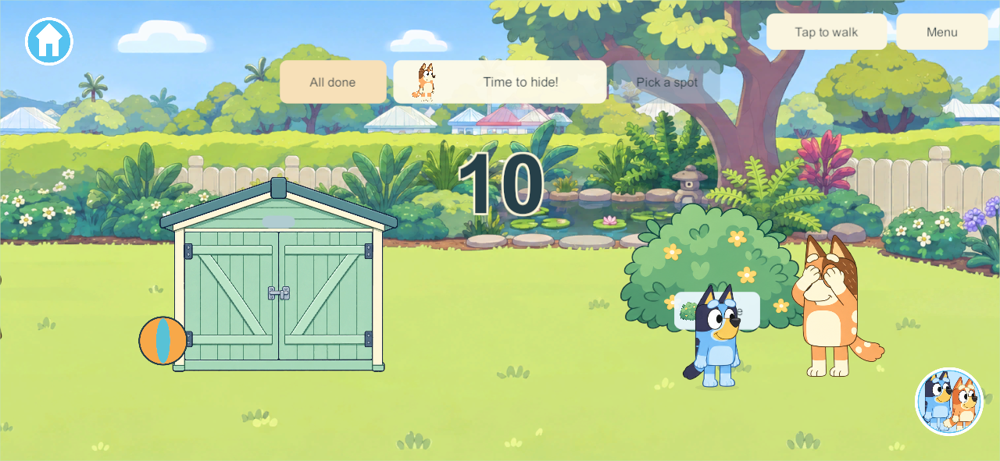
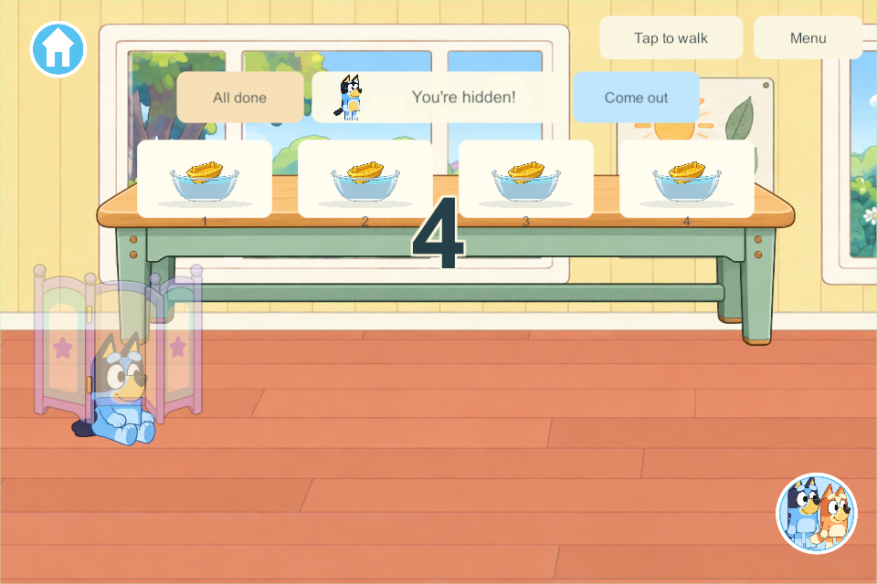
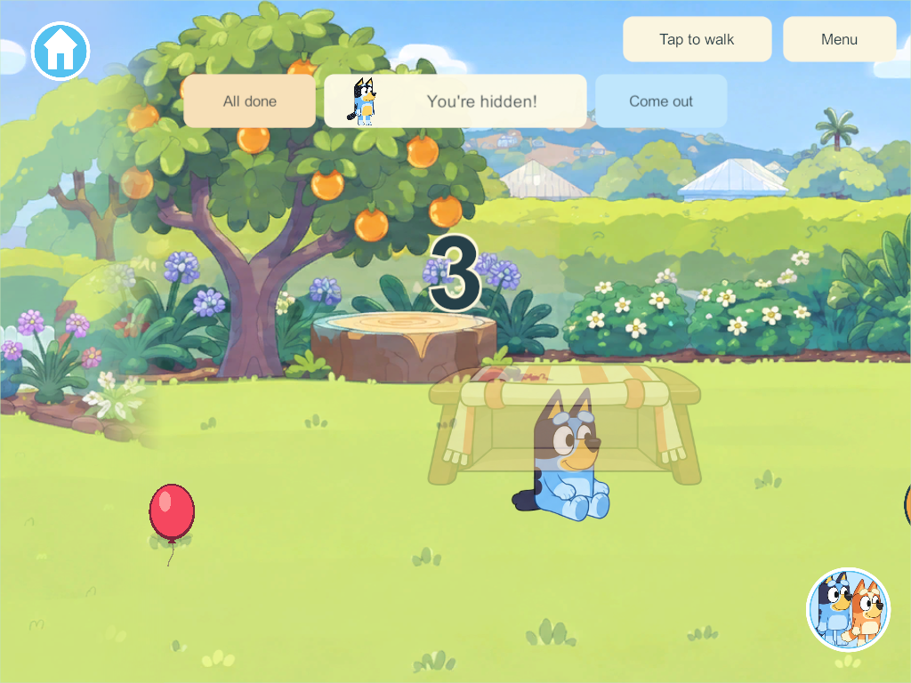

# First-level hide-and-seek — applied research and implementation

September 28, 2026. The user likes the first concept and requests four more hiding places, the whole first level, large ten-to-one countdown numbers, visible stops to look around, and Bandit/Chilli taking turns. This is the active HIDE-01 / HIDE-03 / NPC-01 slice. The prior 20-second proposal is superseded. Four human players, independent participation, possessions and saves remain required.

## Research used for this change

| Primary source | Applied decision | Boundary |
| --- | --- | --- |
| [Rich Welsh, Making NPCs Search Realistically](https://www.gameaipro.com/GameAIPro2/GameAIPro2_Chapter27_Looking_for_Trouble_Making_NPCs_Search_Realistically.pdf), reviewed September 28 | Separate the visible reaction, travel, inspection and wider search. Maintain a set of checked cover points, prefer nearby unchecked places, and pause to glance along longer paths. | This family adaptation does not use the chapter's hidden-player-position weighting or combat behavior. |
| [Brook Miles, NPC Awareness in a 2D Stealth Platformer](https://www.gameaipro.com/GameAIPro/GameAIPro_Chapter32_How_to_Catch_a_Ninja_NPC_Awareness_in_a_2D_Stealth_Platformer.pdf), reviewed September 28 | Keep the searcher's remembered interests separate from live hidden occupants. Use authored cover locations as plausible interests; only a completed inspection reveals an occupant. | Looking animation alone is not a sight/hearing simulation. Optional observation/clue systems remain separate later work. |
| [Unity NGO NetworkTime and ticks](https://docs.unity3d.com/Packages/com.unity.netcode.gameobjects@2.13/manual/advanced-topics/networktime-ticks.html), reviewed September 28 | Authority advances the count, travel and pause clocks. Clients present the same parent, phase and facing from bounded activity samples. | This project retains its existing transport, save and recovery rules; no package upgrade. |
| [Official Chilli reference](https://www.bluey.tv/characters/chilli/) | Preserve Chilli's recognizable adult red-heeler identity and palette in a matching sprite atlas. | Generated artwork remains a candidate for family visual acceptance. |

The ten seconds are the user's preference. Pause lengths, route weights and the search budget below are game tuning choices, not research-proven child-development values.

## Concrete scope before implementation

- **Ten spaces:** keep the six living-room slots; add a folding screen by the science/coloring bay, a nook under the existing dining table, a blanket-covered garden bench, and a bush near the far shed. The dining table is reused with a local cutaway, not duplicated artwork.
- **Whole first level:** the connected `garden` area from the science/coloring bay through the house, kitchen, veranda and backyard. Upstairs/bedrooms/secret rooms and other destinations remain outside this round; entering them withdraws only that player.
- **Ten-second personal preparation:** large outlined 10-to-1 numbers appear over the play area without intercepting taps, then disappear when preparation finishes. Movement continues, unready children are protected, late joins do not reset anyone else.
- **One parent per round:** Bandit first, then Chilli, alternating from the persistent round number. No swap while a sibling is preparing or hiding. Found players can rejoin an ongoing round; once all have finished, the next game uses the other parent. Reopen releases stale roles but remembers whose turn is next.
- **Readable search:** count → stop/look left and right → walk → optional pause on a long stretch → inspect cover → friendly find or next place. A checked-point mask prevents repeat checks until all ten have been covered. Deterministic variation is based on round/pass/slot, never hidden positions.
- **Fair, finite coverage:** choose among unchecked authored points with distance, remaining-route length and a small deterministic variation. Record worst-case stationary coverage for every slot and both parents; tune the expanded route before calling it qualified. Nearby hiding spots receive no special treatment based on occupancy.
- **Persistence:** add the search memory fields with schema/content migration; accept existing schema-28 twenty-second records before suspending their transient roles. Preserve old slot IDs, all inventory, creations, rooms and enrollment.
- **Presentation:** parent portrait/name/count instruction match the current or next round, visible searching/looking status, natural facing changes, and ten pictured hiding buttons. Preserve normal movement, kitchen/science access and the existing book rack.

## Implementation and qualification

Candidate **226** uses schema **29**, content **30**. The earlier six slot IDs are unchanged. New slots are the folding screen at X -7040, the existing dining-table nook at -470, the blanket bench at 2910 and the bush at 4310. The foreground floor rail remains clear; scenery chunks do not control NPC simulation. All ten buttons use the same tap-and-approach interaction, local cutaways and safe Come out behavior.

The large outlined 10-to-1 countdown is displayed over the play area on phone and tablet layouts. It does not intercept movement or hiding taps and disappears when preparation finishes. The HUD keeps the parent portrait and safe-exit controls. [Code comparison with 225](evidence/hide-first-level226-2026-09-28/code-comparison.json) confirms that only this client presentation changed after the 298 core groups and twelve Unity JSON checks passed.

Bandit and Chilli alternate from the saved round number. The parent stands beside the starter to count. A child joining or re-hiding while a sibling is active keeps that parent; only the next complete round switches. Cold reopening releases transient roles and keeps the turn sequence. Schema-28 records can still contain the earlier twenty-second clocks before their safe migration.

The search records a checked-slot mask. Its next choice considers travel distance, the remaining first-level route and a small deterministic variation. It stops to look left/right before choosing another cover and during long walks. Facing, pause age, chosen cover, count and position come from server state. Finding still requires arrival and a completed inspection; pausing does not magically reveal occupants. This is a cover-search system, with sight/hearing and optional clues still future scope.

| Qualification | Result |
| --- | --- |
| Core | [All 298 groups pass](evidence/hide-first-level225-2026-09-28/core-results.json), including older saves, independent hiders, ten covers, parent turns, stationary looks and retained possessions. |
| Search budget | [Sixty slot/parent/start-position cases](evidence/hide-first-level225-2026-09-28/pacing.txt) measure at most **72.95 simulation seconds after preparation**. This does not predict moving/re-hiding players. |
| Unity JSON | [Twelve checks pass](evidence/hide-first-level225-2026-09-28/unity-json.json): older inline state, schema-28 twenty-second migration, and all ten cover round trips/restores. |
| Native private solo 226 | [Two groups pass](evidence/hide-first-level226-2026-09-28/solo-results.json): pictured full loop, Chilli's second turn and safe reopen with toys, rooms and creations retained. |
| Native four-client authority 226 | [All eight groups pass](evidence/hide-first-level226-2026-09-28/results.json): pictured ten-second start, four covers/sibling concealment, first-level search, independent leaving, possessions/avatars, lifecycle, cold restore, every cover button and a stationary long-walk look. |
| Release artifacts | [Windows and signed Android 226 succeeded](evidence/hide-first-level226-2026-09-28/build-verification.json). Each matches 686 compiled-source/art/package files; all 351 Windows artifacts and the signed APK match their recorded hashes. |

The earlier 225 [native activity observation](evidence/hide-first-level225-2026-09-28/network-observation.json) recorded an 819-byte largest sample, with no exceptions or queue warnings observed. The [fresh 226 run](evidence/hide-first-level226-2026-09-28/network-observation.json) also records no exceptions or queue warnings.

Native visual review moved the bench clear of the resting balloon, lowered the dining-table occupant and separated the counting parent from the starter. Candidate 226 retains these corrections and adds the large countdown requested afterward. New raster sources, the official Chilli reference and exact built-in imagegen prompts are in [the art manifest](../../SourceArt/Home/HideAndSeek/manifest.json). Chilli and the new props are generated candidates; the user accepted the earlier concept, not these new images yet.

The later user-requested [Samsung update to 226](evidence/hide-first-level226-2026-09-28/android-update.json) replaced 223 in place. Package, pinned signing identity and exact installed APK hash match; unlocked Home visibly shows Bingo, retained food plates, the parent HUD and the new dining-table hiding button. All 21 worlds and 21 backups remain. Twenty worlds and twenty backups are byte-identical; the active world/backup migrated schema 28 to 29 with all 118 objects, rooms, decorations, food and other durable state unchanged. Recorded hide actions and movement after launch explain transient changes. Enrollment status and the book-audio record are unchanged. This visible launch does not establish full hide-and-seek or four-device acceptance. The live family server, Mac and iPads were not updated. Shared family play needs matching current client/server deployment. The parent-voice Windows policy block is unchanged: this version has visible counting and existing chimes, without newly generated parent speech. Production recovery, mixed physical-device play, A10 performance and the inherited Android 16 KB gate remain open. Native cold restart is not independent production-recovery qualification.

The next hide-and-seek work is optional sight/sound clues, richer parent behavior and separately qualified upstairs routes. Full everyday parent routines and human-seeker roles remain in the Home backlog. Preserve the branch integration hold.
