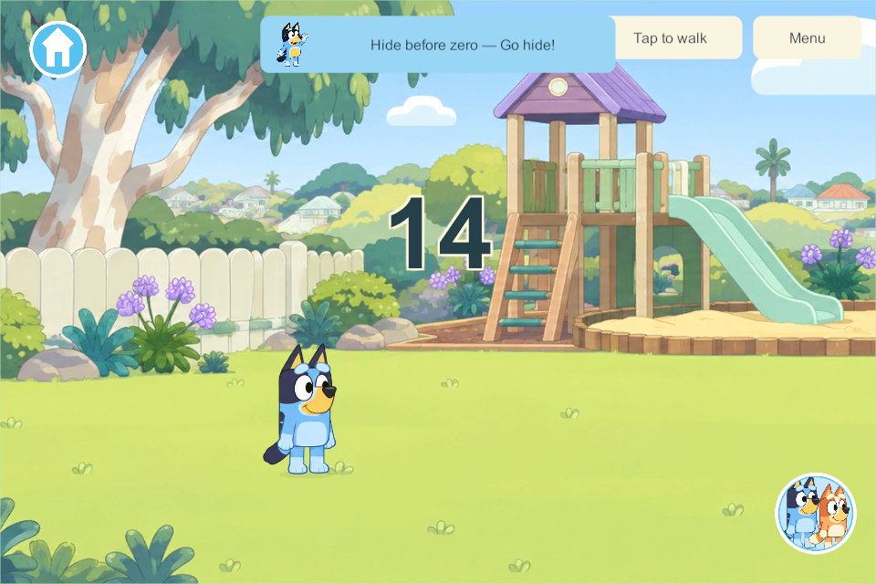
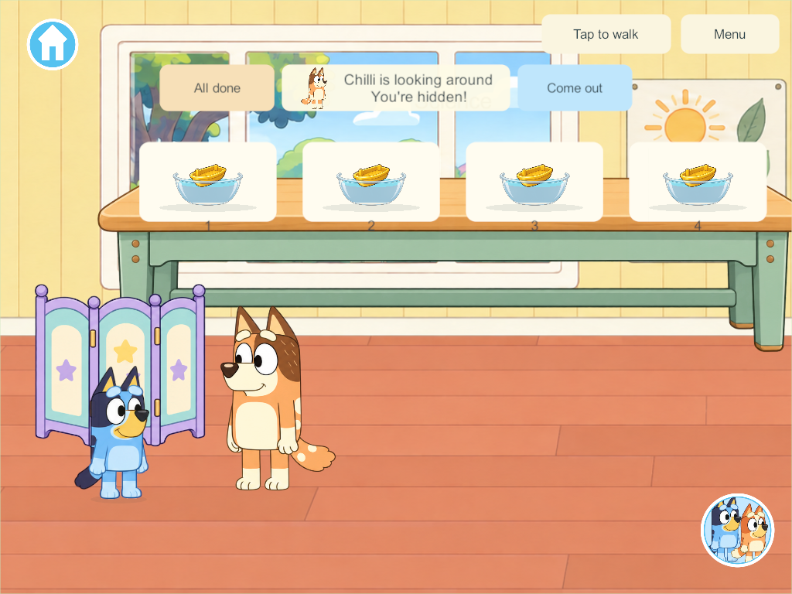

# Hide-and-seek: hide before zero to join

September 30, 2026. HIDE-01 / HIDE-03 / NPC-01. Candidate 229, schema 32/content 33.

## Requested and implemented behavior

One player taps **Start hide & seek**. Everyone on the server immediately sees the same large fifteen-second countdown, including players in other rooms/worlds. Starting neither enrolls nor moves anyone. Entering a hiding spot before zero opts in; no separate acceptance or readiness step is required. **Go hide** optionally brings its user downstairs using only the remaining shared time.

At zero, the parent searches only for players inside cover. Children who do not hide keep playing and are ignored. If no one hides, the countdown finishes and the round closes gently. Bandit and Chilli alternate; the ten first-level covers, large glowing Hide buttons and local parent-follow cameras remain.

Before zero, children can come out and choose another spot within the same shared hiding window. After zero, **Come out**, movement, another activity, room/world travel, backgrounding or disconnection withdraws only that player. They resume free play; the parent keeps finding the others. They cannot re-hide in that search or create a new countdown. Found players can play freely. The next round becomes available when no active hiders remain.

## Shared state and retained saves

The PC owns the count and the single parent search. Legacy preparation timers stay zero. Optional Go hide commands identify the round, preventing a delayed request from joining a later window. Repeated Start requests cannot reset a running count. Old Lobby/Ready/Invited enum values remain readable for previous saves, but new rounds do not use them.

Schema 32 releases old temporary hiding roles through the existing safe migration without replacing inventory, profiles, rooms or creations. Content 33 preserves the project's schema/content recovery contract. Cold reopen releases temporary hiding roles and retains the world. Offline solo uses the same rules privately; no client hosts or imports offline edits into shared state.

## Verification and delivery

[All 304 core groups](evidence/hide-window229-2026-09-30/core-results.json) pass, including staggered hiding, nonparticipants, shared timing, no-hider completion, coming out/walking after zero, stale requests and prior save migration. [Five native four-client groups](evidence/hide-window229-2026-09-30/results.json) pass: countdown in another world, nonhiders ignored, coming out after zero, four shared hiders with independent exits, empty completion and cold server restore with inventory retained. Windows Unity JSON migration/ten-slot serialization passes. [Source/artifact verification](evidence/hide-window229-2026-09-30/build-verification.json) matches all 276 C# inputs and 351 Windows artifacts. [Two private-solo groups](evidence/hide-window229-2026-09-30/solo-results.json) pass, including reopen with unchanged toys, rooms and creations. Only the Windows release is built for 229; Android/iPad 228 exports are superseded and cannot be used for this revised flow. No production server or physical device has been changed. Preserve the main integration hold. Optional clues, parent speech, upstairs search, sustained physical mixed-device play and the wider Home backlog remain open.

## Native presentation

