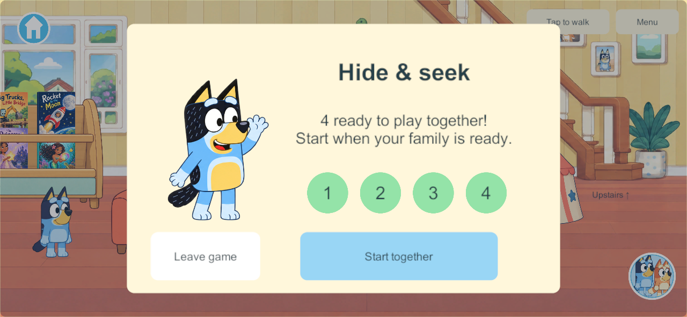
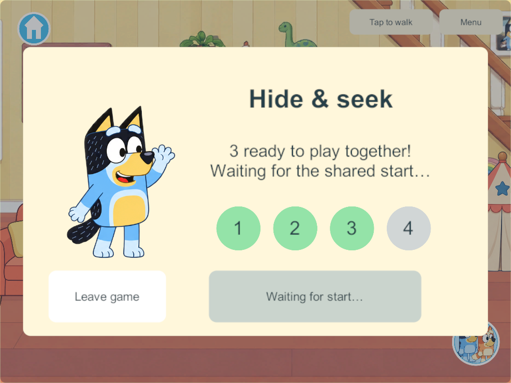
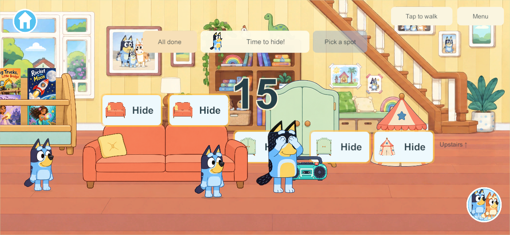

# Hide-and-seek: play together

September 28, 2026. HIDE-01 / HIDE-03 / NPC-01. Candidate 228, schema 31/content 32.

**Superseded September 30:** the user now wants one immediate broadcast countdown and hiding before zero to join. The readiness lobby below is historical candidate-228 evidence. [Current flow](hide-and-seek-hide-to-join-2026-09-30.html).

## User correction and cause

The earlier implementation had one parent NPC but gave each joining player their own 15-second preparation timer. There was no invitation/ready stage for the family. This did not satisfy the user's request to play together. Earlier tests verified independent participation rather than a shared start; that was the wrong acceptance criterion.

Every future game must support up to four people playing together. Independent movement and departures must protect the remaining group, not split it into personal games. This is now recorded in AGENTS.md and the current decisions.

## Implemented flow

1. A player opens Hide & seek and taps **Invite everyone**.
2. Every connected profile receives **Hide & seek — Join us!**, including players in other rooms/worlds. The request itself does not move anyone.
3. **Join together** accepts and brings only that player downstairs if needed. Four numbered readiness badges show how many have joined. **Not now** declines without interrupting play.
4. The inviter presses **Start together** when the family is ready. All ready players enter the same round and see the same server-owned fifteen-second countdown.
5. One parent seeks everyone. Bandit and Chilli alternate rounds. The existing ten covers, large Hide buttons, cutaways and parent-follow camera remain.
6. Moving/coming out releases only that player's cover. Leaving, travel and disconnect preserve the round, parent and other players' progress. Before start, the Start button transfers to another ready player if the inviter leaves.
7. Found players can keep moving while the parent finds the others. A new invitation is available when the round finishes. Joining an active search cannot start a personal countdown or restart the group round.

Offline solo uses the same invitation/start flow with one participant. No client becomes a host; no offline progress imports into the shared world.

## Persistence and network contract

One HideState carries the Lobby phase, organizer and Invited/Ready membership. The existing shared count is the only countdown; legacy preparation fields remain for decoding old saves and are zero in schema 31. Accept/start commands identify their invitation round, so a delayed acceptance cannot join a different round. Simultaneous invitations reuse one lobby. Abandoned lobbies expire safely; cold restores clear temporary participation while preserving the saved world.

The schema-30 migration preserves profiles, rooms, inventory and creations, safely releases old hidden poses, and retains the parent turn. Ordinary travel and accepting an invitation share the same held-item settlement rules.

## Verification and rollout

- All 303 core test groups pass, including staggered joins, duplicate/stale commands, inviter departure, common timing, movement, travel and old-save migration.
- Windows release server/client candidate 228 builds successfully.
- [Five native four-client groups](evidence/hide-together228-2026-09-28/results.json) pass: invitations across worlds, staggered readiness, shared countdown, movement/departure, inviter handoff, backgrounding and cold restore.
- [Two native private-solo groups](evidence/hide-together228-2026-09-28/solo-results.json) pass, including cold reopen with unchanged toys, rooms and creations. The first run encountered the atomic save replacement window in the test reader; its bounded retry now handles that window.
- [Build verification](evidence/hide-together228-2026-09-28/build-verification.json) confirms all 136 C# sources match the Windows release, signed Android release and iPad Xcode export, and all artifact hashes match. The iPad export still needs native Mac signing/installation.
- [Core evidence](evidence/hide-together228-2026-09-28/core-results.json) records all 303 passing groups.
- No production family session or physical device has changed. All participating clients and the server need a coordinated update because content changes from 31 to 32.

Earlier dated research remains historical evidence. Its personal-timer design is superseded by this user correction. Optional clues, parent speech and the wider Home backlog remain open. Preserve the existing main integration hold.

## Native presentation

