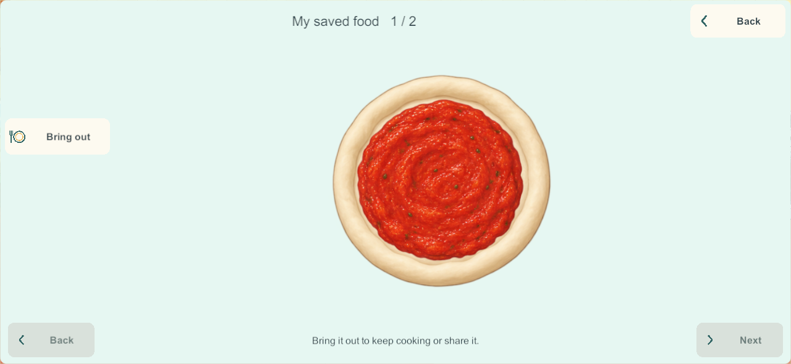
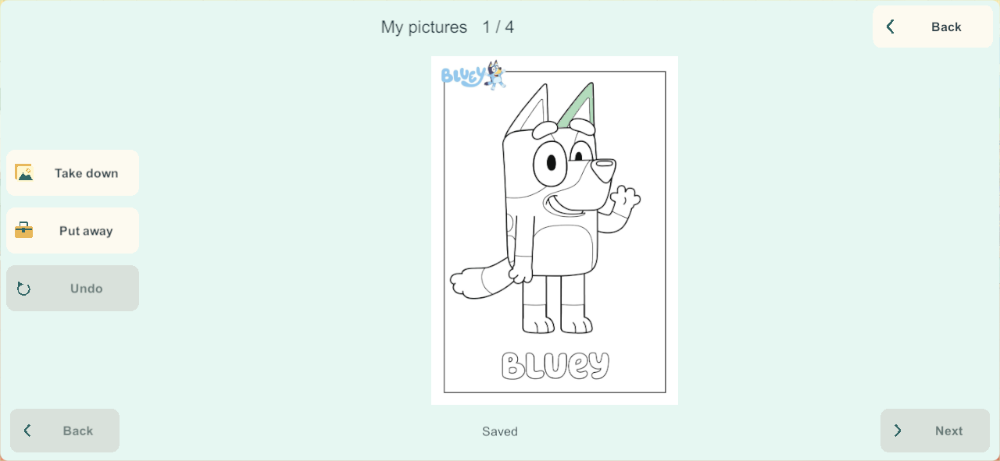
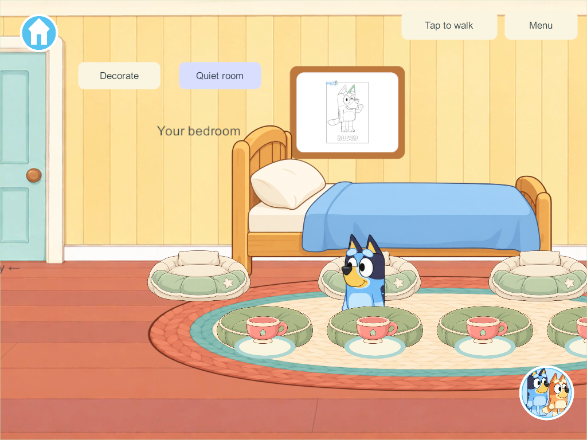

# Home creation and food storage

September 28, 2026. Second bounded slice in the user's [Home finishing sequence](home-finishing-research-2026-09-28.html). Windows candidate **205** passes the scoped engineering checks below; no phone, iPad or live-server deployment has occurred.

## Research applied

The Sago Mini and Crayola publisher references in the finishing research separate selecting a working picture from revisiting a saved creation. Here **Keep picture** freezes a copy and **My pictures** revisits it; coloring the working page afterward does not alter the saved copy. Each of four profiles has four kept-picture places, separate from all eighteen persistent working pages. One picture can hang in its owner's existing bedroom frame. Visitors can look, while changing the displayed picture remains an owner action. Putting a picture away has a single-step undo backup; a full folder refuses the operation without erasing the working page.

Food storage applies the existing persistent-object and anti-clutter requirements: **Put away** moves the same food into a profile's collection and frees its original tray or plate. **Saved food → Bring out** moves it onto a clean free tray. It keeps the food ID, recipe/version, ingredient unit IDs, placements, partial preparation, heat state and remaining portion bits. Two food places per profile give eight bounded family places; food remains on its existing dish if storage is full. Held food and actively heating food cannot be put away. Collections are protected from the five-minute temporary reset; this slice does not automatically archive abandoned meals.

The food/picture counts are implementation capacity choices, not numbers established by the children's-app research. Essential controls retain the accepted cream/teal picture-and-word style. The collection shows one large creation at a time with visible previous/next controls rather than a dense grid of tiny art.

## Persistent contract

Schema **23**, content **24**, network contract **17**. Migration is additive after schema 22: existing rooms, coloring, food, activity timers, saved records and enrollment retain their data. Only new collection state is introduced. Older server/client releases require a coordinated matching update before shared play.

The versioned collection is part of the full snapshot, ordinary saves, shared views, recovery and private continuation. Its binary payload is losslessly compressed and Base64 encoded, with an 8,192-character encoded limit and 65,536-byte decompression limit. Counts and strings are bounded before allocation. Capacity rejection occurs before removing food or artwork from its prior location. The codec compares decoded content, not compressed-byte equality across runtimes: [.NET DeflateStream documentation](https://learn.microsoft.com/en-us/dotnet/api/system.io.compression.deflatestream?view=netstandard-2.1) notes that compression results can differ across versions/platforms. [BinaryReader documentation](https://learn.microsoft.com/en-us/dotnet/api/system.io.binaryreader?view=net-10.0) informs the explicit typed reads and end-of-stream checks.

The existing shared-view transport cap is unchanged. The archive contributes at most 8,192 ASCII bytes beyond the previously measured maximal kitchen/science/coloring world. This follows the bounded-state approach discussed in [Unity's Boss Room networking optimization guidance](https://mp-docs.dl.it.unity3d.com/netcode/2.3.2/learn/bossroom/optimizing-bossroom/), rather than increasing queues to mask larger snapshots. Native delivery and restart evidence must still pass.

Saved art and its room frame reference-count any shared original page texture; closing one view cannot unload the other's artwork. The collection reuses its selected drawing data rather than rebuilding all eighteen pages every frame.

Native visual review exposed aliasing when the full-size line art shrinks into a bedroom frame. The twelve original page textures now import with mipmaps and trilinear filtering, using Unity's [mipmap guidance](https://docs.unity3d.com/6000.3/Documentation/Manual/texture-mipmaps-introduction.html). The source images and region masks stay unchanged; only the active page textures incur mip storage. Physical A10 memory/performance still needs qualification.

## Verification record

[All 254 core groups pass](evidence/creations205-2026-09-28/core-results.json), including additive migration, four storage owners, held/heating/capacity guards, conserved portions, duplicate-command idempotence, immutable pictures, undo and bounded/corrupt payload handling. The maximum kitchen/science/coloring world with eight full stored foods and sixteen kept pictures measures **100,072 bytes**, below the existing 131,072-byte reliable payload cap. Recovery transfers retain it exactly.

[Seven native creation groups](evidence/creations205-2026-09-28/results.json) pass in 205: actual build-202 migration, four real food-store/restore paths, four picture folders and bedroom displays, immutable copies/removal undo, phone/tablet target checks, restart and exception-free shutdown. [Four additional release-authority rule groups](evidence/creations205-2026-09-28/rules-results.json) passed in 204 with identical storage rules. [Seven isolated production-recovery groups](evidence/creations205-2026-09-28/recovery-results.json) pass in 205, including saved food/pictures, byte-exact protected enrollment, rollback, interrupted restore, invalid-input refusal, original-client rejoin and no packet-queue overflow. Parent/recovery helpers now explicitly recognize schema 23/content 24; 205 is qualified for this existing recovery route.

[Source checks](evidence/creations205-2026-09-28/source-check.json) match all 119 game C# files and twelve coloring import settings to Windows 205. [Native visual review](evidence/creations205-2026-09-28/visual-review.json) checks fitted full pages, saved-versus-working colors, readable controls and the bedroom frame after closing its folder. Target checks use native pixels, not physical points or a child-usability certification.

The first core run passed the seven new storage groups but failed an old maximum-world fixture that still constructed schema 22 while requesting current content 24. It was updated to schema 23 and expanded to collection capacity. Windows Application Control initially blocked the rebuilt standalone assembly; a later normal `dotnet run` succeeded with all 254 groups. No security settings changed. [Test history](evidence/creations205-2026-09-28/core-validation.json).

Early native test corrections account for Unity's public JSON serializing null dishes/strings as empty records/strings; exact CLR preservation is checked by the core storage tests. Fixture camera placement and real tray entry settle before synthetic taps. Page selection honors the existing local page choice, and stair fixtures wait for the client to receive the new area before issuing the next command. The final 205 seven-group run completes in one invocation.

Signed Android **205** is also built with the pinned family key. [Android source/artifact check](evidence/creations205-2026-09-28/android-source-check.json) matches all 119 game C# files and twelve coloring imports; the build/signing pipeline verified the unchanged Unity payload. It is ready but **not installed**. Samsung remains 200; server/iPads remain last recorded at 171.

## Remaining sequence

Extend cooking from the complete chocolate-cake process to the remaining cake, pizza and meal stages. The researched ramp/marble activity follows cooking. Full Home completion, freehand drawing, broader durable object storage, physical A10 performance, mixed-device lifecycle/recovery and child usability remain open. The existing hold on integration to main remains.
