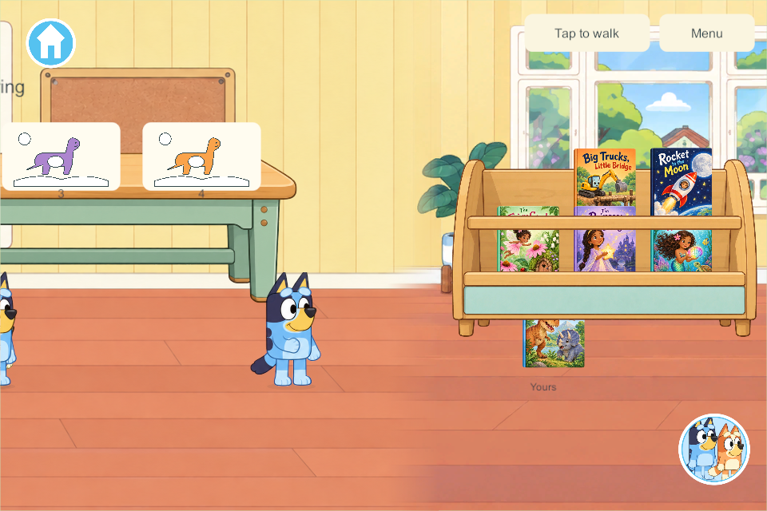
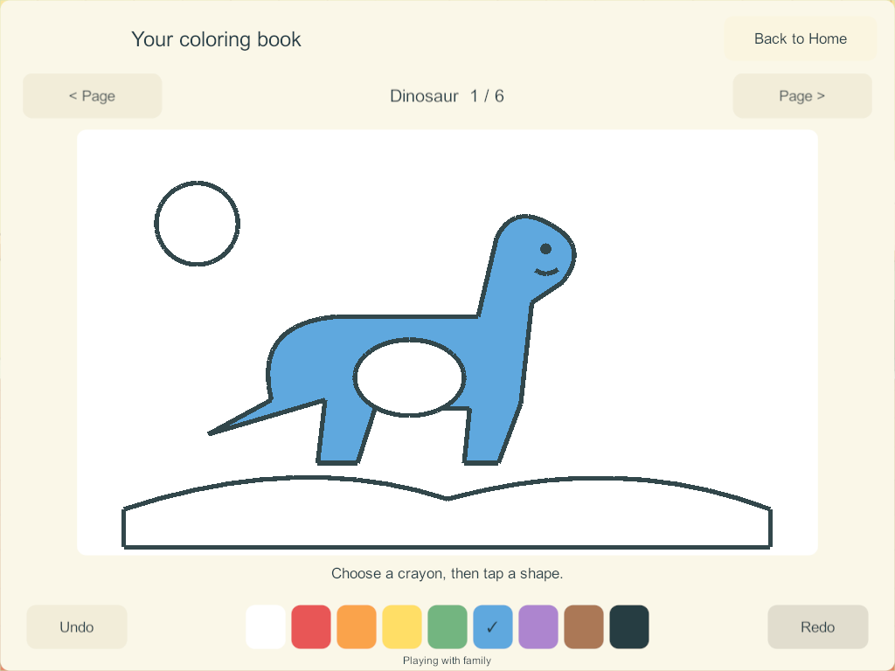

# Shared downstairs science and coloring — first Unity slice

September 27, 2026. Goals: SC-1, the first SC-2 experiments, LAB-01 / H-29–30, SCI-01/02/04 and the tap-fill portion of COL-01–05/08. Home, the eight-station science catalog and coloring remain **Partial**.

The first game implementation adds a connected downstairs science and coloring bay beside the living-room books. Walk left past the bookrack and tap **Science** or **Coloring**. Each family profile has its own persistent workspace. This is a Windows candidate; no phone, iPad or live family server was updated by this task.

## What works in this slice

| Area | Usable behavior | Remaining scope |
| --- | --- | --- |
| Shared downstairs | Two separate interactive workbenches, four visible work mats each, clear front walking space, continuous living-room route | Physical touch/visual acceptance and A10 performance |
| Floating boats | Add/remove up to seven cargo blocks; compare narrow/wide hull capacity, lift out and return, reset only your tray | More material samples, freely placed cargo, picture invitations and richer motion |
| Magnet materials | Drag a magnet with an immediate local preview, or tap a named material to compare; nearby iron follows, wood/plastic/aluminum stay | Second magnet/poles, guided trails and more illustrated samples |
| Colored light | Independently toggle red, green and blue; all eight combinations show on the screen, including yellow and white | Movable overlapping spots, flower art and optional picture invitations |
| Coloring | Six fitted pages: dinosaur, truck, unicorn, snake, garden and house; nine colors; tap a closed region; page-local undo/redo | Freehand/blank drawing, creation folders/gallery, carrying pictures, Together permissions and final art review |
| Four players | Separate profile-owned trays/pages, independent entry/exit and resets; another player's work is protected | Sustained mixed physical-device acceptance and mixed-activity endurance |

The science models are deliberately simple demonstrations, not general physics simulations. There are no scores, timers or forced sequences. The coloring templates are original schematic pages, separate from the narrated books and their requested final story subjects. No new narration or sound-effect acceptance is claimed.

## Research used in the implementation

The [applied research](home-science-coloring-research-2026-09-27.html) contains the primary-source links and full eight-station plan. This slice applies its findings directly:

- Same cargo can sink a narrow hull and float in a wider one; removing cargo reverses the result. Weight alone is not the rule.
- Only the iron sample visibly follows the ordinary magnet. Aluminum is included to avoid teaching that every metal is magnetic.
- RGB uses additive light: red + green = yellow; all three = white. It does not use paint-mixing rules.
- Large coloring regions and tap fill reduce precision demands. Tools surround the whole fitted page. No correct-color score restricts a child's choices.
- Per-profile state and independent resets preserve another child's work and survive avatar changes.
- One bounded UI mesh draws a page. Shapes are authored closed polygons, so fill does not scan pixels or leak through antialiased outlines. Unchanged workspace meshes are reused.

The research proposes separately fetched artwork for unbounded drawing content. **This first slice has no strokes or image payloads.** Its fixed six pages contain 44 region colors per profile and at most 20 undo plus 20 redo entries per page. Those small bounded fields remain in existing authoritative snapshots. Freehand work must implement the separate content/operation protocol before it is added; per-point full-world messages are not an acceptable extension.

## Room, state and compatibility

The bay extends the existing garden/Home area's left bound from **−4800 to −7200**, without shifting any existing room, kitchen, book, stair or toy coordinate. Science is centered at −6590; coloring at −5460. The old schemas retain their original bounds. The architecture image contains no painted tables; separate table artwork and live workspace graphics provide the interactive layers. The scene continues to use at most three loaded/requested panoramas.

**Schema 16 / content 17** adds one discovery record per saved player profile. It preserves existing players, rooms, dishes, objects, enrollment and command receipts. Page edits carry a page revision as well as the existing command identity; stale/foreign/malformed edits refuse without mutation, and repeated accepted command IDs remain idempotent. Undo affects one owner's current page only. Closing an activity, traveling or losing focus cancels temporary gestures.

Installed solo uses the same state/rules and private saves. Connected play uses the PC/VPS authority; existing reconnect rules load the authoritative world without uploading private edits. A mixed content-16/content-17 family deployment must not be attempted: coordinate server and clients when delivery is requested. This candidate inherits the 172 shared-play/countdown/audio changes, whose physical acceptance remains open.

## Verification

The final evidence is recorded beside this report. Core checks cover additive migration, four independent trays/pages, scientific state, bounded undo, duplicate/stale/foreign rejection, malformed saves, travel/avatar persistence and disconnect independence. The full kitchen plus four maximum coloring histories produces a **70,139-byte** compact world view, below the existing 131,072-byte wire limit; recovery serialization also remains inside its bound. This is a payload bound, not a sustained-network performance claim.

Build 173 passed seven native groups with four real Windows clients: an actual 172 save upgrade, science UI, magnet drag and RGB, all six page layouts, independent undo/travel, carrying a living-room book across the scenery seam, and authority restart/rejoin retaining all creations. Visual inspection found a small gap between magnet curve segments; the final candidate replaces it with one closed mesh.

Final candidate build, native rerun, recovery qualification and source/artifact evidence are listed in the completion record below. Desktop viewport captures do not establish real phone/iPad hit sizes, audio output, child usability or sustained A10 frame time.

### Final candidate 174

- **201 core checks passed**, including the combined maximum kitchen/coloring payload and recovery validation. [Core results](evidence/discovery174-2026-09-27/core-results.json).
- **Windows client and dedicated server compiled with zero errors and zero warnings.** Schema 16/content 17; build-manifest contract 17 is retained. [Build summary](evidence/discovery174-2026-09-27/build-summary.json).
- **All seven native acceptance groups passed again on 174**, with four separate Windows clients and an actual 172-to-174 saved-world migration. All six pages were captured; tablet 1024×768 and landscape-phone 1280×591 layouts keep the complete pictures and controls visible. [Native results](evidence/discovery174-2026-09-27/results.json).
- **All six native recovery groups passed** with four populated science/coloring workspaces. Checks include exact restore, original enrollment, rollback, ten invalid/unsafe backup cases, interrupted replacement, damaged-primary repair and missing-world reconstruction. The initial run correctly refused the newly introduced save schema; the parent/recovery helpers and game-rules validator now explicitly support schema 16. Build 174 is added to the recovery-qualified list only after this pass. [Recovery results](evidence/discovery174-2026-09-27/recovery-result.json).
- **1,095 packaged runtime-source files and 351 artifact files verified.** Editor-only metadata whitespace was cleaned without changing importer fields or accepted character art. Host recovery/document tools changed after the native build and were verified separately. [Artifact verification](evidence/discovery174-2026-09-27/artifact-checks.json).

These tests used disposable local worlds. No live family save, enrollment, server process or physical device was changed. The Windows candidate stays on `codex/home-science-coloring`; the existing development-lineage hold on main remains until outstanding physical/book/shared-play qualification is resolved.

[Boat tray](evidence/discovery174-2026-09-27/loaded-boat-tablet.png) · [Corrected magnet](evidence/discovery174-2026-09-27/magnet-materials-tablet.png) · [RGB light](evidence/discovery174-2026-09-27/colored-light-tablet.png) · [Landscape phone layout](evidence/discovery174-2026-09-27/coloring-phone-landscape.png).

## Remaining work and next bounded slice

The later user request asks for deeper fun/presentation research. The [game-reference follow-up](home-science-play-design-2026-09-27.html) recommends a complete illustrated SCI-01 cargo-harbor loop next, before applying that standard to magnets/RGB. The candidate screenshots above remain schematic, not accepted final presentation. No redesigned science build exists yet.

The previously queued **blank drawing with bounded stroke storage and separately fetched artwork**, durable per-profile creation folders, and gesture-scoped undo remain required. Keep the existing region-fill pages working. Real display/carry records and optional Together editing still require their own concurrency tests.

Ramps, dinosaur shadows, bubbles, vibration and plant growth all remain required science scope. Final science illustration/interaction polish, optional spoken prompts, older-iPad performance, physical lifecycle/outage/rejoin, mixed cooking/science/art endurance and coordinated retained-data device delivery remain open. No feature phase is marked complete from source tests alone.

## Source art

Original generated room and transparent workbench assets, their source hashes and prompt specifications are retained in [the discovery source-art record](../../SourceArt/Discovery/README.md). Accepted Bluey/Bingo artwork is unchanged. The new scenery and schematic pages are implementation drafts awaiting user visual acceptance.
