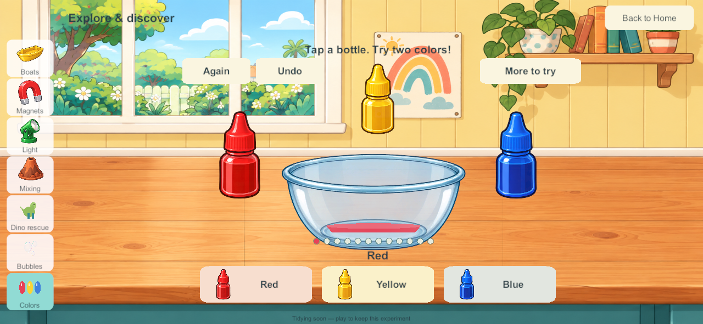
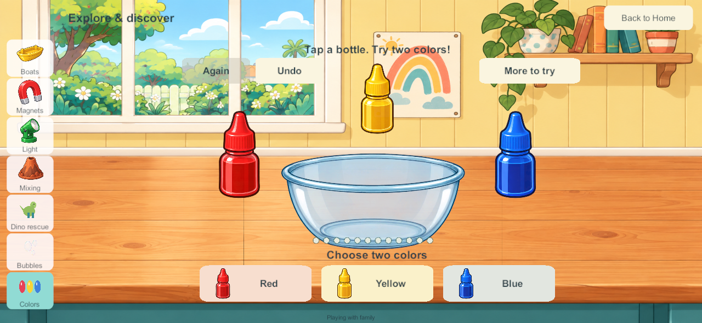

# Five-minute Home activity cleanup

September 28, 2026. ITEM-03 / G-25 / LAB-01. The user reports clutter and unfinished mini-games around Home and explicitly selects **five minutes** of inactivity. This bounded slice applies the item categories and authority rules in [goal-sheet chapter 51](../bluey-game-research-2026-09-23.html#51-automatic-item-returns-stocked-areas-and-tidy-bedrooms).

## Behavior

- Each of the ten current science experiments has a separate clock for each of four profiles. Five eligible idle minutes bring a brief “Tidying soon” cue; five seconds later the temporary tray resets. Reopening or using that experiment cancels its pending reset. Touching another experiment, changing avatars, and duplicate/rejected commands do not refresh it.
- Floating boats, magnets, RGB lights, four mixing experiments, dinosaur ice rescue, bubbles and liquid colors are covered. Running reactions, melting and floating bubbles finish before their idle period starts. Ice, bubble and liquid reset retains the existing one-step Undo state.
- Loose communal books and kitchen ingredients/tools/dishes return as the same objects. No ingredients respawn. Food keeps its identity, ingredients, recipe stage, portions and decorations. Empty dirty dishes are washed; unfinished and uneaten food is retained. This does **not** archive food or free every tray occupied by a saved dish.
- Held items are protected. An occupied home support defers return. Heating completes to its safe ready state before a cooking tray becomes eligible. Unused fridge/cupboard/oven doors close and the sink turns off after kitchen inactivity; kitchen actions renew that clock.
- A landed, unused Keepy Uppy balloon returns to its clear lawn starting point. Flying balloons are protected. Garden bucket/sponge returns and completed flower/puddle repeats adopt the same five-minute grace in the upgraded world; older saves/builds keep their historical rules until upgraded.
- Drawings and undo history, bookmarks, bedroom furniture/decorations, personal toys, stored creations and the protected home ball are excluded. No room or whole-world wipe occurs.

## Persistence and four-player authority

Schema 22/content 23 adds bounded Home inactivity records. Upgrading 198 gives existing content a full grace period without moving or deleting it. Timers advance only with an active solo session or connected family; no overnight wall-clock catch-up occurs. The PC/VPS alone performs shared resets. Full checkpoints retain elapsed clocks; ordinary client views carry compact pending cue indices against a deterministic item/activity key list. Private local continuation keeps its own state and never uploads offline changes to the authority.

A science reset changes that tray's generation token, so an old in-flight pour cannot modify its replacement. A meaningful action cancels the matching clock, not every sibling's activity. Native client opening/selection messages renew only the chosen experiment.

## Validation and delivery

Build 200 completes scoped native qualification. All [247 core groups](evidence/tidying200-2026-09-28/core-results.json) pass. A full kitchen, maximal drawing histories, all science/undo data and every cleanup cue fit in a [98,422-byte shared view](evidence/tidying200-2026-09-28/payload-check.json), below the 100,000-byte budget. [Six native groups](evidence/tidying200-2026-09-28/native-results.json) cover additive 198 migration, four independent native clients, a real five-minute timer with its cue, an active sibling continuing while three idle trays reset, loose kitchen stock/storage, held books, retained paintings/bedrooms and clock persistence through restart. [Visual review](evidence/tidying200-2026-09-28/visual-review.json) records the native screenshot and test-harness corrections. The restart comparison allows less than one nanosecond of JSON double round-trip error; no clock advancement was hidden.

[Seven isolated recovery groups](evidence/tidying200-2026-09-28/recovery-results.json) pass: live backup, exact restore, original four-player enrollment/rejoin, invalid-backup rejection, interrupted recovery, damaged-primary repair and encrypted recovery without packet-queue overflow. The production recovery tool now recognizes build 200. No live family server was restarted or modified.

[Source and artifact checks](evidence/tidying200-2026-09-28/source-artifact-checks.json) match all 116 Unity C# files across current source, Windows and signed Android, with 351 Windows files and the APK verified. [Android inspection](evidence/tidying200-2026-09-28/android-artifact-inspection.json) passes identity, family signature, release mode and ZIP/LOAD alignment. The inherited 16 KB RELRO gate remains open; physical A10/child acceptance is separate.

## Samsung delivery

Build 200 updated 198 in place with the pinned family signing identity. The installed APK hash matches the fresh release exactly. All 21 primary saves and 21 backups remain; twenty of each are byte-identical. The active private save migrates 21 to 22 with all 118 objects, every food dish, four bedrooms, four secret rooms and all existing science/art records unchanged. Only the new cleanup metadata, ordinary clock/player activity and the schema/revision change. The unlocked phone visibly resumed Bingo at the saved beach; Home and the shared book rack were subsequently visible. [Delivery evidence](evidence/tidying200-2026-09-28/android-update.json).

The physical phone has 4096-byte pages. The five-minute timing test was performed with native Windows clients, not repeated as a physical phone timing qualification. Server/iPads remain last recorded at 171 and were not updated; shared cleanup requires coordinated matching-content deployment. No full Home completion is claimed.

## Remaining scope

This is controlled cleanup for installed Home systems, not the complete general loan/stock policy. Personal toy organization, creation galleries/storage, food archiving, spoken cleanup cues, future mini-games, physical child/A10 acceptance and the wider Home backlog remain open. Saved food may still occupy its original dish; its content is deliberately retained. The existing branch integration hold remains.

Next bounded task after this correction: resume the accepted picture controls for coloring. Preserve the eighteen coloring pages, four independent creations and undo/redo.
