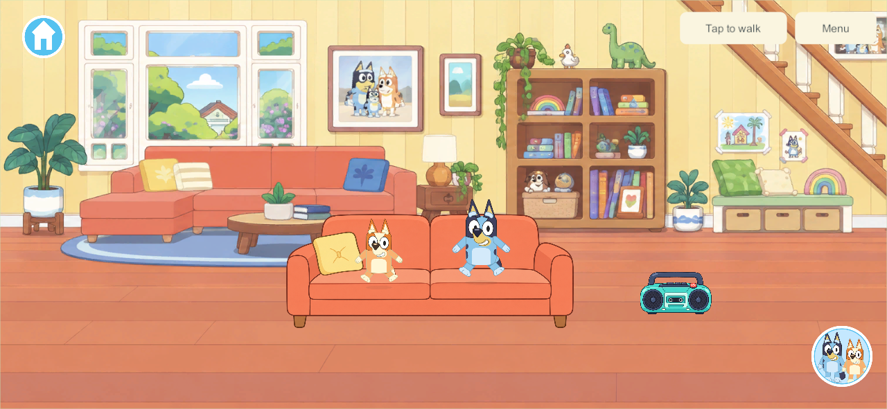
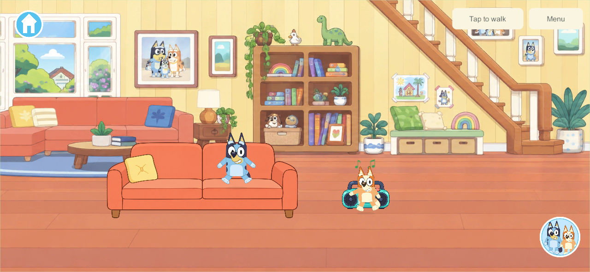
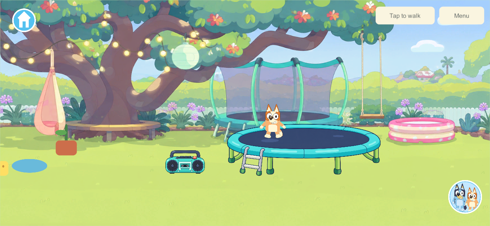
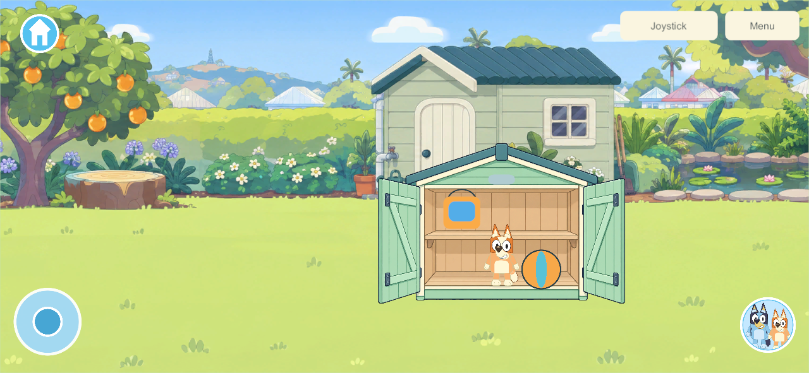
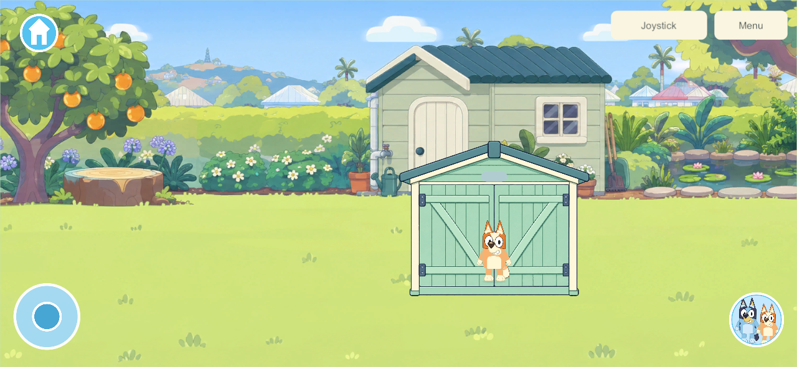
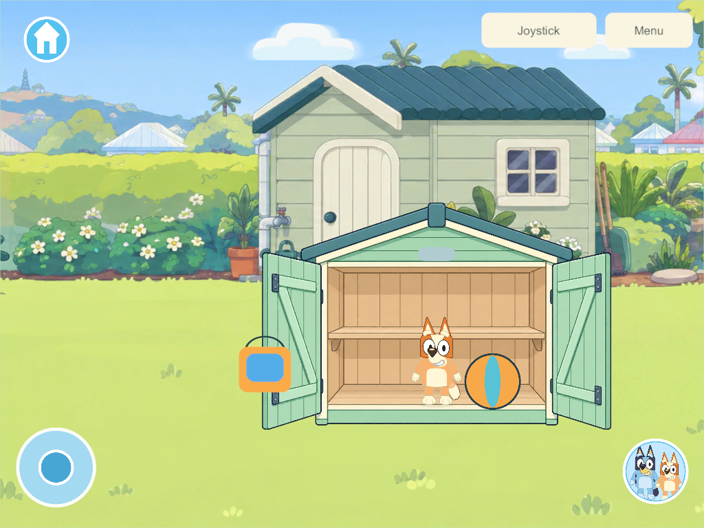

# Home interactions — first playable property pass

September 25, 2026 · **HOME-01** · Goal references: CHAR-01, WORLD-01/WORLD-02, ITEM-02/ITEM-03, STOCK-01; research chapters 32, 50–51 and Bluey reference sections 18–20. This is a bounded G5/G6 interaction slice, not completion of the full home or any phase gate. [Current decisions](../current-decisions.md) remain authoritative.

## What this pass adds

| Place | Playable behavior |
| --- | --- |
| Living room | Two sofa seats with exclusive occupancy, bent-leg poses, tap again or walk to stand, Bluey/Bingo switching while seated |
| Living room and backyard | Radio power buttons, original instrumental loop, nearby idle characters automatically dance through three phrases; walking, holding a prop or another activity takes priority |
| Backyard | Two trampoline spots, compressed landing, rising/tucked feet, moving arms, mat reaction and grounded changing shadow; walking/travel/departure safely leaves the spot |
| Shed | Open/closed doors, four placement targets, one actual item per slot, full bucket and loose ball storage, preserved identities and contents, retrieval after travel/reopen |
| This device | Music mute independent of voice hints and the family's shared radio switch |

The whole house/backyard remains the existing continuous property. No feature work is added to Park, Creek, Beach or Daycare. The five existing garden/creek props continue working.

## Research decisions carried into the implementation

- Read the maintained 55-chapter goal sheet, current build guide/decisions, Bluey reference interaction study and Toca/Piknik supplement before implementation. This is implementation of that research, not a new claim to have externally reverified every commercial-game feature.
- Temporary furniture occupancy belongs to one stable player ID. Switching between Bluey and Bingo retains the seat. A second player cannot displace the first. Entry settles held objects in the same transaction with contents intact.
- Direct tap-to-use is the current Simple Play entry. Animated approach/navigation and bespoke authored exit clips remain further polish. A shared animation clock seed is advanced locally between authoritative snapshots, without sending limb transforms.
- Closing the shed hides its contents; it does not delete/recreate them. Invalid/full/closed targets reject without consuming the held item. The UI then safely settles the rejected drag.
- The garden's borrowed bucket/sponge still return after 180 eligible play seconds plus the five-second cue, even inside storage. Timers survive recovery; storing a borrowed tool does not make it personal. Their ordinary water is drained only by the existing return action. The home ball is a protected fixed home toy and has no idle return. This does not implement the full personal catalog/loan system.
- Radio on/off and shed state persist; seat/bounce leases release on recovery, suspension, departure or travel. Local mute never changes the shared radio or another device's volume. Offline edits remain private; reconnect loads the PC/VPS authority.

## Save compatibility and rollout

Home adds **schema 4 / content 5 / protocol 3**, preserving prior IDs, water, positions, receipts and timer data. Schema 1→2→3 upgrades remain distinct and readable. Existing content-3/schema-2 and content-4/schema-3 recovery records remain accepted. The older unfinished bedroom experiment is not merged; its schema assumptions need a separate rebase.

At this milestone the live family server and installed Android remained build 110 while the family tested. Apple updates stay deferred as requested. This new content requires a coordinated server/client update and recovery qualification before family rollout. Build 110 remains the newest writer in the production recovery allowlist; this milestone did not qualify a new production writer or install a device. **September 26 follow-up:** [fresh Android 115 is installed](android-home-update-2026-09-26.html) with prior item data retained and home presentation verified; it currently plays solo. Server/helper 110 and deferred Apple 101 remain unchanged. [WALK-01](walk-animation-research-2026-09-26.html) now precedes further kitchen/bedroom implementation following the user's walking-appearance clarification.

## Validation

**Windows release client/server 114 pass.** [92 core checks](evidence/home-interactions-2026-09-25/core-rules.json) cover migration, occupancy races, interrupted use, storage capacity/closure, water/identity retention, idle returns, recovery-version compatibility and all prior core behavior.

[Five native acceptance groups](evidence/home-interactions-2026-09-25/result.json) pass in the actual release game: two clients use separate sofa seats and reject conflicts; radio/audio/dance and local mute; animated trampoline while the sibling stays seated; native touch shed storage/close/travel/retrieval at phone and tablet aspect ratios; separate offline home cold reopen. Tests use new isolated worlds and credentials. Neither live family saves nor devices were accessed.

Shared bounce timing was corrected after captured frames exposed a stationary pose in the first candidate. The final check requires its presentation age to advance and retains three distinct bounce captures. UI test placement commands only retry explicit stale-revision rejections; real touches use the game's ordinary acknowledged command queue.

The final native check also requires walking off the trampoline to switch the local pose to Walk, settle to Idle after stopping, and release the spot in the sibling's view. The movement lane clears the temporary pose while the authority publishes the occupancy change.

**Android 114** release APK built and signed with the pinned family identity; payload integrity and package/signature checks pass. [Both builds match all current Unity C# files](evidence/home-interactions-2026-09-25/builds.json). [Static Android inspection](evidence/home-interactions-2026-09-25/android-114-inspection.json) still fails the existing ELF RELRO 16 KB checks in six native libraries; native 16 KB runtime qualification remains open. No APK installation or family-server update occurred. **Four-client recovery:** [final build 114 passes all six isolated groups](evidence/home-interactions-2026-09-25/recovery-114.json): live backup, exact restore/rollback, invalid-backup refusal, interruption recovery, damaged-save repair and reconstructed enrollment. A stored ball and the radio survive restore, and all four original test players reconnect. The production allowlist remains unchanged.

### Sofa and radio

### Trampoline

### Shed

## House layout and next feature passes

| Connected part | Next detailed work from the research |
| --- | --- |
| Living room / hall | TV with parent-managed local media, readable/usable books, cupboard contents, additional seats and authored prop surfaces |
| Kitchen / dining | Fridge, cupboards, sink, ingredient storage, transactional food assembly, plates/serving, oven timing and visible state; the goal sheet retains at least five pizzas, five cakes and five meals |
| Bedrooms | Stable child/room ownership, persistent furniture/decorations, toy chest/catalog, visitor permissions, protected personal creations and safe migrations |
| Secret rooms | Independent bedroom doors, plush collections, stars/northern lights, visits without moving the sibling |
| Bathroom / laundry / connecting rooms | Bath/water interactions, towels and storage, dressing and bedtime links, clear transitions with independent cameras |
| Verandah / yard / rear garden | Swing, hose, watering can, pool, wagon, sand/mud/planting, shed hooks/bins, additional item–item combinations |
| House activities | Dinosaur/plush play, hiding/forts, science, books, music and shared family pretend play; retain every goal-sheet feature |

**Next bounded implementation:** the kitchen's fridge/cupboards and food-placement/serving chain using durable item/container records, followed by the bedroom persistence rebase. Recipe creations must retain identity/toppings, and shared loan policies must expand before opening unlimited supply. The rest of the worlds stay scenic while the home receives sustained work.

Current limits: foreground fixtures are interactive; furniture baked into the panoramas remains decoration. Nested portable containers, per-child room permissions, four-device home qualification, long-session A10 performance and physical visual approval remain open. Two native clients are useful engineering evidence, not four mixed physical devices.

Asset provenance: [home source manifest](../../SourceArt/Home/manifest.json), [source notes](../../SourceArt/Home/README.md); built-in image generation and an original synthesized music loop.
