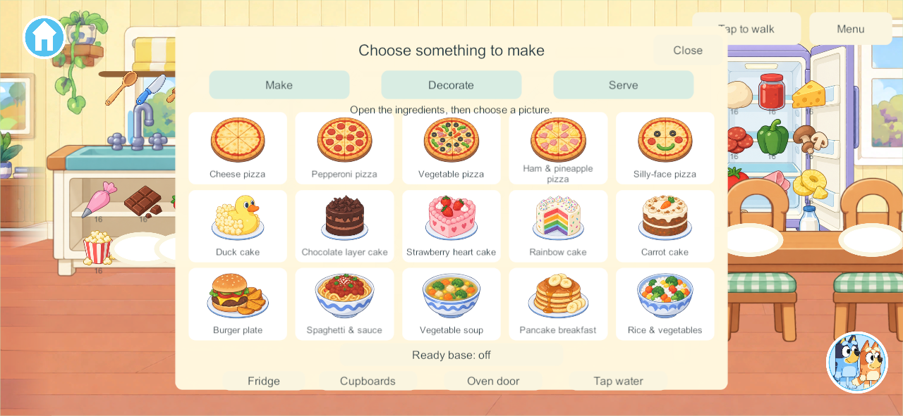
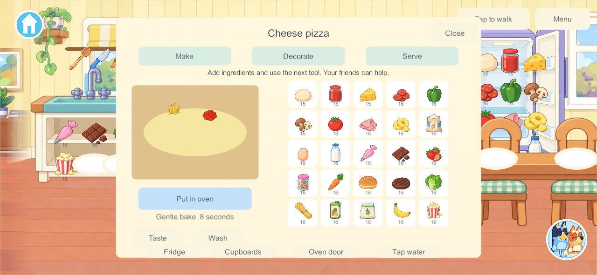
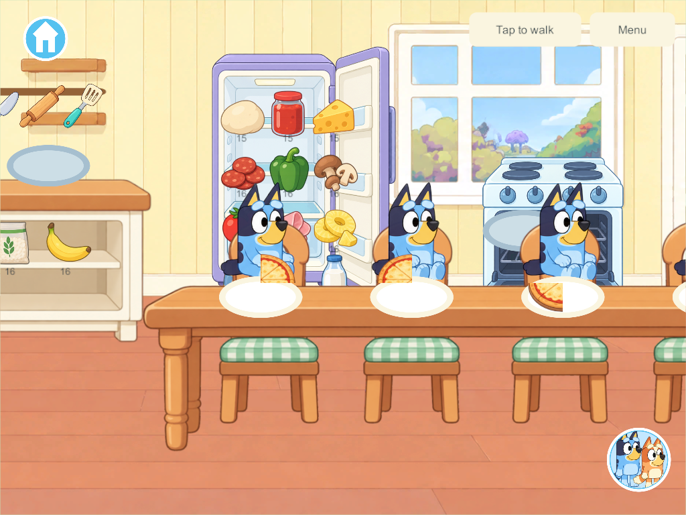

# Home kitchen — September 27, 2026

**Later implementation — candidate 166:** [The researched ease-of-use correction is now implemented](kitchen-easy-2026-09-27.html), with scoped engineering evidence and physical acceptance still open. Samsung remains 162. The dated research/prototype record below describes its original milestone.

**User preview feedback, September 27:** the concepts are liked, but the table blocks the fridge/oven, tray selection does not work as expected and opening drawers for ingredients is confusing. These usability issues are open. The user wants a large central dish surrounded by easy ingredient choices. [Follow-up deep research and correction contract](kitchen-child-friendly-research-2026-09-27.html) is complete; no corrective game build has been made in that research pass.

The user authorized four stages: usable kitchen fixtures and four dining places, durable ingredients/tools/plates, one complete four-player pizza, then all 15 researched recipes. This is a playable kitchen prototype within the existing connected Home property. The full COOK-01 goal remains Partial: custom transformation animation, optional orders, albums, drinks and physical acceptance are still open.

## What changed

- Separate illustrated fridge, four cupboards and worktops, sink/tap, oven and four dining seats replace the painted furniture in this room's background. Stored objects become visible and pickable only when their actual container is open.
- Four reusable trays, eight plates, four sets of four utensils and 25 ingredient packages add **53 persistent objects** once. Empty ingredient packages can be deliberately replenished; refilling changes the package batch and does not spawn more props.
- Make / Decorate / Serve uses large recipe pictures, ingredient taps or drops, a next-tool control, worktop gestures, and physical utensils. Ready-base assistance consumes real recipe ingredients. Each cook can work independently or contribute to an available dish; there is no kitchen-wide lock.
- Five pizzas, five cakes and five meals have individual recipes and preparation sequences. Required ingredients are consumed once before baking. Extra ingredients remain valid play. Heating pauses if the tray leaves the oven and stops safely at ready when a child walks away.
- Food carries a stable dish ID, preparation step, recipe, counted ingredient-unit IDs, extra decoration positions and four portion bits. Serving removes one bit from the source and gives it to a clean plate. Tasting consumes portions; washing reuses the empty plate or cookware. A fifth serving cannot duplicate a consumed portion.
- Plates and food can be carried through the existing stairs and rooms. The bedroom plate reader offers Taste and directs washing back to the kitchen. Original Bluey/Bingo art, accepted movement, menus, books and room play remain in use.

The finished food art is a preset illustration for each researched recipe, with separately placed extra food toppings. Standard recipe ingredients are represented in that illustration; this is not yet an exact illustration of every hand-placed standard topping, a soft-body slicing simulation, stretchy cheese or a custom layer/duck sculpting system. Those full target behaviors remain in the tracker.

## Persistence and shared play

`Kitchen.cs` introduces **schema 13, content 14, build contract 15**. The migration adds stock to schema-12 saves while preserving prior objects, rooms/owners, receipts and family enrollment. Four created secret rooms plus kitchen inventory produce **150 bounded world objects**. Existing save versions remain readable by the forward migration; never downgrade the installed app or rewrite the live family's world as a test.

One PC/VPS authority owns ingredients, tools, fixtures and portions. Clients retain independent cameras and cooking panels. A player leaving does not cancel other cooking. Offline changes remain in separate private saves and are not imported on reconnect.

Unity serializes null inline objects as empty records. Validation normalizes only wholly empty food metadata; malformed nonempty data is rejected. Reliable fragmented views allow **128 KiB** to include Unity's inline records and the maximum food inventory; unreliable motion remains capped at **1,200 bytes**, and chunked recovery remains **256 KiB**. The production recovery allowlist is unchanged.

## Research and artwork

[Applied research](kitchen-research-2026-09-27.md) maps the goal-sheet requirements and primary UI/interaction sources to this implementation. [Source art and provenance](../../SourceArt/Home/Kitchen/README.md) retain imagegen originals, generation briefs and hashes. Unity selects explicit sprite rectangles from the untouched atlases; recipe silhouettes and food-only toppings use inspected bounds rather than assuming uniform spacing. The architecture uses a separate versioned resource, so old source imagery remains intact.

## Validation and delivery

Qualification results are collected in [the evidence directory](evidence/kitchen162-2026-09-27/):

- **178 core checks passed**, including one-time ingredient consumption, all 15 recipe sequences, four cooking places, single holders, portion conservation, closed storage, tool return and additive migration. [Core results](evidence/kitchen162-2026-09-27/core-tests.json).
- **Six native kitchen groups passed in 161**: real appliance touches; complete pizza via taps/gesture/oven/serving; four diners and independent washing; four safe simultaneous bakes with a departing cook; all 15 recipes; and maximum-state delivery to four clients. [Native results](evidence/kitchen162-2026-09-27/native-kitchen-build161.json). The maximum native view measured **79,543 compact JSON bytes**, with 150 objects and 288 ingredient records across twelve food containers. [Bounds](evidence/kitchen162-2026-09-27/wire-bound.json).
- **Three migration/private-play groups passed in 161** against an actual 155 checkpoint: exact prior fields and enrollment retained, food carried upstairs, outage/private taste/cold reopen, authoritative rejoin without private import, current backup and restored-155 migration. [Continuity results](evidence/kitchen162-2026-09-27/continuity-build161.json).
- **Six isolated recovery groups passed in final 162**, covering protected backup, exact restore and four original profiles, rollback, ten invalid-bundle refusals, interrupted recovery and missing-world reconstruction. [Recovery results](evidence/kitchen162-2026-09-27/recovery-build162.json).
- **Three native touch/visual groups passed again in final 162** after raising seated children to the chair height. This is the only code change from 161; core/network/save sources are identical. [Final UI checks](evidence/kitchen162-2026-09-27/native-final-ui-build162.json) · [Exact qualification scope](evidence/kitchen162-2026-09-27/qualification-scope.json).
- Final **Windows client/server and signed Android 162** built successfully. All **88 game code files and 12 kitchen images** match both final source manifests. [Source/artifact verification](evidence/kitchen162-2026-09-27/source-verification.json). Android **162 is now installed** in place on Samsung; see the phone delivery below.

These are native Windows captures at phone/tablet aspect ratios, not physical-device acceptance:

The kitchen milestone is maintained on `codex/home-kitchen`. It includes the earlier book-preview development lineage, whose outstanding qualification is recorded in [the book report](home-books-2026-09-26.md); that broader lineage is not promoted to `main` by this kitchen task.

**Phone delivery — September 27:** Samsung updated from **155 to 162** with the exact signed APK and installed package verified. All **16 primary saves** and their backups remain: 15 primary saves are byte-identical; the active schema-12 world migrated to schema 13, preserving every prior object/player/room field and adding 53 kitchen objects (64 → 117). Home launched visibly and the new kitchen/plate controls were visible on the unlocked phone. No selected Unity/Android runtime errors were observed. This is an installation/visible-launch check, not full physical recipe or four-device acceptance. [Sanitized update and retention evidence](evidence/kitchen162-2026-09-27/android-update.json) · [Actual phone kitchen](evidence/kitchen162-2026-09-27/phone-kitchen.png).

PC server/helper and both iPads remain recorded at 128, iPhone 101. No live family server, other device or private media was changed. The content-14 client requires a matching coordinated server for shared play; private solo remains available.

## Remaining work

The preview has now identified the corrections above. The next bounded implementation is clear appliance access plus one easy tap-driven pizza with a large central dish, surrounding ingredient bowls, working entry and four independent persistent creations. Use the [KUX-01–07 checklist](kitchen-child-friendly-research-2026-09-27.html), then extend the presentation to the other recipes and continue physical four-device and A10 performance/lifecycle qualification. Keep the larger COOK-01 additions—picture orders and parent reactions, creation album, picnic packing, drinks/blender/café, bespoke preparation effects and kitchen sound design—in the Home tracker. No Home or phase gate is marked complete by these prototype paths.
