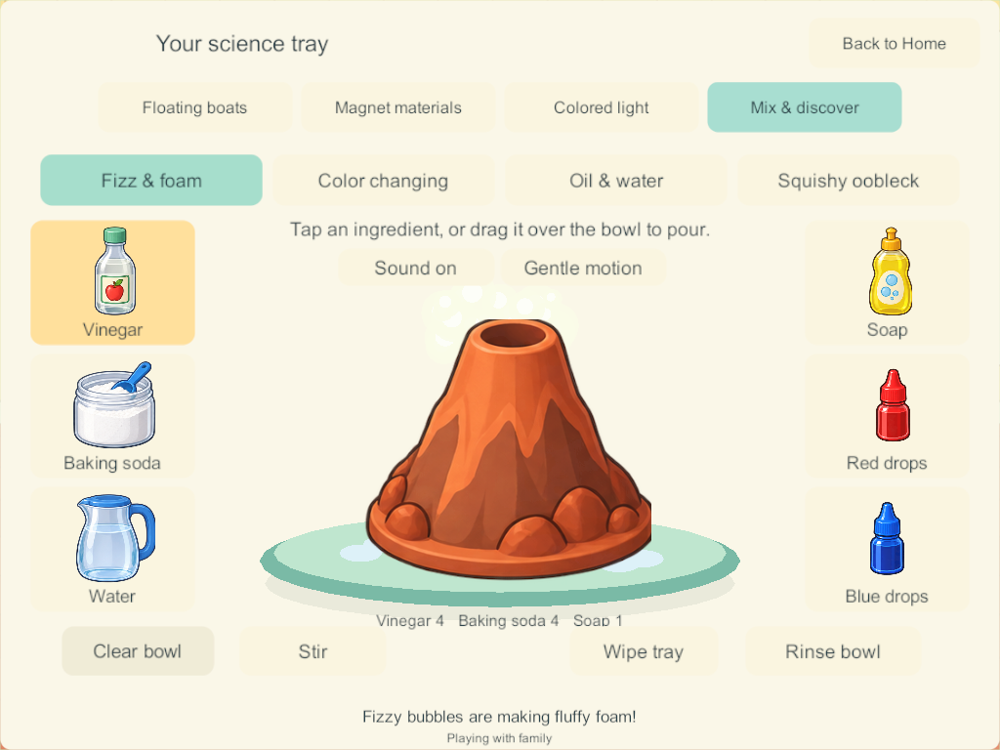
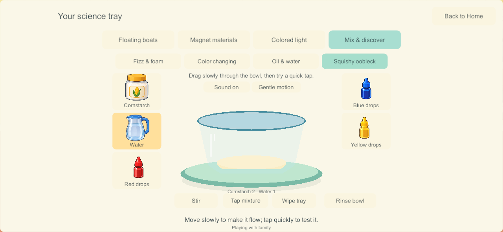
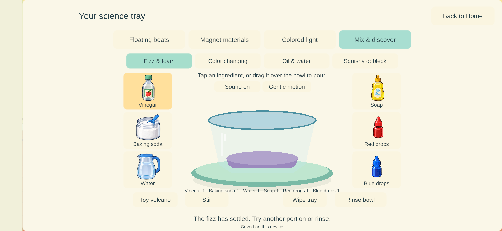

# Home science — Mix and discover

September 27, 2026. **SCI-09 / LAB-01 / H-29–30.** The user's “Finish it” follows the request for visible mixing reactions such as vinegar and baking soda. This bounded implementation adds four mixing experiments to the existing downstairs science bench. The wider nine-station catalog and Home remain Partial.

## Playing

Walk to the science bench on the ground floor, left of the living-room books. Tap **Science → Mix & discover**. Pick an experiment, tap an ingredient for one portion, or drag and hold its picture above the vessel for a partial pour. Release to stop. Stir directly through the mixture or use the Stir button. Rinse resets only your selected experiment; Wipe tray clears only your spill.

| Experiment | Implemented behavior |
| --- | --- |
| Fizz & foam | Vinegar meeting baking soda immediately makes bubbles; water alone does not. Soap retains foam. Amounts determine how much can react. Switch between a clear bowl and a toy volcano without recreating ingredients. |
| Color changing | Cabbage liquid responds to the balance of vinegar and baking-soda solution: pink, purple or blue-green. |
| Oil & water | Oil stays above colored water. Stirring disperses droplets; leaving them lets the layers separate again. |
| Squishy oobleck | Cornstarch/water proportions change the illustrated mixture between powdery, squishy and runny. Slow movement produces flow; tapping shows brief resistance. Touchscreens do not provide actual tactile resistance. |

Large illustrated supplies surround the central vessel. The accepted Bluey/Bingo art and controls are unchanged. Sound and calm-motion preferences belong to the local device; test clients use isolated preference keys. Gentle synthetic fizz/pour/spoon effects are included, but their physical mobile output and subjective quality have not been accepted.

## Research applied

The [applied science/play research](home-science-play-design-2026-09-27.html#sci-09-mix-and-discover) informed each implemented interaction. The central vessel, surrounding recognizable ingredients and immediate visible response follow the researched play design. There is no required Next-button sequence, score or failure screen.

- Finite vinegar/baking-soda reactants generate gas on contact; soap retains bubbles instead of generating extra gas. [ACS Gas Sudsation](https://www.acs.org/education/whatischemistry/adventures-in-chemistry/experiments/gas-sudsation.html).
- Indicator colors respond to the mixture's acid/base balance. [ACS red-cabbage indicator](https://www.acs.org/education/activities/red-cabbage-indicator.html).
- Oil/water separation and water-based color are distinct from a chemical eruption. [Science Buddies color bursts](https://www.sciencebuddies.org/stem-activities/underwater-color-bursts).
- Oobleck distinguishes gradual flow and quick-force resistance. [Science Buddies oobleck](https://www.sciencebuddies.org/stem-activities/oobleck-colloid).

These are simplified reviewed toy portions and visible demonstrations, not quantitative chemistry, pH measurements or a general fluid solver. New or unreviewed ingredients are not exposed as arbitrary combinations. The broader Explore tray, spoken picture invitations and portable saved creations remain future work.

## Four players, saves and recovery

Schema **17 / content 18** adds four mixing trays to each of the four profile workspaces: sixteen independent saved mixtures. Migration preserves earlier coloring, boats, room contents, food, character identity and enrollment. Each tray stores actual supplied amounts, consumed reaction pairs, remaining reaction/foam/stir/poke time, vessel, spill and its own edit revision. Duplicate commands, stale tray edits, foreign-owner edits, invalid ingredients and capacity overflow refuse without mutation.

The PC/VPS advances shared state. Bubble animation is local and bounded; phase changes publish at half-second boundaries. Closing or traveling never resets another player. Private solo uses the same rules and keeps maintenance progressing under the science/coloring overlay. Reopening preserves consumed ingredients and remaining time rather than starting the same reaction again. Offline changes are never merged into the family world.

The full kitchen, maximum four-player coloring histories and sixteen populated mixtures occupy **72,279 bytes** in the compact world view, below the existing 131,072-byte wire limit. This is a payload-bound check, not a mobile performance measurement.

## Verification and delivery

Windows **178** is built and its source/artifacts are verified. **209 core checks, eight four-client native mixing groups, two offline solo groups and six recovery groups passed.** The initial Windows implementation did not deploy devices; the subsequent Samsung update is recorded below. No physical A10, child usability, mixed-device endurance or audio acceptance is claimed. The development branch remains `codex/home-science-coloring`; existing book/audio/shared-play qualification holds still block promotion of this lineage to `main`.

- [Core results](evidence/mixing178-2026-09-27/core-results.json): additive migration, finite reactions, four-player ownership, stale/duplicate rejection, corrupted-state validation, restored progress and combined payload bounds.
- [Build summary](evidence/mixing178-2026-09-27/build-summary.json): Windows release client and dedicated server, zero errors/warnings.
- [Native 178 results](evidence/mixing178-2026-09-27/results.json): real 174 migration, actual touch input, partial held pours, two-finger isolation, all variants, lifecycle, independent travel/reset/coloring and saved authority restart/rejoin. Tablet 1024×768 and landscape phone 1280×591 captures were visually inspected; overlapping tabs and clipped prop neighbors were corrected.
- [Private solo results](evidence/mixing178-2026-09-27/solo-results.json): real native walking/mixing without a server, reaction progress while viewing another activity, durable amounts and local preferences after relaunch. Tested in 177; the 178 changes only separate the illustrated color bottles, with the same chemistry/solo code.
- [Recovery 178 results](evidence/mixing178-2026-09-27/recovery-result.json): sixteen populated mixtures plus prior Home/coloring state survive exact backup/restore, rollback, invalid-backup refusals, interrupted replacement, damaged-primary repair and full missing-world reconstruction. Original protected enrollment reconnects all four players. Build 178 was added to the recovery allowlist only after all six groups passed.
- [Artifact verification](evidence/mixing178-2026-09-27/artifact-checks.json): 1,107 runtime source entries and 351 artifact files. Only semantically identical importer whitespace was cleaned after the build; host tools and documentation were checked separately.
- [Documentation validation](evidence/mixing178-2026-09-27/docs-validation.json): maintained scope, links and rendered reports.

Recovery testing exposed an outdated schema whitelist in the parent helper; it now recognizes schema 17 without bypassing checksum, enrollment or game-state validation. An overlapping run of both four-client suites on this PC hit transport queue saturation and timed out. The final recovery pass ran on its own and completed all six groups. These results do not qualify eight concurrent clients, host-load endurance or physical mixed-device networking.

The implementation adds `Mixing.cs`, `SoloMixing.cs`, `MixingSurface.cs` and `MixingGesture.cs`, with existing discovery/save/network integration. The [artwork prompt record](../../SourceArt/Home/Discovery/mixing-prompts.md) and [asset manifest](../../SourceArt/Home/Discovery/manifest.json) retain the generated sources and runtime copies.

## Remaining work and next bounded task

Review this mixing station on the intended phone/iPads as part of a coordinated content-18 client/server delivery; resolve inherited shared-play/book-sound acceptance before calling the family release healthy. SCI-01 boats, SCI-02 magnets and SCI-04 RGB retain their initial schematic implementations. SCI-03 ramps, SCI-05 shadows, SCI-06 bubbles/fan, SCI-07 vibration and SCI-08 growth remain required. The next bounded science implementation remains the researched illustrated cargo-harbor/direct-handling pass. Blank coloring, folders/gallery, carrying/Together and the rest of Home are still tracked.

## Samsung delivery — Android 179

The user supplied the wireless endpoint and requested a phone update. A fresh non-development Android release was built from the current source, signed with the pinned family certificate, verified against 341 gameplay/art source files, and installed over 171 with `adb install -r`. The exact installed APK hash matches the fresh signed artifact. No uninstall, data clear or downgrade was used.

[Installation and retention evidence](evidence/mixing179-2026-09-27/android-update.json) records all 20 prior saved-world files and 20 backups retained. Nineteen primary files are byte-identical. The active private world migrated from schema 15 to 17; all prior objects, kitchen, Home fixtures, balloon, bedrooms, secret rooms and identity remain exact. Player coordinates and new science activity changed during visible play. Existing enrollment and saved family snapshots are unchanged.

The app visibly launched, and its science/mixing screen with saved ingredients was captured on the Samsung. This confirms installed presentation and retained play state, not subjective sound quality, complete child acceptance or shared four-device qualification. Server and iPads were not updated; the phone currently plays privately until a compatible coordinated family update.

