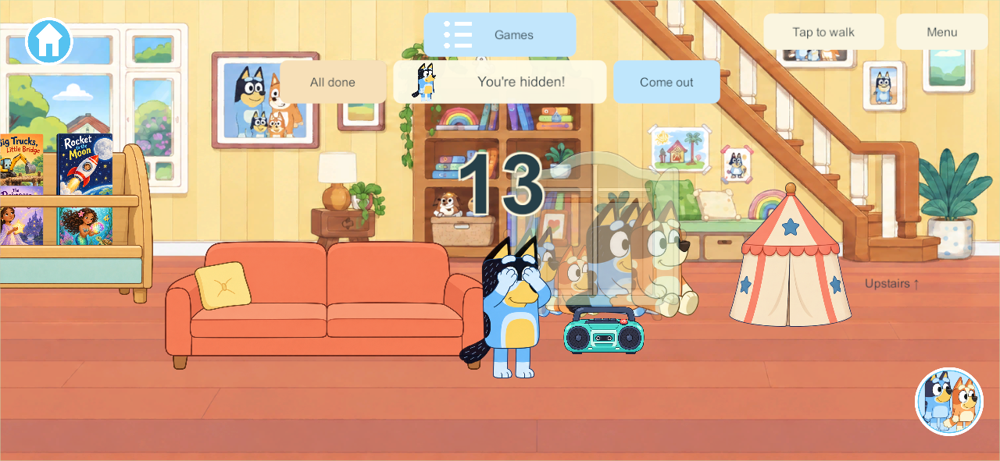
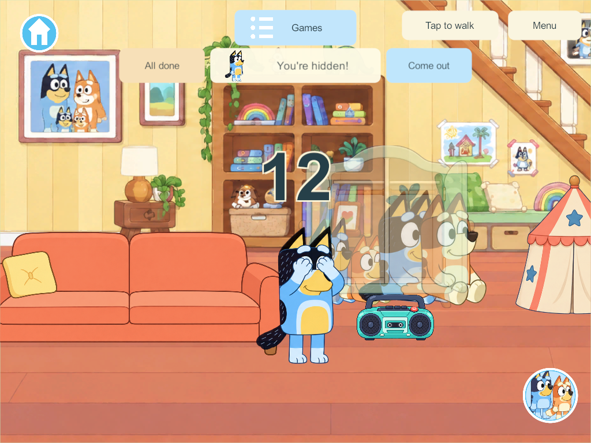

# Home fish movement and shared hiding — October 1, 2026

Release401 stops the pond drawing clock 0.12 seconds after a full world update, although those updates publish on events rather than every swimming frame. The regression reproduces 385 frozen frames within a seven-second swim. Fish are UGUI sprites following complete authoritative eased routes.

The pond now uses the existing continuous visual clock. Real elapsed time advances drawing between receipts; small timing errors correct its rate gradually, by at most 10%. Repeated renders cannot advance it twice. World changes, restarted clocks, pauses and solo mode reset or follow their appropriate simulation. The authority retains routes, food, bites, catch and release. Research: [Unity interpolation guidance](https://mp-docs.dl.it.unity3d.com/netcode/1.7.1/learn/clientside_interpolation/) explains choppiness from network/render cadence; [current NetworkTimeSystem API](https://docs.unity3d.com/Packages/com.unity.netcode.gameobjects@2.13/api/Unity.Netcode.NetworkTimeSystem.html) documents gradual clock-rate correction.

Hiding incorrectly grouped visibility by exact slot, separating the wardrobe's left/right places and the sofa's left/right places. Everyone behind the same physical cover now sees each other directly through its transparency. Reliable replies apply the same separated seated positions and concealment as LateUpdate, preventing generic friend redraws from stacking co-hiders or exposing unrelated hiders. No extra window is added.

**24 selectable places across eight covers**, up from ten: three each at the curtain, sofa, wardrobe, tent, folding screen, dining table, blanket bench and garden bush. Original IDs remain stable. Up to four players share a cover, including the same place. One parent inspection reveals all its occupants and marks its places checked. Individual exits leave siblings playing. Parent speed, fixed counting anchor, Home-only entry and camera following remain.

Windows **404** client/server build with zero errors/warnings. Core checks pass all 24 places, four co-hiders, group inspection, independent exit and saved-state validation. Native four-client checks pass:

- Pond: phone/tablet have 3,848 / 3,839 active moving fish frames, zero freezes, 18 route transitions each and maximum transition distances 1.78 / 2.43 units. Fishing, feeding, catch/release and departure pass. [Results](evidence/home-pond-and-hiding-2026-10-01/pond-result.json).
- Hiding: every client sees four separated occupants in different/shared wardrobe and sofa places. Inspected phone/tablet captures, group reveal, independent exit and concealment in other covers pass. [Results](evidence/home-pond-and-hiding-2026-10-01/hiding-result.json).

Content62 is required for the added hiding IDs and group inspection. Protocol3/schema47 and saved fields are unchanged. Fish movement alone is client presentation. Source is delivered to main; no phone, iPad or live-server installation occurred. Next: requested coordinated app/server delivery and family playtesting. Candidate404 remains in the isolated FishMotionTask snapshot.
