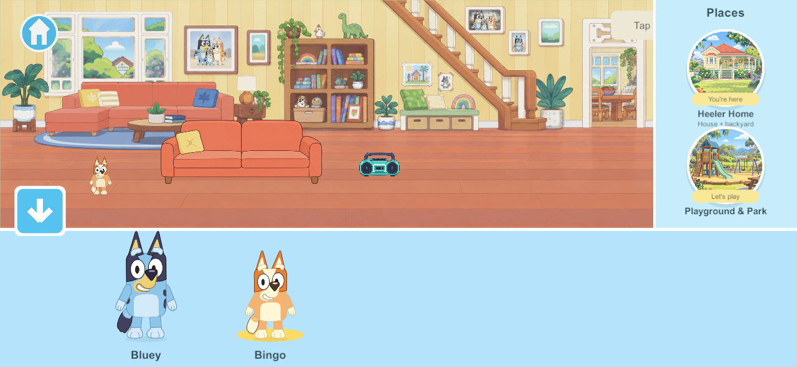

# Home scenery, furniture and usable objects

**Implementation update:** the [first integrated sofa/trampoline/shed pass](integrated-home-2026-09-26.html) now follows this research. The dated findings below describe the preceding defect and remain the broader production contract; the full kitchen/house inventory is not complete.

**Research and source audit: September 26, 2026. Status: research and production specification, not an installed game fix.** This responds to the user's report that a painted couch is duplicated by a second interactive couch. It applies to the connected Heeler Home and backyard. Other worlds remain scenic, with their future activities retained in the goal sheet.

**Decision:** compose the room once. Give each usable object one logical identity and one coordinated set of visible parts. Build the architecture behind it, including the wall/floor it conceals. Render characters and contents between the object's parts where needed. Do not add another copy of furniture in the walking strip.

[Current build plan](../family-playset-build-guide-2026-09-23.html#18-current-work-record-and-research-basis) · [Reference screenshots and interaction study](../bluey-lets-play-reference-study-2026-09-25.html) · [Editable art inventory](../../SourceArt/Home/scene-layer-plan.json)

[TOC]

## 1. What the reference establishes

The user's kitchen and backyard screenshots show one continuous illustrated setting. Counters, furniture, toys and characters share a consistent view, scale and palette. Objects occupy the room and garden rather than being collected into a separate activity strip below a complete painting. The kitchen objects sit on visible surfaces; the trampoline has a rear and a front; the shed belongs to the same lawn as the nearby tools. These are observations of the supplied images, not measurements of Budge's internal scene files.

Budge describes the app as exploration and imaginative play in Bluey's house. Its official store description identifies direct touch/drag interaction and specific uses including cooking, a backyard pizza oven, trampoline bouncing and swinging. This supports an environment built around usable things; promotional language about interacting with everything does not prove that every painted leaf, wall mark or cupboard is individually movable. [Budge product page](https://budgestudios.com/en/apps/detail/bluey-lets-play/), [Budge's App Store listing](https://apps.apple.com/us/app/bluey-lets-play/id1669091583?platform=ipad).

The official Bluey announcement also describes room exploration, food, toys and music, and kitchen/backyard activities. It supports integrating actions into the illustrated setting. It does not disclose the renderer, number of layers, hit shapes, physics system or memory strategy. [Official app announcement](https://www.bluey.tv/blog/bluey-lets-play-mobile-app-is-available-now/).

**Evidence boundary:** no commercial game files were extracted and no hands-on reference session was performed in this research pass. Exact shed-door movement, seat masking and individual object pickup behavior in Budge's app remain unverified. The architecture below is our proposed way to achieve the user's observed result. It is not a reverse-engineered description of that app.

## 2. What is wrong in our current home

*Existing native evidence from revision 118. This is the actual duplicate composition, not a proposed replacement.*

| Local evidence inspected | Finding | Consequence |
| --- | --- | --- |
| `Resources/Scenery/home-living.png` | Sofa, cushions, coffee table, books, plants, shelving and under-stair seat are flattened into the room | Moving or changing those things cannot expose a correct background |
| `garden-tree.png` and `garden-shed.png` | A trampoline and a complete closed shed are already painted in | Adding the separate HOME-01 fixtures repeats the same categories of furniture |
| `SourceArt/Scenery/manifest.json` | Original prompts deliberately put furniture in the upper scene and reserved the lower 38% for walking | This created a scenery-first layout with a separate foreground play strip; it is the wrong foundation for an integrated usable home |
| `SoloScenery.cs` | Loads flattened panels behind the gameplay objects | A panel cannot place its painted sofa arm in front of a seated character |
| `SoloHome.BuildHome()` | Draws complete independent sofa, trampoline and shed images | These fixtures are visually unrelated placements on top of an already furnished painting |
| `SoloScreen.SortDepth()` | Sorts whole roots by projected y, then sends fixture users and stored items to the end of the hierarchy | Sitting and storage become always-on-top exceptions instead of correct overlap |
| `HomeLayout` | Shared seat and storage anchors already exist | Keep those rules and identities; changing artwork does not justify rebuilding saves |

The original Home art README explicitly allowed decorative baked furniture plus foreground fixtures. That prototype shortcut is now superseded. The error is partly art direction and partly scene structure; merely changing sofa color, shrinking it or adding more animation will not resolve it.

## 3. Separate by behavior, not by whether something looks like background

| Category | Examples | Production rule |
| --- | --- | --- |
| Permanent scenery | Sky, distant hills, wall paint, floorboards | May be baked together when it never changes or needs to cover a moving object |
| Fixed usable fixture | Sofa, sink, counter, TV, trampoline | Separate visual parts wherever use, state or overlap requires it; fixed does not mean decorative |
| Movable prop | Ball, cup, book, cushion, garden tool | Its complete appearance and attached shadow leave the original position when it moves |
| Container or support | Shed, fridge, drawer, table, shelf, basket | Own the usable surface/interior, contents anchors and cover parts; contents remain real items |
| Foreground cover | Sofa arm, counter lip, front trampoline frame, tree trunk edge | Separate only where an actor/item can pass behind it; it is not automatically a global top layer |
| Effect | Water stream, music notes, splash, steam | Separate temporary presentation tied to an object's state and position |

A fixed wall switch could use one painted base plus a hit target and a small state overlay if its outline never changes and nothing passes behind it. A sofa used for sitting needs more structure. A leaf in a distant tree does not need a GameObject. Avoid both extremes: one flattened interactive room and thousands of unnecessary decorative objects.

Every prominent, reachable home object gets an inventory entry marked **usable now**, **planned usable**, or **intentional decoration**. Planned usable objects can remain inactive during staged development, but must not be painted permanently into the new base. This prevents the next round of duplicate cups, books and appliances.

## 4. The layered room contract

The base illustration is a **clean plate**: the room with separable furniture and props removed, and the hidden wall, floor and trim drawn correctly. It is not an empty replacement room with a different perspective.

| Back to front within a sofa interaction | Visible part | What it does |
| --- | --- | --- |
| 1 | Clean wall/floor and fixed room decoration | Remains complete with the sofa hidden |
| 2 | Sofa contact shadow | Grounds the same sofa at its actual location |
| 3 | Sofa back and seat surfaces | Provide the cushion/support behind the sitter |
| 4 | Seated character | Pelvis contacts the cushion; the feet and arms use authored poses |
| 5 | Relevant front arms/edge | Cover only the parts meant to be behind them |
| 6 | A character walking closer to the viewer | Can pass in front of the entire sofa assembly |

This is a local relationship, not six global layers applied to all objects. A person walking behind the sofa belongs before its back, while the sitter belongs within it. A nearby table may have its own local relationship. If two shapes require contradictory ordering, split the cover shape further or adjust the authored walking region; changing a global y offset cannot solve every overlap.

**One object is not necessarily one sprite.** The sofa can have a shadow, rear, seat, front arms and movable cushions while still being one sofa. Its seat occupancy is separate from the number of render parts. Doors and contents follow the same principle.

## 5. Apply the contract to every home station

| Station | Separate artwork | Contact and state | Failure to reject |
| --- | --- | --- | --- |
| Living-room sofa | Rear/body, seats, front arms, contact shadow; loose cushions when enabled | Two existing seat slots; poses sized for Bluey/Bingo; stand/leave exits clear of furniture | Second couch, floating hips, character always above arms |
| Coffee table | Top/support, front edge/legs where overlap requires, shadow; books/plant separate if usable | Surface polygon/height and item resting anchors | Plate sinks into the floor plane or book remains painted after pickup |
| Reading shelf and under-stair bench | Empty shelves/cubbies, lips, bench surfaces; usable books/baskets/cushions separate | Shelf slots and bench seats; distant decorative spines may remain explicitly static | Painted contents plus draggable copies |
| Kitchen counter/sink | Cabinet structure, worktop, front lip, basin rim/interior, faucet state/effects | Countertop support differs from floor support; water appears at the faucet and lands in the basin/container | Cups at foot level, water drawn over every foreground object |
| Fridge/cupboards/oven | Interior, shelves, frame and independently authored door states | Closed hides contents and disables their pickup; open exposes the same item instances | New food spawned on every opening, food drawn through closed doors |
| Dining table and chairs | Table planes/occluders and chair rear/front parts; plates separate | Seat pelvis/feet and table serving positions agree | A chair-looking backdrop plus a second chair to sit on |
| Radio | One body per actual radio, power detail and notes | Preserve living and garden radio state; sound/dance use those same placed radios | Painted off-radio under an unrelated playing duplicate |
| Trampoline | Rear net/posts, mat/support, front frame/net; local shadow | Existing two user slots; mat compression follows landings, feet align at contact | Jumping in front of a full trampoline picture or over a second mat |
| Shed | Empty interior, shelf supports, shell/frame, door states/parts, real stored items | Preserve `shed-0` through `shed-3`; cover and input follow open state | Decorative closed shed plus usable shed; tools visible/selectable through a closed door |
| Garden tap and plant | Faucet, stream, plant pot/soil/growth; compatible tools separate | Water origin, bucket mouth and soil target align | Painted watering can remains when the usable one is moved |
| Swing/pool/sandpit/fruit tree | Separable seats/ropes, near rims, surfaces and usable fruit as those features arrive | Author contact/cover parts before enabling behavior | Converting a painted feature by placing a second copy in front |

This is a staged asset inventory, not a promise that every listed station already works. Kitchen, books, TV, science, dinosaur play, bedrooms and secret rooms remain in the full house backlog.

## 6. Drawing order in this actual Unity project

The installed project is Unity **6000.3.24f1** with uGUI **2.0.0**. Its playset currently uses `RawImage`, `Image` and `RectTransform`. Unity documents that Canvas children draw in hierarchy order. Consequently, adding a SpriteRenderer Sorting Group or Sprite Mask to the present UI objects is not a direct fix. [Unity Canvas drawing order](https://docs.unity3d.com/Packages/com.unity.ugui@2.0/manual/UICanvas.html).

**Bounded implementation choice:** first correct one living-room composition in the existing renderer. Keep logical fixture roots for state, but submit their independently ordered visual parts to the same world presentation sequence as the characters. A nested sofa subtree is drawn as a contiguous subtree; an external actor cannot simply be inserted between its children without presentation reparenting or separate render-part roots. Keep semantic ownership independent of the Transform hierarchy.

Build a stable draw list from the floor/support anchor, the object's cover regions and local relationships. Preserve each character's internal body-part order. Use the ground contact anchor for walking and bouncing depth, not the animated head/feet height. Keep an occupant between that fixture's back and front pieces, then allow a closer passerby to cover the whole fixture. For two occupants, use stable slot ordering with authored non-overlapping seat positions. Stable object/part IDs break ties so equal-depth parts do not flicker.

Replace the blanket fixture-user and stored-item `SetAsLastSibling` rules. During dragging, a temporary lift above the world can aid readability, but dropping must restore the chosen support/container relationship. HUD and chooser stay above world rendering; the camera remains independent for each player.

Unity's SpriteRenderer sorting system is a viable later alternative: it supports sorting layers, order, distance/sort points and groups. A Sorting Group is externally ordered as a unit, so grouping a whole sofa still does not automatically allow an external sitter between its rear and front. A renderer migration would need its own measured prototype; it is not required just to remove the duplicated sofa. [Unity 6.3 2D rendering order](https://docs.unity.com/en-us/engine/6000.3/manual/unity2d/sprite/sort-sprites/sort-sprites).

## 7. Covers, masks and believable contact

Prefer a correctly shaped front sprite for a sofa arm or cupboard frame. Use clipping where the geometry needs it, such as keeping shelf contents inside an opening. uGUI's Mask clips child graphics to a parent shape using the stencil buffer. It does not invent a seat pose, physical interior or correct gameplay permissions. [Unity UI Mask](https://docs.unity3d.com/Packages/com.unity.ugui@2.0/manual/script-Mask.html).

Each fixture needs separate anchors for ground placement, seat/support contact and action entry/exit. A chair's root or the center of its image is not a suitable pelvis anchor. The same applies to a hand on a radio, a cup on a counter and feet touching a trampoline mat. Author Bluey and Bingo contact poses against the actual sized furniture. Cover shapes must preserve readable hands/faces and avoid cutting off a whole character merely to hide a bad pose.

Use a soft contact shadow at the correct supporting surface. A carried cup's shadow must not remain painted on the floor. A bouncing character's ground shadow remains on the mat while its body rises; draw-order depth also remains tied to that mat. Reserve squash/compression for parts that can deform—the mat, cushion or pose—not the entire rigid fixture. These are proposed animation/art constraints, not an assertion about Budge's animation system.

## 8. Touch interaction must match what is visible

Display layers, touch shapes, walking obstacles and storage regions serve different purposes. Author them separately but from the same object layout. A transparent rectangle around a large irregular object must not steal taps intended for a nearby cup. An arm may cover part of a sitter without needing its own input handler.

Keep decorative art non-raycastable. A fixture's deliberate interaction regions select its seat, handle or control; a front-to-back resolver rejects covered/closed contents. Enlarge tiny controls within sensible limits for touch, without crossing unrelated objects. A stored tool becomes a pickup candidate only when it is exposed. Do not rely on a visual mask alone to enforce this.

The chooser must continue using the unobscured world viewport from revision 118. Changing room art cannot reintroduce the character hidden behind the tray. Dragging a prop over the chooser must not pick a place; camera pan, walking, object dragging and fixture taps retain exclusive pointer ownership. [Existing chooser evidence](walk-animation-2026-09-26.html).

## 9. How items fit on and inside other items

The world needs **support relationships**, not only x/y coordinates. A cup can be on the floor, on a counter, in a cupboard, on a plate or held by a character. The same cup changes its supporting coordinate space and drawing relationship, not its identity.

For future reusable containers, keep an item ID, parent/support ID, local position or slot, holder, contents/creation data and durable state. Validate that an item has one location/holder and that container nesting cannot create a cycle. A visual can be absent while its state persists. Closing the shed or unloading a distant room must not delete its contents. Reopening creates views for the existing records, not new items.

Current HOME-01 already has fixed shed slots and authoritative occupancy; preserve these during the first visual pass. Generic nesting and portable containers remain later G5 work. Physics should assist a brief drop/bounce when useful; it should not be responsible for keeping saved plates or cups stable across devices. A valid release resolves to an authored support or a safe floor point. Shared authority decides ownership and final placement; each client draws that result.

## 10. Make the layers look like one Bluey-style scene

The supplied screenshots guide a clean, shallow side view, softly colored outlines, broad flat color shapes, restrained shading and clear silhouettes. These are visual observations. Our panoramas have more painted texture and very large empty foreground strips; matching the reference requires composition changes as well as more details.

Author a room layout with the existing character model sheet visible at intended phone/tablet scale. Choose wall/floor junction, seat heights, worktop height and door proportions together. Keep one palette, outline treatment, view angle, shadow direction and level of detail across base and props. Separately generated assets need matching to this master; a common text prompt alone is insufficient.

Provide quiet readable ground around hands, feet and movable props, but distribute playable furniture through the room. Do not force all usable objects below a fully furnished decorative room. Avoid making every interactive object glow or giving it a heavy outline; discovery comes from recognizable affordances and small responses. Decoration can be detailed without competing with a character's silhouette.

For the connected house/backyard, author the doorway/veranda seam as a shared transition with consistent floor level and trim. The current overlapping panorama fade only softens edges; it cannot reconcile two independently drawn doorways or floor perspectives. Keep scenery-only distant hills behind the property, while nearby posts or trunks may need separate cover parts.

## 11. Asset production and export workflow

1. **Inventory before painting.** Mark every reachable object as fixed, movable, container/support, cover, effect or decoration; record what remains planned. Use the [home inventory](../../SourceArt/Home/scene-layer-plan.json).
2. **Compose with characters.** Arrange a single sofa, table and shelf against the existing Bluey/Bingo scale. Draw seat/support and walk regions on an authoring overlay.
3. **Create the clean plate.** Remove separable furniture and redraw what it hides. A crop of the existing couch cannot reconstruct the wall behind it. Removing a prop includes its baked shadow and reflections.
4. **Build an editable master.** Keep named layers/groups and complete hidden geometry. If raster generation assists, edit against the same master/reference; inspect the result before accepting it. Do not regenerate the whole room independently for every prop.
5. **Export coordinated parts.** Keep shared source coordinates, named part IDs, transparent padding/pivots and export offsets. Tightly cropped files are fine when their original offsets are retained. Open/closed states keep the same frame/hinge alignment.
6. **Compose a preview before integration.** Toggle furniture/props off, expose interiors and place both characters at each contact anchor. Check transparent edges over light and dark surfaces. The assembled room should match the master without duplicate silhouettes or outlines.
7. **Import and place once.** Bind parts to the existing fixture and item identities. Update render placement together with hit/support metadata. Keep source, prompts and provenance in the art manifest.

Unity's PSD Importer can import individual source layers and preserve positions/hierarchy in generated prefabs; merged import intentionally flattens them. This is an optional authoring route, not an installed dependency in this project. Its documented rig/prefab route also has package prerequisites. For the first bounded uGUI pass, transparent PNG parts plus explicit offsets are sufficient. [Unity PSD Importer 12.0 properties](https://docs.unity3d.com/Packages/com.unity.2d.psdimporter@12.0/manual/PSD-importer-properties.html).

Blender can help block out proportions or consistent orthographic furniture views, but final layered 2D art and contact points still need authoring. Full 3D physics or a renderer rewrite is not a prerequisite for this correction.

## 12. Memory and frame-time implications

More layers are not free. Transparent overlapping areas increase work; many moving UI elements can increase Canvas rebuild cost. Unity recommends separating Canvases by update behavior, disabling unnecessary raycast targets and avoiding excessive overlapping UI. Apply those principles within legal drawing boundaries: separating rear furniture and actors into incompatible Canvases can break the very ordering being fixed. Do not create one Canvas per prop by default. [Unity UI optimization guidance](https://unity.com/how-to/unity-ui-optimization-tips).

Keep static distant scenery combined. Crop dynamic parts with stored offsets instead of exporting a full-room transparent texture for every spoon. Pack related small props by room/use when profiling supports it; a single all-house atlas can keep otherwise distant art resident. Shared references must release only when no visible/preloaded room still uses them.

Current panorama residency is capped at three loaded/requested panels; that does **not** cap future prop texture residency. Add a room-level resident-byte budget covering bases, fixtures, atlas pages and temporary transitions, while retaining all game state outside the art cache. Mobile scenery already uses ASTC 6×6, no mipmaps and no readable CPU copy. Validate prop imports separately rather than assuming they inherit the scenery importer.

For scale only: one current 2172×724 RGBA32 image is about **6.0 MiB** before mipmaps or extra copies. ASTC 6×6 block payload at that size is about **0.67 MiB**; actual runtime allocation may differ with import resizing, padding, format support and driver overhead. Neither number is a measured whole-game budget. Measure resident textures, p95/p99 frame times, Canvas rebuilds, batches and overdraw on the A10 iPad before declaring this architecture qualified.

## 13. State, migration and shared play

The first living-room art correction should preserve canonical `garden`, all existing toy IDs and saved state, `sofa-left/right`, `trampoline-left/right`, the two radio fields and `shed-0..3`. There is one Home + backyard destination. Views can be streamed independently for each player without recreating shared objects.

If aligning art requires moving authoritative anchors, treat that as a versioned content/layout change: migrate affected fixture positions deliberately and verify stored items and safe exits. Do not silently change `HomeLayout` constants, reset a save, or generate replacement tools. Prefer fitting the first new art to existing anchors to keep the correction bounded.

At research completion Samsung remains **118**, server/helper **110**, Apple devices **101**. Phone content 5 currently plays solo; matching shared rollout is pending and Apple updates remain deferred. Research completion is not deployment. Future shared acceptance uses isolated matching clients/server first, with original family saves retained.

## 14. Ordered implementation plan

**ART-HOME-02** is a bounded task label under existing CHAR-01, WORLD-01/02, ITEM-02/03 and G5/G6 presentation, not a new top-level feature ID.

| Order | Deliverable | Exit evidence |
| --- | --- | --- |
| A — living room first | Clean living-room base; one coordinated sofa; correct two-seat overlap; table/shelf inventory; stable render-part ordering | One sofa in assembled scene; empty plate with no ghost; Bluey and Bingo seated; nearer and farther walkers; phone and 4:3 composition |
| B — current backyard fixtures | Clean tree/shed bases; one trampoline with front/rear parts; one shed with exposed interior and preserved four-slot contents | Bounce contact/occlusion; open/closed/storage loop; no duplicate shed/trampoline or painted tools under moved copies |
| C — kitchen foundation | Clean architecture; fridge/cupboard interiors/doors; counter/table/chair support layout before food gameplay | Empty and stocked states, correct surface placement, no duplicate food or appliances |
| D — next home features | Kitchen food/serving and durable creations, then bedroom schema integration | Existing goal-sheet behavior plus the visual/interaction acceptance below |

Preserve the accepted joystick, combined chooser and recognizable character art. Walking 118 remains awaiting user visual acceptance; this scene correction does not close that feedback. Other worlds retain attractive scenic shells and long walking space. Do not expand their features during home work.

## 15. Acceptance that would have caught this error

| Check | Required visible/technical result |
| --- | --- |
| Hide every separable object in the editor | Complete clean plate; no painted duplicate or leftover shadow underneath |
| Move every enabled portable prop | Original position is empty; only one live item and one rendered placement |
| Sit Bluey and Bingo in each seat | Hips/feet meet authored supports, appropriate front arms overlap, hands and faces remain legible |
| Walk another character behind and in front | Correct local ordering; sitter does not become globally topmost |
| Bounce with another player nearby | Feet meet the mat; rear/front net/frame surround the jumper; nearby passerby depth remains stable |
| Open, store, close, reopen and retrieve | Same item ID and contents; no visible or selectable hidden item through closed doors |
| Place on floor, table and shelf | Correct support height and edge overlap; no floor-depth shortcut for shelf contents |
| Pan across room seams and open chooser | No duplicated doorway, floor step or edge smear; active character stays visible above tray |
| Save/reopen, leave/revisit and isolated shared rejoin | No recreated prop, lost creation, reset container or changed player identity |
| Wide phone and 4:3 tablet | Coherent scale, reachable targets and readable character silhouettes |
| A10 sustained profile | Recorded texture residency and frame-time evidence; no inferred pass from a Samsung screenshot |
| User visual review of a complete interaction clip | Explicitly separate aesthetic acceptance from automated rule checks |

## 16. Research outcome and remaining work

This pass inspected all four home/backyard panoramas, the recorded live composition, source prompts, fixture creation, drawing order, storage/seat rules and installed package versions. It checked the primary sources linked above and produced the concrete layered-art inventory and revised task order. The goal sheet, current decisions and build plan are updated together.

No runtime code, panorama, fixture image, installed app, family server or save was changed in this research pass. The duplication remains in build 118 until ART-HOME-02 is implemented. The first visual proof must be one integrated living room with one sofa, not another batch of isolated furniture illustrations.

[Source/asset audit](evidence/home-scene-layers-2026-09-26/research-audit.json) · [Document consistency](evidence/home-scene-layers-2026-09-26/docs-validation.json) · [Research page render checks](evidence/home-scene-layers-2026-09-26/render-validation.json). These validate the research deliverable, not the future game correction.
